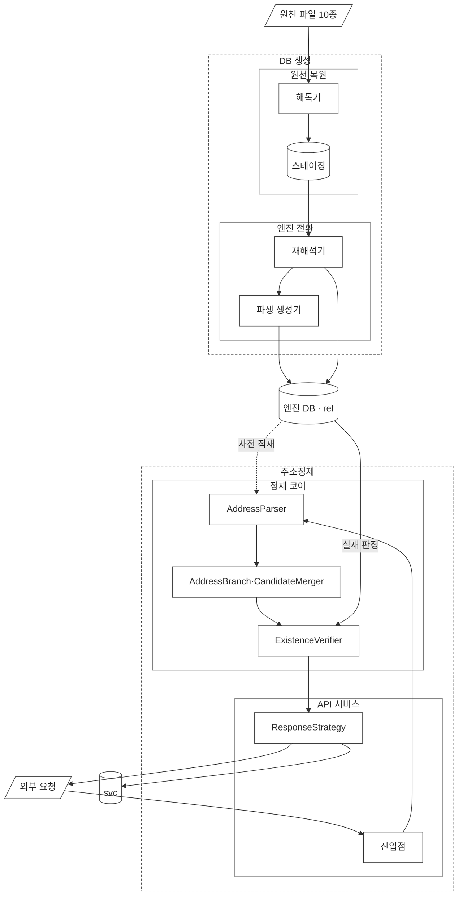

# 설계1: 범위와 경계

이 문서는 **「무엇을 만드는 물건인가」**라는 질문을 다룹니다.

---

## 0. 자주 나오는 말

이 절의 용어는 설계 문서 전체에서 같은 뜻으로 씁니다. 같은 대상을 다른 이름으로 바꿔 부르지 않습니다.

| 말 | 뜻 | 자세한 설명 |
|---|---|---|
| 앞 세 자리 | 주소 앞부분의 행정구역 3개. 시·도, 시·군·구, 읍·면 | `03-pipeline.md` 2절 |
| 단위 표기 | 주소 단위를 나타내는 끝 글자. `시`·`구`·`읍`·`로`·`길` 등 | `03-pipeline.md` 2절 |
| 토큰 | 입력 주소를 단위 표기 기준으로 끊어 얻은 문자열 하나 | `03-pipeline.md` 0-1절 |
| `AddressBranch` | 표기 방식마다 따로 실행되는 조회 경로. 구현은 도로명·지번·건물이름에 대응하는 `RoadBranch` · `LotBranch` · `BuildingNameBranch` 3개 | `03-pipeline.md` 0절 |
| 사전 | 메모리에 올려 둔 이름 목록. DB를 조회하지 않고 바로 찾습니다 | `04-source-data.md` 7절 |
| 등록주소 | 도로명주소관리번호로 식별되는 도로명주소 한 건. 건물이 여러 채 서 있을 수 있습니다 | `02-data-model.md` 3절 |
| 4칼럼 복합 키 | 등록주소 하나를 가리키는 네 칼럼. 도로명코드·지하여부·건물본번·건물부번 | `06-source-schema.md` 5절 |
| 건물관리번호 | 건물 한 채마다 하나씩 붙는 25자리 식별자. 중복이 없습니다 | `04-source-data.md` 3-2절 |
| 도로명주소관리번호 | 등록주소 하나마다 붙는 26자리 식별자 | `06-source-schema.md` 2-8절 |
| 역조회 인덱스 | 도로명 이름으로 시·군·구를 거꾸로 찾는 테이블 | `03-pipeline.md` 4-2-1절 |
| 자모 | 한글 낱자. `강`을 `ㄱ`·`ㅏ`·`ㅇ`으로 나눈 것 | `03-pipeline.md` 2절 |
| 기대 정제 값 | 정답을 미리 붙여 둔 시험용 주소 묶음. 구현한 결과가 맞게 동작하는지 측정하는 데 씁니다 | `05-expected-results.md` |
| 교정 전략 | 사람이 화면에서 결과를 고쳐 가며 쓰는 소비자용 전략. 후보를 적은 수로 추려 돌려줍니다 | `03-pipeline.md` 4-3절 |
| 검출 전략 | 쌓인 자료를 한꺼번에 검사하는 소비자용 전략. 사유를 폭넓게 돌려줍니다 | `03-pipeline.md` 4-3절 |
| 전체분 | 현재 유효한 자료 전체를 담은 파일. 월 단위로 받습니다 | `04-source-data.md` 1-4절 |
| 변동분 | 그날 또는 그달에 바뀐 자료만 담은 파일. 폐지된 주소는 변동분에만 나옵니다 | `04-source-data.md` 1-4절 |

**이 표가 용어의 정본입니다.** 이 표는 2026-09-07에 진행 규칙 문서에서 설계 문서로 옮겼습니다. 같은 표를 2곳에 두지 않습니다.

토큰, `AddressBranch`, 등록주소의 세 항목은 표를 옮기면서 새로 더했습니다. 세 용어는 여러 문서에 걸쳐 쓰이는데도 표에 없었기 때문입니다.

---

## 1. 제공하는 가치

이 솔루션이 제공하는 가치는 정제된 주소 자체가 아니라, 사용자가 바로 조치할 수 있는 실패 사유입니다.

"실패했습니다"라는 결과만 알리지 않고, **"왜 실패했고 무엇을 하면 되는지"**를 함께 돌려줍니다.

```
못 만든 것:  "주소를 확인해주세요"
만드는 것:  "행정동 표기로 보입니다. 법정동 이름이나 도로명으로 다시 입력해 주세요"
```

---

## 2. 왜 만드나: 기존 구조의 문제

### 팀프레시 기존 흐름

```
외부 연동 주체 → API → TMS (엑셀 업로드·수기 입력 등 다경로 주문 수신, 주소 필드 추출)
  → API → 주소정제 애플리케이션 (외부사 팝업 호출 / TMS 호출 등 다경로 수신)
    → 정규식 + 최종 처리 분기 클래스
      → 성공: 호출지로 return
      → 실패: 카카오 API 호출
```

소비자는 TMS 내부(주문 흐름), 외부사 팝업 단건, 엑셀 배치의 세 경로로 들어옵니다.

### 문제 6가지

| # | 문제 |
|---|---|
| 1 | 실패한 건은 카카오 호출 전이든 후든 "실패"라는 결과만 돌아오고, 사유가 붙지 않습니다 |
| 2 | **오배송은 처음부터 실패로 분류되지 않습니다.** 정제는 성공으로 끝났지만 실제로는 틀린 주소였던 경우이며, 하루 사이클이 끝난 뒤에야 드러납니다 |
| 3 | 카카오 API는 종종 수십 초씩 지연되고 간헐적으로 응답하지 않습니다. 월 3만 건 이상 호출하므로 카카오의 가용성이 곧 CS 건수 증가 위험으로 이어집니다 |
| 4 | 단건 정제 품질이 좋아서 내재화를 원하는 외부사가 있었지만, SDK로 제공할 수단이 전혀 없었습니다 |
| 5 | 엑셀 배치는 실패 목록만 반환하고 사유는 반환하지 않습니다 |
| 6 | HTTP/1.0 기반 클라이언트를 쓰기 때문에 클라이언트 자체에서 2~3초가 지연됩니다 |

### 중심 문제는 정제율이 아닙니다

| | 내용 |
|---|---|
| ① 실패 사유의 해상도 | 왜 실패했는지에 대한 설명이 한 줄로 끝납니다 |
| ② 틀렸다는 것을 아는 시점 | 성공으로 처리되었지만 실제로는 틀린 건이 사이클이 끝난 뒤에야 드러납니다 |

문제 6번(HTTP 성능)은 이 프로젝트의 주제에서 뺐습니다. 함께 다루면 이 솔루션이 제공하는 가치가 불분명해지기 때문입니다.

---

## 3. 표본에 대한 사실: 감추지 않습니다

당시 시스템이 실패 사유를 남기지 않았기 때문에 실패 사례 기록가 존재하지 않습니다.

실제로 배송이 잘못 간 사례는 있지만, 그 사례가 어느 유형에서 나왔는지 사후에 분류할 수 없습니다.

- 이 사례는 기대 정제 값의 실무 묶음(A군)에도, 커버율 계산에도 넣지 않습니다
- 이 내용을 삭제하지 않고, 사례가 왜 없는지 알 수 있도록 남겨 둡니다
- **이 사실 자체가 문제를 드러냅니다.** 사유를 남기지 않으면 나중에 아무것도 알 수 없습니다

그래서 「옛 주소 대응 기록」를 둡니다. 같은 실수를 반복하지 않기 위한 구조입니다.

---

## 4. 범위

### 지역: 서울

**조건은 지역 값만 늘리면 확장되는 구조여야 한다는 것입니다.** 이를 위해 다음 3가지를 지킵니다.

- 어디에도 서울이라는 값을 하드코딩하지 않습니다
- 행정구역의 계층 수를 고정하지 않습니다. 서울은 시·도 바로 아래에 구가 있고, 3종은 시·군·구가 없으며, 도 지역은 시·군 아래에 읍·면이 있습니다
- 테이블을 지역별로 나누지 않습니다

"서울만 넣었습니다"와 "전국을 넣을 수 있는데 서울만 넣었습니다"는 다른 말입니다. 뒤의 말을 할 수 있는 근거가 위의 3가지입니다.

다만 서울은 건물군이 가장 적은 지역이라는 점에 주의해야 합니다.

| 지역 | 등록주소 하나당 건물 수 |
|---|---|
| 서울 | 1.13 |
| 전국 | 1.67 |
| 경북 | 1.95 |

그래서 건물군 처리를 허술하게 구현해도 서울에서는 결함이 드러나지 않고, 지역을 늘리는 순간 드러납니다.
서울 데이터만으로 검증하면 이 결함을 찾을 수 없으므로, 기대 정제 값(정답을 미리 붙여 둔 시험용 주소 묶음)을 구성할 때 이 점을 함께 고려합니다.

### 정답원: 건물DB 우선, 검색 API는 폴백

건물DB를 우선하는 근거는 다음 3가지뿐입니다.

1. 회귀 검증이 외부 호출에 의존하면 케이스가 늘어날수록 검증을 진행하기 어려워집니다
2. 실제로 겪은 갱신 시점 차이 문제(A5)는 DB 경로에만 존재합니다
3. 자료 규모도 근거입니다. 단일 지역의 자료는 수십만 건이므로, "적재에 몇 주"가 걸린다는 초기 추정은 틀렸습니다

"컬리 회고의 첫 아쉬움이 건물 DB 우선이었습니다"라는 근거는 폐기했습니다. 이 아쉬움은 컬리의 목표에서 나온 후회이므로 이 프로젝트의 근거가 되지 않습니다.

### 외부 호출: 어댑터로 감쌉니다

카카오 호출은 어댑터 뒤에 둡니다. 카카오를 다른 서비스로 교체할 수 있어야 하기 때문입니다.

**정제 코어는 어댑터를 직접 호출하지 않습니다.** 정제 코어는 옛주소 조회 포트를 호출하고, 어댑터는 그 포트 뒤에 둡니다. 자세한 내용은 `03-pipeline.md` 9절에 있습니다.

---

## 5. 경계: 이 경계를 넘는 안을 낼 때는 먼저 충돌을 밝힙니다

### LLM은 판정하지 않습니다

- 표준 주소인지 판정하는 일은 코드가 맡습니다. 정답은 건물 DB입니다
- 비슷한 이름을 찾아 후보를 제안하는 일도 코드가 자모 편집 거리로 처리합니다. 자모는 `강`을 `ㄱ`·`ㅏ`·`ㅇ`으로 나눈 한글 낱자입니다
- 제안한 후보가 실재하는지 확인하는 일도 다시 코드가 맡습니다

**런타임에는 LLM이 없습니다.** LLM은 사용자 요청을 처리하는 경로 어디에도 들어가지 않습니다.

apm-observatory에서도 이미 같은 경계를 적용했습니다(판정은 통계로 하고, LLM은 원인 분석에만 씁니다).
같은 기준을 다른 도메인에 한 번 더 적용하면, 그 기준은 우연이 아니라 원칙이 됩니다.

### 정답이 외부에 있습니다

행정안전부 자료가 정답이므로 채점을 끝까지 규칙 기반으로 할 수 있습니다.
**따라서 LLM-as-judge가 필요 없습니다.** 정답이 외부에 있다는 것은 흔치 않은 조건입니다.

### 모르는 것을 아는 척하지 않습니다

후보가 여러 개이면 여러 개를 그대로 넘깁니다. 임의로 첫 번째 후보를 고르지 않습니다.

여러 후보를 버리지 않고 넘기는 방식은 컬리가 위험 부담이 크다고 보고 포기한 부분입니다.
이는 우열의 문제가 아니라 조건의 차이입니다. 컬리는 배송이 걸려 있어 하나를 골라야 했고, 이 프로젝트에는 **고르지 않고 넘겨받을 수 있는 소비자**(팝업·배치)가 있습니다.

---

## 6. 모듈 경계와 전체 아키텍처

경계를 나누는 것은 설계 취향이 아니라 요건에서 나온 결정입니다. 컬리의 주소정제는 OMS 안의 한 부분이었지만, 이 프로젝트는 소비자가 3곳입니다.

### 6-1. 전체 아키텍처



도식의 도형은 각각 정해진 뜻이 있습니다. 평행사변형은 외부와 맞닿는 지점, 원통은 저장소, 사각형은 모듈을 나타냅니다. 실선 화살표는 값이 전달되는 경로이고, 파선 화살표는 미리 채워 두는 경로입니다. 파선 테두리는 구성 요소를, 실선 테두리는 그 안의 하위 컴포넌트를 나타냅니다.

### 6-2. 구성 요소는 2개입니다

| 구성 요소 | 맡는 일 | 하지 않는 일 |
|---|---|---|
| DB 생성 | 행정안전부 원천 자료를 엔진용 자료로 만듭니다 | 외부 요청을 받지 않습니다 |
| 주소정제 | 들어온 주소를 정제해 돌려줍니다 | 참조 마스터를 수정하지 않습니다 |

두 구성 요소가 함께 쓰는 것은 엔진 DB 하나뿐입니다. DB 생성은 엔진 DB에 자료를 기록하고, 주소정제는 엔진 DB를 읽습니다. 두 구성 요소의 접근은 권한으로도 분리해 둡니다. 자세한 내용은 `02-data-model.md` 6-2절에 있습니다.

**두 구성 요소는 서로를 호출하지 않습니다.** 따라서 배치가 실행되는 동안 정제 요청이 들어와도 두 처리 흐름은 서로 영향을 주지 않고, 정제가 멈춰도 적재는 그대로 실행됩니다.

### 6-3. DB 생성: 하위 컴포넌트 2개

| 하위 컴포넌트 | 맡는 일 |
|---|---|
| 원천 복원 | 파일을 읽어 원천 구조 그대로 스테이징 테이블에 넣습니다. MS949 인코딩, CRLF 줄 끝, 층명칭에 문자열로 들어오는 `null`을 이 하위 컴포넌트에서 처리합니다 |
| 엔진 전환 | 스테이징 테이블을 재해석해 엔진 테이블 7개를 만들고, 그다음 파생 자료 2가지를 만듭니다 |

**두 하위 컴포넌트로 나눈 이유는 실패하는 지점이 다르기 때문입니다.** 원천 복원은 파일이 손상되었을 때 실패하고, 엔진 전환은 재해석 규칙이 틀렸을 때 실패합니다. 하나의 하위 컴포넌트로 묶으면 어느 쪽에서 틀렸는지 구분할 수 없습니다.

스테이징 테이블은 배치가 실행되는 동안에만 존재하며, 영구 스키마로 두지 않습니다. 근거는 `decisions.md` 1-3-20절에 있습니다.

최초 적재, 일 반영, 월 대사의 3가지 배치가 이 두 하위 컴포넌트를 실행합니다. 자세한 내용은 `04-source-data.md` 8절에 있습니다.

### 6-4. 주소정제: 하위 컴포넌트 2개

| 하위 컴포넌트 | 맡는 일 |
|---|---|
| API 서비스 | 요청을 교정 진입점과 검출 진입점으로 나눠 받고, 전략에 맞는 형태의 응답을 `ResponseStrategy`로 조립합니다 |
| 정제 코어 | `AddressParser`부터 `ExistenceVerifier`까지 맡습니다. 요청이 어느 전략으로 들어왔는지는 값으로만 전달받습니다 |

**경계를 이 위치에 둔 근거는 교정과 검출의 처리 과정이 하나라는 사실입니다.** 교정과 검출은 반환 형태만 다르고, `AddressParser`·`AddressBranch`·`CandidateMerger`·`ExistenceVerifier`를 그대로 공유합니다. 자세한 근거는 `03-pipeline.md` 4-3절에 있습니다.

정제 코어 안에서 전략 value를 참조하는 곳은 `DictionarySearcher`, `LevelJudge`, 응답의 3곳입니다. 나머지 모듈은 전략과 관계없이 같은 일을 합니다.

응답을 만드는 일은 두 모듈로 나뉩니다. 등급과 사유를 정하는 `ResultGrader`는 정제 코어에 있고, 전략별 반환 형태를 만드는 `ResponseStrategy`는 API 서비스에 있습니다. 등급 판정 자체는 전략과 관계없이 같으므로 정제 코어에 두고, 소비자마다 달라지는 반환 형태만 정제 코어 밖으로 분리합니다.

### 6-5. 도식에 없는 모듈 2개

어댑터와 GIS 모듈은 위 도식에 없습니다. 두 모듈 모두 정제 흐름 밖에 있기 때문입니다.

| 모듈 | 위치 |
|---|---|
| 어댑터 | `ExistenceVerifier`가 실재를 확인하지 못해 외부 서비스에 조회할 때만 호출됩니다. 카카오를 교체할 수 있도록 감쌉니다 |
| GIS 모듈 | admin 전용입니다. 엔진 DB와 서비스 DB를 읽기만 하고 정제 흐름에는 참여하지 않습니다 |

**GIS 관리 화면을 로직보다 먼저 만드는 안이 있습니다.** 예상하지 못한 사례는 화면을 보면서 발견되기 때문입니다. 아직 정하지 않은 추가 구현 아이디어이므로 1단계 범위에 넣지 않습니다.

### 6-6. 소비자 3곳이 진입점 2개로 나뉩니다

```
TMS 내부        →  검출
외부사 팝업 단건 →  교정
엑셀 배치        →  검출
```

**요청이 어느 진입점으로 들어왔는지가 곧 전략 value입니다.** 정제 흐름 안에서는 전략을 다시 판단하지 않습니다.

정제 코어 내부를 자세히 보여 주는 도식은 `03-pipeline.md` 9절의 컴포넌트 UML입니다. 그 안의 인터페이스와 패턴은 같은 문서 10절에서 안내하는 인터페이스 정의서(`07-interface.md`)에 정리되어 있습니다.

---

## 7. 위험 등급표

이 절에서는 틀린 주소가 나갔을 때 피해가 얼마나 큰지에 따라 순위를 매깁니다. 이 순위가 무엇을 먼저 막을지 정하는 근거입니다.

### 7-1. 등급을 구분하는 것은 「누가 보는가」입니다

주소가 틀렸을 때 그 결과는 3가지로 나뉩니다.

| 우리가 한 답 | 그다음에 생기는 일 | 등급 |
|---|---|---|
| 「이 주소 맞습니다」 | 아무도 의심하지 않습니다. 물건이 다른 집으로 배송되고 다음 날 전화가 옵니다 | 높음 |
| 「맞긴 한데 확인해 보세요」 | 확인 없이 넘어갑니다. 다만 사유가 적혀 있어 나중에 왜 틀렸는지는 찾을 수 있습니다 | 중간 |
| 「못 찾겠습니다」 · 「이 중에 고르세요」 | 담당자가 보고 그 자리에서 고칩니다 | 낮음 |

**실패는 눈에 띄기 때문에 안전하고, 틀린 정답은 드러나지 않기 때문에 위험합니다.** 2절의 중심 문제 ②(틀렸다는 것을 아는 시점)가 가리키는 경우가 위 표의 첫 행입니다.

### 7-2. 같은 답이라도 받는 쪽이 다르면 등급이 다릅니다

「맞긴 한데 확인해 보세요」를 예로 듭니다.

| 받는 쪽 | 생기는 일 | 등급 |
|---|---|---|
| 외부사 팝업 | 사람이 화면을 보고 있으므로 그 자리에서 확인합니다 | 낮음 |
| 엑셀 배치 | 수천 행 가운데 한 행이어서 아무도 보지 않습니다 | 높음에 가깝습니다 |

따라서 **답변 내용만으로 등급을 매기지 않고, 누가 받는지를 함께 봅니다.**

### 7-3. 소비자마다 선을 하나씩 긋습니다

**선 왼쪽의 응답은 자동으로 나가고, 선 오른쪽의 응답은 사람이 반드시 확인합니다.**

```
외부사 팝업 (교정)      확실 | 확인권장  후보여럿  수정제안  실패
TMS · 엑셀 배치 (검출)  확실  확인권장 | 후보여럿  수정제안  실패
```

외부사 팝업에서는 확실만 자동으로 나갑니다. 나머지 4가지 응답은 화면에 표시되어 사용자가 고릅니다. 화면 앞에 사람이 있기 때문이며, 이는 교정 전략에서 역조회로 채운 값을 확정으로 보는 근거와 같습니다(`03-pipeline.md` 4-2절).

배치에서는 확인 권장까지 자동으로 나갑니다. 검출 전략은 처리 결과 전체와 실패 목록을 돌려주므로, 확인 권장 건은 성공 쪽 결과에 사유만 붙은 채로 실립니다.

응답 5가지와 소비자 3곳을 곱한 15칸을 따로 적지 않습니다. 선 2개로 이를 대신하고, 소비자가 늘어나면 선을 한 줄 더 긋습니다.

### 7-4. 무엇을 먼저 막는가

**가장 먼저 막을 것은 「이 주소 맞습니다」라고 답했는데 틀린 건입니다.** 나머지 두 경우는 사유가 남거나 사람이 확인하므로 바로잡을 방법이 있습니다.

다만 이런 건을 줄이려고 「확인해 보세요」를 남발하면 안 됩니다. 경고가 늘 켜져 있으면 경고가 없는 것과 같기 때문입니다. 그래서 다음 두 값을 함께 측정합니다.

| 측정하는 값 | 뜻 |
|---|---|
| 확실 오답률 | 확실로 답한 건 가운데 기대 정제 값과 다른 건의 비율 |
| 확인 권장 오탐률 | 하나로 좁혀지는 주소인데도 불필요하게 사유가 붙은 건의 비율 |

측정 방법은 `05-expected-results.md` 4-4절에 있습니다. 실제 측정은 항목 11이 채워진 뒤에 할 수 있습니다.

---

## 8. 좌표: 아직 넣지 않습니다

좌표 자료는 아직 받지 않았습니다. 행정안전부는 좌표를 별도 자료(사물주소·내비게이션용 DB 등)로 제공합니다.
**[확인 필요: 정확한 자료명, 좌표계, 배포 단위, 연결 키]**

좌표의 용도는 정제를 통과한 주소가 실제로 존재하는지 화면에서 눈으로 대조하는 것입니다.

배송용 좌표와 대조용 좌표는 필요한 정밀도가 다릅니다.
- 배송용 좌표는 건물 출입구 단위의 정밀도가 필요합니다. 틀리면 배송 기사가 길을 헤맵니다
- 대조용 좌표는 화면에 점을 찍어 눈으로 확인하는 데 씁니다. 대략 맞으면 충분합니다

지금 필요한 것은 대조용 좌표이므로 정밀한 자료는 필요 없습니다.

좌표를 붙인다면 건물 단위로 붙입니다. 좌표는 건물마다 하나씩 붙는 25자리 건물관리번호로 연결합니다. 지금 데이터 모델에서 건물을 확실히 정의해 두면, 나중에는 테이블 하나를 추가하는 것으로 끝납니다.
