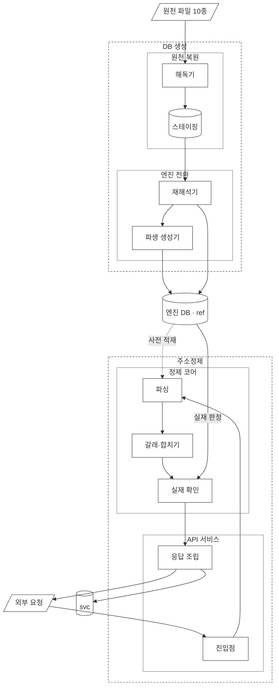

# 설계1 — 범위와 경계

**답하는 질문: 무엇을 만드는 물건인가**

---

## 0. 자주 나오는 말

**설계 문서 전체에서 같은 뜻으로 쓴다. 다른 이름으로 바꿔 부르지 않는다.**

| 말 | 뜻 | 자세한 곳 |
|---|---|---|
| 앞 세 자리 | 주소의 위쪽 세 단계. 시·도, 시·군·구, 읍·면 | `03-pipeline.md` 2절 |
| 표지 | 주소 단위를 나타내는 끝 글자. `시`·`구`·`읍`·`로`·`길` 따위 | `03-pipeline.md` 2절 |
| 조각 | 표지로 끊은 덩어리 하나 | `03-pipeline.md` 0-1절 |
| 갈래 | 표기 방식마다 따로 도는 조회 경로. 도로명 · 지번 · 건물이름 셋 | `03-pipeline.md` 0절 |
| 사전 | 메모리에 올려 둔 이름 목록. DB를 치지 않고 바로 찾는다 | `04-source-data.md` 7절 |
| 주소자리 | 도로명주소 한 자리. 건물이 여럿 설 수 있다 | `02-data-model.md` 3절 |
| 4칸 묶음 | 주소 한 자리를 가리키는 네 칸. 도로명코드·지하여부·건물본번·건물부번 | `06-source-schema.md` 5절 |
| 건물관리번호 | 건물 한 채마다 하나씩 붙는 25자리 식별자. 중복이 없다 | `04-source-data.md` 3-2절 |
| 도로명주소관리번호 | 주소 한 자리마다 붙는 26자리 식별자 | `06-source-schema.md` 2-8절 |
| 역조회 색인 | 도로명 이름으로 시·군·구를 거꾸로 찾는 표 | `03-pipeline.md` 4-2-1절 |
| 자모 | 한글 낱자. `강`을 `ㄱ`·`ㅏ`·`ㅇ`으로 푼 것 | `03-pipeline.md` 2절 |
| 기대 정제 값 | 정답을 미리 붙여 둔 시험용 주소 묶음. 만든 것이 맞게 도는지 잰다 | `05-expected-results.md` |
| 교정 전략 | 사람이 화면에서 고쳐 가며 쓰는 쪽. 후보를 짧게 낸다 | `03-pipeline.md` 4-3절 |
| 검출 전략 | 쌓인 자료를 한꺼번에 훑는 쪽. 사유를 넓게 낸다 | `03-pipeline.md` 4-3절 |
| 전체분 | 살아 있는 자료를 통째로 담은 파일. 월 단위로 받는다 | `04-source-data.md` 1-4절 |
| 변동분 | 그날 또는 그달에 바뀐 것만 담은 파일. 없어진 주소는 여기에만 나온다 | `04-source-data.md` 1-4절 |

**이 표가 용어의 정본이다.** 2026-09-07에 진행 규칙에서 설계 문서로 옮겼다. 같은 표를 두 곳에 두지 않는다.

**조각 · 갈래 · 주소자리 셋은 옮기면서 더했다.** 문서를 건너 쓰이는데 표에 없었다.

---

## 1. 파는 것

**행동 가능한 실패 사유.**

정제된 주소가 아니다. "실패했습니다"가 아니라 **"왜 실패했고 무엇을 하면 되는지"**를 돌려준다.

```
못 만든 것:  "주소를 확인해주세요"
만드는 것:  "행정동 표기로 보입니다. 법정동 이름이나 도로명으로 다시 입력해 주세요"
```

---

## 2. 왜 만드나 — 기존 구조의 문제

### 팀프레시 기존 흐름

```
외부 연동 주체 → API → TMS (엑셀 업로드·수기 입력 등 다경로 주문 수신, 주소 필드 추출)
  → API → 주소정제 애플리케이션 (외부사 팝업 호출 / TMS 호출 등 다경로 수신)
    → 정규식 + 최종 처리 분기 클래스
      → 성공: 호출지로 return
      → 실패: 카카오 API 호출
```

**소비자 3경로** — TMS 내부(주문 흐름) / 외부사 팝업 단건 / 엑셀 배치

### 문제 여섯

| # | 문제 |
|---|---|
| 1 | **실패한 건은 바로 "실패"라고만 돌아온다.** 카카오 호출 전이든 후든 같다. 사유가 안 붙는다 |
| 2 | **오배송은 애초에 실패로 잡히지 않는다.** 정제는 성공으로 닫혔는데 실제로는 틀린 주소였던 경우. 하루 사이클이 끝난 뒤에 드러난다 |
| 3 | 카카오 지연(수십 초, 종종)·먹통(간헐). 월 3만 건 이상 호출 → 가용성이 곧 CS 건수 위험 |
| 4 | 단건 정제 품질이 좋아 **내재화를 원하는 외부사가 있었으나 SDK 제공 수단 전무** |
| 5 | 엑셀 배치는 실패 목록만 반환하고 **사유 없음** |
| 6 | HTTP/1.0 기반 클라이언트, 자체로 2~3초 지연 |

### 중심 문제는 정제율이 아니다

| | 무엇 |
|---|---|
| ① 실패 사유의 해상도 | 왜 실패했는지가 한 줄로만 닫힌다 |
| ② 틀렸다는 것을 아는 시점 | 성공으로 닫힌 뒤 틀린 건은 사이클이 끝난 뒤에야 드러난다 |

**6번(HTTP 성능)은 이 프로젝트 주제에서 뺐다.** 파는 것이 흐려진다.

---

## 3. 표본에 대한 사실 — 감추지 않는다

**당시 시스템이 실패 사유를 남기지 않아 케이스 장부가 존재하지 않는다.**

실제로 배송이 잘못 간 사례가 있으나 **어느 유형에서 나왔는지 사후 분류가 불가능하다.**

- A군에도 커버율 계산에도 넣지 않는다
- **삭제하지 않고 왜 없는지가 보이게 남긴다**
- **이 사실 자체가 문제 진술이다.** 사유를 안 남기면 나중에 아무것도 알 수 없다

→ 그래서 「옛 주소 대응 장부」가 나온다. 같은 실수를 안 하는 구조다.

---

## 4. 범위

### 지역 — 서울

**조건: 지역 값만 늘리면 확장되는 구조여야 한다.**

- 어디에도 서울이라는 값을 박지 않는다
- **행정 단계 수를 고정하지 않는다.** 서울은 시도 밑에 바로 구, 세종은 시군구 없음, 도 지역은 시군 밑에 읍면
- 표를 지역별로 나누지 않는다

**"서울만 넣었습니다"와 "전국을 넣을 수 있는데 서울만 넣었습니다"는 다른 말이고, 뒤쪽을 말하려면 위 셋이 근거가 된다.**

**주의 — 서울은 건물군이 가장 적은 지역이다.**

| 지역 | 도로명주소 한 자리당 건물 수 |
|---|---|
| 서울 | 1.13 |
| 전국 | 1.67 |
| 경북 | 1.95 |

**건물군 처리를 대충 해도 서울에서는 안 드러난다.** 지역을 늘리는 순간 드러난다.
→ 서울 데이터만으로 검증하면 이 결함이 안 잡힌다. 기대 정제 값(정답을 미리 붙여 둔 시험용 주소 묶음)을 구성할 때 함께 고려한다.

### 정답원 — 건물DB 우선, 검색 API는 폴백

**근거 세 가지뿐이다.**

1. 회귀 검증이 외부 호출에 묶이면 케이스가 늘수록 막힌다
2. 겪은 A5(갱신 시점 차이)는 DB 경로에만 존재한다
3. 규모 사실 — 단일 지역 수십만 건. "적재에 몇 주"라던 초기 추정이 틀렸다

**폐기된 근거** — "컬리 회고의 첫 아쉬움이 건물 DB 우선이었다." 컬리 목표에서 나온 후회이므로 이 프로젝트의 근거가 아니다.

### 외부 호출 — 어댑터로 감싼다

카카오는 어댑터 뒤에 둔다. 갈아끼울 수 있어야 한다.

**코어는 어댑터를 직접 부르지 않는다.** 옛주소 조회 포트를 부르고 그 뒤에 어댑터가 선다. 상세는 `03-pipeline.md` 9절에 있다.

---

## 5. 경계 — 이 선을 넘는 안이면 먼저 충돌을 밝힌다

### LLM은 판정하지 않는다

- 표준 주소인지 **판정** → 코드 (건물 DB가 정답)
- 닮은 이름을 찾아 **후보 제안** → 코드 (자모 편집 거리. 자모는 `강`을 `ㄱ`·`ㅏ`·`ㅇ`으로 푼 한글 낱자다)
- 제안 후보가 실재하는지 **확인** → 다시 코드

**런타임에는 LLM이 없다.** 사용자 요청을 처리하는 경로 어디에도 안 들어간다.

같은 선을 apm-observatory에서 이미 그었다(판정은 통계, LLM은 원인 분석).
**같은 기준을 다른 도메인에서 한 번 더 적용하면 우연이 아니라 원칙이 된다.**

### 정답이 외부에 있다

행정안전부 자료가 정답이므로 **채점을 규칙 기반으로 끝까지 밀고 갈 수 있다.**
**LLM-as-judge가 필요 없다.** 흔치 않은 조건이다.

### 모르는 걸 아는 척하지 않는다

후보가 여럿이면 여럿으로 넘긴다. 임의로 첫 후보를 고르지 않는다.

**후보 여럿을 버리지 않고 넘기는 것** — 컬리가 도박이라 포기한 지점이다.
우열이 아니라 조건 차이다. 컬리는 배송이 걸려 하나를 골라야 했고, 이쪽은 **고르지 않고 넘길 수 있는 소비자**(팝업·배치)가 있다.

---

## 6. 모듈 경계와 전체 아키텍처

**모듈화는 설계 취향이 아니라 요건에서 나온다.** 컬리는 OMS 안의 한 모듈이었고, 이쪽은 소비자가 셋이다.

### 6-1. 전체 아키텍처



**도형이 뜻을 진다.** 평행사변형은 바깥과 닿는 자리, 원통은 저장소, 사각형은 모듈이다. 실선 화살표는 값이 흐르는 길이고 파선은 채워 두는 길이다. 파선 테두리가 덩어리, 실선 테두리가 그 안의 모듈이다.

### 6-2. 덩어리가 둘이다

| 덩어리 | 맡는 일 | 하지 않는 일 |
|---|---|---|
| DB 생성 | 행정안전부 원천을 엔진 자료로 만든다 | 외부 요청을 받지 않는다 |
| 주소정제 | 들어온 주소를 정제해 돌려준다 | 참조 마스터를 고치지 않는다 |

**둘이 만나는 자리는 엔진 DB 하나다.** DB 생성이 쓰고 주소정제가 읽는다. 권한으로도 갈라 둔다. 상세는 `02-data-model.md` 6-2절에 있다.

**두 덩어리는 서로를 부르지 않는다.** 배치가 도는 중에 정제 요청이 들어와도 흐름이 얽히지 않고, 정제가 멈춰도 적재는 그대로 돈다.

### 6-3. DB 생성 — 마디 둘

| 마디 | 맡는 일 |
|---|---|
| 원천 복원 | 파일을 읽어 원천 구조 그대로 스테이징 테이블에 넣는다. MS949 인코딩, CRLF 줄 끝, 층명칭에 들어오는 `null` 글자를 여기서 처리한다 |
| 엔진 전환 | 스테이징을 재해석해 엔진 테이블 일곱을 만들고, 그다음 파생 둘을 만든다 |

**마디를 나눈 이유는 실패하는 자리가 다르기 때문이다.** 원천 복원은 파일이 깨졌을 때 실패하고, 엔진 전환은 재해석 규칙이 틀렸을 때 실패한다. 한 마디로 묶으면 어느 쪽에서 틀렸는지 가릴 수 없다.

**스테이징은 배치가 도는 동안만 존재한다.** 영구 스키마로 두지 않는다. 근거는 `decisions.md` 1-3-20절에 있다.

**배치 셋이 이 두 마디를 돌린다.** 최초 적재·일 반영·월 대사이고, 상세는 `04-source-data.md` 8절에 있다.

### 6-4. 주소정제 — 마디 둘

| 마디 | 맡는 일 |
|---|---|
| API 서비스 | 교정과 검출 진입점을 나눠 받고, 전략에 맞는 형태로 응답을 조립한다 |
| 정제 코어 | 파싱부터 실재 확인까지 맡는다. 어느 전략으로 들어왔는지를 값으로만 받는다 |

**경계를 여기 그은 근거는 처리 과정이 하나라는 사실이다.** 교정과 검출은 반환 형태만 다르고 파싱·갈래·합치기·실재 확인을 그대로 공유한다. 근거는 `03-pipeline.md` 4-3절에 있다.

**전략값을 보는 자리가 코어 안에 셋 있다.** 후보 찾기·층 판정·응답이고, 나머지 자리는 전략과 무관하게 같은 일을 한다.

**응답을 만드는 일이 두 자리로 갈린다.** 등급과 사유를 정하는 응답 판정기는 정제 코어에 있고, 전략별 반환 모양을 만드는 응답 조립기는 API 서비스에 있다. 판정 자체는 전략과 무관하게 같으므로 코어에 두고, 소비자마다 달라지는 형태만 밖으로 뺀다.

### 6-5. 도식에 없는 모듈 둘

**어댑터와 GIS 모듈은 위 그림에 없다.** 둘 다 정제 흐름 밖에 서기 때문이다.

| 모듈 | 어디 서나 |
|---|---|
| 어댑터 | 실재 확인이 실패한 뒤 외부에 물을 때만 부른다. 카카오를 갈아끼울 수 있게 감싼다 |
| GIS 모듈 | admin 전용이다. 엔진 DB와 서비스 DB를 읽기만 하고 정제 흐름에 끼지 않는다 |

**GIS 관리 화면을 로직보다 먼저 만든다.** 예상하지 못한 사례가 화면에서 나온다.

### 6-6. 소비자 셋이 진입점 둘로 갈린다

```
TMS 내부        →  검출
외부사 팝업 단건 →  교정
엑셀 배치        →  검출
```

**어느 진입점으로 들어왔는지가 곧 전략값이다.** 흐름 안에서 다시 묻지 않는다.

→ 정제 코어 안쪽을 확대한 그림은 `03-pipeline.md` 9절 컴포넌트 UML이 맡고, 그 안의 인터페이스와 패턴은 같은 문서 10절이 가리키는 인터페이스 정의서(`07-interface.md`)가 맡는다.

---

## 7. 위험 등급표

**틀린 주소가 나갔을 때 얼마나 큰일인지에 순위를 매긴다.** 무엇을 먼저 막을지의 근거가 된다.

### 7-1. 등급을 가르는 것은 「누가 보는가」다

주소가 틀렸을 때 결말이 셋으로 갈린다.

| 우리가 뭐라고 답했나 | 그다음에 무슨 일이 생기나 | 등급 |
|---|---|---|
| 「이 주소 맞습니다」 | 아무도 의심하지 않는다. 물건이 남의 집에 가고 다음 날 전화가 온다 | **높음** |
| 「맞긴 한데 확인해 보세요」 | 그냥 넘어간다. 다만 사유가 적혀 있어 나중에 왜 틀렸는지는 찾는다 | 중간 |
| 「못 찾겠습니다」 · 「이 중에 고르세요」 | 담당자가 본다. 그 자리에서 고친다 | 낮음 |

**실패는 시끄러워서 안전하고 틀린 정답은 조용해서 위험하다.** 2절 문제 ②가 가리키는 자리가 맨 윗줄이다.

### 7-2. 같은 답이라도 받는 쪽이 다르면 등급이 다르다

「맞긴 한데 확인해 보세요」를 예로 든다.

| 받는 쪽 | 무슨 일이 생기나 | 등급 |
|---|---|---|
| 외부사 팝업 | 사람이 화면을 보고 있다. 그 자리에서 확인한다 | 낮음 |
| 엑셀 배치 | 수천 줄 가운데 한 줄이다. 아무도 안 본다 | 높음에 가깝다 |

→ **답변 내용만으로 등급을 매기지 않는다. 누가 받는지를 함께 본다.**

### 7-3. 소비자마다 선을 하나씩 긋는다

**선 왼쪽은 자동으로 나가고 오른쪽은 사람이 반드시 본다.**

```
외부사 팝업 (교정)      확실 | 확인권장  후보여럿  수정제안  실패
TMS · 엑셀 배치 (검출)  확실  확인권장 | 후보여럿  수정제안  실패
```

**팝업은 확실만 자동이다.** 나머지 넷은 화면에 떠서 사용자가 고른다. 화면 앞에 사람이 있기 때문이고, 역조회로 채운 값을 교정에서 확정으로 보는 근거와 같다(`03-pipeline.md` 4-2절).

**배치는 확인 권장까지 자동이다.** 검출 전략이 처리 결과 전체와 실패 목록을 돌려주므로, 확인 권장은 성공 쪽에 사유만 달고 실린다.

**응답 다섯에 소비자 셋을 곱한 열다섯 칸을 적지 않는다.** 선 두 개가 그 자리를 대신하고, 소비자가 늘면 선을 한 줄 더 긋는다.

### 7-4. 무엇을 먼저 막는가

**「이 주소 맞습니다」라고 답했는데 틀린 건이 최우선이다.** 나머지 둘은 사유가 남거나 사람이 보므로 되돌릴 길이 있다.

**다만 이것을 줄이려고 「확인해 보세요」를 남발하면 안 된다.** 경고가 늘 켜져 있으면 없는 것과 같다. 두 값을 함께 잰다.

| 재는 것 | 뜻 |
|---|---|
| 확실 오답률 | 확실로 답했는데 기대 정제 값과 다른 비율 |
| 확인 권장 오탐률 | 하나로 좁혀지는 주소에 괜히 사유가 붙은 비율 |

재는 방법은 `05-expected-results.md` 4-4절에 있다. **실측은 항목 11이 채워진 뒤에 가능하다.**

---

## 8. 좌표 — 아직 넣지 않는다

**자료를 받지 않았다.** 행안부는 좌표를 별도 자료(사물주소·내비게이션용 DB 등)로 제공한다.
**[확인 필요: 정확한 자료명, 좌표계, 배포 단위, 연결 키]**

용도는 **정제 통과한 주소가 실제 존재하는지 화면에서 눈으로 대조**하는 것이다.

**배송용과 대조용은 필요 정밀도가 다르다.**
- 배송용 — 건물 출입구 단위. 틀리면 기사가 헤맨다
- 대조용 — 화면에 점 찍어 눈으로 보는 것. 대충 맞으면 된다

지금은 대조용이므로 정밀한 자료가 필요 없다.

**붙는다면 자리는 건물이다.** 건물마다 하나씩 붙는 25자리 건물관리번호로 가리킨다. 지금 데이터 모델이 건물을 확실히 세워 두면 나중에 표 하나 붙이는 것으로 끝난다.
