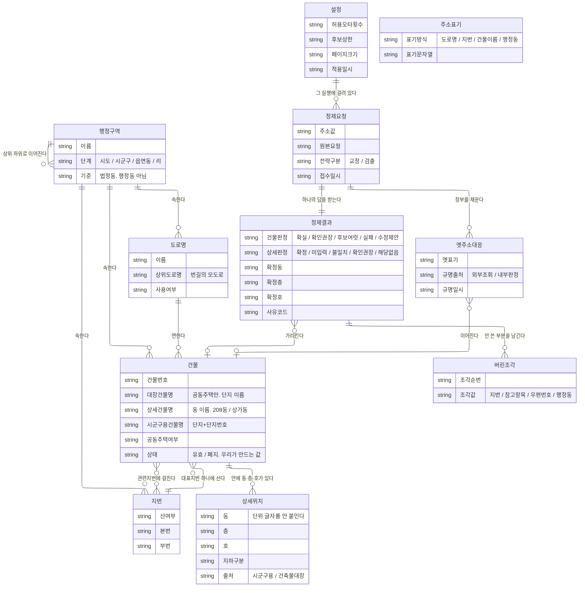
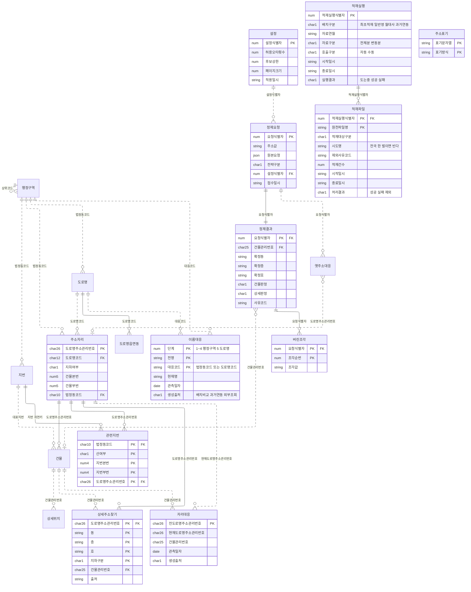
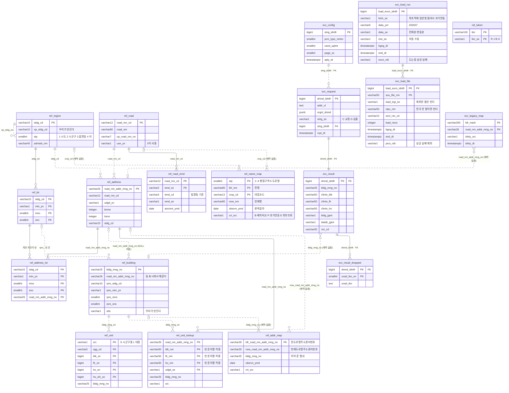

# 주소정제 솔루션 — 데이터 모델

작성일 2026-08-13 · 단계: **개념 완료 / 논리 완료 / 물리 완료**

---

## 0. 이 문서가 담는 것

**모델링 기준.** 수준은 개념·논리·물리 셋(ANSI/X3/SPARC 3층 스키마). 표기는 까마귀발을 세 수준에 모두 쓴다.

| 수준 | 여기서 하는 것 | 여기서 하지 않는 것 |
|---|---|---|
| 개념 (1~4절) | 대상을 엔터티로 뽑고 관계와 개수 관계를 정한다 | 속성을 전부 나열하지 않는다. 식별자를 정하지 않는다. 다대다를 풀지 않는다 |
| 논리 (5절) | 식별자를 정한다. 다대다를 중간 엔터티로 푼다. 식별·비식별을 선으로 구분한다. **정규형을 맞춘다** | 자료형과 길이를 정하지 않는다 |
| 물리 (6절) | 물리명·자료형·길이·색인·제약·분할·`autovacuum`을 정한다. ERD를 그린다 | 적재 배치 절차를 정하지 않는다 (`04-source-data.md`) |

---

## 1. 엔터티를 두 갈래로 나눈다

**남의 자료를 그대로 받는 쪽과 우리 업무에서 나온 쪽을 섞지 않는다.**
받는 쪽은 우리가 바꿀 수 없고, 저쪽이 구조를 바꾸면 두 쪽 사이 경계에서 멈춰야 한다.

### 받는 쪽 — 행정안전부 자료

| 엔터티 | 무엇인가 | 비고 |
|---|---|---|
| 행정구역 | 시·도, 시·군·구, 읍·면·동, 리 | **법정동 기준임을 명시** |
| 도로명 | 길에 붙인 이름 | |
| 지번 | 땅에 붙인 번호 | |
| 건물 | 도로에 면해 번호를 받은 건물 | **이름이 세 종류** |
| 상세위치 | 건물 안의 동·층·호 | **공동주택도 담는다.** 아래 3절 |

**원천 이력을 옮겨 담는 엔터티는 세우지 않는다.** 대신 갱신 전후를 견줘 만든 대응을 논리 단계에서 둘 세운다. 근거는 3절에 있다.

### 우리 쪽 — 업무에서 나온다. 원천 자료에 없다

| 엔터티 | 무엇인가 | 비고 |
|---|---|---|
| 주소표기 | 이름 하나가 무슨 방식으로 쓰였는지 판정하는 사전 | **표기방식 넷** |
| 설정 | 한 번의 실행에 걸린 설정값 묶음 | **정제결과를 재현하는 열쇠** |
| 정제요청 | 들어온 입력 한 건 | |
| 정제결과 | 들어온 입력에 붙는 판정과 사유 | |
| 버린조각 | 자리를 정하는 데 안 쓴 부분 | **정제결과 한 건에 여럿 붙는다** |
| 옛주소대응 | 외부에 물어 얻은 답을 적어 두는 장부 | **빌려온 것이다** |
| 적재실행 | 적재 진입점을 한 번 부른 기록 | **폴더 하나가 한 줄** |
| 적재파일 | 그 실행이 훑은 파일 한 개 | **적재한 것과 건너뛴 것을 함께 든다** |

**개념 단계의 엔터티는 아홉이다.** 논리 단계에서 「주소자리」·「관련지번」·「상세주소찾기」·「설정」·「버린조각」·「도로명읍면동」·「이름대응」·「자리대응」·「적재실행」·「적재파일」이 더해져 **열아홉**이 된다. 5절에 있다.

---

## 2. 개념 모델

**선의 실선·점선은 식별·비식별을 뜻하지 않는다.** 개념 단계에서 식별자를 정하지 않으므로 구분할 수 없다. 구분은 5절 논리 모델에서 붙인다.



**적재 장부 둘은 이 그림에 없다.** 주소 도메인이 아니라 운영 기록이고, 논리 단계에서 세운다. 4절이 그 자리를 가리킨다.

---

## 3. 관계를 이렇게 본 이유

### 행정구역이 자기 자신과 이어진다 — 그리고 법정동 기준이다

서울은 시·도 밑에 바로 구가 온다. 세종은 시·군·구가 없다. 도 지역은 시·군 밑에 읍·면이 또 있다.
**단계 수를 고정하면 서울 모양이 굳어져서 다른 지역에서 깨진다.**
상하 관계로만 두고 단계를 값으로 구분하면 어느 지역이든 들어간다.

**이 엔터티는 법정동만 담는다.**

원천 자료가 전부 법정동 기준이다. 도로명코드 파일의 읍면동코드 칸조차 설명이 `법정동 기준`이다.

행정동도 칸으로 오지만 **원천이 직접 신뢰하지 말라고 적어놨다.**

> 현재 제공되는 행정동 정보는 관할주민센터 정보를 기준으로 하고 있으며 **도로명주소와 1:1로 매칭되는 정보만** 포함합니다. 또한 **행정동정보가 누락되거나 잘못 매칭된 정보가 존재할 수 있으므로** 참고용으로만 사용하시기 바랍니다.

세 가지가 한꺼번에 나온다. 1:N인 경우는 아예 안 들어 있고, 누락과 오매칭을 원천이 인정했고, 기준이 행정동 경계가 아니라 **관할주민센터**다.

→ **행정동을 행정구역 엔터티에 넣으면 안 된다.** 넣으면 못 믿을 값이 정답 자리에 앉는다.
→ 겪은 유형 A3(행정동·법정동 혼용)은 다른 방식으로 다룬다. 아래 「주소표기」 참조.

### 건물과 지번의 관계가 두 종류다

**대표지번 — 건물마다 하나씩, 건물 줄 안에 있다**

건물정보 파일 한 줄에 `지번본번`·`지번부번` 칸이 있다. 별도 파일이 아니다.

같은 주소 자리의 건물이라도 지번이 다를 수 있다. 실물 사례로, 강일리버파크 10단지는 `고덕로97길 20` 한 자리인데 건물마다 지번이 424-2와 695-0으로 갈린다.

→ **우리 갈래에서 대표지번은 건물 단위다.**

**관련지번 — 별도 파일. 그리고 건물이 아니라 「주소 한 자리」에 붙는다**

관련지번 파일에는 **건물관리번호 칸이 아예 없다.** 건물을 가리키는 것은 4칸 묶음(도로명코드·지하여부·건물본번·건물부번)뿐이다.

이 네 칸이 가리키는 것은 건물 한 채가 아니라 **주소 한 자리**다.

```
"아리수로93길 40"          ← 네 칸이 가리키는 것
    ├── 건물 A  →  308동
    ├── 건물 B  →  307동
    └── 건물 C  →  상가동
```

→ 개념 그림에서는 건물–지번 여러 대 여러로 그린다. **논리 단계에서 「주소자리」를 세워 푼다.**

**두 갈래가 담는 지번이 거의 겹치지 않는다.**

**[전량 · 전국] 지번 자연키 유일값 7,597,936개 가운데 대표지번이 6,169,477개(81.2%)이고, 관련지번에만 있는 것이 1,428,459개(18.8%)다.**

→ **지번으로 찾을 때 두 곳을 동시에 봐야 한다.** 근거는 `03-pipeline.md` 0-1절 지번 갈래에 있다.

**[전량 · 전국] 4칸 묶음 6,422,298개의 건물 수 분포**

| 건물 수 | 묶음 수 |
|---|---|
| 1 | 4,246,781 (66.1%) |
| 2 | 1,185,592 |
| 3 | 556,723 |
| 4 | 222,361 |
| 5 이상 | 210,841 |

최대는 1,732채다. **세 자리에 두 자리는 건물이 하나뿐이고, 꼬리가 길다.**

### 동이 두 곳에 나타난다

**아파트 동은 건물이다.** 아파트 단지에서 동 하나하나가 별개 건물로 등록되고, **건물관리번호를 각각 갖는다.**

**그런데 상세위치에도 동이 있다.** 건축물대장 상세주소는 단지의 호수를 건물 한 채에 몰아 붙이고 동명칭 칸으로 가르는 경우가 있다.

**[전량 · 경기 실측] 건물이 두 채 이상인 아파트 주소 14,042곳**

| 상세주소가 붙은 건물 | 곳 수 |
|---|---|
| 여러 채에 나뉘어 붙는다 | 10,682 (76%) |
| 한 채에 몰려 붙는다 | 2,887 (21%) |
| 한 채도 없다 | 473 (3%) |

→ **입력한 동을 건물 고르는 조건으로만 쓰면 21%에서 실패한다.** 주소 한 자리에 딸린 건물을 모두 놓고 상세위치를 모은 뒤, 동·층·호로 함께 좁힌다.

**동에 단위 글자를 붙이지 않는다.** 원천이 상세위치 쪽 동·층·호에 기준 문자를 안 붙인다. 서울 전량에서 건축물대장 상세주소의 동 값 2,087,230개 중 1,748,631개가 숫자만이고, 나머지도 `비01`·`B101`처럼 문자가 섞인 값이지 `110동` 형태가 아니다.

**자료형은 문자열이다.** 근거는 6-3절에 있다.

### 상세위치가 공동주택도 담는다

상세주소DB는 주택법상 공동주택을 제외한다. **그러나 건축물대장 상세주소가 공동주택 호수를 담는다.**

**[전량 · 서울 실측] 두 자료가 겹치지 않는다.** 시군구용에만 있는 건물 80,790채, 대장에만 있는 건물 136,020채, 양쪽에 다 있는 건물 301채다.

**[전량 실측] 공동주택 가운데 호수 자료가 있는 건물 비율** — 서울 88.4%, 경기 84.7%, 부산 79.3%.

→ **아파트 호수도 실재 확인 대상이다.** 형식 검사만 하지 않는다.

### 건물 이름이 세 종류다

| 칸 | 값 예시 | 층위 |
|---|---|---|
| 건축물대장건물명 | `강일리버파크` | 단지 |
| 상세건물명 | `308동` | 동 |
| 시군구용건물명 | `강일리버파크3단지아파트` | 단지 + 단지번호 |

→ **건물 이름으로 찾을 때는 세 칸 전부를 비교 대상으로 삼아야 한다.** 비교 방법은 5-7절에 있다.

### 상세위치는 건물에 종속된다 — 독립해서 가리켜지지 않는다

`1503호`만으로는 아무 뜻이 없다. `어느 건물의 1503호`여야 한다.

**정제결과는 건물만 가리키고, 확정한 값은 복사해 둔다.** 양쪽으로 선을 뻗으면 건물 A를 가리키면서 건물 B에 딸린 상세위치를 가리키는 상태가 그림상 막히지 않는다.

### 판정이 두 부분으로 나뉜다

국가 표준의 주소 표기 순서는 이렇다.

> 시·도 + 시·군·구 + 읍·면 + 도로명 + 건물번호 + **상세주소(동/층/호)** + (참고항목)

앞쪽은 나라가 붙인 번호라 정답 목록이 있다. 뒤쪽도 정답이 있지만 **부르는 방식이 건물마다 제각각이다.**

**하나로 뭉치면 표현할 수 없는 경우가 생긴다.** 건물은 하나로 딱 나왔는데 호를 안 쓴 경우다.

**주의 — 아파트는 표준 표기와 실물이 어긋난다.** 아파트의 동은 자료에서 참고항목(건물명) 자리에 있거나 상세위치 쪽에 있다.

### 주소표기를 따로 둔 이유 — 그리고 행정동이 여기 들어간다

**표기방식에 `행정동`을 넣는다.** 행정동은 정답 자리에 못 앉지만, **"이 입력은 행정동 방식으로 쓰였다"는 사실 자체는 기록할 수 있다.**

```
입력: "상계1동 ○○로 12"  (상계1동은 행정동이고 법정동에는 없다)
  → 표기방식 = 행정동으로 인식
  → 법정동 대응표가 없으므로 건물을 못 찾음
  → 판정: 실패 / 사유종류: 참조없음
  → 사유: "행정동 표기로 보임. 법정동 이름으로 다시 입력하거나 도로명을 확인해 주세요"
```

**이것이 이 프로젝트가 파는 「행동 가능한 실패 사유」다.**

**행정동 이름 목록은 실재한다.** 건물정보 19번 칸에 전국 3,281개, 서울 427개가 온다. 그 가운데 법정동 이름에 없는 것이 서울 338개, 전국 1,379개이고, **A3를 실제로 잡는 범위가 그만큼이다.**

### 건물의 「상태」는 우리가 만드는 값이다

가이드에는 "폐지건의 경우 사용여부가 '1'로 변경"이라고 적혀 있지만, 사용여부 칸이 건물정보 레이아웃에 없다.

→ **원천에서 오지 않는다. 받는 쪽이 만들어 붙이는 칸이다.**

| 자료 | 가이드 안내 |
|---|---|
| 건물·도로명 | 사용여부를 '1'로 변경 (**논리 삭제**) |
| 관련지번·상세주소 | DELETE (**물리 삭제**) |

**폐지 줄에 값이 다 온다.** 월변동분 건물 폐지 6,469줄에서 고시일자·변동전도로명주소·비고 넷을 뺀 27칸이 채워져 왔다.

### 원천 이력을 옮겨 담지 않는다 — 대응은 우리가 만든다

**원천 이력이 「무엇이 무엇으로 바뀌었나」를 주지 않는다.** 도로명 폐지 71줄의 변경이력정보가 전부 비어 있고, 변경이력사유 `0`(도로명변경)이 전체분에도 변동분에도 한 건이 없다. 오는 것은 「언제 무슨 사유로 바뀌었나」뿐이다.

→ **사유코드를 표로 쌓는 엔터티를 세우지 않는다.** 갱신 갈래를 가르는 데만 쓰고 버린다.

**그러나 대응 자체를 포기하지는 않는다.** 원천에서 꺼내는 대신 **갱신 전후를 견줘 만든다.**

```
갱신 전   건물관리번호 A  →  주소자리 X
갱신 후   건물관리번호 A  →  주소자리 Y
          같은 건물이 다른 자리로 갔다  →  X를 Y로 잇는 한 줄
```

**건물관리번호와 도로명코드가 값이 바뀌어도 안 바뀌기 때문에 성립한다.** 이 둘이 전후를 잇는 열쇠다.

→ **엔터티 둘을 세운다.** 「이름대응」이 행정구역과 도로명의 이름 변화를, 「자리대응」이 건물이 선 자리의 변화를 받는다. 논리 단계에서 세우고 5-1절에 있다.

**세우는 물건이 이력이 아니라 사전이다.** 이력은 「언제 무슨 사유로 바뀌었나」를 쌓지만 이것은 「옛 이름이 지금 무엇인가」 한 줄만 든다. 여러 번 바뀌면 줄을 쌓지 않고 현재 값을 덮어 조회가 한 번에 끝난다.

**빌려온 것과 만든 것을 섞지 않는다.** 외부 검색 API가 준 답은 `svc.legacy_map`이 따로 들고, 우리가 견줘 만든 것은 `ref`에 둔다.

**현재 상태는 다른 칸이 든다.** 건물은 `ref.building.stts`, 도로명은 `ref.road.use_yn`이다. 갱신 배치는 삭제·삽입 건수와 새로 만든 대응 줄 수를 지표로 남긴다.

**전체분만으로는 대응이 한 줄도 안 나온다.** 견줄 이전 스냅숏이 없기 때문이다. **서비스가 도는 동안 매달 쌓인다.**

### 정제요청과 정제결과를 나눈 이유

들어온 것과 우리가 답한 것은 다르다. **들어온 값은 손대지 않고 그대로 남긴다.**

**이 둘은 운영 기록이 아니라 검증 기록이다.** 2단계 루프가 구축·실험·검증·수정을 반복해서 도는데, 무엇을 넣었을 때 무엇이 나왔는지가 남아야 채점과 재현이 된다. 사용자 정보·과금·재처리 횟수·보관 정책을 담지 않는 이유가 여기 있다.

**재현에 필요한 것은 셋이다** — 주소 문자열, 전략구분, 설정. 세 번째가 「설정」 엔터티다.

### 적재 장부는 배치가 무엇을 언제 넣었는지만 든다

**적재 진입점이 폴더 하나를 훑어 적재 대상만 고른다.** 무엇을 골랐고 무엇을 건너뛰었는지가 남지 않으면, 파일이 하나 빠진 채 배치가 돌아도 아무도 모른다.

**둘로 나눈 이유는 실행 하나가 파일 여럿을 훑기 때문이다.** 한 표에 담으면 배치 종류·연월·구분이 파일 줄마다 되풀이돼 제3정규형을 깬다. 실행이 끝난 시각을 적을 때 전국이면 아흔일곱 줄을 함께 고쳐야 하고, 폴더가 비면 파일 줄이 없어 실행 자체가 기록에 안 남는다.

**판단에 끼지 않는다.** 적재가 「현재 값으로 만든다」이므로 같은 폴더를 두 번 넣어도 결과가 같다. 장부를 보고 이미 넣은 파일을 건너뛰게 만들면 장부가 틀렸을 때 적재가 함께 틀린다. 상세는 `04-source-data.md` 14-6절에 있다.

---

## 4. 개념 단계에서 일부러 남겨둔 것

| 항목 | 어디서 정했나 |
|---|---|
| **상세주소찾기 테이블** | 아래 4-1절 (논리) |
| **이름대응·자리대응 테이블** | 5-1절 (논리). 3절이 근거를 든다 |
| **적재실행·적재파일 테이블** | 5-1절 (논리). 3절이 근거를 들고 규칙은 `04-source-data.md` 14-6절 |
| 관련지번 연결을 조인할지 펼칠지 | 5절 (논리). 주소자리 엔터티로 푼다 |
| 식별자 | 5절 (논리) |
| 정제결과가 상세위치까지 참조할지 | 5절 (논리). **참조하지 않고 값을 복사한다** |
| 건물 이름 세 칸을 어떻게 비교할지 | 5절 (논리). 칸 사이 OR, 조각 사이 AND |
| 정제요청·결과를 전부 남길지 | **이번 단계에서 파지 않는다.** 엔진과 코어에 집중한다 |
| 찾기 위한 색인 | 6-5절 (물리) |
| 지역별 분할 여부 | 6-8절 (물리). **하지 않는다** |
| 좌표 | 미정. 자료를 안 받았다 |

### 4-1. 상세주소찾기 — 논리 단계에서 세우는 파생 테이블

**세우는 이유는 조회 갈래를 없애는 것이다.** 동이 건물 쪽에 있는 경우와 상세위치 쪽에 있는 경우가 76 대 21로 갈린다. 적재할 때 한 번 펼쳐 두면 조회는 한 번이다.

**식별자는 자연키다.** 도로명주소관리번호 + 동 + 층 + 호 + 지하구분이다.

**주소 자리를 4칸 묶음이 아니라 도로명주소관리번호로 든다.** 4칸 묶음은 전국 10건에서 두 읍면동이 겹쳐 갈리지 않는다.

**인조식별자를 두지 않는다.** 지우고 다시 넣을 때마다 번호가 새로 붙어, 그 번호를 들고 있던 쪽이 끊어진다.

**갱신은 주소 한 자리 단위로 지우고 다시 넣는다.**

| | 부분 갱신 | 자리 단위로 지우고 다시 넣기 |
|---|---|---|
| 로직 | 이동사유코드별로 갈라 짠다 | 하나뿐이다 |
| 한 줄이 여러 줄에 퍼지는 경우 | 따로 짜야 한다 | 저절로 풀린다 |
| 틀렸을 때 | 조용히 어긋난 채 남는다 | 다음 갱신에서 덮인다 |

**[전량 실측] 대가는 작다.** 한 달치 변동분이 건드리는 주소 자리가 15,361곳이고, 서울 상세주소 4,323,373줄 중 38,541줄(0.89%)을 다시 쓴다.

**위험 셋**

| 무엇 | 어떻게 막나 |
|---|---|
| 지우고 넣는 사이에 조회가 오면 없는 주소가 된다 | 한 트랜잭션으로 묶는다 |
| 지운 뒤 넣기가 실패하면 그 자리가 사라진다 | 자리 단위로 커밋하고 처리한 자리를 기록한다 |
| 대량 삭제가 조용히 지나간다 | 하루 삭제·삽입 건수를 지표로 남기고 평소 폭을 벗어나면 멈춘다 |

**옛 값은 남기지 않는다.** 이 테이블은 원천에서 만들어 낸 파생값이라 옛 값을 들 이유가 없다. 주소가 바뀐 대응은 자리대응 테이블이 따로 든다.

---

## 5. 논리 데이터 모델

개념 모델의 아홉 엔터티에 「주소자리」·「관련지번」·「상세주소찾기」·「설정」·「버린조각」·「도로명읍면동」·「이름대응」·「자리대응」·「적재실행」·「적재파일」이 더해져 **열아홉**이 된다. **자료형과 길이는 정하지 않는다.**

### 5-1. 식별자

| 엔터티 | 식별자 | 종류 |
|---|---|---|
| 행정구역 | 법정동코드 10 | 자연키 |
| 도로명 | 도로명코드 12 | 자연키 |
| **도로명읍면동** | **도로명코드 12 + 읍면동일련번호 2** | 자연키 |
| 지번 | 법정동코드 10 + 산여부 1 + 지번본번 4 + 지번부번 4 | 자연키 |
| 주소자리 | 도로명주소관리번호 26 | 자연키 |
| 건물 | 건물관리번호 25 | 자연키 |
| 관련지번 | 지번 자연키 넷 + 도로명주소관리번호 | 자연키 |
| 상세위치 | 출처 + 시군구코드 5 + 동·층·호·호접미사 일련번호 | 자연키 |
| 상세주소찾기 | 도로명주소관리번호 + 동 + 층 + 호 + 지하구분 | 자연키 |
| **이름대응** | **단계 + 전명 + 대응코드** | 자연키 |
| **자리대응** | **전도로명주소관리번호 26** | 자연키 |
| 주소표기 | 표기문자열 + 표기방식 | 자연키 |
| **설정** | **인조식별자** | 인조 |
| 정제요청 | 인조식별자 | 인조 |
| 정제결과 | 정제요청 식별자 | 자연키 |
| **버린조각** | **정제요청 식별자 + 조각순번** | 자연키 |
| 옛주소대응 | 옛표기 + 가리키는 주소자리 | 자연키 |
| **적재실행** | **인조식별자** | 인조 |
| **적재파일** | **적재실행 식별자 + 원천파일명** | 자연키 |

**행정구역은 상위 행을 우리가 만든다.** 원천은 최하위 단계 코드만 준다. 뒷자리를 `0`으로 채워 시도·시군구 행을 만든다.

```
1100000000   서울특별시
1168000000   서울특별시 강남구
1168010100   서울특별시 강남구 역삼동
```

**상세위치 식별자에 건물관리번호를 앞세우지 않는다.** 원천 PK로 이미 유일하고, 앞세우면 건물이 바뀔 때 식별자가 따라 바뀐다.

**이름대응의 식별자에 대응코드가 들어간다.** 같은 전명이 여러 코드에서 나올 수 있다. 「중앙로」가 여러 시군구에서 동시에 바뀌면 도로명코드마다 한 줄이다.

**자리대응은 옛 자리 하나가 식별자다.** 옛 자리 하나가 새 자리 둘을 가리키는 경우는 없다. 건물이 한 자리에서 다른 한 자리로 옮겨간 것이기 때문이다.

**적재실행에 인조식별자를 쓴다.** 상세주소찾기에서 인조식별자를 뺀 근거는 「지우고 넣을 때마다 번호가 새로 붙어 참조가 끊어진다」였는데, 장부는 지우고 다시 넣지 않아 그 근거가 안 걸린다.

**적재파일은 파일명이 열쇠의 절반이다.** 건너뛴 파일은 자료와 시도를 못 채우므로 그 둘을 열쇠로 쓸 수 없다. 파일명은 폴더 안에서 유일하고 원천 그대로 두기로 이미 정해 둔 값이다.

### 5-2. 다대다를 주소자리로 푼다

```
행정구역 ──< 주소자리 ──< 건물 ──< 상세위치
                │
                └──< 관련지번 >── 지번
```

**대표지번은 중간 엔터티가 필요 없다.** 건물 한 채에 하나뿐이고 건물 줄 안에 있어 일대다다.

**지번 중복 제거 기준은 식별자와 같다.** 법정동코드·산여부·본번·부번 넷이 같으면 같은 땅이다.

**관련지번은 `jibun_rnaddrkor_` 한 벌만 적재한다.**

### 5-3. 정규화 — 위반 일곱과 파생 하나를 걷어냈다

**엔터티를 제1·제2·제3정규형으로 다시 훑었다 (2026-08-26 · 08-27 · 09-03).**

| 어디 | 무엇을 어겼나 | 어떻게 풀었나 |
|---|---|---|
| 정제요청의 설정값 | **제1정규형.** 허용오타횟수·후보상한·페이지크기 셋이 한 칸에 | **「설정」 엔터티 신설.** 요청이 식별자로 가리킨다 |
| 정제결과의 버린조각 | **제1정규형.** 여러 조각이 한 칸에 | **「버린조각」 엔터티 신설** |
| 건물의 법정동코드 | **제3정규형.** 주소자리를 타고 가면 나온다 | **뜻을 「대표지번 법정동코드」로 못박는다.** 지번을 가리키는 열쇠가 되어 중복이 사라진다 |
| 상세위치의 도로명주소관리번호 | **제3정규형.** 건물관리번호로 정해진다 | **뺀다.** 전량 확인에서 상세주소 324만 줄이 전부 건물에 걸렸다 |
| 도로명의 시군구코드 | **파생 칼럼.** 도로명코드 12자리의 앞 5자리 | **뺀다** |
| 정제결과의 사유종류 | **제3정규형.** 사유코드가 정해지면 따라 정해진다 | **사유코드 마스터가 갖는다** |
| 도로명의 이름·상위도로명번호·사용여부 | **제2정규형.** 식별자가 도로명코드 + 읍면동일련번호 둘인데 셋이 앞 하나로 정해진다 | **「도로명읍면동」 엔터티 신설.** 읍면동 속성과 고시일자를 그쪽으로 옮긴다 (2026-08-27) |
| 적재 장부의 배치종류·자료연월·자료구분 | **제3정규형.** 파일 줄에 담으면 실행 식별자가 정한다 | **「적재실행」과 「적재파일」로 나눈다** (2026-09-03) |

**절 제목의 셈이 어긋나 있었다.** 08-27에 도로명 줄을 더하면서 제목을 안 고쳐 「위반 다섯」으로 남아 있었다. 09-03에 장부 줄을 더하며 일곱으로 바로잡았다.

**도로명 위반은 08-26 검토에서 빠졌다.** 전량 실측으로 뒤늦게 드러났다. 371,958줄이 도로명코드 174,253개로 접히고 한 코드 안에서 이름이 갈리는 경우가 0건이다. **원천이 도로명코드마다 대표 줄을 하나씩 주고 있어, 나누는 것이 원천 구조를 바꾸는 일이 아니라 섞여 온 것을 되돌리는 일이다.**

**정제요청의 들어온경로 칸도 함께 걷어냈다.** 흐름 어디에서도 읽지 않는 칸이었다. 자리를 **전략구분**과 **설정식별자**가 받는다.

**대응 엔터티 둘은 정규형을 지킨다 (2026-08-31).** 이름대응은 단계·전명·대응코드 셋이 전체키이고 현재명이 그 셋에 종속한다. 자리대응은 옛 자리 하나가 키이고 현재 자리와 건물관리번호가 그것에 종속한다. **다형 참조가 없다.** 이름과 자리를 한 표에 담으면 코드가 10자리·12자리로 섞이므로 표를 나눴다.

### 5-4. 일부러 어긴 곳 셋 — 고치지 않고 근거를 남긴다

| 어디 | 무엇을 어겼나 | 왜 그대로 두나 |
|---|---|---|
| 상세주소찾기 | **제2정규형.** 건물관리번호가 기본키 전체가 아니라 「주소자리 + 동」에만 종속한다 | **조회 갈래를 없애려고 적재할 때 미리 펼쳐 둔 파생 테이블이다.** 요청마다 두 경로를 타는 것을 막는다 |
| 정제결과의 확정 동·층·호 | **제3정규형.** 상세위치를 참조하면 나온다 | **원천이 갱신되면 그때 무엇을 답했는지가 사라진다.** 참조가 아니라 값으로 복사한다 |
| 적재파일의 제외사유코드 | **부분집합을 세분한다.** 값이 차면 처리결과가 「제외」로 정해진다 | **`svc.result`의 판정과 사유코드가 선 자리와 같다.** 결말을 한 칸으로 들고 그 안쪽을 코드가 가른다. 칸을 더 두면 조합마다 값이 는다 |

**적어 두지 않으면 다음 사람이 잘못으로 보고 고친다.**

**같은 판단이 세 곳에 있다.** 정제요청의 원본 요청 칸, 상세주소찾기의 인조식별자 배제, 정제결과의 확정 동·층·호다.

### 5-5. 논리 ERD

실선이 식별 관계, 점선이 비식별 관계다.



**식별 관계로 그린 곳은 일곱이다.** 주소자리–건물, 주소자리–관련지번, 지번–관련지번, 주소자리–상세주소찾기, 정제요청–정제결과, 정제결과–버린조각, 적재실행–적재파일이다.

**대응 둘은 전부 비식별이다.** 전명과 옛 자리가 지금 마스터에 없을 수 있다. 그것이 바로 이 표가 존재하는 이유다.

### 5-6. 주소표기는 이름과 방식만 담는다

**대상을 가리키는 칸을 두지 않는다.** 캐시는 후보를 좁히는 데만 쓰고 실재 판정은 DB가 한다.

```
표기문자열   표기방식
세종로       도로명
세종로       법정동
```

**[전량] 규모**

| 방식 | 전국 | 서울 |
|---|---|---|
| 도로명 | 371,958 | 14,583 |
| 법정동·법정리 | 10,557 | 466 |
| 건물이름 (세 칸 합집합) | 588,665 | 111,664 |
| 행정동 | 3,281 | 427 |
| **합** | **약 97만** | **약 12.7만** |

메모리에 올릴 수 있는 크기다.

### 5-7. 건물 이름 세 칸 비교

| | 관계 |
|---|---|
| 칸 사이 | **OR.** 조각 하나가 세 칸 중 어디에 걸리든 인정한다 |
| 조각 사이 | **AND.** 입력에 조각이 둘이면 둘 다 만족하는 건물을 찾는다 |

```
입력   강일리버파크 308동

1번 줄  대장명=강일리버파크  상세명=308동  시군구용=강일리버파크3단지아파트  →  ○
2번 줄  대장명=강일리버파크  상세명=307동  시군구용=강일리버파크3단지아파트  →  ×
```

**칸을 짝으로 못박지 않는다.** 공동주택이 아니면 건축물대장건물명이 아예 오지 않는다.

**AND가 0을 만들 때는 조각별로 따로 찾은 결과를 남긴다.**

**후보 상한은 열 개다.**

**[전량 · 전국] 이름 하나가 가리키는 건물 수**

| | 이름 수 | 한 채뿐 | 열 채 이하 | 최대 |
|---|---|---|---|---|
| 건축물대장건물명 | 92,222 | 57.5% | 92.6% | 2,253 (`현대아파트`) |
| 시군구용건물명 | 418,618 | 61.1% | 95.3% | 5,508 (`주택`) |

**꼬리에 건물 종류를 적어 둔 값이 있다.** **사전에서 걸러내지 않는다.** 후보 상한이 넘으면 개수만 돌려주므로 「그 이름을 가진 건물이 5,508채입니다」가 나가고, 그것이 다음에 무엇을 할지 알려 주는 답이다.

### 5-8. 판정과 사유를 나눠 든다

```
건물판정 = 남은 후보 수     1이면 확실 · 2 이상이면 후보여럿 · 0이면 실패
버린조각 = 자리를 정하는 데 안 쓴 부분이 있으면 채운다
확실 + 버린조각이 함께 서면 건물판정을 확인권장으로 낸다
```

**버린조각을 별도 엔터티로 두는 이유는 여럿이 함께 나오기 때문이다.** 지번·참고항목·우편번호·행정동이 한 입력에서 동시에 버려질 수 있다. 한 칸에 이어 붙이면 「지번만 버린 건이 몇 건인가」를 못 센다.

**사유 코드는 하나로 둔다.** 종류마다 코드를 만들면 목록이 계속 늘고 받는 쪽도 그때마다 갱신해야 한다.

응답 등급과 사유 코드의 정의는 `03-pipeline.md` 3절과 4절에 있다.

---

## 6. 물리 데이터 모델

**DBMS: PostgreSQL** (2026-08-26 확정)

> **물리명은 행정안전부 「공공데이터 공통표준단어」·「공공데이터 공통표준용어」 대조로 확정했다.**
> **ERD는 6-10절에 있다. 산출물은 `erd-physical.drawio`와 `design/standard-dict/` 열이다.**

### 6-0. 이 절이 정하는 것

| 정한다 | 정하지 않는다 |
|---|---|
| 스키마 구성 · 물리명 | 적재 배치 절차 (`04-source-data.md`) |
| 자료형과 길이 | 서버 규모와 메모리 설정 |
| 색인 | 백업·복제 구성 |
| 제약을 어디까지 거는가 | 접속 풀 크기 |
| 지우고 넣기 대비 설정 · 분할 여부 | **SQL 문장 형태** |

**SQL 문장을 여기에 적지 않는다.** 설계가 정할 것은 판단 지점과 제약이고, 문장으로 할지 애플리케이션 코드로 할지는 구현이 정한다.

### 6-1. 명명 규칙

**영문 소문자 snake_case로 쓴다.** PostgreSQL은 인용 부호가 없는 식별자를 소문자로 접는다.

```
CREATE TABLE Building (...)   →  실제 이름은 building
CREATE TABLE "Building" (...) →  실제 이름은 Building. 이후 늘 큰따옴표가 필요하다
```

| 대상 | 규칙 | 예 |
|---|---|---|
| 테이블 | 단수형 명사 | `building` |
| 칼럼 | **표준 영문약어명을 이어 붙인다** | `road_nm_cd` |
| 색인 | `ix_테이블_용도` | `ix_address_road4` |
| 유일 색인 | `ux_테이블_용도` | `ux_road_name` |
| 제약 | `ck_테이블_칼럼` | `ck_region_len` |

**`tb_` 같은 접두어를 안 붙인다.** 스키마가 이미 갈라 준다.

### 6-1-1. 표준 대조 결과

**칼럼 117개를 전부 대조했다.** 조각 83개 가운데 77개가 공통표준단어이고 여섯이 프로젝트 신규다.

| 갈래 | 예 |
|---|---|
| 표준용어 직접일치 | 법정동코드 `STDG_CD` · 도로명 `ROAD_NM` · 적재건수 `LOAD_NOCS` |
| 동의어 경유 일치 | 지번본번 → 본번 `MNO` · 지번부번 → 부번 `SNO` |
| 표준단어 조합 | 시군구코드 `SGG_CD` · 대응코드 `CRSP_CD` · 적재실행식별자 `LOAD_EXCN_IDNTFR` |
| 프로젝트 등록 | 아래 여섯 |

**프로젝트 신규 표준단어 여섯**

| 단어 | 약어 | 왜 표준에 없나 |
|---|---|---|
| 동(棟) | **`BLK`** | 표준용어 「행정동명 = `DONG_NM`」·「행정동코드 = `DONG_CD`」가 이미 `DONG`을 쓴다. 처음 승인은 `DONG`이었으나 한 약어가 洞·棟 두 뜻을 갖게 되어 `BLK`로 확정했다 (2026-08-26) |
| 호 | `HO` | 표준 3,284개에 홑글자 「호」가 없다 |
| 접미사 | `SFX` | 등재 없음. 영어 관용 축약 |
| 전 | `BFR` | 「이전 = `BFR`」의 축약을 빌린다 |
| 오타 | `TYPO` | 등재 없음 (2026-08-28) |
| 후보 | `CAND` | 등재 없음. 「후보자 = `CNDD`」·「조건 = `CND`」와 겹치지 않는다 (2026-08-28) |

**등록하지 않기로 한 것 둘**

- **「용」** — 접미사이지 독자 개념이 아니다. `시군구용건물명`은 `sgg_bldg_nm`으로 충분하다
- **「정제」** — `svc` 스키마 이름이 이미 그 뜻을 진다

**`_no`가 겹쳐 쓰이던 문제가 풀렸다.** 표준이 관리번호는 `MNG_NO`, 지번 본번·부번은 `MNO`·`SNO`로 갈라 준다.

**우리가 지었던 조어 둘을 표준으로 되돌렸다 (2026-08-28).** 대표는 `rep`가 아니라 **`rprs`**, 설정은 `cfg`가 아니라 **`stng`**다. 둘 다 표준단어에 있는데 대조 없이 지었던 것이다.

**대응 테이블 둘의 칼럼도 신규 단어 없이 닫혔다 (2026-08-31).**

| 논리명 | 물리명 | 조각 근거 |
|---|---|---|
| 전명 | `bfr_nm` | 이전 `BFR` + 명 `NM` |
| 대응코드 | `crsp_cd` | 대응 `CRSP` + 코드 `CD` |
| 현재명 | `now_nm` | 현재 `NOW` + 명 `NM` |
| 관측일자 | `obsrvn_ymd` | 관측 `OBSRVN` + 일자 `YMD` |
| 생성출처 | `crt_src` | 생성 `CRT` + 출처 `SRC` |

**적재 장부 둘도 신규 단어 없이 닫혔다 (2026-09-03).** 열일곱 칸이 공통표준단어 열여섯 개를 더해 닫힌다 — 적재 `LOAD` · 실행 `EXCN` · 배치 `BTCH` · 자료 `DATA` · 호출 `CLOT` · 시작 `BGNG` · 종료 `END` · 결과 `RSLT` · 처리 `PRCS` · 제외 `EXCL` · 시도 `CTPV` · 대상 `TRGT` · 연월 `YM` · 건수 `NOCS` · 원천 `SOU` · 파일 `FILE`이다.

| 논리명 | 물리명 | 조각 근거 |
|---|---|---|
| 적재실행식별자 | `load_excn_idntfr` | 적재 + 실행 + 식별자 |
| 배치구분 | `btch_se` | 배치 + 구분 |
| 자료연월 | `data_ym` | 자료 + 연월 |
| 원천파일명 | `sou_file_nm` | 원천 + 파일 + 명 |
| 적재대상구분 | `load_trgt_se` | 적재 + 대상 + 구분 |
| 제외사유코드 | `excl_rsn_cd` | 제외 + 사유 + 코드 |

**「건너뜀」을 신규 단어로 등록하지 않는다.** 표준단어 「제외 = `EXCL`」가 같은 뜻을 든다.

**도메인이 하나 늘었다.** 자료연월이 `varchar(6)`이라 `연월V6`을 세웠다. 스물다섯에서 스물여섯이 된다.

### 6-2. 스키마를 셋으로 가른다

| 스키마 | 담는 것 | 사는 기간 | 누가 쓰나 |
|---|---|---|---|
| `stg` | 원천 파일을 구조 그대로 옮긴 것 | **배치가 도는 동안만** | 배치만 쓴다 |
| `ref` | 원천을 재해석한 엔진 마스터 | 영구 | 배치가 쓰고 온라인은 읽는다 |
| `svc` | 업무에서 나온 것 | 영구 | 온라인이 읽고 쓴다. **장부 둘만 배치가 쓴다** |

**`ref`는 원천 구조가 아니다.** 열둘 중 일곱이 원천 줄과 하나씩 맞지 않는다. `region`은 원천에 없는 테이블이고, `lot`은 자료 둘에서 받아 합치며, `unit`은 파일 두 벌을 출처 칸으로 합치고, `building`은 자료 둘에 원천에 없는 상태 칸을 더한다. `unit_lookup`과 `token`은 통째로 파생이고, `name_map`·`addr_map`은 우리가 견줘 만든다.

→ **원천을 담는 자리는 `stg`이고 엔진 자리는 `ref`다.** 한 스키마가 두 성격을 겸하면 「어디까지 원천을 따르는가」를 테이블마다 다시 묻게 된다.

**적재 장부 둘을 `svc`에 둔다.** 스키마를 가른 근거가 「온라인이 참조 마스터를 고칠 길을 권한으로 막는다」인데, 장부는 배치만 쓰고 온라인은 안 읽으므로 `ref`에 둘 이유가 없다. `ref`는 원천에서 나온 참조 자료를 담는 자리라 성격이 다르고, **표 둘 때문에 스키마를 넷으로 늘리는 것은 값을 못 한다.**

**`stg`를 영구 스키마로 두지 않는다.** 근거는 `decisions.md` 1-3-20절에 있다. **다만 과거 전체분을 넣어 대응을 만들 때도 이 자리를 쓴다.** 스테이징에 두 벌을 올리고 견주는 것이므로 새 스키마를 만들지 않는다.

**PostgreSQL의 스키마는 오라클과 뜻이 다르다.** 오라클은 스키마가 곧 사용자 계정이지만, PostgreSQL은 한 데이터베이스 안의 이름 공간이고 계정과 별개다. **한 접속으로 세 스키마를 그냥 조인한다.**

```
온라인 계정  stg  → 없음
             ref  → SELECT만
             svc  → SELECT · INSERT   (장부 둘은 제외)
배치 계정    stg  → 전부
             ref  → 전부
             svc  → 장부 둘만
```

### 6-3. 자료형 규칙 넷

#### 규칙 1 — 고정폭 코드에 `char(n)`을 쓰지 않는다

**PostgreSQL의 `char(n)`은 빠르지 않다.** 남는 자리를 공백으로 채워 저장하므로 자리를 더 먹고 비교할 때 공백을 떼는 처리가 붙는다.

**`varchar(n)`을 쓰고 길이는 `CHECK`로 잡는다.** `varchar(10)`은 「10자 이하」이지 「정확히 10자」가 아니다.

#### 규칙 2 — 앞자리 0이 뜻을 가지면 문자열, 아니면 숫자

| 칸 | 자료형 | 왜 |
|---|---|---|
| 법정동코드 · 도로명코드 · 건물관리번호 · 도로명주소관리번호 | `varchar` | 앞자리 0이 코드의 일부다 |
| 지번본번 · 지번부번 | `smallint` | 최대 9,999. 자료마다 0 채움이 달라 숫자로 맞춰야 한다 |
| 건물본번 · 건물부번 | `integer` | 최대 99,999. `smallint` 상한 32,767을 넘는다 |
| 상세위치 일련번호 넷 | `bigint` | 원천이 10자리. `integer` 상한 21억을 넘는다 |
| 적재건수 | `integer` | 한 파일이 379만 줄이라 `smallint`를 넘는다 |

#### 규칙 3 — 동·층·호는 문자열이다

**3절의 「단위 글자를 안 붙인다」를 자료형으로 읽으면 안 된다.** 실측값에 `비01`·`B101`이 있다. 서울 건축물대장 기준 동 값 2,087,230개 중 숫자만인 것이 1,748,631개이고 나머지는 문자가 섞인다.

→ **`varchar(50)`이다.** 원천 칸 크기와 같다.

#### 규칙 4 — 그 밖

| 대상 | 자료형 | 비고 |
|---|---|---|
| 원본 요청 | `jsonb` | 칸 하나뿐이라 문서 DB를 부를 이유가 아니다 |
| 접수일시 · 규명일시 · 적용일시 · **시작일시 · 종료일시** | `timestamptz` | 시간대를 든다 |
| 고시일자 · 효력발생일 · **관측일자** | `date` | 원천은 `YYYYMMDD` 문자 8자리. 적재할 때 바꾸고 빈 값은 `NULL` |
| **자료연월** | `varchar(6)` | `202607`. 날짜로 담으면 없는 정밀도를 만든다 |
| 인조식별자 | `bigint GENERATED ALWAYS AS IDENTITY` | 오라클 12c의 `IDENTITY`와 문법이 같다 |
| 판정·구분 같은 코드값 | `varchar(1)` + `CHECK` | `enum` 자료형을 쓰지 않는다. 값을 더할 때 `ALTER TYPE`이 필요해 뻑뻑하다 |

### 6-4. 테이블 열아홉

**원천 사유코드를 쌓는 테이블은 만들지 않는다.** 대신 대응 테이블 둘을 둔다. 근거는 3절에 있다.

#### `ref.region` — 행정구역

| 칼럼 | 자료형 | 제약 | 원천 |
|---|---|---|---|
| `stdg_cd` | `varchar(10)` | PK | 법정동코드 |
| `up_stdg_cd` | `varchar(10)` | | **우리가 만든다.** 상위 법정동코드 |
| `stp` | `smallint` | `CHECK (stp IN (1,2,3,4))` | **우리가 만든다.** 1 시도 · 2 시군구 · 3 읍면동 · 4 리 |
| `admdst_nm` | `varchar(40)` | NOT NULL | 시도명 · 시군구명 · 법정읍면동명 · 법정리명 |

**단계를 `lvl`이 아니라 `stp`로 쓴다.** 표준단어 「단계 = `STP`」가 등록돼 있다. `level`은 오라클 계층 질의 의사 칼럼이라 어차피 피한다.

#### `ref.road` — 도로명

| 칼럼 | 자료형 | 제약 | 원천 |
|---|---|---|---|
| `road_nm_cd` | `varchar(12)` | PK | 도로명코드 |
| `road_nm` | `varchar(80)` | NOT NULL | 도로명 |
| `up_road_nm_no` | `varchar(7)` | | 상위도로명번호 |
| `use_yn` | `varchar(1)` | | 사용여부. **`0`이 사용이다** |

**전국 174,253줄이다.** 원천에서 읍면동 칸이 빈 줄을 받는다.

**읍면동 칸 셋을 `ref.road_emd`로 옮겼다.** 도로명·상위도로명번호·사용여부가 읍면동일련번호와 무관하게 도로명코드 하나로 정해진다. **[전량 · 전국] 한 코드 안에서 세 값이 갈리는 경우가 0건이다.** 근거는 `decisions.md` 1-3-21절에 있다.

**원천이 두 층을 한 파일에 섞어 준다.** 도로명코드마다 읍면동 칸이 빈 줄이 정확히 하나씩 있고(174,252줄), 그것이 도로명코드 단위 대표 줄이다. **쪼개는 것이 원천 구조를 바꾸는 일이 아니라 섞여 온 것을 되돌리는 일이다.**

**시군구코드 칼럼을 두지 않는다.** 도로명코드 12자리의 앞 5자리다. 필요하면 잘라 쓴다.

**부여사유와 도로구간 기초번호는 안 담는다.** 도로명 자료에만 있고 판정에 쓰지 않는다.

**이 테이블의 `road_nm`이 대응 비교의 대상이다.** 갱신 전후에서 같은 도로명코드의 이름이 달라지면 `ref.name_map`에 한 줄이 생긴다.

#### `ref.road_emd` — 도로명이 지나는 읍면동

| 칼럼 | 자료형 | 제약 | 원천 |
|---|---|---|---|
| `road_nm_cd` | `varchar(12)` | PK1 | 도로명코드 |
| `emd_sn` | `varchar(2)` | PK2 | 읍면동일련번호 |
| `emd_cd` | `varchar(3)` | | 읍면동코드 (법정동 기준) |
| `emd_se` | `varchar(1)` | | 읍면동구분 |
| `ancmnt_ymd` | `date` | | 고시일자 |

**전국 197,706줄이다.** 원천에서 읍면동 칸이 찬 줄을 받는다.

**고시일자가 이쪽에 있다.** 한 도로명코드 안에서 갈리는 코드가 3,566개라 전체 키에 종속한다.

**계층 조회는 이 테이블을 안 친다.** 읍면동은 도로명 계층에 끼지 않는다. 「이 도로가 어느 동네를 지나는가」를 답할 때만 쓴다.

**[확인 필요]** 대표 줄이 없는 도로명코드가 하나 있다(174,253 대 174,252). 줄이 서른인 코드도 아직 안 짚었다. 둘 다 적재 배치를 만들 때 닫는다.

#### `ref.lot` — 지번

| 칼럼 | 자료형 | 제약 |
|---|---|---|
| `stdg_cd` | `varchar(10)` | PK1 |
| `mtn_yn` | `varchar(1)` | PK2 |
| `mno` | `smallint` | PK3 |
| `sno` | `smallint` | PK4 |

**지번일련번호를 담지 않는다.** 그 칸이 가르는 것이 같은 지번의 중복 등록 12건이다.

#### `ref.address` — 주소자리

| 칼럼 | 자료형 | 제약 | 원천 |
|---|---|---|---|
| `road_nm_addr_mng_no` | `varchar(26)` | PK | 도로명주소관리번호 |
| `road_nm_cd` | `varchar(12)` | NOT NULL | |
| `udgd_yn` | `varchar(1)` | NOT NULL | 지하여부 |
| `bmno` | `integer` | NOT NULL | 건물본번 |
| `bsno` | `integer` | NOT NULL | 건물부번 |
| `stdg_cd` | `varchar(10)` | NOT NULL | 법정동코드 |
| `zip` | `varchar(5)` | | 기초구역번호 |
| `aptcpx_se` | `varchar(1)` | | 공동주택구분 |
| `efctn_ymd` | `date` | | 효력발생일 |

**이전도로명주소 칸을 만들지 않는다.** 전체분과 변동분 전량이 빈 값이다. **옛 자리와의 연결은 `ref.addr_map`이 든다.**

#### `ref.address_lot` — 관련지번

| 칼럼 | 자료형 | 제약 |
|---|---|---|
| `stdg_cd` | `varchar(10)` | PK1 |
| `mtn_yn` | `varchar(1)` | PK2 |
| `mno` | `smallint` | PK3 |
| `sno` | `smallint` | PK4 |
| `road_nm_addr_mng_no` | `varchar(26)` | PK5 |

**논리 식별자와 칼럼 순서를 뒤집었다.** 조회 방향이 지번에서 주소자리로 간다. 기본키 색인은 앞 칼럼부터 순서대로 타므로, 관리번호가 앞에 서면 지번으로 찾을 때 테이블을 통째로 훑는다.

#### `ref.building` — 건물

| 칼럼 | 자료형 | 제약 | 원천 |
|---|---|---|---|
| `bldg_mng_no` | `varchar(25)` | PK | 건물관리번호 |
| `road_nm_addr_mng_no` | `varchar(26)` | | **동 표시 자료에서 채운다.** NOT NULL을 걸지 않는다 |
| `rprs_stdg_cd` | `varchar(10)` | | **대표지번의 법정동코드** |
| `rprs_mtn_yn` | `varchar(1)` | | 대표지번 산여부 |
| `rprs_mno` | `smallint` | | 대표지번 본번 |
| `rprs_sno` | `smallint` | | 대표지번 부번 |
| `bdrg_bldg_nm` | `varchar(40)` | | 건축물대장건물명 |
| `dtl_bldg_nm` | `varchar(100)` | | 상세건물명 |
| `sgg_bldg_nm` | `varchar(40)` | | 시군구용건물명 |
| `aptcpx_yn` | `varchar(1)` | | 공동주택여부 |
| `dong_nm` | `varchar(40)` | | **행정동명.** 참고용 |
| `stts` | `varchar(1)` | `CHECK (stts IN ('0','1'))` | **우리가 만든다.** 0 유효 · 1 폐지 |

**대표를 `rprs`로 쓴다.** 표준단어 「대표 = `RPRS`」다. 08-26에 `rep`로 지었다가 08-28 표준 대조에서 되돌렸다.

**건물 소재 법정동코드 칼럼을 따로 두지 않는다.** 주소자리가 든다. **`rprs_stdg_cd`는 대표지번을 가리키는 열쇠의 일부이지 건물의 소재지가 아니다.** 값이 같더라도 역할이 다르므로 이름으로 못박는다.

**건물정보 파일에 도로명주소관리번호가 없다.** 건물을 주소자리에 잇는 것은 상세주소 동 표시(`rnspbd_dong_*`)다. **적재할 때 동 표시를 읽어 채운다.**

**그 칸에 NOT NULL을 걸지 않는다.** 동 표시에 없는 건물이 **서울 230채** 있다. 잠실역 실내 도로명에 붙은 건물이고, 건물정보에는 있으나 동 표시·도로명주소 한글에는 없다. **채울 재료가 원천에 없다.**

「자료마다 담는 범위가 다르다」가 `ref`에 외래키를 안 거는 근거인데(6-6절), 같은 사실이 이 칸에도 걸린다. **그 230채는 건물 이름으로는 찾히고 도로명주소로는 안 찾힌다.**

**이 테이블의 `road_nm_addr_mng_no`가 대응 비교의 대상이다.** 갱신 전후에서 같은 건물관리번호의 주소자리가 달라지면 `ref.addr_map`에 한 줄이 생긴다.

#### `ref.unit` — 상세위치

| 칼럼 | 자료형 | 제약 | 원천 |
|---|---|---|---|
| `src` | `varchar(1)` | PK1 · `CHECK (src IN ('S','L'))` | S 시군구용 · L 건축물대장 |
| `sgg_cd` | `varchar(5)` | PK2 | 시군구코드 |
| `blk_sn` | `bigint` | PK3 | 동일련번호 |
| `flr_sn` | `bigint` | PK4 | 층일련번호 |
| `ho_sn` | `bigint` | PK5 | 호일련번호 |
| `ho_sfx_sn` | `bigint` | PK6 | 호접미사일련번호 |
| `blk_nm` | `varchar(50)` | | 동명칭 |
| `flr_nm` | `varchar(50)` | | 층명칭 |
| `ho_nm` | `varchar(50)` | | 호명칭 |
| `udgd_se` | `varchar(1)` | | 지하구분 |
| `bldg_mng_no` | `varchar(25)` | | 건물 연계키 |

**도로명주소관리번호 칼럼을 두지 않는다.** 건물관리번호로 정해진다. 전량 확인에서 상세주소 324만 줄이 전부 건물에 걸렸다.

**호접미사명칭 칸을 만들지 않는다.** 전국 128건이라 비교 실익이 없다. 일련번호는 기본키의 일부라 남긴다.

**적재할 때 `null`이라는 글자와 공백 한 칸을 빈 문자열로 바꾼다.** 층명칭에 그대로 들어온다.

#### `ref.unit_lookup` — 상세주소찾기 (파생)

| 칼럼 | 자료형 | 제약 |
|---|---|---|
| `road_nm_addr_mng_no` | `varchar(26)` | PK1 |
| `blk_nm` | `varchar(50)` | PK2 · NOT NULL |
| `flr_nm` | `varchar(50)` | PK3 · NOT NULL |
| `ho_nm` | `varchar(50)` | PK4 · NOT NULL |
| `udgd_se` | `varchar(1)` | PK5 · NOT NULL |
| `bldg_mng_no` | `varchar(25)` | NOT NULL |
| `src` | `varchar(1)` | `CHECK (src IN ('S','L'))` |

**제2정규형을 일부러 어겼다.** 근거는 5-4절에 있다.

**빈 값을 `NULL`이 아니라 빈 문자열로 넣는다.** 기본키 칼럼은 `NULL`을 못 받는데 층명칭이 전국 170만 줄, 호명칭이 17.8만 줄 비어 있다.

```
Oracle      ''  =  NULL          →  기본키에 못 넣는다
PostgreSQL  '' <>  NULL          →  기본키에 넣는다
```

**조회할 때도 갈린다.** 층을 안 쓴 입력을 찾으려면 `= ''`이지 `IS NULL`이 아니다.

#### `ref.token` — 주소표기

| 칼럼 | 자료형 | 제약 |
|---|---|---|
| `tkn` | `varchar(100)` | PK1 |
| `tkn_se` | `varchar(1)` | PK2 · `CHECK (tkn_se IN ('R','J','B','H'))` |

R 도로명 · J 법정동 · B 건물이름 · H 행정동이다. 길이 100은 상세건물명 칸 크기를 따른다.

**「토큰」은 8차(2025-11) 표준단어다.** 설명이 「독립적으로 구분되어 식별할 수 있는 최소 단위」이고 파싱 조각을 그대로 가리킨다.

**전국 약 97만 줄이다.** 메모리 사전이 이 테이블을 읽어 만들어지고 온라인 조회는 여기를 안 친다.

**표지를 뗀 색인도 이 테이블과 `ref.region`·`ref.road`에서 만든다.** 열쇠를 테이블로 저장하지 않고 사전을 만들 때 계산한다. 근거는 `03-pipeline.md` 2절 ①-2에 있다.

#### `ref.name_map` — 이름대응 (2026-08-31 신설)

| 칼럼 | 논리명 | 자료형 | 제약 |
|---|---|---|---|
| `stp` | 단계 | `smallint` | PK1 · `CHECK (stp IN (1,2,3,4,5))` · 1 시도 · 2 시군구 · 3 읍면동 · 4 리 · **5 도로명** |
| `bfr_nm` | 전명 | `varchar(80)` | PK2 |
| `crsp_cd` | 대응코드 | `varchar(12)` | PK3 · 법정동코드 10 또는 도로명코드 12 |
| `now_nm` | 현재명 | `varchar(80)` | NOT NULL |
| `obsrvn_ymd` | 관측일자 | `date` | NOT NULL · 우리가 처음 견준 날 |
| `crt_src` | 생성출처 | `varchar(1)` | `CHECK (crt_src IN ('B','P','E'))` · B 배치비교 · P 과거연동 · E 외부조회 |

**`stp`를 `ref.region`과 같은 이름으로 쓴다.** 값 넷이 그대로이고 도로명이 다섯 번째로 붙는다. **한 약어는 한 뜻만 가리킨다**는 규칙을 지키면서 도로명을 같은 축에 얹는다.

**코드 길이가 10과 12로 섞인다.** `varchar(12)`로 받고 `stp` 값에 따라 길이가 갈린다. **`CHECK`로 길이를 걸지 않는다.** 조건부 길이 검사는 값이 늘 때마다 제약을 고쳐야 한다.

**여러 번 바뀌면 `now_nm`을 덮는다.** 줄을 쌓지 않아 조회가 한 번에 끝난다. `obsrvn_ymd`는 처음 값을 지킨다.

**메모리 사전으로 올린다.** 파싱이 자모 거리를 재기 전에 이 사전을 친다.

#### `ref.addr_map` — 자리대응 (2026-08-31 신설)

| 칼럼 | 논리명 | 자료형 | 제약 |
|---|---|---|---|
| `bfr_road_nm_addr_mng_no` | 전도로명주소관리번호 | `varchar(26)` | PK |
| `now_road_nm_addr_mng_no` | 현재도로명주소관리번호 | `varchar(26)` | NOT NULL |
| `bldg_mng_no` | 건물관리번호 | `varchar(25)` | NOT NULL · 이어 준 열쇠 |
| `obsrvn_ymd` | 관측일자 | `date` | NOT NULL |
| `crt_src` | 생성출처 | `varchar(1)` | `CHECK (crt_src IN ('B','P','E'))` |

**옛 자리 하나가 기본키다.** 건물이 한 자리에서 다른 한 자리로 옮겨간 것이라 옛 자리가 새 자리 둘을 가리키는 경우가 없다.

**같은 옛 자리에 건물이 여럿 있으면 어떻게 하나.** 한 자리의 건물이 통째로 같은 새 자리로 가면 줄 하나다. 건물마다 다른 자리로 흩어지면 **첫 건물의 대응만 남고 나머지는 덮인다.** 실무에서 그런 경우가 있는지는 아직 안 쟀다.

> **[확인 필요: 한 주소자리의 건물이 서로 다른 새 자리로 갈리는 경우가 있는가]** 있으면 기본키에 건물관리번호를 더해야 한다. 여러 달치 변동분을 견줘야 나온다.

**메모리에 올리지 않는다.** 실재 확인이 후보를 다 지운 뒤에만 보므로 상주로 둘 값이 없다.

#### `svc.config` — 설정

| 칼럼 | 논리명 | 자료형 | 제약 |
|---|---|---|---|
| `stng_idntfr` | 설정식별자 | `bigint` | PK · `GENERATED ALWAYS AS IDENTITY` |
| `prm_typo_nmtm` | 허용오타횟수 | `smallint` | NOT NULL |
| `cand_uplmt` | 후보상한 | `smallint` | NOT NULL |
| `page_sz` | 페이지크기 | `smallint` | NOT NULL |
| `aply_dt` | 적용일시 | `timestamptz` | `DEFAULT now()` |

**설정을 `cfg`가 아니라 `stng`로 쓴다.** 표준단어 「설정 = `STNG`」다. `cfg`는 우리 조어였고 08-28에 되돌렸다.

**세 칼럼의 물리명은 2026-08-28에 표준 대조로 확정했다.** 「오타 = `TYPO`」와 「후보 = `CAND`」가 프로젝트 신규 표준단어이고, 나머지는 공통표준단어 조합이다.

**yaml이 최초 기본값과 접속 정보를 들고, 이 테이블이 지금 걸린 값과 지나간 값을 든다.** 기동·갱신 때 한 번 읽어 메모리에 올리므로 요청마다 DB를 다시 치지 않는다.

#### `svc.request` — 정제요청

| 칼럼 | 자료형 | 제약 |
|---|---|---|
| `dmnd_idntfr` | `bigint` | PK · `GENERATED ALWAYS AS IDENTITY` |
| `addr_vl` | `text` | NOT NULL |
| `orgnl_dmnd` | `jsonb` | |
| `strtg_se` | `varchar(1)` | NOT NULL · `CHECK (strtg_se IN ('C','D'))` · C 교정 · D 검출 |
| `stng_idntfr` | `bigint` | FK → `svc.config` |
| `rcpt_dt` | `timestamptz` | `DEFAULT now()` |

**주소 값에 길이 제한을 두지 않는다.** 사용자가 무엇을 칠지 모른다. `text`와 `varchar`는 PostgreSQL에서 저장 방식이 같아 길이 제한이 없다고 느려지지 않는다.

**전략구분은 어느 API로 들어왔는지를 그대로 적는 값이다.** 서버가 요청 내용을 뜯어보고 판별하지 않는다. 같은 입력이 교정에서 확정, 검출에서 확인 권장으로 갈리므로 이 칸이 없으면 결과를 재현하지 못한다.

**클라이언트를 식별하는 칸을 두지 않는다.** 인증과 유량 제어는 이 애플리케이션 밖에서 끝난다.

#### `svc.result` — 정제결과

| 칼럼 | 자료형 | 제약 |
|---|---|---|
| `dmnd_idntfr` | `bigint` | PK · FK → `svc.request` |
| `bldg_mng_no` | `varchar(25)` | |
| `cfmtn_blk` | `varchar(50)` | 확정 동. **값 복사** |
| `cfmtn_flr` | `varchar(50)` | 확정 층 |
| `cfmtn_ho` | `varchar(50)` | 확정 호 |
| `bldg_jgmt` | `varchar(1)` | `CHECK (bldg_jgmt IN ('C','R','M','F','S'))` · C 확실 · R 확인권장 · M 후보여럿 · F 실패 · S 수정제안 |
| `daddr_jgmt` | `varchar(1)` | `CHECK (daddr_jgmt IN ('C','E','M','R','N'))` · C 확정 · E 미입력 · M 불일치 · R 확인권장 · N 해당없음 |
| `rsn_cd` | `varchar(30)` | 사유코드 |

**사유종류 칼럼을 두지 않는다.** 사유코드가 정해지면 따라 정해진다. 코드 마스터가 든다.

**판정 두 칸의 코드 문자는 표준코드정의서가 정본이다.** 2026-09-07에 정했다. 규약은 「우리가 만드는 값은 뜻의 영문 첫 글자를 대문자로 쓰고 칸 안에서만 유일하다」이고, 원천이 주는 값은 원천 문자를 그대로 받는다.

**미입력과 해당 없음의 글자를 갈랐다.** 둘 다 None이 될 수 있어, 사용자가 안 쓴 것은 `E`(Empty), 그 건물에 상세주소 자체가 없는 것은 `N`(None)으로 둔다.

#### `svc.result_dropped` — 버린조각

| 칼럼 | 자료형 | 제약 |
|---|---|---|
| `dmnd_idntfr` | `bigint` | PK1 · FK → `svc.result` |
| `unsd_tkn_sn` | `smallint` | PK2 · 조각순번 |
| `unsd_tkn` | `text` | NOT NULL · 조각값 |

**한 요청에서 지번·참고항목·우편번호가 동시에 버려질 수 있다.** 한 칸에 이어 붙이면 「지번만 버린 건이 몇 건인가」를 못 센다.

#### `svc.legacy_map` — 옛주소대응 (외부에서 받은 것)

| 칼럼 | 자료형 | 제약 |
|---|---|---|
| `bfr_mark` | `varchar(200)` | PK1 · 옛표기 |
| `road_nm_addr_mng_no` | `varchar(26)` | PK2 |
| `idnty_src` | `varchar(1)` | `CHECK (idnty_src IN ('E','I'))` · 규명출처. E 외부조회 · I 내부판정 |
| `idnty_dt` | `timestamptz` | `DEFAULT now()` |

**출처 칼럼을 `src`가 아니라 `idnty_src`로 쓴다.** `ref.unit.src`가 시군구용·건축물대장을 뜻하므로 같은 이름에 다른 값 집합이 붙는 것을 막는다. **한 약어는 한 뜻만 가리킨다.** 같은 이유로 대응 테이블 둘은 `crt_src`(생성출처)를 쓴다.

**`ref.name_map`·`ref.addr_map`과 성격이 다르다.** 이쪽은 밖에서 받아 온 답이고 저쪽은 우리가 견줘 만든 것이다. **빌려온 것과 만든 것을 섞지 않는다.** 조회는 우리 표를 먼저 보고 없을 때만 이 표와 외부를 본다.

#### `svc.load_run` — 적재실행 (2026-09-03 신설)

| 칼럼 | 논리명 | 자료형 | 제약 |
|---|---|---|---|
| `load_excn_idntfr` | 적재실행식별자 | `bigint` | PK · `GENERATED ALWAYS AS IDENTITY` |
| `btch_se` | 배치구분 | `varchar(1)` | NOT NULL · `CHECK (btch_se IN ('I','D','M','P'))` · I 최초적재 · D 일반영 · M 월대사 · P 과거연동 |
| `data_ym` | 자료연월 | `varchar(6)` | NOT NULL · `CHECK (data_ym ~ '^[0-9]{6}$')` |
| `data_se` | 자료구분 | `varchar(1)` | NOT NULL · `CHECK (data_se IN ('F','C'))` · F 전체분 · C 변동분 |
| `clot_se` | 호출구분 | `varchar(1)` | NOT NULL · `CHECK (clot_se IN ('A','M'))` · A 자동 · M 수동 |
| `bgng_dt` | 시작일시 | `timestamptz` | NOT NULL · `DEFAULT now()` |
| `end_dt` | 종료일시 | `timestamptz` | |
| `excn_rslt` | 실행결과 | `varchar(1)` | NOT NULL · `CHECK (excn_rslt IN ('R','S','F'))` · R 도는중 · S 성공 · F 실패 |

**폴더 하나가 한 줄이다.** 연월과 구분은 경로에서 읽고, 배치구분은 부를 때 받는다. 경로가 「무슨 배치인가」를 안 들기 때문이다. 근거는 `04-source-data.md` 14-6절에 있다.

**실행결과에 「도는중」이 값으로 선다.** 시작할 때 넣고 끝날 때 갱신한다. **같은 폴더를 동시에 두 번 넣는 것을 이 값이 막는다.** 사전 갈아 끼우기가 「이미 도는 중」을 돌려주는 규칙과 같은 자리다.

**호출구분을 두는 이유는 7-1절과 짝을 맞추기 때문이다.** 사전 갈아 끼우기가 「자동인가 수동인가」를 지표로 남기라 정해 두었고, 같은 운영 진입점에 붙는 적재가 그것을 안 남길 이유가 없다.

**고른 파일 수와 건너뛴 파일 수를 칼럼으로 두지 않는다.** `svc.load_file`을 세면 나오는 파생값이다. `ref.road`의 시군구코드를 뺀 판단과 같다.

#### `svc.load_file` — 적재파일 (2026-09-03 신설)

| 칼럼 | 논리명 | 자료형 | 제약 |
|---|---|---|---|
| `load_excn_idntfr` | 적재실행식별자 | `bigint` | PK1 · FK → `svc.load_run` |
| `sou_file_nm` | 원천파일명 | `varchar(50)` | PK2 |
| `load_trgt_se` | 적재대상구분 | `varchar(1)` | B 건물정보 · R 도로명코드 · A 도로명주소한글 · J 관련지번 · S 시군구용 · L 건축물대장 · D 동표시. **제외한 줄은 빈다** |
| `ctpv_nm` | 시도명 | `varchar(50)` | **전국 한 벌이면 빈다** |
| `excl_rsn_cd` | 제외사유코드 | `varchar(10)` | `NOT_TARGET` 적재대상아님 · `REFERENCE` 근거자료 · `UNKNOWN` 모르는파일 |
| `load_nocs` | 적재건수 | `integer` | |
| `bgng_dt` | 시작일시 | `timestamptz` | |
| `end_dt` | 종료일시 | `timestamptz` | |
| `prcs_rslt` | 처리결과 | `varchar(1)` | NOT NULL · `CHECK (prcs_rslt IN ('S','F','E'))` · S 성공 · F 실패 · E 제외 |

**열쇠가 파일명이다.** 제외한 파일은 적재대상구분과 시도명을 못 채우므로 그 둘을 열쇠로 쓸 수 없다. **파일명은 폴더 안에서 유일하고 원천 그대로 두기로 이미 정해 둔 값이다.**

**시도명에 `total`·`mod`를 넣지 않는다.** 전국 한 벌이면 비우고, 어느 벌인지는 파일명이 든다. **원천에 없는 값을 만들어 넣지 않는다.**

**처리결과와 제외사유코드를 함께 둔다.** 결말 셋을 처리결과가 들고 「제외」의 안쪽을 코드가 가른다. `svc.result`의 판정과 사유코드가 선 자리와 같고, 근거는 5-4절에 있다.

**파일 단위 시각을 남기는 이유는 착수 전 검증에 걸리기 때문이다.** 「적재 배치가 한 번 도는 데 얼마나 걸리는가」를 잴 때 어느 파일이 시간을 먹는지가 함께 나와야 한다. `rnspbt_adrdc_seoul` 하나가 379만 줄이다.

### 6-5. 색인

#### 온라인 조회가 타는 색인

| 색인 | 테이블 · 칼럼 | 무엇을 받나 |
|---|---|---|
| `ix_address_road4` | `ref.address (road_nm_cd, udgd_yn, bmno, bsno) INCLUDE (stdg_cd)` | 4칸 묶음 조회 · 역조회 |
| `ix_address_stdg` | `ref.address (stdg_cd)` | 시군구로 좁히기 |
| `ix_building_addr` | `ref.building (road_nm_addr_mng_no)` | 주소자리 → 건물 목록 |
| `ix_building_replot` | `ref.building (rprs_stdg_cd, rprs_mtn_yn, rprs_mno, rprs_sno)` | 대표지번 갈래 |
| `pk_address_lot` | `ref.address_lot` 기본키 | 관련지번 갈래. 별도 색인이 필요 없다 |
| `pk_unit_lookup` | `ref.unit_lookup` 기본키 | 동·층·호 조회 · 자리 단위 삭제 |
| `ix_unit_bldg` | `ref.unit (bldg_mng_no)` | 건물 → 상세위치 |
| `ix_token_se` | `ref.token (tkn_se, tkn)` | 사전 적재 |
| `pk_addr_map` | `ref.addr_map` 기본키 | 옛 자리 → 새 자리 |
| `ix_name_map_cd` | `ref.name_map (crsp_cd)` | **대응 비교가 쓴다.** 코드로 기존 줄을 찾아 현재명을 덮는다 |

**`ix_address_road4`에 `INCLUDE`를 붙인 이유가 heap 구조 때문이다.** PostgreSQL은 클러스터형 인덱스가 없어 색인을 탄 뒤 테이블을 한 번 더 읽는다. `INCLUDE`로 필요한 칸을 색인 안에 함께 넣으면 그 두 번째 읽기가 사라진다.

**`ix_address_road4`를 유일 색인으로 걸지 않는다.** 전국 10건이 겹친다.

**`ref.name_map`의 기본키만으로는 모자란다.** 조회는 「전명으로 찾기」인데 사전이 메모리에 올라가므로 DB를 안 친다. **DB를 치는 쪽은 배치의 덮어쓰기이고 그것이 대응코드로 찾는다.**

#### 접두사 비교용 색인

교정 전략의 접두사 비교가 여기 걸린다. **PostgreSQL에서 `LIKE '강남%'`는 기본 색인을 안 탄다.**

```sql
CREATE INDEX ix_token_prefix ON ref.token (tkn varchar_pattern_ops);
```

**이유는 콜레이션이다.** 기본 색인은 한국어 정렬 순서로 만들어지는데 `LIKE`의 접두사 비교는 바이트 순서를 필요로 한다. **오라클·MySQL·MSSQL에는 대응물이 없다.** 모르고 넘어가면 371,958줄 사전을 매번 통째로 훑는다.

#### 부분 색인

폐지 건을 지우지 않기로 했으므로 유효 건물만 담은 색인을 따로 둘 수 있다. `WHERE stts = '0'`이다. **오라클에는 없는 기능이다.**

**폐지 비율을 재기 전까지는 안 만든다.** 폐지가 전체의 1%면 색인 두 벌을 유지하는 값이 안 나온다.

#### 색인을 안 만드는 자리

| 어디 | 왜 |
|---|---|
| `svc.request`의 주소 값 | 조회하지 않는다. 검증 기록이다 |
| `ref.token` 전반 | 메모리 사전이 조회를 받는다 |
| `ref.name_map`의 전명 | 같은 이유. 메모리 사전이 받는다 |
| `svc.load_run` · `svc.load_file` | **기본키 말고 더 만들지 않는다.** 실행이 하루 한 줄이라 스캔이 싸다 |
| 원천 코드값 칸 전부 | 값 종류가 몇 개뿐이라 색인이 값을 못 한다 |

### 6-6. 제약을 어디까지 거는가

| 대상 | 외래키 제약 | 왜 |
|---|---|---|
| `ref` 안쪽 | **걸지 않는다** | 자료마다 담는 범위와 배포 단위가 다르다 |
| `svc` 안쪽 | **건다** | 우리가 만드는 자료라 무결성을 우리가 책임진다 |
| `svc` → `ref` | **걸지 않는다** | 참조 마스터가 배치로 통째로 갈리므로 요청 기록이 그때마다 막힌다 |

**`svc` 안쪽 외래키가 넷이다.** 정제요청 → 설정, 정제결과 → 정제요청, 버린조각 → 정제결과, **적재파일 → 적재실행**이다.

**`ref`에 외래키를 안 거는 근거는 실물에 있다.** 잠실역 230건이 자료 셋에는 있고 셋에는 없다. 시도 하나만 적재하면 다른 자료의 부모가 없는 것이 정상이다.

**대응 테이블 둘에는 더 강한 이유가 있다.** 전명과 옛 자리는 지금 마스터에 **없는 것이 정상이다.** 없어졌기 때문에 대응이 만들어졌다. 외래키를 걸면 만드는 순간 막힌다.

**대신 적재 배치가 대사하고 지표로 남긴다.** 걸리지 않는 줄 수를 세어 평소 폭을 벗어나면 멈춘다.

**`CHECK` 제약은 건다.** 길이와 코드값 집합은 원천이 무엇을 주든 우리가 아는 사실이다.

### 6-7. 지우고 넣기 대비

`ref.unit_lookup`이 주소 한 자리 단위로 지우고 다시 들어간다. 서울에서 한 달 38,541줄(0.89%)이다.

**PostgreSQL은 지운 줄을 바로 없애지 않는다.** 죽음 표시만 하고 `autovacuum`이 나중에 와서 자리를 회수한다.

**기본 설정이 이 규모에서 안 돈다.**

```
autovacuum_vacuum_scale_factor 기본값 0.2
→ 테이블의 20%가 죽어야 시작한다
→ 432만 줄이면 86만 줄이 죽어야 한다
→ 한 달 3.8만 줄이면 스물두 달치가 쌓여야 한 번 돈다
```

**비율을 0으로 두고 고정 건수로 바꾼다.** 죽은 줄이 5만 개를 넘으면 돈다.

```sql
ALTER TABLE ref.unit_lookup SET (
  autovacuum_vacuum_scale_factor  = 0.0,
  autovacuum_vacuum_threshold     = 50000,
  autovacuum_analyze_scale_factor = 0.0,
  autovacuum_analyze_threshold    = 50000
);
```

**같은 설정을 `ref.address_lot`과 `ref.unit`에도 건다.** 월 전체분 대사가 이 셋을 함께 건드린다.

**대응 테이블 둘과 장부 둘에는 걸지 않는다.** 줄이 늘기만 하고 지워지지 않는다. 현재명을 덮는 갱신은 있으나 한 달에 수천 줄 수준이라 기본 설정으로 충분하다.

**배치 끝에 `VACUUM ANALYZE`를 직접 부른다.** `autovacuum`을 기다리지 않는다. **`VACUUM FULL`은 안 쓴다.** 테이블을 통째로 잠근다.

### 6-8. 분할하지 않는다

| 테이블 | 서울 줄 수 | 판단 |
|---|---|---|
| `ref.address` | 523,115 | 분할하지 않는다 |
| `ref.building` | 593,235 | 분할하지 않는다 |
| `ref.unit` | 약 432만 | 분할하지 않는다 |
| `ref.unit_lookup` | 약 432만 | 분할하지 않는다 |
| `ref.name_map` · `ref.addr_map` | 초기 0 | 분할하지 않는다 |
| `svc.load_run` · `svc.load_file` | 하루 한 줄 · 실행당 최대 97줄 | 분할하지 않는다 |

**서울 규모에서 분할이 값을 안 한다.** 조회가 기본키나 좁은 색인을 타므로 훑는 양이 이미 작다.

**전국으로 넓힐 때 다시 연다.** **[확인 필요: 도로명주소관리번호 26자리의 앞자리 구조]**

**분할을 미루는 것이 싼 이유는 나중에 붙일 수 있어서다.** PostgreSQL 10 이후 선언형 분할이 들어와, 새 분할 테이블을 만들고 자료를 옮기면 된다.

### 6-9. 오라클·MySQL 습관이 안 통하는 자리

| # | 자리 | 무슨 일이 나나 | 어떻게 |
|---|---|---|---|
| 1 | `LIKE '강남%'` | 색인을 안 탄다. 사전을 통째로 훑는다 | `varchar_pattern_ops` 색인을 따로 만든다 |
| 2 | 빈 문자열 | 오라클이면 `NULL`이라 기본키에 못 넣는데 여기서는 들어간다 | `= ''`로 찾는다. `IS NULL`이 아니다 |
| 3 | `char(n)` | 공백이 붙어 비교가 어긋난다 | `varchar(n)` + `CHECK` |
| 4 | 기본키 조회 | 색인을 탄 뒤 테이블을 한 번 더 읽는다 | 자주 쓰는 칸을 `INCLUDE`로 색인에 넣는다 |
| 5 | 대량 삭제·삽입 | 테이블이 부푸는데 기본 `autovacuum`이 안 돈다 | 테이블별로 고정 건수 기준으로 바꾼다 |
| 6 | 실행계획이 틀림 | **힌트로 못 잡는다** | 통계 표본을 올리거나 쿼리를 다시 쓴다 |
| 7 | 식별자 대소문자 | 소문자로 접힌다 | 처음부터 소문자로 짓는다 |
| 8 | `ROWNUM` · `TOP` | 없다 | `LIMIT` |

### 6-10. 물리 ERD

**산출물은 `erd-physical.drawio` 한 벌이다.** 자료 폴더에 있고 `app.diagrams.net`이나 draw.io 설치본으로 연다. 아래 mermaid는 같은 내용을 문서 안에서 읽으려고 둔 것이다.

**구현 참조물이다.** 관계를 새로 정하지 않고 6-4·6-5절이 이미 정한 것을 그림으로 옮긴다. JPA로 옮길 때 연관을 한눈에 보려고 펴 보는 그림이다.

**`.drawio` 파일이 정본이다.** 상자 자리가 파일 안에 있어 draw.io에서 끌어 옮겨 저장하면 그대로 남는다. 생성기 `gen_drawio.py`가 그 파일을 찍었으나, **한 번 끌어 옮긴 뒤에는 `.drawio`가 앞서고 생성기는 참고물이다.**

**2026-09-03에 테이블 열아홉·관계 스물둘이 됐다.** 옛 상자의 자리와 값은 하나도 안 바뀌었고 `load_run`·`load_file` 둘과 관계 하나가 붙었다. **생성기를 다시 돌리지 않고 `.drawio`에 직접 더했다.**

**읽는 법 넷.**

- **한 줄은 네 칸이다** — `PK · 논리명 · 물리명 · 자료형`. 논리와 물리를 함께 본다
- **선이 외래키 제약을 뜻하지 않는다.** `svc` 안쪽 넷만 실제 제약이고 나머지는 값으로만 이어진다. 근거는 6-6절
- **굵은 실선이 식별 관계, 점선이 비식별 관계, 회색 잔점선이 제약 없는 참조다**
- **원천 사유코드를 쌓는 테이블은 없다.** 대응 테이블 둘이 그 자리를 대신한다. 근거는 3절



**`ref.token`은 아무 데도 안 붙는다.** 이름과 방식만 담는 판정용 사전이라 대상을 가리키는 칸이 없다. 근거는 5-6절.

**적재 장부 둘도 다른 표에 안 붙는다.** 무엇을 넣었는지의 기록이지 참조 마스터가 아니다.

#### JPA로 옮길 때 걸리는 자리 다섯

**`ref.address` → `ref.road`는 걸리지 않는다.** `road`를 도로명코드 하나짜리 기본키로 쪼갠 뒤 온전한 전체키 참조가 됐다.

| 자리 | 무엇이 걸리나 |
|---|---|
| `ref.building`의 주소자리 · 대표지번 | **비어 있을 수 있다.** 서울 230채가 주소자리를 못 채운다 |
| `ref.unit_lookup`의 기본키 | 다섯 칸 중 셋이 **빈 문자열**을 받는다. `NULL`이 아니므로 `= ''`로 찾는다 |
| `ref.name_map`의 `crsp_cd` | **길이가 10과 12로 섞인다.** `stp` 값이 어느 쪽인지 정한다 |
| `ref` 전반 | **외래키 제약이 없다.** 참조 무결성을 적재 배치가 대사로 지킨다 |
| `svc.result` → `ref.building` | 스키마를 건너뛰고 제약도 없다. 코드가 책임진다 |

---

## 7. 확인 필요

- [ ] **한 주소자리의 건물이 서로 다른 새 자리로 갈리는 경우가 있는가** — 있으면 `ref.addr_map` 기본키에 건물관리번호를 더한다
- [ ] 건물관리번호 안의 지번이 현재 지번과 어긋나는 원인 (표본 9%)
- [ ] 상세주소찾기 테이블의 전국 합계 줄 수
- [ ] 상세주소 표시 두 벌의 PK 여덟 칸이 서로 겹치는가
- [ ] 행정동 ↔ 법정동 대응표를 어디서 얻을지
- [ ] 도로명주소관리번호 26자리의 앞자리 구조
- [ ] `autovacuum` 고정 건수 5만이 맞는 값인가
- [ ] 폐지 건물 비율

**「도로명이 바뀐 대응 관계를 어디서 얻을지」가 닫혔다.** 밖에서 얻지 않고 갱신 전후를 견줘 만든다.

**「`svc.config` 세 칼럼의 물리명」이 닫혔다.** 2026-08-28 표준 대조로 정했다.

---

## 8. 닫힌 확인 필요

**2026-09-07 (코드값 문자)**

| 항목 | 답 |
|---|---|
| 코드값 문자를 무엇으로 쓰는가 | **우리가 만드는 값은 뜻의 영문 첫 글자를 대문자로.** 원천이 주는 값은 원천 문자를 그대로 받는다 |
| 같은 글자를 다른 칸에서 다른 뜻으로 써도 되는가 | **된다. 칸 안에서만 유일하다.** `varchar(1)`은 쓸 수 있는 글자가 스물여섯뿐이라 전역 유일을 걸면 금방 동난다 |
| 규약의 예외가 있는가 | **둘.** `ref.building.stts`는 원천 `use_yn`과 같은 뜻이라 `0`·`1`을 쓰고, `ref.region.stp`는 `smallint`라 애초에 문자가 아니다 |
| 코드 칼럼이 몇인가 | **24.** `crt_src`가 표준코드정의서에서 빠져 있던 것을 09-07에 채웠다 |
| 사유코드도 닫혔는가 | **닫혔다.** 열일곱을 모아 `사유코드정의서.csv`를 냈다. 이름 규칙은 `{대상}_{일어난 일}`이고 약어를 안 쓴다 |
| A군 「사유 코드 초안」 넷은 무엇이었나 | **유형 이름과 응답 코드가 섞여 있었다.** A1은 `UNIT_TOKEN_RESTORED`, A2는 `TYPO_CORRECTED`, A3은 `ADMIN_DONG_USED`가 나가고 A6은 성공이라 코드가 없다 |
| 생성기가 지금 폴더에서 도는가 | **안 돌았다.** 08-31 폴더 재편 뒤 경로를 안 고쳤던 것을 09-07에 맞췄다 |

**2026-09-03 (적재 장부)**

| 항목 | 답 |
|---|---|
| 적재 장부를 몇 개 두는가 | **둘.** `svc.load_run`과 `svc.load_file`이다 |
| 왜 한 표가 아닌가 | **제3정규형.** 파일 줄에 담으면 배치종류·연월·구분을 실행 식별자가 정한다 |
| 어느 스키마에 두는가 | **`svc`.** 배치만 쓰고 온라인은 안 읽는다. 스키마를 넷으로 늘리지 않는다 |
| 파일 줄의 열쇠가 무엇인가 | **적재실행식별자 + 원천파일명.** 제외한 파일은 자료와 시도를 못 채운다 |
| 전국 한 벌 파일의 시도명을 어떻게 담는가 | **비운다.** `total`·`mod`를 값으로 넣지 않는다 |
| 결말 셋을 어떻게 담는가 | **처리결과 한 칸에 담고 「제외」의 안쪽을 제외사유코드가 가른다** |
| 장부 칼럼이 신규 표준단어를 만드는가 | **아니다.** 공통표준단어 열여섯 개로 닫힌다 |
| 도메인이 늘었는가 | **하나.** 자료연월이 `varchar(6)`이라 `연월V6`을 세웠다 |
| 엔터티가 몇인가 | **개념 아홉 · 논리 열아홉 · 물리 열아홉** |
| 칼럼이 몇인가 | **117.** 조각 83 가운데 77이 공통표준단어, 여섯이 프로젝트 신규 |
| 5-3절 제목의 셈이 맞았는가 | **아니었다.** 08-27부터 「위반 다섯」으로 남아 있던 것을 일곱으로 바로잡았다 |

**2026-08-31 (옛 주소 대응 · 물리명)**

| 항목 | 답 |
|---|---|
| 옛 주소 대응을 어디서 얻는가 | **갱신 전후를 견줘 우리가 만든다** |
| 표를 몇 개 만드는가 | **둘.** 이름대응과 자리대응. 코드 길이가 섞이므로 한 표에 안 담는다 |
| 어느 스키마에 두는가 | **`ref`.** 배치가 채우고 온라인은 읽는다 |
| 외부에서 받은 답과 어떻게 가르는가 | **`svc.legacy_map`이 따로 든다.** 빌려온 것과 만든 것을 섞지 않는다 |
| 여러 번 바뀌면 줄을 쌓는가 | **아니다.** 현재 값을 덮어 조회가 한 번에 끝난다 |
| 외래키를 거는가 | **아니다.** 전명은 지금 마스터에 없는 것이 정상이다 |
| 대응 칼럼이 신규 표준단어를 만드는가 | **아니다.** 현재 `NOW` · 대응 `CRSP` · 관측 `OBSRVN` · 생성 `CRT`가 전부 등재돼 있다 |

**2026-08-28 (표준 대조 되돌림)**

| 항목 | 답 |
|---|---|
| `rep`·`cfg`가 표준인가 | **아니다. 우리 조어였다.** 대표는 `rprs`, 설정은 `stng`다 |
| 프로젝트 신규 단어가 몇 개인가 | **여섯.** 동(棟)·호·접미사·전·오타·후보 |
| `svc.config` 세 칼럼의 물리명 | **`prm_typo_nmtm` · `cand_uplmt` · `page_sz`** |

**2026-08-27 (산출물 · 변경 이력)**

| 항목 | 답 |
|---|---|
| 물리 ERD를 무슨 도구로 내는가 | **draw.io.** 산출물은 `erd-physical.drawio` 한 벌 |
| 논리와 물리를 한 화면에서 어떻게 보는가 | **한 줄에 병기한다.** `PK · 논리명 · 물리명 · 자료형` |
| 원천 사유코드를 쌓는 표를 만드는가 | **만들지 않는다.** 원천 이력이 대응 관계를 안 준다 |

**2026-08-26 (물리 모델)**

| 항목 | 답 |
|---|---|
| DBMS를 무엇으로 할 것인가 | **PostgreSQL** |
| 서울 규모에서 분할이 필요한가 | **아니다** |
| 상세주소찾기의 빈 층·호를 어떻게 담는가 | **빈 문자열** |
| 동·층·호를 숫자 자료형으로 담을 수 있는가 | **아니다.** `비01`·`B101`이 실재한다 |
| `ref`에 외래키를 걸 것인가 | **걸지 않는다** |
| 관련지번의 칼럼 순서를 어떻게 둘 것인가 | **지번 자연키를 앞에 둔다** |
| 동(棟)의 약어를 `DONG`으로 되돌릴 것인가 | **아니다.** 표준용어 `DONG_NM`·`DONG_CD`와 부딪힌다. `BLK`로 확정한다 |
| 주소자리 칸에 NOT NULL을 걸 수 있는가 | **없다.** 동 표시에 없는 건물이 서울 230채다. 비운 채로 넣는다 |

**2026-08-27 (도로명 정규화)**

| 항목 | 답 |
|---|---|
| 도로명 이름이 읍면동일련번호에 종속하는가 | **아니다.** 전국 전량에서 한 코드 안 갈림이 0건이다 |
| 도로명을 둘로 쪼개면 원천 구조를 바꾸는 일인가 | **아니다.** 원천이 코드마다 대표 줄을 하나씩 준다 |
| 도로명이 바뀌면 몇 줄을 함께 고치는가 | **평균 2.13줄, 최대 30줄.** 쪼개면 한 줄이다 |
| 고시일자를 어느 쪽에 두는가 | **`ref.road_emd`.** 한 코드 안에서 3,566개가 갈린다 |

**2026-08-25 (논리 모델)**

| 항목 | 답 |
|---|---|
| 4칸 묶음이 주소 한 자리를 유일하게 가리키는가 | **아니다.** 전국 10건이 겹친다 |
| 지번일련번호가 무엇을 가르는가 | **같은 지번의 중복 등록 12건** |
| 관련지번 두 벌이 같은 내용인가 | **같다** |
| 상세위치 식별자에 건물관리번호를 앞세울 것인가 | **앞세우지 않는다** |
| 정제결과가 상세위치까지 참조할지 | **참조하지 않는다.** 값을 복사한다 |
| 건물 이름 세 칸을 어떻게 비교할지 | **칸 사이 OR, 조각 사이 AND** |
| 주소표기 사전을 메모리에 올릴 수 있는가 | **올릴 수 있다** |
| 대표지번만으로 지번 입력을 얼마나 덮는가 | **81.2%.** 두 곳을 동시에 본다 |

---

## 부록. 쓴 명령

논리 모델을 세울 때 쓴 명령과 08-26 실측 명령은 `06-source-schema.md` 부록에 있다.

**표준 대조는 파일 둘을 읽어 칸 이름을 맞춘 것이라 원천 실측이 아니다.** 쓴 파일은 `행정안전부_공공데이터 공통표준단어_20251101.csv`(3,284건)와 `행정안전부_공공데이터 공통표준용어_20251101.csv`(13,176건)다.

### 대응 테이블 칼럼의 표준 조각 확인 (2026-08-31)

```bash
f=$(ls *공통표준단어*.csv)
for w in 현재 관측 생성 대응 단계 이전 출처; do
  awk -F',' -v w="$w" '$1==w {print $1"|"$2"|"$3}' "$f"
done
# → 현재 NOW · 관측 OBSRVN · 생성 CRT · 대응 CRSP · 단계 STP · 이전 BFR · 출처 SRC
```

### 적재 장부 칼럼의 표준 조각 확인 (2026-09-03)

```python
import csv, io, os
p = [f for f in os.listdir('.') if '공통표준단어' in f][0]
idx = {}
for r in csv.DictReader(io.open(p, encoding='utf-8-sig')):
    idx.setdefault(r['공통표준단어명'].strip(), []).append(r['공통표준단어영문약어명'])
for w in ('적재','실행','배치','자료','호출','시작','종료','결과','처리',
          '제외','시도','대상','연월','건수','원천','파일','장부','건너뜀','줄'):
    print(w, idx.get(w, 'X'))
# → 열여섯이 전부 등재. 장부·건너뜀·줄만 없고 셋 다 등록하지 않는다
#   장부는 테이블 이름이라 단어가 아니고, 건너뜀은 제외 EXCL, 줄은 건수 NOCS가 받는다
```

### 산출물 검사 (2026-09-03)

```python
# .drawio의 테이블·관계 수와 상자 겹침을 재고, CSV 줄 수를 문서 값과 맞춘다
import xml.etree.ElementTree as ET
r = ET.parse('design/erd-physical.drawio').getroot()
tabs = [c for c in r.iter('mxCell') if 'shape=table;' in (c.get('style') or '')]
edges = [c for c in r.iter('mxCell') if c.get('edge') == '1']
print(len(tabs), len(edges))   # → 19 22
```

**`shape=table`로 찾으면 `shape=tableRow`까지 걸려 136이 나온다.** 세미콜론을 붙여 `shape=table;`로 찾는다.

### 산출물 생성기 셋

```bash
python3 gen_drawio.py     # erd-physical.drawio  (참고물. 옮긴 자리를 지운다)
python3 gen_std_dict.py   # 표준사전 CSV 다섯    (칼럼 117 · 단어 83 · 도메인 26 · 코드 24 · 사유코드 17)
python3 gen_table_def.py  # 테이블·색인·제약 CSV (ref 12 · svc 7 · 색인 13)
python3 gen_std_xlsx.py   # 표준사전.xlsx        (열 시트)
```

**순서가 매여 있다.** `gen_std_dict.py`가 `erd-physical.drawio`를 읽어 칼럼을 뽑고, `gen_table_def.py`가 그 재료를 다시 쓴다. **`.drawio`가 바뀌면 뒤 셋을 차례로 돌린다.**

**`gen_drawio.py`를 다시 돌리면 draw.io에서 끌어 옮긴 자리가 사라진다.** 09-03에는 `.drawio`에 상자 둘을 직접 더하고 뒤 셋만 돌렸다.
