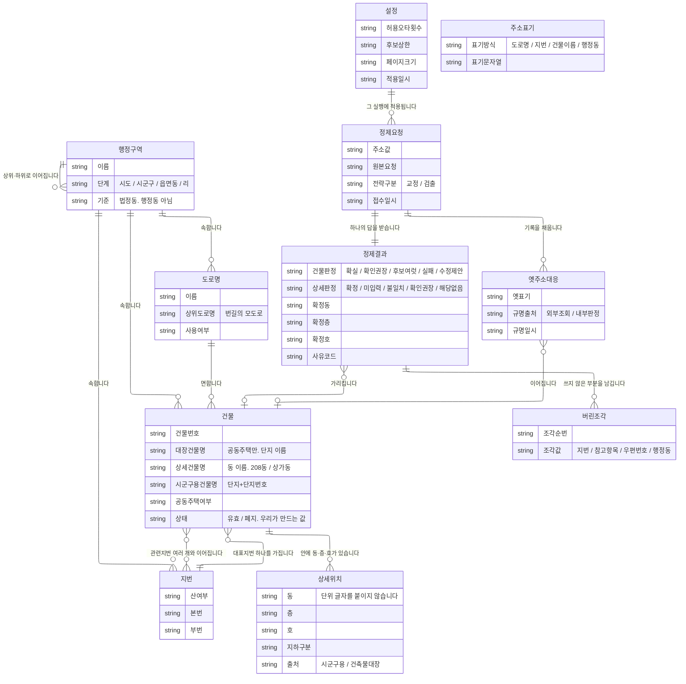
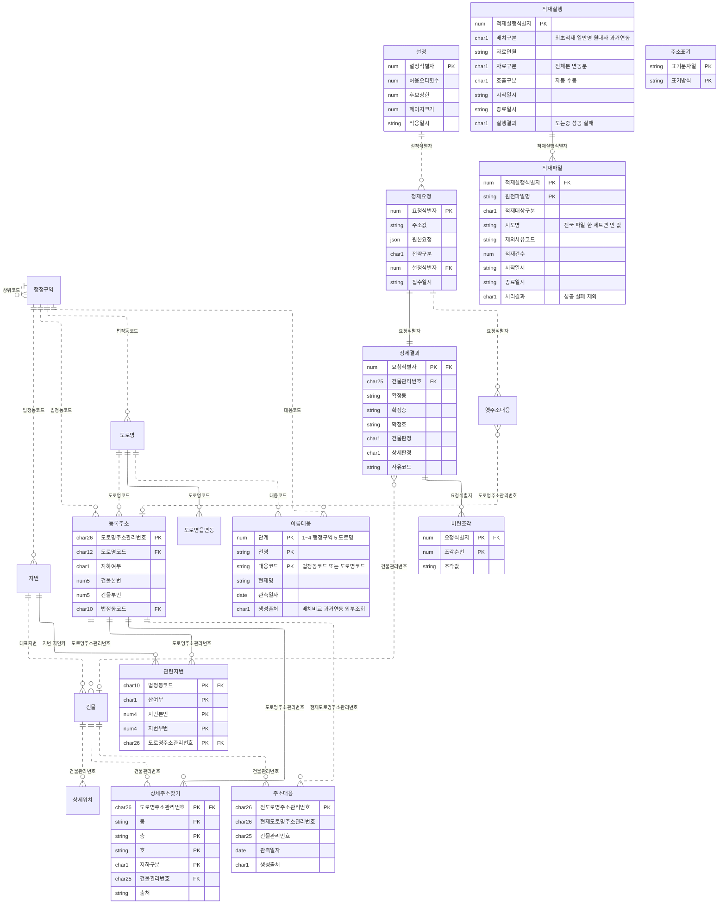
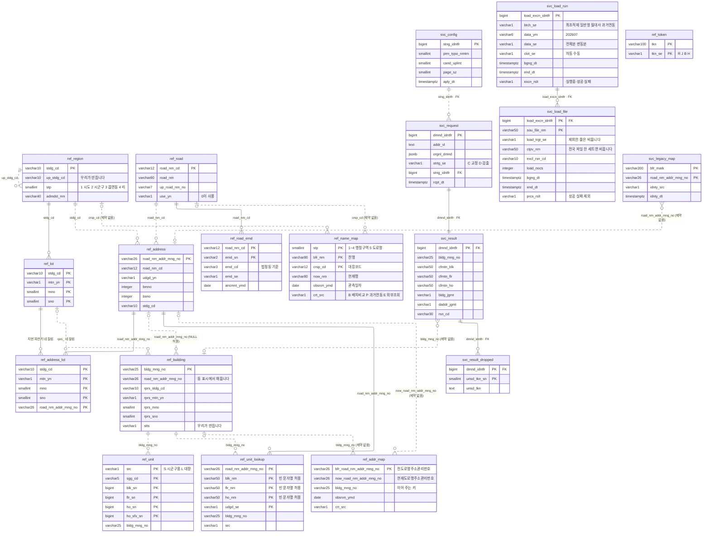

# 주소정제 솔루션: 데이터 모델

작성일 2026-08-13 · 단계: **개념 완료 / 논리 완료 / 물리 완료**

---

## 0. 이 문서가 담는 것

이 문서는 모델링 기준을 정합니다. 수준은 개념·논리·물리 3가지이며, ANSI/X3/SPARC 3층 스키마를 따릅니다. 표기법으로는 까마귀발 표기를 세 수준에 모두 씁니다.

| 수준 | 여기서 하는 것 | 여기서 하지 않는 것 |
|---|---|---|
| 개념 (1~4절) | 대상을 엔터티로 도출하고 관계와 개수 관계를 정합니다 | 속성을 전부 나열하지 않습니다. 식별자를 정하지 않습니다. 다대다를 풀지 않습니다 |
| 논리 (5절) | 식별자를 정합니다. 다대다를 중간 엔터티로 풉니다. 식별과 비식별을 선으로 구분합니다. 정규형을 맞춥니다 | 자료형과 길이를 정하지 않습니다 |
| 물리 (6절) | 물리명·자료형·길이·인덱스·제약·분할·`autovacuum`을 정합니다. ERD를 그립니다 | 적재 배치 절차를 정하지 않습니다 (`04-source-data.md`) |

---

## 1. 엔터티를 2가지로 나눕니다

**외부에서 그대로 받는 자료와 우리 업무에서 나온 자료를 섞지 않습니다.**
받는 자료는 우리가 바꿀 수 없고, 원천이 구조를 바꾸면 두 자료 사이의 경계에서 처리를 멈춰야 하기 때문입니다.

### 받는 쪽: 행정안전부 자료

| 엔터티 | 무엇인가 | 비고 |
|---|---|---|
| 행정구역 | 시·도, 시·군·구, 읍·면·동, 리 | 법정동 기준임을 명시합니다 |
| 도로명 | 길에 붙인 이름 | |
| 지번 | 땅에 붙인 번호 | |
| 건물 | 도로에 면해 번호를 받은 건물 | 이름이 세 종류입니다 |
| 상세위치 | 건물 안의 동·층·호 | 공동주택도 담습니다. 아래 3절 참조 |

**원천 이력을 옮겨 담는 엔터티는 세우지 않습니다.** 대신 갱신 전후를 비교해 만든 대응 엔터티를 논리 단계에서 2개 세웁니다. 근거는 3절에 있습니다.

### 우리 쪽: 업무에서 나오며 원천 자료에는 없습니다

| 엔터티 | 무엇인가 | 비고 |
|---|---|---|
| 주소표기 | 이름 하나가 어떤 방식으로 쓰였는지 판정하는 사전 | 표기방식 4가지 |
| 설정 | 한 번의 실행에 적용한 설정 value 묶음 | 정제결과를 재현하는 데 필요한 값 |
| 정제요청 | 들어온 입력 한 건 | |
| 정제결과 | 들어온 입력에 붙는 판정과 사유 | |
| 버린조각 | 등록주소를 정하는 데 쓰지 않은 부분 | 정제결과 한 건에 여러 건이 붙습니다 |
| 옛주소대응 | 외부에 조회해 얻은 답을 적어 두는 기록 | 외부에서 받아 온 값입니다 |
| 적재실행 | 적재 진입점을 한 번 호출한 기록 | 폴더 하나가 한 줄입니다 |
| 적재파일 | 그 실행이 읽은 파일 한 개 | 적재한 파일과 건너뛴 파일을 함께 담습니다 |

**개념 단계의 엔터티는 9개입니다.** 논리 단계에서 「등록주소」·「관련지번」·「상세주소찾기」·「설정」·「버린조각」·「도로명읍면동」·「이름대응」·「주소대응」·「적재실행」·「적재파일」이 더해져 19개가 됩니다. 자세한 내용은 5절에 있습니다.

---

## 2. 개념 모델

**선의 실선과 점선은 식별과 비식별을 뜻하지 않습니다.** 개념 단계에서는 식별자를 정하지 않으므로 2가지를 구분할 수 없습니다. 구분은 5절 논리 모델에서 붙입니다.



적재 기록 엔터티 2개는 이 그림에 없습니다. 주소 도메인이 아니라 운영 기록이므로 논리 단계에서 세우며, 4절이 그 위치를 가리킵니다.

---

## 3. 관계를 이렇게 본 이유

### 행정구역이 자기 자신과 이어지며 법정동을 기준으로 삼습니다

서울은 시·도 아래에 바로 구가 옵니다. 3종은 시·군·구가 없습니다. 도 지역은 시·군 아래에 읍·면이 또 있습니다.
**단계 수를 고정하면 서울의 구조가 전제가 되어 다른 지역에서 맞지 않습니다.**
상하 관계로만 두고 단계를 값으로 구분하면 어느 지역이든 표현할 수 있습니다.

이 엔터티는 법정동만 담습니다.

원천 자료가 전부 법정동 기준이기 때문입니다. 도로명코드 파일의 읍면동코드 칼럼도 설명이 `법정동 기준`입니다.

행정동도 칼럼으로 들어오지만, 원천이 그대로 신뢰하지 말라고 안내합니다.

> 현재 제공되는 행정동 정보는 관할주민센터 정보를 기준으로 하고 있으며 **도로명주소와 1:1로 매칭되는 정보만** 포함합니다. 또한 **행정동정보가 누락되거나 잘못 매칭된 정보가 존재할 수 있으므로** 참고용으로만 사용하시기 바랍니다.

이 안내에 3가지 문제가 함께 나옵니다. 1:N인 경우는 아예 들어 있지 않고, 누락과 오매칭을 원천이 인정했으며, 기준이 행정동 경계가 아니라 관할주민센터입니다.

→ 따라서 행정동을 행정구역 엔터티에 넣지 않습니다. 넣으면 신뢰할 수 없는 값이 정답 자리를 차지합니다.
→ 겪은 유형 가운데 행정동과 법정동을 섞어 쓴 입력(A3)은 다른 방식으로 다룹니다. 아래 「주소표기」를 참조합니다.

### 건물과 지번의 관계가 두 종류입니다

대표지번은 건물마다 하나씩 있고 건물 줄 안에 담깁니다.

건물정보 파일 한 줄에 `지번본번`과 `지번부번` 칼럼이 있으며, 별도 파일이 아닙니다.

같은 등록주소의 건물이라도 지번이 다를 수 있습니다. 실제 사례로 강일리버파크 10단지는 등록주소가 `고덕로97길 20` 하나인데, 건물마다 지번이 424-2와 695-0으로 나뉩니다.

→ 우리 데이터 모델에서 대표지번은 건물 단위입니다.

관련지번은 별도 파일에 있고, 건물이 아니라 「등록주소 하나」에 붙습니다.

관련지번 파일에는 건물관리번호 칼럼이 아예 없습니다. 건물을 가리키는 값은 4칼럼 복합 키(도로명코드·지하여부·건물본번·건물부번)뿐입니다.

이 네 칼럼이 가리키는 대상은 건물 한 채가 아니라 등록주소 하나입니다.

```
"아리수로93길 40"          ← 네 칼럼이 가리키는 대상
    ├── 건물 A  →  308동
    ├── 건물 B  →  307동
    └── 건물 C  →  상가동
```

→ 개념 그림에서는 건물과 지번을 여러 대 여러 관계로 그립니다. 논리 단계에서 「등록주소」 엔터티를 세워 이 관계를 풉니다.

대표지번과 관련지번이 담는 지번은 거의 겹치지 않습니다.

[전량 · 전국] 지번 자연키 유일값 7,597,936개 가운데 대표지번이 6,169,477개(81.2%)이고, 관련지번에만 있는 것이 1,428,459개(18.8%)입니다.

→ **지번으로 찾을 때는 대표지번과 관련지번 2곳을 함께 조회해야 합니다.** 근거는 `03-pipeline.md` 0-1절 `LotBranch`에 있습니다.

[전량 · 전국] 4칼럼 복합 키 6,422,298개의 건물 수 분포는 다음과 같습니다.

| 건물 수 | 묶음 수 |
|---|---|
| 1 | 4,246,781 (66.1%) |
| 2 | 1,185,592 |
| 3 | 556,723 |
| 4 | 222,361 |
| 5 이상 | 210,841 |

최대는 1,732채입니다. 세 자리 가운데 두 자리는 건물이 하나뿐이고, 나머지는 건물 수가 많은 쪽까지 넓게 이어집니다.

### 동이 2곳에 나타납니다

아파트 동은 건물입니다. 아파트 단지에서 동 하나하나가 별개 건물로 등록되고, 각각 건물관리번호를 가집니다.

그런데 상세위치에도 동이 있습니다. 건축물대장 상세주소는 단지의 호수를 건물 한 채에 모아 등록하고 동명칭 칼럼으로 구분하는 경우가 있습니다.

[전량 · 경기 실측] 건물이 2채 이상인 아파트 주소 14,042곳의 분포는 다음과 같습니다.

| 상세주소가 붙은 건물 | 곳 수 |
|---|---|
| 여러 채에 나뉘어 붙습니다 | 10,682 (76%) |
| 한 채에 몰려 붙습니다 | 2,887 (21%) |
| 한 채도 없습니다 | 473 (3%) |

→ **입력한 동을 건물 고르는 조건으로만 쓰면 21%에서 실패합니다.** 등록주소 하나에 속한 건물을 모두 모아 상세위치를 합친 뒤, 동·층·호로 함께 좁힙니다.

동에는 단위 글자를 붙이지 않습니다. 원천이 상세위치의 동·층·호에 단위 글자를 붙이지 않기 때문입니다. 서울 전량에서 건축물대장 상세주소의 동 값 2,087,230개 중 1,748,631개가 숫자만이고, 나머지도 `비01`이나 `B101`처럼 문자가 섞인 값이지 `110동` 형태가 아닙니다.

자료형은 문자열입니다. 근거는 6-3절에 있습니다.

### 상세위치가 공동주택도 담습니다

상세주소DB는 주택법상 공동주택을 제외합니다. 그러나 건축물대장 상세주소가 공동주택 호수를 담습니다.

[전량 · 서울 실측] 두 자료는 겹치지 않습니다. 시군구용에만 있는 건물이 80,790채, 대장에만 있는 건물이 136,020채, 양쪽에 다 있는 건물이 301채입니다.

[전량 실측] 공동주택 가운데 호수 자료가 있는 건물 비율은 서울 88.4%, 경기 84.7%, 부산 79.3%입니다.

→ **아파트 호수도 실재 확인 대상입니다.** 형식 검사만 하지 않습니다.

### 건물 이름이 세 종류입니다

| 칼럼 | 값 예시 | 층위 |
|---|---|---|
| 건축물대장건물명 | `강일리버파크` | 단지 |
| 상세건물명 | `308동` | 동 |
| 시군구용건물명 | `강일리버파크3단지아파트` | 단지 + 단지번호 |

→ **건물 이름으로 찾을 때는 세 칼럼을 모두 비교 대상으로 삼습니다.** 비교 방법은 5-7절에 있습니다.

### 상세위치는 건물에 종속되며 단독으로 참조할 수 없습니다

`1503호`만으로는 대상을 특정할 수 없고, `어느 건물의 1503호`여야 합니다.

**정제결과는 건물만 가리키고, 확정한 값은 복사해 둡니다.** 건물과 상세위치 양쪽으로 참조를 두면, 건물 A를 가리키면서 건물 B에 딸린 상세위치를 가리키는 상태를 모델에서 막을 수 없습니다.

### 판정이 두 부분으로 나뉩니다

국가 표준이 정한 주소 표기 순서는 다음과 같습니다.

> 시·도 + 시·군·구 + 읍·면 + 도로명 + 건물번호 + **상세주소(동/층/호)** + (참고항목)

앞부분은 국가가 부여한 번호이므로 정답 목록이 있습니다. 뒷부분에도 정답이 있지만 표기하는 방식이 건물마다 다릅니다.

판정을 하나로 합치면 표현할 수 없는 케이스가 생깁니다. 건물은 하나로 확정되었는데 호를 입력하지 않은 케이스입니다.

주의할 점은 아파트에서 표준 표기와 실제 자료가 어긋난다는 것입니다. 아파트의 동은 자료에서 참고항목(건물명) 자리에 있거나 상세위치 쪽에 있습니다.

### 주소표기를 따로 둔 이유와 행정동을 여기에 넣는 까닭

표기방식에 `행정동`을 넣습니다. 행정동은 정답 자리에 놓을 수 없지만, 「이 입력은 행정동 방식으로 쓰였습니다」라는 사실 자체는 기록할 수 있기 때문입니다.

```
입력: "상계1동 ○○로 12"  (상계1동은 행정동이고 법정동에는 없습니다)
  → 표기방식 = 행정동으로 인식
  → 법정동 대응표가 없으므로 건물을 못 찾음
  → 판정: 실패 / 사유종류: 참조없음
  → 사유: "행정동 표기로 보임. 법정동 이름으로 다시 입력하거나 도로명을 확인해 주세요"
```

**이것이 이 솔루션이 제공하는, 사용자가 바로 조치할 수 있는 실패 사유입니다.**

행정동 이름 목록은 실재합니다. 건물정보의 행정동 이름 칼럼(19번)에 전국 3,281개, 서울 427개가 들어옵니다. 그 가운데 법정동 이름에 없는 것이 서울 338개, 전국 1,379개이고, 행정동과 법정동을 섞어 쓴 입력(A3)을 실제로 잡아내는 범위가 그만큼입니다.

### 건물의 「상태」는 우리가 만드는 값입니다

가이드에는 "폐지건의 경우 사용여부가 '1'로 변경"이라고 적혀 있지만, 사용여부 칼럼이 건물정보 레이아웃에 없습니다.

→ **이 값은 원천에서 오지 않으며, 받는 쪽에서 만들어 붙이는 칼럼입니다.**

| 자료 | 가이드 안내 |
|---|---|
| 건물·도로명 | 사용여부를 '1'로 변경 (논리 삭제) |
| 관련지번·상세주소 | DELETE (물리 삭제) |

폐지 줄에도 값이 다 들어옵니다. 월변동분 건물 폐지 6,469줄에서 고시일자·변동전도로명주소·비고 4가지를 뺀 27칼럼이 채워져 왔습니다.

### 원천 이력을 옮겨 담지 않고 대응은 우리가 만듭니다

원천 이력은 「무엇이 무엇으로 바뀌었나」를 주지 않습니다. 도로명 폐지 71줄의 변경이력정보가 전부 비어 있고, 변경이력사유 `0`(도로명변경)이 전체분에도 변동분에도 한 건이 없습니다. 오는 것은 「언제 무슨 사유로 바뀌었나」뿐입니다.

→ 사유코드를 테이블로 쌓는 엔터티는 세우지 않습니다. 갱신 처리를 나누는 데만 쓰고 저장하지 않습니다.

그러나 대응 자체를 포기하지는 않습니다. 원천에서 가져오는 대신 갱신 전후를 비교해 만듭니다.

```
갱신 전   건물관리번호 A  →  등록주소 X
갱신 후   건물관리번호 A  →  등록주소 Y
          같은 건물이 다른 자리로 옮겨 갔습니다  →  X를 Y로 잇는 한 줄
```

**이 방법은 건물관리번호와 도로명코드가 다른 값이 바뀌어도 그대로 유지되기 때문에 성립합니다.** 이 두 코드가 갱신 전후를 잇는 기준입니다.

→ 엔터티 2개를 세웁니다. 「이름대응」은 행정구역과 도로명의 이름 변화를 담고, 「주소대응」은 건물이 선 자리의 변화를 담습니다. 논리 단계에서 세우며 5-1절에 있습니다.

여기서 세우는 것은 이력이 아니라 사전입니다. 이력은 「언제 무슨 사유로 바뀌었나」를 쌓지만, 사전은 「옛 이름이 지금 무엇인가」 한 줄만 담습니다. 여러 번 바뀌어도 줄을 쌓지 않고 현재 값을 덮어쓰므로 조회가 한 번에 끝납니다.

외부에서 받아 온 값과 우리가 만든 값을 섞지 않습니다. 외부 검색 API가 준 답은 `svc.legacy_map`이 따로 담고, 우리가 비교해 만든 값은 `ref`에 둡니다.

현재 상태는 다른 칼럼이 담습니다. 건물은 `ref.building.stts`, 도로명은 `ref.road.use_yn`입니다. 갱신 배치는 삭제·삽입 건수와 새로 만든 대응 줄 수를 지표로 남깁니다.

전체분만으로는 대응이 한 줄도 나오지 않습니다. 비교할 이전 스냅숏이 없기 때문입니다. 대응은 서비스가 운영되는 동안 매달 쌓입니다.

### 정제요청과 정제결과를 나눈 이유

들어온 입력과 우리가 돌려준 답은 다릅니다. 들어온 값은 수정하지 않고 그대로 남깁니다.

**이 두 엔터티는 운영 기록이 아니라 검증 기록입니다.** 2단계 루프가 구축·실험·검증·수정을 반복해 실행하므로, 어떤 입력에 어떤 결과가 나왔는지가 남아야 채점과 재현을 할 수 있습니다. 사용자 정보·과금·재처리 횟수·보관 정책을 담지 않는 이유가 여기에 있습니다.

재현에 필요한 값은 주소 문자열, 전략구분, 설정 3가지입니다. 세 번째가 「설정」 엔터티입니다.

### 적재 기록은 배치가 무엇을 언제 적재했는지만 담습니다

적재 진입점은 폴더 하나를 읽어 적재 대상만 고릅니다. 무엇을 골랐고 무엇을 건너뛰었는지가 남지 않으면, 파일이 하나 빠진 채 배치가 실행되어도 아무도 알아채지 못합니다.

**2개로 나눈 이유는 실행 하나가 파일 여러 개를 읽기 때문입니다.** 한 테이블에 담으면 배치 종류·연월·구분이 파일 줄마다 되풀이되어 제3정규형을 어깁니다. 실행이 끝난 시각을 적을 때 전국이면 아흔일곱 줄을 함께 고쳐야 하고, 폴더가 비면 파일 줄이 없어 실행 자체가 기록에 남지 않습니다.

이 기록은 적재 판단에 관여하지 않습니다. 적재가 「현재 값으로 만듭니다」를 따르므로 같은 폴더를 두 번 적재해도 결과가 같습니다. 기록을 보고 이미 적재한 파일을 건너뛰게 만들면, 기록이 틀렸을 때 적재도 함께 틀립니다. 상세한 내용은 `04-source-data.md` 13-6절에 있습니다.

---

## 4. 개념 단계에서 일부러 남겨둔 것

| 항목 | 어디서 정했나 |
|---|---|
| 상세주소찾기 테이블 | 아래 4-1절 (논리) |
| 이름대응·주소대응 테이블 | 5-1절 (논리). 3절에 근거가 있습니다 |
| 적재실행·적재파일 테이블 | 5-1절 (논리). 3절에 근거가 있고 규칙은 `04-source-data.md` 13-6절에 있습니다 |
| 관련지번 연결을 조인할지 펼칠지 | 5절 (논리). 등록주소 엔터티로 풉니다 |
| 식별자 | 5절 (논리) |
| 정제결과가 상세위치까지 참조할지 | 5절 (논리). 참조하지 않고 값을 복사합니다 |
| 건물 이름 세 칼럼을 어떻게 비교할지 | 5절 (논리). 칼럼 사이는 OR, 토큰 사이는 AND |
| 정제요청과 정제결과를 전부 남길지 | 이번 단계에서 다루지 않고 엔진과 코어에 집중합니다 |
| 조회에 쓸 인덱스 | 6-5절 (물리) |
| 지역별 분할 여부 | 6-8절 (물리). 하지 않습니다 |
| 좌표 | 미정입니다. 자료를 받지 않았습니다 |

### 4-1. 상세주소찾기: 논리 단계에서 세우는 파생 테이블

**이 테이블을 세우는 이유는 조회 분기를 없애기 위해서입니다.** 동이 건물 쪽에 있는 경우와 상세위치 쪽에 있는 경우가 76 대 21로 나뉩니다. 적재할 때 한 번 펼쳐 두면 조회는 한 번으로 끝납니다.

식별자는 자연키이며, 도로명주소관리번호 + 동 + 층 + 호 + 지하구분입니다.

등록주소는 4칼럼 복합 키가 아니라 도로명주소관리번호로 식별합니다. 4칼럼 복합 키는 전국 10건에서 두 읍면동이 겹쳐 구분되지 않기 때문입니다.

인조식별자는 두지 않습니다. 삭제한 뒤 다시 삽입할 때마다 번호가 새로 부여되어, 그 번호를 참조하던 쪽의 연결이 끊어지기 때문입니다.

갱신은 등록주소 하나 단위로 삭제한 뒤 다시 삽입합니다.

| | 부분 갱신 | 자리 단위로 삭제 후 재삽입 |
|---|---|---|
| 로직 | 이동사유코드별로 나누어 구현합니다 | 하나뿐입니다 |
| 한 줄이 여러 줄에 퍼지는 경우 | 따로 구현해야 합니다 | 자동으로 처리됩니다 |
| 틀렸을 때 | 드러나지 않고 어긋난 채 남습니다 | 다음 갱신에서 덮어씁니다 |

[전량 실측] 비용은 작습니다. 한 달치 변동분이 바꾸는 등록주소가 15,361곳이고, 서울 상세주소 4,323,373줄 가운데 38,541줄(0.89%)을 다시 씁니다.

위험은 3가지입니다.

| 무엇 | 어떻게 막나 |
|---|---|
| 삭제와 삽입 사이에 조회가 들어오면 없는 주소가 됩니다 | 한 트랜잭션으로 묶습니다 |
| 삭제한 뒤 삽입이 실패하면 그 등록주소가 사라집니다 | 등록주소 단위로 커밋하고 처리한 등록주소를 기록합니다 |
| 대량 삭제를 알아채지 못합니다 | 하루 삭제·삽입 건수를 지표로 남기고 평소 범위를 벗어나면 중단합니다 |

옛 값은 남기지 않습니다. 이 테이블은 원천에서 만들어 낸 파생 값이라 옛 값을 보관할 이유가 없습니다. 주소가 바뀐 대응은 주소대응 테이블이 따로 담습니다.

---
## 5. 논리 데이터 모델

개념 모델의 엔터티 9개에 「등록주소」·「관련지번」·「상세주소찾기」·「설정」·「버린조각」·「도로명읍면동」·「이름대응」·「주소대응」·「적재실행」·「적재파일」을 더하면 논리 모델의 엔터티는 모두 19개입니다. **이 절에서는 자료형과 길이를 정하지 않습니다.**

### 5-1. 식별자

| 엔터티 | 식별자 | 종류 |
|---|---|---|
| 행정구역 | 법정동코드 10 | 자연키 |
| 도로명 | 도로명코드 12 | 자연키 |
| 도로명읍면동 | 도로명코드 12 + 읍면동일련번호 2 | 자연키 |
| 지번 | 법정동코드 10 + 산여부 1 + 지번본번 4 + 지번부번 4 | 자연키 |
| 등록주소 | 도로명주소관리번호 26 | 자연키 |
| 건물 | 건물관리번호 25 | 자연키 |
| 관련지번 | 지번 자연키 속성 4개 + 도로명주소관리번호 | 자연키 |
| 상세위치 | 출처 + 시군구코드 5 + 동·층·호·호접미사 일련번호 | 자연키 |
| 상세주소찾기 | 도로명주소관리번호 + 동 + 층 + 호 + 지하구분 | 자연키 |
| 이름대응 | 단계 + 전명 + 대응코드 | 자연키 |
| 주소대응 | 전도로명주소관리번호 26 | 자연키 |
| 주소표기 | 표기문자열 + 표기방식 | 자연키 |
| 설정 | 인조식별자 | 인조 |
| 정제요청 | 인조식별자 | 인조 |
| 정제결과 | 정제요청 식별자 | 자연키 |
| 버린조각 | 정제요청 식별자 + 조각순번 | 자연키 |
| 옛주소대응 | 옛표기 + 가리키는 등록주소 | 자연키 |
| 적재실행 | 인조식별자 | 인조 |
| 적재파일 | 적재실행 식별자 + 원천파일명 | 자연키 |

행정구역의 상위 단계 행은 솔루션이 직접 만듭니다. 원천은 최하위 단계의 코드만 제공하므로, 코드의 뒷자리를 `0`으로 채워 시도 행과 시군구 행을 만듭니다.

```
1100000000   서울특별시
1168000000   서울특별시 강남구
1168010100   서울특별시 강남구 역삼동
```

상세위치의 식별자 앞에는 건물관리번호를 두지 않습니다. 상세위치는 원천 PK만으로 이미 유일하며, 건물관리번호를 앞에 두면 건물이 바뀔 때 식별자도 함께 바뀌기 때문입니다.

이름대응의 식별자에는 대응코드가 포함됩니다. 같은 전명이 여러 코드에서 나올 수 있기 때문입니다. 예를 들어 「중앙로」라는 도로명이 여러 시군구에서 동시에 바뀌면, 이름대응에는 도로명코드마다 한 행이 생깁니다.

주소대응은 옛 등록주소 하나를 식별자로 씁니다. 옛 등록주소 하나가 새 등록주소 2개를 가리키는 경우는 없습니다. 주소대응의 한 행은 건물 하나가 한 등록주소에서 다른 등록주소 하나로 옮겨 간 것을 나타내기 때문입니다.

적재실행에는 인조식별자를 씁니다. 상세주소찾기에서 인조식별자를 뺀 근거는 「지우고 넣을 때마다 번호가 새로 붙어 참조가 끊어집니다」였습니다. 적재 실행 로그는 지우고 다시 넣지 않으므로 이 근거가 적용되지 않습니다.

적재파일의 식별자는 적재실행 식별자와 원천파일명을 합친 복합 키입니다. 건너뛴 파일은 자료와 시도 값을 채우지 못하므로, 이 두 값은 키로 쓸 수 없습니다. 원천파일명은 폴더 안에서 유일하며, 원천의 파일명을 그대로 두기로 이미 정해 둔 값입니다.

### 5-2. 다대다 관계를 등록주소로 해소합니다

```
행정구역 ──< 등록주소 ──< 건물 ──< 상세위치
                │
                └──< 관련지번 >── 지번
```

대표지번에는 중간 엔터티가 필요하지 않습니다. 대표지번은 건물 한 채에 하나뿐이고 건물 행 안에 들어 있으므로, 지번과 건물은 일대다 관계입니다.

지번의 중복을 제거하는 기준은 식별자와 같습니다. 법정동코드, 산여부, 본번, 부번 네 값이 모두 같으면 같은 필지로 봅니다.

관련지번은 `jibun_rnaddrkor_` 파일 한 세트만 적재합니다.

### 5-3. 정규화: 위반 7가지와 파생 칼럼 하나를 정리했습니다

엔터티를 제1·제2·제3정규형 기준으로 다시 검토했습니다(2026-08-26 · 08-27 · 09-03).

| 어디 | 무엇을 어겼나 | 어떻게 풀었나 |
|---|---|---|
| 정제요청의 설정 value | 제1정규형. 허용오타횟수·후보상한·페이지크기 세 값이 한 칼럼에 들어 있습니다 | 「설정」 엔터티를 새로 만듭니다. 정제요청은 설정 식별자로 설정을 가리킵니다 |
| 정제결과의 버린조각 | 제1정규형. 여러 토큰이 한 칼럼에 들어 있습니다 | 「버린조각」 엔터티를 새로 만듭니다 |
| 건물의 법정동코드 | 제3정규형. 등록주소를 거치면 법정동코드를 알 수 있습니다 | 이 칼럼의 의미를 「대표지번 법정동코드」로 한정합니다. 이 칼럼이 지번을 가리키는 외래키가 되므로 중복이 없어집니다 |
| 상세위치의 도로명주소관리번호 | 제3정규형. 건물관리번호가 정해지면 따라 정해집니다 | 칼럼을 뺍니다. 전량 확인에서 상세주소 324만 행이 모두 건물과 연결되었습니다 |
| 도로명의 시군구코드 | 파생 칼럼. 도로명코드 12자리 가운데 앞 5자리입니다 | 칼럼을 뺍니다 |
| 정제결과의 사유종류 | 제3정규형. 사유코드가 정해지면 사유종류도 따라 정해집니다 | 사유종류는 사유코드 마스터에 둡니다 |
| 도로명의 이름·상위도로명번호·사용여부 | 제2정규형. 식별자가 도로명코드와 읍면동일련번호 두 속성인데, 이 세 속성은 앞의 도로명코드 하나로 정해집니다 | 「도로명읍면동」 엔터티를 새로 만들고, 읍면동 속성과 고시일자를 그쪽으로 옮깁니다 (2026-08-27) |
| 적재 실행 로그의 배치종류·자료연월·자료구분 | 제3정규형. 파일 행에 담으면 적재실행 식별자가 이 값들을 정합니다 | 「적재실행」과 「적재파일」로 나눕니다 (2026-09-03) |

절 제목에 적은 개수가 틀려 있었습니다. 08-27에 도로명 행을 표에 더하면서 제목을 고치지 않아 제목이 「위반 다섯」으로 남아 있었습니다. 09-03에 적재 실행 로그 행을 더하면서 7가지로 바로잡았습니다.

도로명의 위반은 08-26 검토에서 빠졌고, 전량 실측을 하면서 뒤늦게 발견되었습니다. 원천 371,958행은 도로명코드 174,253개로 묶이며, 한 도로명코드 안에서 이름이 서로 다른 경우는 0건입니다. 원천이 도로명코드마다 대표 행을 하나씩 제공하고 있으므로, 도로명읍면동을 나누는 것은 원천 구조를 바꾸는 일이 아니라 섞여서 들어온 데이터를 원래대로 되돌리는 일입니다.

정제요청의 들어온경로 칼럼도 함께 뺐습니다. 처리 흐름 어디에서도 읽지 않는 칼럼이었기 때문입니다. 이 칼럼이 맡던 역할은 전략구분 칼럼과 설정식별자 칼럼이 대신합니다.

대응 엔터티 2개는 정규형을 지킵니다(2026-08-31). 이름대응은 단계, 전명, 대응코드 세 속성이 전체 키이고, 현재명은 이 세 속성 전체에 종속합니다. 주소대응은 옛 등록주소 하나가 키이고, 현재 등록주소와 건물관리번호는 이 키에 종속합니다. 다형 참조도 없습니다. 이름과 등록주소를 한 테이블에 담으면 코드가 10자리와 12자리로 섞이므로 테이블을 나눴습니다.

### 5-4. 일부러 어긴 3곳: 고치지 않고 근거를 남깁니다

| 어디 | 무엇을 어겼나 | 왜 그대로 두나 |
|---|---|---|
| 상세주소찾기 | 제2정규형. 건물관리번호가 기본키 전체가 아니라 「등록주소 + 동」에만 종속합니다 | 조회 경로가 2가지로 나뉘지 않도록 적재할 때 미리 펼쳐 둔 파생 테이블입니다. 이 테이블이 있으면 요청마다 두 경로를 모두 조회하지 않아도 됩니다 |
| 정제결과의 확정 동·층·호 | 제3정규형. 상세위치를 참조하면 알 수 있습니다 | 참조로 두면 원천이 갱신될 때 그 시점에 어떤 값으로 응답했는지가 사라집니다. 그래서 참조하지 않고 값을 복사해 둡니다 |
| 적재파일의 제외사유코드 | 부분집합을 세분합니다. 이 칼럼에 값이 있으면 처리결과가 「제외」로 정해집니다 | `svc.result`에서 판정과 사유코드를 나눈 방식과 같습니다. 결과는 처리결과 한 칼럼에 담고, 그 안의 세부 구분은 제외사유코드로 합니다. 칼럼을 더 두면 조합마다 값이 늘어납니다 |

이 근거를 적어 두지 않으면 다음 담당자가 이 설계를 잘못으로 보고 고치게 됩니다.

같은 판단을 적용한 곳이 3곳 있습니다. 정제요청의 원본 요청 칼럼, 상세주소찾기에서 인조식별자를 뺀 것, 정제결과의 확정 동·층·호입니다.

### 5-5. 논리 ERD

실선은 식별 관계를, 점선은 비식별 관계를 나타냅니다.



식별 관계로 그린 곳은 7곳입니다. 등록주소와 건물, 등록주소와 관련지번, 지번과 관련지번, 등록주소와 상세주소찾기, 정제요청과 정제결과, 정제결과와 버린조각, 적재실행과 적재파일입니다.

대응 엔터티 2개의 관계는 모두 비식별 관계입니다. 전명과 옛 등록주소는 현재 마스터에 없을 수 있기 때문입니다. 마스터에 없는 값을 기록하는 것이 바로 이 두 테이블을 두는 이유입니다.

### 5-6. 주소표기는 이름과 방식만 담습니다

주소표기에는 대상을 가리키는 칼럼을 두지 않습니다. 캐시는 후보를 좁히는 데만 쓰고, 주소가 실재하는지는 DB를 조회해 판정하기 때문입니다.

```
표기문자열   표기방식
세종로       도로명
세종로       법정동
```

[전량] 방식별 규모는 다음과 같습니다.

| 방식 | 전국 | 서울 |
|---|---|---|
| 도로명 | 371,958 | 14,583 |
| 법정동·법정리 | 10,557 | 466 |
| 건물이름 (세 칼럼 합집합) | 588,665 | 111,664 |
| 행정동 | 3,281 | 427 |
| 합 | 약 97만 | 약 12.7만 |

이 정도 규모는 메모리에 모두 올릴 수 있습니다.

### 5-7. 건물 이름 세 칼럼 비교

| | 관계 |
|---|---|
| 칼럼 사이 | OR. 토큰 하나가 세 칼럼 가운데 어느 칼럼에서 검색되든 인정합니다 |
| 토큰 사이 | AND. 입력에 토큰이 2개이면 두 토큰을 모두 만족하는 건물을 찾습니다 |

```
입력   강일리버파크 308동

1번 줄  대장명=강일리버파크  상세명=308동  시군구용=강일리버파크3단지아파트  →  ○
2번 줄  대장명=강일리버파크  상세명=307동  시군구용=강일리버파크3단지아파트  →  ×
```

특정 칼럼끼리 짝을 지어 비교하도록 고정하지 않습니다. 공동주택이 아니면 건축물대장건물명 값이 아예 들어오지 않기 때문입니다.

AND 조건으로 찾은 결과가 0건이면 토큰별로 따로 찾은 결과를 남깁니다.

후보 상한은 10개입니다.

[전량 · 전국] 이름 하나가 가리키는 건물 수는 다음과 같습니다.

| | 이름 수 | 한 채뿐 | 10채 이하 | 최대 |
|---|---|---|---|---|
| 건축물대장건물명 | 92,222 | 57.5% | 92.6% | 2,253 (`현대아파트`) |
| 시군구용건물명 | 418,618 | 61.1% | 95.3% | 5,508 (`주택`) |

건물명 가운데에는 끝에 건물 종류를 적어 둔 값이 있지만, 이런 값을 사전에서 걸러내지 않습니다. 후보 수가 상한을 넘으면 개수만 돌려주므로 응답으로 「그 이름을 가진 건물이 5,508채입니다」가 나갑니다. 사용자는 이 응답을 보고 다음에 무엇을 해야 할지 알 수 있습니다.

### 5-8. 판정과 사유를 나눠 담습니다

```
건물판정 = 남은 후보 수     1이면 확실 · 2 이상이면 후보여럿 · 0이면 실패
버린조각 = 자리를 정하는 데 안 쓴 부분이 있으면 채운다
확실 + 버린조각이 함께 서면 건물판정을 확인권장으로 낸다
```

버린조각을 별도 엔터티로 두는 이유는 한 입력에서 버린 토큰이 여러 개 함께 나오기 때문입니다. 지번, 참고항목, 우편번호, 행정동이 한 입력에서 동시에 버려질 수 있습니다. 이 값들을 한 칼럼에 이어 붙이면 「지번만 버린 건이 몇 건인가」를 셀 수 없습니다.

사유 코드는 하나만 둡니다. 종류마다 코드를 만들면 코드 목록이 계속 늘어나고, 응답을 받는 쪽도 그때마다 코드 목록을 갱신해야 합니다.

응답 등급과 사유 코드의 정의는 `03-pipeline.md` 3절과 4절에 있습니다.

---
## 6. 물리 데이터 모델

DBMS는 PostgreSQL입니다(2026-08-26 확정).

> 물리명은 행정안전부의 「공공데이터 공통표준단어」와 「공공데이터 공통표준용어」를 대조해 확정했습니다.
> ERD는 6-10절에 있습니다. 산출물은 `erd-physical.drawio`와 `design/standard-dict/` 아래 파일 10개입니다.

### 6-0. 이 절이 정하는 것

| 정합니다 | 정하지 않습니다 |
|---|---|
| 스키마 구성 · 물리명 | 적재 배치 절차 (`04-source-data.md`) |
| 자료형과 길이 | 서버 규모와 메모리 설정 |
| 인덱스 | 백업·복제 구성 |
| 제약을 어디까지 거는가 | 접속 풀 크기 |
| 지우고 넣기 대비 설정 · 분할 여부 | SQL 문장 형태 |

**SQL 문장은 이 절에 적지 않습니다.** 설계가 정하는 것은 판단 지점과 제약이고, SQL 문장으로 구현할지 애플리케이션 코드로 구현할지는 구현 단계에서 정합니다.

### 6-1. 명명 규칙

**영문 소문자 snake_case로 씁니다.** PostgreSQL은 인용 부호가 없는 식별자를 소문자로 바꾸어 처리합니다.

```
CREATE TABLE Building (...)   →  실제 이름은 building
CREATE TABLE "Building" (...) →  실제 이름은 Building. 이후 늘 큰따옴표가 필요합니다
```

| 대상 | 규칙 | 예 |
|---|---|---|
| 테이블 | 단수형 명사 | `building` |
| 칼럼 | 표준 영문약어명을 이어 붙입니다 | `road_nm_cd` |
| 인덱스 | `ix_테이블_용도` | `ix_address_road4` |
| 유일 인덱스 | `ux_테이블_용도` | `ux_road_name` |
| 제약 | `ck_테이블_칼럼` | `ck_region_len` |

`tb_` 같은 접두어는 붙이지 않습니다. 스키마가 이미 대상을 구분해 주기 때문입니다.

### 6-1-1. 표준 대조 결과

**칼럼 117개를 전부 대조했습니다.** 물리명을 이루는 단어 83개 가운데 77개가 공통표준단어이고 6개가 프로젝트 신규 단어입니다.

| 분류 | 예 |
|---|---|
| 표준용어 직접일치 | 법정동코드 `STDG_CD` · 도로명 `ROAD_NM` · 적재건수 `LOAD_NOCS` |
| 동의어 경유 일치 | 지번본번 → 본번 `MNO` · 지번부번 → 부번 `SNO` |
| 표준단어 조합 | 시군구코드 `SGG_CD` · 대응코드 `CRSP_CD` · 적재실행식별자 `LOAD_EXCN_IDNTFR` |
| 프로젝트 등록 | 아래 6개 |

프로젝트 신규 표준단어 6개는 다음과 같습니다.

| 단어 | 약어 | 표준에 없는 이유 |
|---|---|---|
| 동(棟) | `BLK` | 표준용어 「행정동명 = `DONG_NM`」·「행정동코드 = `DONG_CD`」가 이미 `DONG`을 씁니다. 처음 승인은 `DONG`이었으나 한 약어가 洞·棟 두 뜻을 갖게 되어 `BLK`로 확정했습니다 (2026-08-26) |
| 호 | `HO` | 표준단어 3,284개에 홑글자 「호」가 없습니다 |
| 접미사 | `SFX` | 등재 없음. 영어 관용 축약 |
| 전 | `BFR` | 「이전 = `BFR`」의 축약을 빌립니다 |
| 오타 | `TYPO` | 등재 없음 (2026-08-28) |
| 후보 | `CAND` | 등재 없음. 「후보자 = `CNDD`」·「조건 = `CND`」와 겹치지 않습니다 (2026-08-28) |

등록하지 않기로 한 것은 다음 2가지입니다.

- 「용」은 접미사이지 독자 개념이 아닙니다. `시군구용건물명`은 `sgg_bldg_nm`으로 충분합니다.
- 「정제」는 `svc` 스키마 이름이 이미 그 뜻을 담고 있습니다.

`_no`가 겹쳐 쓰이던 문제는 해결했습니다. 표준이 관리번호는 `MNG_NO`로, 지번 본번과 부번은 `MNO`와 `SNO`로 구분하기 때문입니다.

우리가 지어 쓰던 조어 2개를 표준으로 되돌렸습니다 (2026-08-28). 대표는 `rep`가 아니라 `rprs`이고, 설정은 `cfg`가 아니라 `stng`입니다. 두 단어 모두 표준단어에 있는데 대조하지 않고 만들어 썼던 것입니다.

대응 테이블 2개의 칼럼도 신규 단어 없이 모두 확정했습니다 (2026-08-31).

| 논리명 | 물리명 | 단어 조합 근거 |
|---|---|---|
| 전명 | `bfr_nm` | 이전 `BFR` + 명 `NM` |
| 대응코드 | `crsp_cd` | 대응 `CRSP` + 코드 `CD` |
| 현재명 | `now_nm` | 현재 `NOW` + 명 `NM` |
| 관측일자 | `obsrvn_ymd` | 관측 `OBSRVN` + 일자 `YMD` |
| 생성출처 | `crt_src` | 생성 `CRT` + 출처 `SRC` |

적재 실행 로그 2개도 신규 단어 없이 모두 확정했습니다 (2026-09-03). 칼럼 17개를 공통표준단어 16개의 조합으로 표기했습니다. 쓴 단어는 적재 `LOAD` · 실행 `EXCN` · 배치 `BTCH` · 자료 `DATA` · 호출 `CLOT` · 시작 `BGNG` · 종료 `END` · 결과 `RSLT` · 처리 `PRCS` · 제외 `EXCL` · 시도 `CTPV` · 대상 `TRGT` · 연월 `YM` · 건수 `NOCS` · 원천 `SOU` · 파일 `FILE`입니다.

| 논리명 | 물리명 | 단어 조합 근거 |
|---|---|---|
| 적재실행식별자 | `load_excn_idntfr` | 적재 + 실행 + 식별자 |
| 배치구분 | `btch_se` | 배치 + 구분 |
| 자료연월 | `data_ym` | 자료 + 연월 |
| 원천파일명 | `sou_file_nm` | 원천 + 파일 + 명 |
| 적재대상구분 | `load_trgt_se` | 적재 + 대상 + 구분 |
| 제외사유코드 | `excl_rsn_cd` | 제외 + 사유 + 코드 |

「건너뜀」은 신규 단어로 등록하지 않습니다. 표준단어 「제외 = `EXCL`」가 같은 뜻을 담습니다.

도메인이 하나 늘었습니다. 자료연월이 `varchar(6)`이라 `연월V6` 도메인을 새로 정의했습니다. 도메인 수는 스물다섯 개에서 스물여섯 개가 됩니다.

### 6-2. 스키마를 3개로 나눕니다

| 스키마 | 담는 자료 | 보존 기간 | 사용 주체 |
|---|---|---|---|
| `stg` | 원천 파일을 구조 그대로 옮긴 자료 | 배치가 실행되는 동안만 | 배치만 씁니다 |
| `ref` | 원천을 재해석한 엔진 마스터 | 영구 | 배치가 쓰고 온라인은 읽습니다 |
| `svc` | 업무 처리에서 생긴 자료 | 영구 | 온라인이 읽고 씁니다. 적재 실행 로그 2개만 배치가 씁니다 |

`ref`는 원천 구조가 아닙니다. 테이블 12개 가운데 7개가 원천 줄과 하나씩 대응하지 않습니다. `region`은 원천에 없는 테이블이고, `lot`은 자료 2개에서 받아 합치며, `unit`은 파일 2세트를 출처 칼럼으로 구분해 한 테이블에 합치고, `building`은 자료 2개에 원천에 없는 상태 칼럼을 더합니다. `unit_lookup`과 `token`은 전부 파생 테이블이고, `name_map`과 `addr_map`은 우리가 자료를 비교해 만듭니다.

따라서 **원천을 담는 자리는 `stg`이고 엔진이 쓰는 자리는 `ref`입니다.** 한 스키마가 두 성격을 겸하면 「어디까지 원천을 따르는가」를 테이블마다 다시 묻게 되기 때문입니다.

적재 실행 로그 2개는 `svc`에 둡니다. 스키마를 나눈 근거가 「온라인이 참조 마스터를 고칠 길을 권한으로 막습니다」인데, 적재 실행 로그는 배치만 쓰고 온라인은 읽지 않으므로 `ref`에 둘 이유가 없습니다. `ref`는 원천에서 나온 참조 자료를 담는 자리라 성격이 다르고, 테이블 2개 때문에 스키마를 4개로 늘리는 것은 타당하지 않습니다.

`stg`를 영구 스키마로 두지 않습니다. 근거는 `decisions.md` 1-3-20절에 있습니다. 다만 과거 전체분을 넣어 대응을 만들 때도 이 스키마를 씁니다. 스테이징에 전체분 2세트를 올려 비교하는 작업이므로 새 스키마를 만들지 않습니다.

PostgreSQL의 스키마는 오라클과 뜻이 다릅니다. 오라클은 스키마가 곧 사용자 계정이지만, PostgreSQL의 스키마는 한 데이터베이스 안의 이름 공간이고 계정과 별개입니다. 그래서 한 접속으로 세 스키마를 바로 조인합니다.

```
온라인 계정  stg  → 없음
             ref  → SELECT만
             svc  → SELECT · INSERT   (적재 실행 로그 2개는 제외)
배치 계정    stg  → 전부
             ref  → 전부
             svc  → 적재 실행 로그 2개만
```

### 6-3. 자료형 규칙 4가지

#### 규칙 1: 고정폭 코드에 `char(n)`을 쓰지 않습니다

PostgreSQL의 `char(n)`은 빠르지 않습니다. 남는 자리를 공백으로 채워 저장하므로 저장 공간을 더 차지하고, 비교할 때 공백을 제거하는 처리가 추가됩니다.

**`varchar(n)`을 쓰고 길이는 `CHECK` 제약으로 검사합니다.** `varchar(10)`은 「10자 이하」라는 뜻이지 「정확히 10자」라는 뜻이 아니기 때문입니다.

#### 규칙 2: 앞자리 0에 의미가 있으면 문자열, 없으면 숫자

| 칼럼 | 자료형 | 근거 |
|---|---|---|
| 법정동코드 · 도로명코드 · 건물관리번호 · 도로명주소관리번호 | `varchar` | 앞자리 0이 코드의 일부입니다 |
| 지번본번 · 지번부번 | `smallint` | 최대 9,999. 자료마다 0 채움이 달라 숫자로 맞춰야 합니다 |
| 건물본번 · 건물부번 | `integer` | 최대 99,999. `smallint` 상한 32,767을 넘습니다 |
| 상세위치 일련번호 4개 | `bigint` | 원천이 10자리. `integer` 상한 21억을 넘습니다 |
| 적재건수 | `integer` | 한 파일이 379만 줄이라 `smallint`를 넘습니다 |

#### 규칙 3: 동·층·호는 문자열입니다

3절의 「단위 글자를 안 붙입니다」를 자료형 규칙으로 읽으면 안 됩니다. 실측값에 `비01`과 `B101`이 있습니다. 서울 건축물대장 기준으로 동 값 2,087,230개 가운데 숫자로만 이루어진 것이 1,748,631개이고, 나머지에는 문자가 섞여 있습니다.

따라서 **`varchar(50)`으로 정했습니다.** 원천 칼럼 크기와 같습니다.

#### 규칙 4: 그 밖의 자료형

| 대상 | 자료형 | 비고 |
|---|---|---|
| 원본 요청 | `jsonb` | 칼럼 하나뿐이라 문서 DB를 도입할 이유가 되지 않습니다 |
| 접수일시 · 규명일시 · 적용일시 · 시작일시 · 종료일시 | `timestamptz` | 시간대를 함께 담습니다 |
| 고시일자 · 효력발생일 · 관측일자 | `date` | 원천은 `YYYYMMDD` 문자 8자리입니다. 적재할 때 바꾸고 빈 값은 `NULL`로 넣습니다 |
| 자료연월 | `varchar(6)` | `202607`. 날짜로 담으면 원천에 없는 정밀도를 만들어 냅니다 |
| 인조식별자 | `bigint GENERATED ALWAYS AS IDENTITY` | 오라클 12c의 `IDENTITY`와 문법이 같습니다 |
| 판정·구분 같은 코드값 | `varchar(1)` + `CHECK` | `enum` 자료형을 쓰지 않습니다. 값을 더할 때마다 `ALTER TYPE`이 필요해 번거롭습니다 |

### 6-4. 테이블 19개

**원천 사유코드를 쌓는 테이블은 만들지 않습니다.** 대신 대응 테이블 2개를 둡니다. 근거는 3절에 있습니다.

#### `ref.region`: 행정구역

| 칼럼 | 자료형 | 제약 | 원천 |
|---|---|---|---|
| `stdg_cd` | `varchar(10)` | PK | 법정동코드 |
| `up_stdg_cd` | `varchar(10)` | | 우리가 만듭니다. 상위 법정동코드 |
| `stp` | `smallint` | `CHECK (stp IN (1,2,3,4))` | 우리가 만듭니다. 1 시도 · 2 시군구 · 3 읍면동 · 4 리 |
| `admdst_nm` | `varchar(40)` | NOT NULL | 시도명 · 시군구명 · 법정읍면동명 · 법정리명 |

**단계를 `lvl`이 아니라 `stp`로 씁니다.** 표준단어 「단계 = `STP`」가 등록되어 있기 때문입니다. `level`은 오라클 계층 질의의 의사 칼럼이라 어차피 피해야 합니다.

#### `ref.road`: 도로명

| 칼럼 | 자료형 | 제약 | 원천 |
|---|---|---|---|
| `road_nm_cd` | `varchar(12)` | PK | 도로명코드 |
| `road_nm` | `varchar(80)` | NOT NULL | 도로명 |
| `up_road_nm_no` | `varchar(7)` | | 상위도로명번호 |
| `use_yn` | `varchar(1)` | | 사용여부. `0`이 사용입니다 |

전국 174,253줄입니다. 원천에서 읍면동 칼럼이 비어 있는 줄을 받습니다.

**읍면동 칼럼 3개를 `ref.road_emd`로 옮겼습니다.** 도로명과 상위도로명번호와 사용여부는 읍면동일련번호와 무관하게 도로명코드 하나로 정해집니다. 전량·전국 확인 결과, 한 코드 안에서 세 값이 달라지는 경우는 0건입니다. 근거는 `decisions.md` 1-3-21절에 있습니다.

원천은 두 계층을 한 파일에 섞어 제공합니다. 도로명코드마다 읍면동 칼럼이 빈 줄이 정확히 하나씩 있고(174,252줄), 그 줄이 도로명코드 단위의 대표 줄입니다. 테이블을 나누는 것은 원천 구조를 바꾸는 일이 아니라 섞여 들어온 두 계층을 되돌리는 일입니다.

시군구코드 칼럼을 두지 않습니다. 도로명코드 12자리의 앞 5자리가 시군구코드이므로, 필요하면 잘라서 씁니다.

부여사유와 도로구간 기초번호는 담지 않습니다. 도로명 자료에만 있고 판정에 쓰지 않기 때문입니다.

이 테이블의 `road_nm`이 대응 비교의 대상입니다. 갱신 전후에 같은 도로명코드의 이름이 달라지면 `ref.name_map`에 한 줄이 생깁니다.

#### `ref.road_emd`: 도로명이 지나는 읍면동

| 칼럼 | 자료형 | 제약 | 원천 |
|---|---|---|---|
| `road_nm_cd` | `varchar(12)` | PK1 | 도로명코드 |
| `emd_sn` | `varchar(2)` | PK2 | 읍면동일련번호 |
| `emd_cd` | `varchar(3)` | | 읍면동코드 (법정동 기준) |
| `emd_se` | `varchar(1)` | | 읍면동구분 |
| `ancmnt_ymd` | `date` | | 고시일자 |

전국 197,706줄입니다. 원천에서 읍면동 칼럼이 채워진 줄을 받습니다.

고시일자는 이 테이블에 있습니다. 한 도로명코드 안에서 값이 달라지는 코드가 3,566개라 전체 키에 종속하기 때문입니다.

계층 조회는 이 테이블을 조회하지 않습니다. 읍면동은 도로명 계층에 들어가지 않습니다. 「이 도로가 어느 동네를 지나는가」를 답할 때만 이 테이블을 씁니다.

대표 줄이 없는 도로명코드가 하나 있습니다(174,253 대 174,252). 줄이 30개인 코드와 함께 적재 배치를 만들 때 처리합니다.

#### `ref.lot`: 지번

| 칼럼 | 자료형 | 제약 |
|---|---|---|
| `stdg_cd` | `varchar(10)` | PK1 |
| `mtn_yn` | `varchar(1)` | PK2 |
| `mno` | `smallint` | PK3 |
| `sno` | `smallint` | PK4 |

**지번일련번호를 담지 않습니다.** 그 칼럼이 구분하는 대상은 같은 지번의 중복 등록 12건입니다.

#### `ref.address`: 등록주소

| 칼럼 | 자료형 | 제약 | 원천 |
|---|---|---|---|
| `road_nm_addr_mng_no` | `varchar(26)` | PK | 도로명주소관리번호 |
| `road_nm_cd` | `varchar(12)` | NOT NULL | |
| `udgd_yn` | `varchar(1)` | NOT NULL | 지하여부 |
| `bmno` | `integer` | NOT NULL | 건물본번 |
| `bsno` | `integer` | NOT NULL | 건물부번 |
| `stdg_cd` | `varchar(10)` | NOT NULL | 법정동코드 |
| `zip` | `varchar(5)` | | 기초구역번호 |
| `aptcpx_se` | `varchar(1)` | | 공동주택구분 |
| `efctn_ymd` | `date` | | 효력발생일 |

**이전도로명주소 칼럼을 만들지 않습니다.** 전체분과 변동분 전량이 빈 값이기 때문입니다. 옛 자리와의 연결은 `ref.addr_map`이 담습니다.

#### `ref.address_lot`: 관련지번

| 칼럼 | 자료형 | 제약 |
|---|---|---|
| `stdg_cd` | `varchar(10)` | PK1 |
| `mtn_yn` | `varchar(1)` | PK2 |
| `mno` | `smallint` | PK3 |
| `sno` | `smallint` | PK4 |
| `road_nm_addr_mng_no` | `varchar(26)` | PK5 |

**논리 식별자와 칼럼 순서를 뒤집었습니다.** 조회 방향이 지번에서 등록주소로 향하기 때문입니다. 기본키 인덱스는 앞 칼럼부터 순서대로 사용하므로, 관리번호가 앞에 서면 지번으로 찾을 때 테이블 전체를 읽습니다.

#### `ref.building`: 건물

| 칼럼 | 자료형 | 제약 | 원천 |
|---|---|---|---|
| `bldg_mng_no` | `varchar(25)` | PK | 건물관리번호 |
| `road_nm_addr_mng_no` | `varchar(26)` | | 동 표시 자료에서 채웁니다. NOT NULL을 걸지 않습니다 |
| `rprs_stdg_cd` | `varchar(10)` | | 대표지번의 법정동코드 |
| `rprs_mtn_yn` | `varchar(1)` | | 대표지번 산여부 |
| `rprs_mno` | `smallint` | | 대표지번 본번 |
| `rprs_sno` | `smallint` | | 대표지번 부번 |
| `bdrg_bldg_nm` | `varchar(40)` | | 건축물대장건물명 |
| `dtl_bldg_nm` | `varchar(100)` | | 상세건물명 |
| `sgg_bldg_nm` | `varchar(40)` | | 시군구용건물명 |
| `aptcpx_yn` | `varchar(1)` | | 공동주택여부 |
| `dong_nm` | `varchar(40)` | | 행정동명. 참고용 |
| `stts` | `varchar(1)` | `CHECK (stts IN ('0','1'))` | 우리가 만듭니다. 0 유효 · 1 폐지 |

대표를 `rprs`로 씁니다. 표준단어가 「대표 = `RPRS`」이기 때문입니다. 08-26에 `rep`로 정했다가 08-28 표준 대조에서 되돌렸습니다.

건물 소재 법정동코드 칼럼을 따로 두지 않습니다. 그 값은 등록주소가 담습니다. `rprs_stdg_cd`는 대표지번을 가리키는 키의 일부이지 건물의 소재지가 아닙니다. 값이 같더라도 역할이 다르므로 이름으로 구분해 둡니다.

건물정보 파일에 도로명주소관리번호가 없습니다. 건물과 등록주소를 잇는 자료는 상세주소 동 표시(`rnspbd_dong_*`)입니다. 그래서 적재할 때 동 표시를 읽어 채웁니다.

**그 칼럼에 NOT NULL을 걸지 않습니다.** 동 표시에 없는 건물이 서울에 230채 있기 때문입니다. 잠실역 실내 도로명에 붙은 건물이며, 건물정보에는 있으나 동 표시와 도로명주소 한글에는 없습니다. 채울 자료가 원천에 없습니다.

「자료마다 담는 범위가 다릅니다」가 `ref`에 외래키를 걸지 않는 근거인데(6-6절), 같은 사실이 이 칼럼에도 해당합니다. 그 230채는 건물 이름으로는 찾을 수 있지만 도로명주소로는 찾을 수 없습니다.

이 테이블의 `road_nm_addr_mng_no`가 대응 비교의 대상입니다. 갱신 전후에 같은 건물관리번호의 등록주소가 달라지면 `ref.addr_map`에 한 줄이 생깁니다.

#### `ref.unit`: 상세위치

| 칼럼 | 자료형 | 제약 | 원천 |
|---|---|---|---|
| `src` | `varchar(1)` | PK1 · `CHECK (src IN ('S','L'))` | S 시군구용 · L 건축물대장 |
| `sgg_cd` | `varchar(5)` | PK2 | 시군구코드 |
| `blk_sn` | `bigint` | PK3 | 동일련번호 |
| `flr_sn` | `bigint` | PK4 | 층일련번호 |
| `ho_sn` | `bigint` | PK5 | 호일련번호 |
| `ho_sfx_sn` | `bigint` | PK6 | 호접미사일련번호 |
| `blk_nm` | `varchar(50)` | | 동명칭 |
| `flr_nm` | `varchar(50)` | | 층명칭 |
| `ho_nm` | `varchar(50)` | | 호명칭 |
| `udgd_se` | `varchar(1)` | | 지하구분 |
| `bldg_mng_no` | `varchar(25)` | | 건물 연계키 |

**도로명주소관리번호 칼럼을 두지 않습니다.** 건물관리번호로 정해지기 때문입니다. 전량 확인에서 상세주소 324만 줄이 모두 건물과 연결되었습니다.

호접미사명칭 칼럼을 만들지 않습니다. 전국 128건이라 비교 실익이 없습니다. 일련번호는 기본키의 일부라 남깁니다.

적재할 때 `null`이라는 글자와 공백 한 칸을 빈 문자열로 바꿉니다. 층명칭에 그 값이 그대로 들어오기 때문입니다.

#### `ref.unit_lookup`: 상세주소찾기 (파생)

| 칼럼 | 자료형 | 제약 |
|---|---|---|
| `road_nm_addr_mng_no` | `varchar(26)` | PK1 |
| `blk_nm` | `varchar(50)` | PK2 · NOT NULL |
| `flr_nm` | `varchar(50)` | PK3 · NOT NULL |
| `ho_nm` | `varchar(50)` | PK4 · NOT NULL |
| `udgd_se` | `varchar(1)` | PK5 · NOT NULL |
| `bldg_mng_no` | `varchar(25)` | NOT NULL |
| `src` | `varchar(1)` | `CHECK (src IN ('S','L'))` |

**제2정규형을 일부러 어겼습니다.** 근거는 5-4절에 있습니다.

빈 값을 `NULL`이 아니라 빈 문자열로 넣습니다. 기본키 칼럼은 `NULL`을 받을 수 없는데 층명칭이 전국 170만 줄, 호명칭이 17.8만 줄 비어 있기 때문입니다.

```
Oracle      ''  =  NULL          →  기본키에 못 넣습니다
PostgreSQL  '' <>  NULL          →  기본키에 넣습니다
```

조회 방식도 달라집니다. 층을 입력하지 않은 요청을 찾으려면 `= ''`으로 찾아야 하고 `IS NULL`로는 찾지 못합니다.

#### `ref.token`: 주소표기

| 칼럼 | 자료형 | 제약 |
|---|---|---|
| `tkn` | `varchar(100)` | PK1 |
| `tkn_se` | `varchar(1)` | PK2 · `CHECK (tkn_se IN ('R','J','B','H'))` |

R은 도로명, J는 법정동, B는 건물이름, H는 행정동입니다. 길이 100은 상세건물명 칼럼 크기를 따릅니다.

**「토큰」은 8차(2025-11) 표준단어입니다.** 표준 설명이 「독립적으로 구분되어 식별할 수 있는 최소 단위」이고, 파싱 단계의 토큰을 그대로 가리킵니다.

전국 약 97만 줄입니다. 메모리 사전은 이 테이블을 읽어 만들고, 온라인 조회는 이 테이블을 조회하지 않습니다.

단위 표기를 제거한 인덱스도 이 테이블과 `ref.region`·`ref.road`에서 만듭니다. 키를 테이블로 저장하지 않고 사전을 만들 때 계산합니다. 근거는 `03-pipeline.md` 2절 ①-2에 있습니다.

#### `ref.name_map`: 이름대응 (2026-08-31 신설)

| 칼럼 | 논리명 | 자료형 | 제약 |
|---|---|---|---|
| `stp` | 단계 | `smallint` | PK1 · `CHECK (stp IN (1,2,3,4,5))` · 1 시도 · 2 시군구 · 3 읍면동 · 4 리 · 5 도로명 |
| `bfr_nm` | 전명 | `varchar(80)` | PK2 |
| `crsp_cd` | 대응코드 | `varchar(12)` | PK3 · 법정동코드 10 또는 도로명코드 12 |
| `now_nm` | 현재명 | `varchar(80)` | NOT NULL |
| `obsrvn_ymd` | 관측일자 | `date` | NOT NULL · 우리가 처음 견준 날 |
| `crt_src` | 생성출처 | `varchar(1)` | `CHECK (crt_src IN ('B','P','E'))` · B 배치비교 · P 과거연동 · E 외부조회 |

**`stp`를 `ref.region`과 같은 이름으로 씁니다.** 값 4개가 그대로이고 도로명이 다섯 번째 값으로 붙습니다. 「한 약어는 한 뜻만 가리킵니다」라는 규칙을 지키면서 도로명을 같은 축에 얹었습니다.

코드 길이가 10자리와 12자리로 섞입니다. `varchar(12)`로 받고 `stp` 값에 따라 길이가 달라집니다. 길이는 `CHECK` 제약으로 검사하지 않습니다. 조건부 길이 검사는 값이 늘 때마다 제약을 고쳐야 하기 때문입니다.

이름이 여러 번 바뀌면 `now_nm`을 덮어씁니다. 줄을 쌓지 않으므로 조회가 한 번에 끝납니다. `obsrvn_ymd`는 처음 값을 그대로 유지합니다.

이 테이블은 메모리 사전으로 올립니다. `AddressParser`가 자모 거리를 계산하기 전에 이 사전을 먼저 조회합니다.

#### `ref.addr_map`: 주소대응 (2026-08-31 신설)

| 칼럼 | 논리명 | 자료형 | 제약 |
|---|---|---|---|
| `bfr_road_nm_addr_mng_no` | 전도로명주소관리번호 | `varchar(26)` | PK |
| `now_road_nm_addr_mng_no` | 현재도로명주소관리번호 | `varchar(26)` | NOT NULL |
| `bldg_mng_no` | 건물관리번호 | `varchar(25)` | NOT NULL · 이어 준 키(key) |
| `obsrvn_ymd` | 관측일자 | `date` | NOT NULL |
| `crt_src` | 생성출처 | `varchar(1)` | `CHECK (crt_src IN ('B','P','E'))` |

옛 등록주소 하나가 기본키입니다. 건물이 한 등록주소에서 다른 등록주소로 옮겨간 것이라, 옛 등록주소가 새 등록주소 2개를 가리키는 경우가 없습니다.

같은 옛 등록주소에 건물이 여럿 있는 경우는 다음과 같이 처리합니다. 한 등록주소의 건물이 통째로 같은 새 등록주소로 가면 줄 하나가 생깁니다. 건물마다 다른 등록주소로 흩어지면 첫 건물의 대응만 남고 나머지는 덮입니다. 실무에서 그런 경우가 있는지는 아직 확인하지 않았습니다.

> **기본키에 건물관리번호를 넣지 않습니다.** 한 등록주소의 건물이 서로 다른 새 자리로 나뉘는 사례가 실제로 나오면 그때 기본키를 다시 봅니다.

이 테이블은 메모리에 올리지 않습니다. `ExistenceVerifier`가 후보를 모두 지운 뒤에만 조회하므로 메모리에 상주시킬 이유가 없습니다.

#### `svc.config`: 설정

| 칼럼 | 논리명 | 자료형 | 제약 |
|---|---|---|---|
| `stng_idntfr` | 설정식별자 | `bigint` | PK · `GENERATED ALWAYS AS IDENTITY` |
| `prm_typo_nmtm` | 허용오타횟수 | `smallint` | NOT NULL |
| `cand_uplmt` | 후보상한 | `smallint` | NOT NULL |
| `page_sz` | 페이지크기 | `smallint` | NOT NULL |
| `aply_dt` | 적용일시 | `timestamptz` | `DEFAULT now()` |

**설정을 `cfg`가 아니라 `stng`로 씁니다.** 표준단어가 「설정 = `STNG`」이기 때문입니다. `cfg`는 우리 조어였고 08-28에 되돌렸습니다.

세 칼럼의 물리명은 2026-08-28에 표준 대조로 확정했습니다. 「오타 = `TYPO`」와 「후보 = `CAND`」가 프로젝트 신규 표준단어이고, 나머지는 공통표준단어의 조합입니다.

yaml이 최초 기본 value와 접속 정보를 담고, 이 테이블이 현재 적용된 값과 지나간 값을 담습니다. 기동할 때와 갱신할 때 한 번 읽어 메모리에 올리므로 요청마다 DB를 다시 조회하지 않습니다.

#### `svc.request`: 정제요청

| 칼럼 | 자료형 | 제약 |
|---|---|---|
| `dmnd_idntfr` | `bigint` | PK · `GENERATED ALWAYS AS IDENTITY` |
| `addr_vl` | `text` | NOT NULL |
| `orgnl_dmnd` | `jsonb` | |
| `strtg_se` | `varchar(1)` | NOT NULL · `CHECK (strtg_se IN ('C','D'))` · C 교정 · D 검출 |
| `stng_idntfr` | `bigint` | FK → `svc.config` |
| `rcpt_dt` | `timestamptz` | `DEFAULT now()` |

**주소 값에 길이 제한을 두지 않습니다.** 사용자가 어떤 값을 입력할지 알 수 없기 때문입니다. `text`와 `varchar`는 PostgreSQL에서 저장 방식이 같아, 길이 제한이 없다고 해서 느려지지 않습니다.

전략구분은 어느 API로 들어왔는지를 그대로 적는 값입니다. 서버가 요청 내용을 분석해 판별하지 않습니다. 같은 입력이 교정에서는 확정으로, 검출에서는 확인 권장으로 달라지므로 이 칼럼이 없으면 결과를 재현하지 못합니다.

클라이언트를 식별하는 칼럼을 두지 않습니다. 인증과 유량 제어는 이 애플리케이션 밖에서 처리합니다.

#### `svc.result`: 정제결과

| 칼럼 | 자료형 | 제약 |
|---|---|---|
| `dmnd_idntfr` | `bigint` | PK · FK → `svc.request` |
| `bldg_mng_no` | `varchar(25)` | |
| `cfmtn_blk` | `varchar(50)` | 확정 동. 값 복사 |
| `cfmtn_flr` | `varchar(50)` | 확정 층 |
| `cfmtn_ho` | `varchar(50)` | 확정 호 |
| `bldg_jgmt` | `varchar(1)` | `CHECK (bldg_jgmt IN ('C','R','M','F','S'))` · C 확실 · R 확인권장 · M 후보여럿 · F 실패 · S 수정제안 |
| `daddr_jgmt` | `varchar(1)` | `CHECK (daddr_jgmt IN ('C','E','M','R','N'))` · C 확정 · E 미입력 · M 불일치 · R 확인권장 · N 해당없음 |
| `rsn_cd` | `varchar(30)` | 사유코드 |

사유종류 칼럼을 두지 않습니다. 사유코드가 정해지면 사유종류도 따라 정해지고, 그 대응은 코드 마스터가 담습니다.

**판정 두 칼럼의 코드 문자는 표준코드정의서가 정본입니다.** 2026-09-07에 정했습니다. 규약은 「우리가 만드는 값은 뜻의 영문 첫 글자를 대문자로 쓰고 칼럼 안에서만 유일합니다」이고, 원천이 주는 값은 원천 문자를 그대로 받습니다.

미입력과 해당 없음의 코드 문자를 구분했습니다. 두 값 모두 None이 될 수 있어, 사용자가 입력하지 않은 경우는 `E`(Empty)로, 그 건물에 상세주소 자체가 없는 경우는 `N`(None)으로 둡니다.

#### `svc.result_dropped`: 버린조각

| 칼럼 | 자료형 | 제약 |
|---|---|---|
| `dmnd_idntfr` | `bigint` | PK1 · FK → `svc.result` |
| `unsd_tkn_sn` | `smallint` | PK2 · 조각순번 |
| `unsd_tkn` | `text` | NOT NULL · 조각값 |

**한 요청에서 지번과 참고항목과 우편번호가 동시에 버려질 수 있습니다.** 이것을 한 칼럼에 이어 붙이면 「지번만 버린 건이 몇 건인가」를 셀 수 없습니다.

#### `svc.legacy_map`: 옛주소대응 (외부에서 받은 것)

| 칼럼 | 자료형 | 제약 |
|---|---|---|
| `bfr_mark` | `varchar(200)` | PK1 · 옛표기 |
| `road_nm_addr_mng_no` | `varchar(26)` | PK2 |
| `idnty_src` | `varchar(1)` | `CHECK (idnty_src IN ('E','I'))` · 규명출처. E 외부조회 · I 내부판정 |
| `idnty_dt` | `timestamptz` | `DEFAULT now()` |

**출처 칼럼을 `src`가 아니라 `idnty_src`로 씁니다.** `ref.unit.src`가 시군구용과 건축물대장을 뜻하므로, 같은 이름에 다른 값 집합이 붙는 것을 막기 위해서입니다. 한 약어는 한 뜻만 가리킵니다. 같은 이유로 대응 테이블 2개는 `crt_src`(생성출처)를 씁니다.

이 테이블은 `ref.name_map`·`ref.addr_map`과 성격이 다릅니다. 이 테이블은 밖에서 받아 온 답을 담고, 두 대응 테이블은 우리가 자료를 비교해 만든 것을 담습니다. 빌려온 것과 만든 것을 섞지 않습니다. 조회할 때는 우리가 만든 테이블을 먼저 보고, 없을 때만 이 테이블과 외부를 봅니다.

#### `svc.load_run`: 적재실행 (2026-09-03 신설)

| 칼럼 | 논리명 | 자료형 | 제약 |
|---|---|---|---|
| `load_excn_idntfr` | 적재실행식별자 | `bigint` | PK · `GENERATED ALWAYS AS IDENTITY` |
| `btch_se` | 배치구분 | `varchar(1)` | NOT NULL · `CHECK (btch_se IN ('I','D','M','P'))` · I 최초적재 · D 일반영 · M 월대사 · P 과거연동 |
| `data_ym` | 자료연월 | `varchar(6)` | NOT NULL · `CHECK (data_ym ~ '^[0-9]{6}$')` |
| `data_se` | 자료구분 | `varchar(1)` | NOT NULL · `CHECK (data_se IN ('F','C'))` · F 전체분 · C 변동분 |
| `clot_se` | 호출구분 | `varchar(1)` | NOT NULL · `CHECK (clot_se IN ('A','M'))` · A 자동 · M 수동 |
| `bgng_dt` | 시작일시 | `timestamptz` | NOT NULL · `DEFAULT now()` |
| `end_dt` | 종료일시 | `timestamptz` | |
| `excn_rslt` | 실행결과 | `varchar(1)` | NOT NULL · `CHECK (excn_rslt IN ('R','S','F'))` · R 도는중 · S 성공 · F 실패 |

**폴더 하나가 한 줄에 대응합니다.** 연월과 구분은 경로에서 읽고, 배치구분은 배치를 호출할 때 받습니다. 경로에 「무슨 배치인가」가 담겨 있지 않기 때문입니다. 근거는 `04-source-data.md` 13-6절에 있습니다.

실행결과 코드에 실행 중이라는 값을 둡니다. 시작할 때 넣고 끝날 때 갱신합니다. 이 값이 같은 폴더를 동시에 두 번 적재하는 것을 막습니다. 사전 갈아 끼우기에서 「이미 실행 중입니다」를 돌려주는 규칙과 같은 구조입니다.

호출구분을 두는 이유는 7-1절과 짝을 맞추기 위해서입니다. 사전 갈아 끼우기에서 「자동인가 수동인가」를 지표로 남기기로 정해 두었고, 같은 운영 진입점에 붙는 적재가 그것을 남기지 않을 이유가 없습니다.

선택한 파일 수와 건너뛴 파일 수를 칼럼으로 두지 않습니다. `svc.load_file`의 줄을 세면 나오는 값이기 때문입니다. `ref.road`에 시군구코드 칼럼을 두지 않기로 한 판단과 같습니다.

#### `svc.load_file`: 적재파일 (2026-09-03 신설)

| 칼럼 | 논리명 | 자료형 | 제약 |
|---|---|---|---|
| `load_excn_idntfr` | 적재실행식별자 | `bigint` | PK1 · FK → `svc.load_run` |
| `sou_file_nm` | 원천파일명 | `varchar(50)` | PK2 |
| `load_trgt_se` | 적재대상구분 | `varchar(1)` | B 건물정보 · R 도로명코드 · A 도로명주소한글 · J 관련지번 · S 시군구용 · L 건축물대장 · D 동표시. 제외한 줄은 빕니다 |
| `ctpv_nm` | 시도명 | `varchar(50)` | 전국 파일 한 세트면 빕니다 |
| `excl_rsn_cd` | 제외사유코드 | `varchar(10)` | `NOT_TARGET` 적재대상아님 · `REFERENCE` 근거자료 · `UNKNOWN` 모르는파일 |
| `load_nocs` | 적재건수 | `integer` | |
| `bgng_dt` | 시작일시 | `timestamptz` | |
| `end_dt` | 종료일시 | `timestamptz` | |
| `prcs_rslt` | 처리결과 | `varchar(1)` | NOT NULL · `CHECK (prcs_rslt IN ('S','F','E'))` · S 성공 · F 실패 · E 제외 |

**키로 파일명을 씁니다.** 제외한 파일은 적재대상구분과 시도명을 채울 수 없으므로 그 두 칼럼을 키로 쓸 수 없습니다. 파일명은 폴더 안에서 유일하고, 원천 그대로 두기로 이미 정해 둔 값입니다.

시도명에 `total`이나 `mod`를 넣지 않습니다. 전국 파일 한 세트면 비우고, 어느 시도 세트인지는 파일명이 담습니다. 원천에 없는 값을 만들어 넣지 않습니다.

처리결과와 제외사유코드를 함께 둡니다. 결말 3가지를 처리결과가 담고, 「제외」의 안쪽 사유를 코드가 구분합니다. `svc.result`에서 판정과 사유코드를 함께 둔 구조와 같고, 근거는 5-4절에 있습니다.

파일 단위로 시각을 남기는 이유는 착수 전 검증 항목에 해당하기 때문입니다. 「적재 배치가 한 번 실행되는 데 얼마나 걸리는가」를 잴 때 어느 파일이 시간을 많이 쓰는지가 함께 나와야 합니다. `rnspbt_adrdc_seoul` 하나가 379만 줄입니다.
### 6-5. 인덱스

#### 온라인 조회가 타는 인덱스

| 인덱스 | 테이블 · 칼럼 | 받는 조회 |
|---|---|---|
| `ix_address_road4` | `ref.address (road_nm_cd, udgd_yn, bmno, bsno) INCLUDE (stdg_cd)` | 4칼럼 복합 키 조회와 역조회 |
| `ix_address_stdg` | `ref.address (stdg_cd)` | 시군구로 좁히는 조회 |
| `ix_building_addr` | `ref.building (road_nm_addr_mng_no)` | 등록주소로 건물 목록 찾기 |
| `ix_building_replot` | `ref.building (rprs_stdg_cd, rprs_mtn_yn, rprs_mno, rprs_sno)` | 대표지번으로 찾는 `AddressBranch` |
| `pk_address_lot` | `ref.address_lot` 기본키 | 관련지번으로 찾는 `AddressBranch`. 별도 인덱스가 필요 없습니다 |
| `pk_unit_lookup` | `ref.unit_lookup` 기본키 | 동·층·호 조회와 자리 단위 삭제 |
| `ix_unit_bldg` | `ref.unit (bldg_mng_no)` | 건물로 상세위치 찾기 |
| `ix_token_se` | `ref.token (tkn_se, tkn)` | 사전 적재 |
| `pk_addr_map` | `ref.addr_map` 기본키 | 옛 자리로 새 자리 찾기 |
| `ix_name_map_cd` | `ref.name_map (crsp_cd)` | 대응 비교가 씁니다. 코드로 기존 줄을 찾아 현재명을 덮습니다 |

**`ix_address_road4`에 `INCLUDE`를 붙인 이유는 PostgreSQL의 heap 구조입니다.** PostgreSQL은 클러스터형 인덱스가 없어서 인덱스를 탄 뒤에 테이블을 한 번 더 읽습니다. 필요한 칼럼을 `INCLUDE`로 인덱스 안에 함께 넣으면 이 두 번째 읽기가 없어집니다.

`ix_address_road4`는 유일 인덱스로 걸지 않습니다. 4칼럼 복합 키가 겹치는 주소가 전국에 10건 있기 때문입니다.

`ref.name_map`은 기본키만으로는 모자랍니다. 온라인 조회는 「전명으로 찾기」인데, 사전이 메모리에 올라가므로 이 조회는 DB를 거치지 않습니다. DB를 조회하는 쪽은 배치의 덮어쓰기이고, 그 덮어쓰기가 대응코드로 기존 줄을 찾습니다.

#### 접두사 비교용 인덱스

교정 전략의 접두사 비교가 이 인덱스를 씁니다. **PostgreSQL에서 `LIKE '강남%'`는 기본 인덱스를 타지 않습니다.**

```sql
CREATE INDEX ix_token_prefix ON ref.token (tkn varchar_pattern_ops);
```

기본 인덱스를 타지 않는 이유는 콜레이션입니다. 기본 인덱스는 한국어 정렬 순서로 만들어지는데, `LIKE`의 접두사 비교는 바이트 순서를 따릅니다. 오라클과 MySQL과 MSSQL에는 같은 기능이 없습니다. 이 점을 모르고 넘어가면 371,958줄짜리 사전을 조회할 때마다 통째로 훑습니다.

#### 부분 인덱스

폐지 건을 지우지 않기로 했으므로, 유효한 건물만 담는 부분 인덱스를 따로 둘 수 있습니다. 조건은 `WHERE stts = '0'`입니다. 부분 인덱스는 오라클에는 없는 기능입니다.

**폐지 비율을 재기 전까지는 만들지 않습니다.** 폐지가 전체의 1%라면 인덱스를 2개 유지할 만큼의 이득이 나오지 않습니다.

#### 인덱스를 안 만드는 자리

| 어디 | 왜 |
|---|---|
| `svc.request`의 주소 값 | 조회하지 않습니다. 검증 기록입니다 |
| `ref.token` 전반 | 메모리 사전이 조회를 받습니다 |
| `ref.name_map`의 전명 | 같은 이유입니다. 메모리 사전이 조회를 받습니다 |
| `svc.load_run` · `svc.load_file` | 기본키 말고는 만들지 않습니다. 실행 기록이 하루 한 줄이라 전체 스캔 비용이 작습니다 |
| 원천 코드값 칼럼 전부 | 값 종류가 몇 개뿐이라 인덱스를 만들어도 효과가 없습니다 |

### 6-6. 제약을 어디까지 거는가

| 대상 | 외래키 제약 | 왜 |
|---|---|---|
| `ref` 안쪽 | 걸지 않습니다 | 자료마다 담는 범위와 배포 단위가 다릅니다 |
| `svc` 안쪽 | 겁니다 | 우리가 만드는 자료라 무결성을 우리가 책임집니다 |
| `svc` → `ref` | 걸지 않습니다 | 참조 마스터가 배치로 통째로 교체되므로, 걸어 두면 요청 기록이 그때마다 막힙니다 |

`svc` 안쪽 외래키는 4개입니다. 정제요청 → 설정, 정제결과 → 정제요청, 버린조각 → 정제결과, 적재파일 → 적재실행입니다.

**`ref`에 외래키를 걸지 않는 근거는 실제 자료에 있습니다.** 잠실역 230건이 원천 자료 3종에는 있고 3종에는 없습니다. 시도 하나만 적재하면 다른 자료의 부모 줄이 없는 것이 정상입니다.

대응 테이블 2개에는 더 강한 이유가 있습니다. 전명과 옛 자리는 지금 마스터에 없는 것이 정상입니다. 없어졌기 때문에 대응이 만들어집니다. 외래키를 걸면 대응을 만드는 순간 삽입이 막힙니다.

대신 적재 배치가 대사해서 지표로 남깁니다. 마스터에 이어지지 않는 줄 수를 세어, 평소 범위를 벗어나면 배치를 멈춥니다.

`CHECK` 제약은 겁니다. 길이와 코드값 집합은 원천이 무엇을 주든 우리가 아는 사실이기 때문입니다.

### 6-7. 지우고 넣기 대비

`ref.unit_lookup`은 등록주소 하나 단위로 지우고 다시 넣습니다. 서울에서 한 달에 38,541줄(0.89%)입니다.

PostgreSQL은 지운 줄을 바로 없애지 않습니다. 삭제 표시만 해 두고 `autovacuum`이 나중에 자리를 회수합니다.

**기본 `autovacuum` 설정은 이 규모에서 동작하지 않습니다.**

```
autovacuum_vacuum_scale_factor 기본 value 0.2
→ 테이블의 20%가 죽어야 시작한다
→ 432만 줄이면 86만 줄이 죽어야 한다
→ 한 달 3.8만 줄이면 스물두 달치가 쌓여야 한 번 돈다
```

비율 기준을 0으로 두고 고정 건수 기준으로 바꿉니다. 삭제 표시된 줄이 5만 개를 넘으면 `autovacuum`이 실행됩니다.

```sql
ALTER TABLE ref.unit_lookup SET (
  autovacuum_vacuum_scale_factor  = 0.0,
  autovacuum_vacuum_threshold     = 50000,
  autovacuum_analyze_scale_factor = 0.0,
  autovacuum_analyze_threshold    = 50000
);
```

같은 설정을 `ref.address_lot`과 `ref.unit`에도 겁니다. 월 전체분 대사가 이 세 테이블을 함께 바꾸기 때문입니다.

대응 테이블 2개와 적재 실행 로그 2개에는 이 설정을 걸지 않습니다. 줄이 늘기만 하고 지워지지 않기 때문입니다. 현재명을 덮는 갱신이 있으나 한 달에 수천 줄 수준이라 기본 설정으로 충분합니다.

배치가 끝날 때 `VACUUM ANALYZE`를 직접 실행하고 `autovacuum`을 기다리지 않습니다. `VACUUM FULL`은 쓰지 않습니다. 테이블을 통째로 잠그기 때문입니다.

### 6-8. 분할하지 않습니다

| 테이블 | 서울 줄 수 | 판단 |
|---|---|---|
| `ref.address` | 523,115 | 분할하지 않습니다 |
| `ref.building` | 593,235 | 분할하지 않습니다 |
| `ref.unit` | 약 432만 | 분할하지 않습니다 |
| `ref.unit_lookup` | 약 432만 | 분할하지 않습니다 |
| `ref.name_map` · `ref.addr_map` | 초기 0 | 분할하지 않습니다 |
| `svc.load_run` · `svc.load_file` | 하루 한 줄 · 실행당 최대 97줄 | 분할하지 않습니다 |

**서울 규모에서는 분할이 효과가 없습니다.** 조회가 기본키나 좁은 인덱스를 타므로 읽는 양이 이미 적습니다.

전국으로 넓힐 때 도로명주소관리번호 26자리의 앞자리 구조를 열어 보고 다시 검토합니다.

분할을 미뤄도 되는 이유는 나중에 붙일 수 있기 때문입니다. PostgreSQL 10부터 선언형 분할이 들어왔으므로, 새 분할 테이블을 만들고 자료를 옮기면 됩니다.

### 6-9. 오라클·MySQL 습관이 안 통하는 자리

| # | 자리 | 일어나는 일 | 대응 |
|---|---|---|---|
| 1 | `LIKE '강남%'` | 인덱스를 타지 않아 사전을 통째로 훑습니다 | `varchar_pattern_ops` 인덱스를 따로 만듭니다 |
| 2 | 빈 문자열 | 오라클에서는 `NULL`이라 기본키에 넣지 못하지만 PostgreSQL에서는 들어갑니다 | `IS NULL`이 아니라 `= ''`로 찾습니다 |
| 3 | `char(n)` | 공백이 붙어 비교가 어긋납니다 | `varchar(n)`에 `CHECK`를 겁니다 |
| 4 | 기본키 조회 | 인덱스를 탄 뒤 테이블을 한 번 더 읽습니다 | 자주 쓰는 칼럼을 `INCLUDE`로 인덱스에 넣습니다 |
| 5 | 대량 삭제·삽입 | 테이블이 부푸는데 기본 `autovacuum`이 동작하지 않습니다 | 테이블마다 고정 건수 기준으로 바꿉니다 |
| 6 | 실행계획이 어긋남 | 힌트로 바로잡을 수 없습니다 | 통계 표본을 늘리거나 쿼리를 다시 씁니다 |
| 7 | 식별자 대소문자 | 소문자로 바뀝니다 | 처음부터 소문자로 짓습니다 |
| 8 | `ROWNUM` · `TOP` | 없습니다 | `LIMIT`을 씁니다 |

### 6-10. 물리 ERD

산출물은 `erd-physical.drawio` 파일 하나입니다. 자료 폴더에 있고 `app.diagrams.net`이나 draw.io 설치본으로 엽니다. 아래 mermaid는 같은 내용을 문서 안에서 읽으려고 둔 것입니다.

물리 ERD는 구현 참조물입니다. 관계를 새로 정하지 않고 6-4절과 6-5절이 이미 정한 것을 그림으로 옮깁니다. JPA로 옮길 때 연관을 한눈에 확인하려고 펴 보는 그림입니다.

**`.drawio` 파일이 정본입니다.** 상자 위치가 파일 안에 들어 있어서 draw.io에서 끌어 옮긴 뒤 저장하면 그대로 남습니다. 생성기 `gen_drawio.py`가 이 파일을 만들었으나, 한 번 끌어 옮긴 뒤로는 `.drawio` 파일이 우선하고 생성기는 참고물입니다.

2026-09-03에 테이블이 19개, 관계가 22개가 됐습니다. 기존 상자의 위치와 값은 하나도 바뀌지 않았고 `load_run`과 `load_file` 두 테이블과 관계 한 개가 더해졌습니다. 생성기를 다시 실행하지 않고 `.drawio` 파일에 직접 더했습니다.

읽는 법은 4가지입니다.

- 한 줄은 `PK · 논리명 · 물리명 · 자료형` 네 칸으로 이루어집니다. 논리명과 물리명을 함께 봅니다
- 선이 외래키 제약을 뜻하지는 않습니다. `svc` 안쪽 4개만 실제 제약이고 나머지는 값으로만 이어집니다(근거는 6-6절)
- 굵은 실선이 식별 관계, 점선이 비식별 관계, 회색 잔점선이 제약 없는 참조입니다
- 원천 사유코드를 쌓는 테이블은 없습니다. 대응 테이블 2개가 그 자리를 대신합니다(근거는 3절)



`ref.token`은 아무 테이블에도 붙지 않습니다. 이름과 방식만 담는 판정용 사전이라 대상을 가리키는 칼럼이 없습니다. 근거는 5-6절입니다.

적재 실행 로그 2개도 다른 테이블에 붙지 않습니다. 무엇을 넣었는지 남기는 기록이지 참조 마스터가 아니기 때문입니다.

#### JPA로 옮길 때 걸리는 자리 5곳

`ref.address` → `ref.road`는 걸리지 않습니다. `road`를 도로명코드 하나짜리 기본키로 쪼갠 뒤로 온전한 전체 키 참조가 됐습니다.

| 자리 | 무엇이 걸리나 |
|---|---|
| `ref.building`의 등록주소 · 대표지번 | 비어 있을 수 있습니다. 서울 230채가 등록주소를 채우지 못합니다 |
| `ref.unit_lookup`의 기본키 | 다섯 칼럼 가운데 세 칼럼이 빈 문자열을 받습니다. `NULL`이 아니므로 `= ''`로 찾습니다 |
| `ref.name_map`의 `crsp_cd` | 길이가 10과 12로 섞입니다. `stp` 값이 어느 쪽인지 정합니다 |
| `ref` 전반 | 외래키 제약이 없습니다. 참조 무결성은 적재 배치가 대사로 지킵니다 |
| `svc.result` → `ref.building` | 스키마를 건너뛰고 제약도 없습니다. 코드가 책임집니다 |

---

## 7. 닫은 것

**2026-09-07 (코드값 문자)**

| 항목 | 답 |
|---|---|
| 코드값 문자를 무엇으로 쓰는가 | 우리가 만드는 값은 뜻을 나타내는 영문 첫 글자를 대문자로 씁니다. 원천이 주는 값은 원천 문자를 그대로 받습니다 |
| 같은 글자를 다른 칼럼에서 다른 뜻으로 써도 되는가 | 써도 됩니다. 코드값은 칼럼 안에서만 유일합니다. `varchar(1)`은 쓸 수 있는 글자가 스물여섯 개뿐이라 전역 유일을 걸면 금방 모자랍니다 |
| 규약의 예외가 있는가 | 2가지입니다. `ref.building.stts`는 원천 `use_yn`과 같은 뜻이라 `0`·`1`을 쓰고, `ref.region.stp`는 `smallint`라 애초에 문자가 아닙니다 |
| 코드 칼럼이 몇 개인가 | 24개입니다. `crt_src`가 표준코드정의서에서 빠져 있던 것을 09-07에 채웠습니다 |
| 사유코드도 닫혔는가 | 닫혔습니다. 17개를 모아 `사유코드정의서.csv`를 냈습니다. 이름 규칙은 `{대상}_{일어난 일}`이고 약어를 쓰지 않습니다 |
| A군 「사유 코드 초안」 4가지는 무엇이었나 | 유형 이름과 응답 코드가 섞여 있었습니다. A1은 `UNIT_TOKEN_RESTORED`, A2는 `TYPO_CORRECTED`, A3은 `ADMIN_DONG_USED`가 나가고 A6은 성공이라 코드가 없습니다 |
| 생성기가 지금 폴더에서 실행되는가 | 실행되지 않았습니다. 08-31 폴더 재편 뒤 경로를 고치지 않았던 것을 09-07에 맞췄습니다 |

**2026-09-03 (적재 실행 로그)**

| 항목 | 답 |
|---|---|
| 적재 실행 로그를 몇 개 두는가 | 2개입니다. `svc.load_run`과 `svc.load_file`입니다 |
| 왜 한 테이블이 아닌가 | 제3정규형 때문입니다. 파일 줄에 담으면 배치종류·연월·구분을 실행 식별자가 정하게 됩니다 |
| 어느 스키마에 두는가 | `svc`에 둡니다. 배치만 쓰고 온라인은 읽지 않습니다. 스키마를 4개로 늘리지 않습니다 |
| 파일 줄의 키가 무엇인가 | 적재실행식별자와 원천파일명입니다. 제외한 파일은 자료와 시도를 채우지 못합니다 |
| 전국 파일 한 세트의 시도명을 어떻게 담는가 | 비웁니다. `total`·`mod`를 값으로 넣지 않습니다 |
| 결말 3가지를 어떻게 담는가 | 처리결과 한 칼럼에 담고, 「제외」의 안쪽은 제외사유코드가 구분합니다 |
| 적재 실행 로그 칼럼이 신규 표준단어를 만드는가 | 만들지 않습니다. 공통표준단어 16개로 닫힙니다 |
| 도메인이 늘었는가 | 한 개 늘었습니다. 자료연월이 `varchar(6)`이라 `연월V6`을 세웠습니다 |
| 엔터티가 몇 개인가 | 개념 9개, 논리 19개, 물리 19개입니다 |
| 칼럼이 몇 개인가 | 117개입니다. 표준단어 83개 가운데 77개가 공통표준단어이고 6개가 프로젝트 신규 단어입니다 |
| 5-3절 제목의 셈이 맞았는가 | 맞지 않았습니다. 08-27부터 「위반 다섯」으로 남아 있던 것을 7가지로 바로잡았습니다 |

**2026-08-31 (옛 주소 대응 · 물리명)**

| 항목 | 답 |
|---|---|
| 옛 주소 대응을 어디서 얻는가 | 갱신 전후를 견줘 우리가 만듭니다 |
| 테이블을 몇 개 만드는가 | 2개입니다. 이름대응과 주소대응이며, 코드 길이가 섞이므로 한 테이블에 담지 않습니다 |
| 어느 스키마에 두는가 | `ref`에 둡니다. 배치가 채우고 온라인은 읽습니다 |
| 외부에서 받은 답과 어떻게 구분하는가 | `svc.legacy_map`이 따로 담습니다. 빌려온 것과 만든 것을 섞지 않습니다 |
| 여러 번 바뀌면 줄을 쌓는가 | 쌓지 않습니다. 현재 값을 덮어 조회가 한 번에 끝납니다 |
| 외래키를 거는가 | 걸지 않습니다. 전명은 지금 마스터에 없는 것이 정상입니다 |
| 대응 칼럼이 신규 표준단어를 만드는가 | 만들지 않습니다. 현재 `NOW` · 대응 `CRSP` · 관측 `OBSRVN` · 생성 `CRT`가 전부 등재되어 있습니다 |

**2026-08-28 (표준 대조 되돌림)**

| 항목 | 답 |
|---|---|
| `rep`·`cfg`가 표준인가 | 표준이 아니라 우리가 만든 말이었습니다. 대표는 `rprs`, 설정은 `stng`입니다 |
| 프로젝트 신규 단어가 몇 개인가 | 6개입니다. 동(棟)·호·접미사·전·오타·후보입니다 |
| `svc.config` 세 칼럼의 물리명 | `prm_typo_nmtm` · `cand_uplmt` · `page_sz`입니다 |

**2026-08-27 (산출물 · 변경 이력)**

| 항목 | 답 |
|---|---|
| 물리 ERD를 무슨 도구로 내는가 | draw.io로 냅니다. 산출물은 `erd-physical.drawio` 한 세트입니다 |
| 논리와 물리를 한 화면에서 어떻게 보는가 | 한 줄에 병기합니다. `PK · 논리명 · 물리명 · 자료형` 순서입니다 |
| 원천 사유코드를 쌓는 테이블을 만드는가 | 만들지 않습니다. 원천 이력이 대응 관계를 주지 않습니다 |

**2026-08-26 (물리 모델)**

| 항목 | 답 |
|---|---|
| DBMS를 무엇으로 할 것인가 | PostgreSQL로 정했습니다 |
| 서울 규모에서 분할이 필요한가 | 필요하지 않습니다 |
| 상세주소찾기의 빈 층·호를 어떻게 담는가 | 빈 문자열로 담습니다 |
| 동·층·호를 숫자 자료형으로 담을 수 있는가 | 담을 수 없습니다. `비01`·`B101`이 실재합니다 |
| `ref`에 외래키를 걸 것인가 | 걸지 않습니다 |
| 관련지번의 칼럼 순서를 어떻게 둘 것인가 | 지번 자연키를 앞에 둡니다 |
| 동(棟)의 약어를 `DONG`으로 되돌릴 것인가 | 되돌리지 않습니다. 표준용어 `DONG_NM`·`DONG_CD`와 충돌합니다. `BLK`로 확정합니다 |
| 등록주소 칼럼에 NOT NULL을 걸 수 있는가 | 걸 수 없습니다. 동 표시에 없는 건물이 서울에 230채입니다. 비운 채로 넣습니다 |

**2026-08-27 (도로명 정규화)**

| 항목 | 답 |
|---|---|
| 도로명 이름이 읍면동일련번호에 종속하는가 | 종속하지 않습니다. 전국 전량에서 한 코드 안에 이름이 서로 다른 경우가 0건입니다 |
| 도로명을 두 테이블로 쪼개면 원천 구조를 바꾸는 일인가 | 바꾸는 일이 아닙니다. 원천이 코드마다 대표 줄을 하나씩 줍니다 |
| 도로명이 바뀌면 몇 줄을 함께 고치는가 | 평균 2.13줄이고 최대 30줄입니다. 쪼개면 한 줄만 고칩니다 |
| 고시일자를 어느 쪽에 두는가 | `ref.road_emd`에 둡니다. 한 코드 안에서 3,566개가 서로 다릅니다 |

**2026-08-25 (논리 모델)**

| 항목 | 답 |
|---|---|
| 4칼럼 복합 키가 등록주소 하나를 유일하게 가리키는가 | 가리키지 못합니다. 전국에서 10건이 겹칩니다 |
| 지번일련번호가 무엇을 구분하는가 | 같은 지번의 중복 등록 12건을 구분합니다 |
| 관련지번 2세트가 같은 내용인가 | 같은 내용입니다 |
| 상세위치 식별자에 건물관리번호를 앞세울 것인가 | 앞세우지 않습니다 |
| 정제결과가 상세위치까지 참조하는가 | 참조하지 않습니다. 값을 복사합니다 |
| 건물 이름 세 칼럼을 어떻게 비교하는가 | 칼럼 사이는 OR로, 토큰 사이는 AND로 비교합니다 |
| 주소표기 사전을 메모리에 올릴 수 있는가 | 올릴 수 있습니다 |
| 대표지번만으로 지번 입력을 얼마나 덮는가 | 81.2%를 덮습니다. 그래서 2곳을 동시에 봅니다 |

---

## 부록. 쓴 명령

논리 모델을 세울 때 쓴 명령과 08-26 실측 명령은 `06-source-schema.md` 부록에 있습니다.

표준 대조는 파일 2개를 읽어 칼럼 이름을 맞춘 작업이라 원천 실측이 아닙니다. 쓴 파일은 `행정안전부_공공데이터 공통표준단어_20251101.csv`(3,284건)와 `행정안전부_공공데이터 공통표준용어_20251101.csv`(13,176건)입니다.

### 대응 테이블 칼럼의 표준 조각 확인 (2026-08-31)

```bash
f=$(ls *공통표준단어*.csv)
for w in 현재 관측 생성 대응 단계 이전 출처; do
  awk -F',' -v w="$w" '$1==w {print $1"|"$2"|"$3}' "$f"
done
# → 현재 NOW · 관측 OBSRVN · 생성 CRT · 대응 CRSP · 단계 STP · 이전 BFR · 출처 SRC
```

### 적재 실행 로그 칼럼의 표준 조각 확인 (2026-09-03)

```python
import csv, io, os
p = [f for f in os.listdir('.') if '공통표준단어' in f][0]
idx = {}
for r in csv.DictReader(io.open(p, encoding='utf-8-sig')):
    idx.setdefault(r['공통표준단어명'].strip(), []).append(r['공통표준단어영문약어명'])
for w in ('적재','실행','배치','자료','호출','시작','종료','결과','처리',
          '제외','시도','대상','연월','건수','원천','파일','장부','건너뜀','줄'):
    print(w, idx.get(w, 'X'))
# → 열여섯이 전부 등재. 장부·건너뜀·줄만 없고 셋 다 등록하지 않는다
#   장부는 당시 이 표 2개를 묶어 부르던 이름이라 단어가 아니고, 건너뜀은 제외 EXCL, 줄은 건수 NOCS가 받는다
```

### 산출물 검사 (2026-09-03)

```python
# .drawio의 테이블·관계 수와 상자 겹침을 재고, CSV 줄 수를 문서 값과 맞춘다
import xml.etree.ElementTree as ET
r = ET.parse('design/erd-physical.drawio').getroot()
tabs = [c for c in r.iter('mxCell') if 'shape=table;' in (c.get('style') or '')]
edges = [c for c in r.iter('mxCell') if c.get('edge') == '1']
print(len(tabs), len(edges))   # → 19 22
```

**`shape=table`로 찾으면 `shape=tableRow`까지 걸려 136개가 나옵니다.** 세미콜론을 붙여 `shape=table;`로 찾습니다.

### 산출물 생성기 3개

```bash
python3 gen_drawio.py     # erd-physical.drawio  (참고물. 옮긴 자리를 지운다)
python3 gen_std_dict.py   # 표준사전 CSV 다섯    (칼럼 117 · 단어 83 · 도메인 26 · 코드 24 · 사유코드 17)
python3 gen_table_def.py  # 테이블·인덱스·제약 CSV (ref 12 · svc 7 · 인덱스 13)
python3 gen_std_xlsx.py   # 표준사전.xlsx        (열 시트)
```

실행 순서가 정해져 있습니다. `gen_std_dict.py`가 `erd-physical.drawio`를 읽어 칼럼을 뽑고, `gen_table_def.py`가 그 결과를 다시 씁니다. `.drawio` 파일이 바뀌면 뒤의 3개를 차례로 실행합니다.

**`gen_drawio.py`를 다시 실행하면 draw.io에서 끌어 옮긴 자리가 사라집니다.** 09-03에는 `.drawio` 파일에 상자 2개를 직접 더하고 뒤의 3개만 실행했습니다.