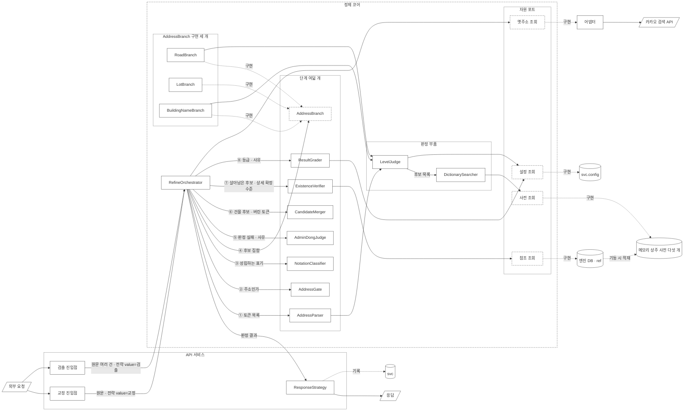

# 설계3: 처리 흐름

**답하는 질문: 들어온 주소를 어떤 차례로 처리하는가**

상태: 흐름 전체 확정 · 단계별 역할 9가지 서술 완료 · 컴포넌트 UML 완료 · 인터페이스 정의서 완료 · 인덱스 기반 끊기 확정 · 옛 주소 대응 체계 확정

---

## 0. 전체 흐름

```
교정 API ─┐                                                         ┌→ RoadBranch ─────────┐
          ├→ ① AddressParser ─→ AddressGate ─→ NotationClassifier ─┼→ LotBranch ──────────┼→ ② CandidateMerger
검출 API ─┘     (자르기·재기)    (주소인가)                          ├→ BuildingNameBranch ─┘          │
                              │                                     └→ AdminDongJudge ┐               ↓
                          주소 아님                                                    │   ③ ExistenceVerifier (DB)
                              │                                                        ↓               │
                            ④ ResultGrader ←──────────────────────────────────────────────────────────┘
```

**교정과 검출은 API를 따로 둡니다.** 하나의 API로 받아서 흐름 안에서 어느 쪽 요청인지 판별하려면 그 판별 기준을 따로 세워야 하기 때문입니다. 진입점을 나누면 어느 API로 들어왔는지가 그대로 전략 value가 되므로, 흐름 안에서 다시 판별하지 않습니다.

전략 value를 읽는 지점은 3곳입니다. `DictionarySearcher`가 접두사 비교를 켤지 정하는 지점, `LevelJudge`가 허용 오타 횟수를 정하는 지점, `ResultGrader`가 후보를 내밀지 사유를 낼지 정하는 지점입니다. 나머지 지점은 전략 value와 상관없이 같은 일을 합니다.

`AddressBranch` 구현 3가지는 같은 인터페이스를 구현합니다. `RoadBranch`와 `LotBranch`와 `BuildingNameBranch`는 받는 값과 돌려주는 값이 같고 내부 처리만 다릅니다. 어느 구현으로 들어와도 마지막에는 건물 한 채를 가리키므로 ② `CandidateMerger`부터는 하나의 흐름으로 이어집니다. 원천 자료가 그런 구조이기 때문입니다. 건물정보 파일 한 줄에 도로명 값과 대표지번과 건물 이름 세 칼럼이 나란히 들어 있습니다.

`AdminDongJudge`는 `AddressBranch` 구현이 아닙니다. 행정동과 법정동을 잇는 대응표가 없어서 찾지 못한다는 것이 이미 정해져 있으므로, 행정동 사전에 걸리는 순간 ④ `ResultGrader`로 바로 갑니다. ③ `ExistenceVerifier`를 거치지 않습니다.

### 단계별 서술 진행 상태

| 단계 | 상태 |
|---|---|
| ① `AddressParser` | 완료 |
| `AddressGate` | 완료 |
| `NotationClassifier` | 완료 |
| `RoadBranch` | 완료 |
| `LotBranch` | 완료 |
| `BuildingNameBranch` | 완료 |
| `AdminDongJudge` | 완료 |
| ② `CandidateMerger` | 완료 |
| ③ `ExistenceVerifier` | 완료. 확인 쿼리 형태만 물리 데이터 모델로 넘깁니다 |
| ④ `ResultGrader` | 완료 |

**서술 틀을 고정합니다.** 각 단계를 다섯 항목으로 씁니다. 받는 값, 하는 일, 돌려주는 값, 하지 않는 일, 다음 단계가 쓰는 것입니다. 마지막 항목이 단계와 단계를 잇는 부분입니다. 앞 단계가 무엇을 돌려줘야 하는지는 뒤 단계가 무엇을 필요로 하는지에서 나옵니다.

### 모듈 이름

**같은 대상을 같은 이름으로 부릅니다.** 단계 이름과 모듈 이름을 아래 표로 통일합니다.

| 모듈 | 하는 일 | 단계 |
|---|---|---|
| `AddressParser` | 원문을 토큰으로 자릅니다 | ① `AddressParser` |
| `AddressGate` | 주소로 볼 만한 입력인지 구분합니다 | `AddressGate` |
| `NotationClassifier` | 성립하는 표기를 전부 표시합니다 | `NotationClassifier` |
| `AddressBranch` | 구현은 `RoadBranch` · `LotBranch` · `BuildingNameBranch`입니다 | `AddressBranch` |
| `AdminDongJudge` | 사유를 만듭니다 | `AdminDongJudge` |
| `CandidateMerger` | 구현별 결과를 건물 단위로 합칩니다 | ② `CandidateMerger` |
| `ExistenceVerifier` | DB에 있는 것만 남깁니다 | ③ `ExistenceVerifier` |
| `ResultGrader` | 등급과 사유를 정합니다 | ④ `ResultGrader` |
| `RefineOrchestrator` | 단계를 부르는 차례를 담습니다 | 흐름 전체 |
| `RefineContext` | 단계마다 값을 읽고 쓰는 공용 객체입니다 | 흐름 전체 |
| `ResponseStrategy` | 전략별 반환 모양을 만듭니다 | API 서비스 |
| `LevelJudge` · `DictionarySearcher` | 판정에 쓰는 부품 2개입니다 | `AddressParser` · 계층 조회 |

---

## 0-1. 단계별 역할과 책임

### ① `AddressParser`

*받는 값*: 주소 문자열 전체, 우편번호, 들어온 경로, 전략 value(교정인지 검출인지)

*하는 일*: 「서울특별시 강남구 테헤란로 152」처럼 한 줄로 들어온 글자를 의미 단위로 나눕니다. 나누는 신호는 단위를 나타내는 끝 글자입니다. `시`와 `구`와 `읍`과 `로`와 `길` 같은 글자이고, 이 문서에서는 「단위 표기」라고 부릅니다. `강남구`의 `구`를 보고 그 지점에서 끊습니다.

끊어 낸 단위 하나를 **토큰**이라고 부릅니다. 토큰이 실제로 있는 이름인지 사전에서 찾습니다. 사전은 이름 목록을 메모리에 올려 둔 것입니다. 없으면 다른 지점에서 끊어 다시 찾습니다. `구로구디지털로`를 `구로`와 `구`로 끊으면 「구로」가 사전에 없으므로, `구로구`와 `디지털로`로 다시 끊습니다.

단위 표기가 없어서 어느 사전에도 걸리지 않은 토큰은 인덱스 기반 끊기가 받습니다. 인덱스 기반 끊기도 실패하면 자모 거리를 잽니다.

자모 거리를 재는 지점이 여기입니다. 정확히 맞는 이름이 없으면 그 지점에서 자모 거리를 재어 닮은 이름이 있는지 봅니다. 재는 범위는 전국 사전 전체입니다. 상위 행정구역이 아직 정해지지 않아서 범위를 좁힐 수 없습니다.

*돌려주는 값*: 토큰 목록입니다. 토큰마다 3가지를 붙입니다. 어느 층에 걸렸는지, 사전에서 찾았는지, 정확히 맞았는지 아니면 닮은 이름만 있었는지입니다. 어느 층에도 걸리지 않은 토큰도 남깁니다.

*하지 않는 일*: 옳고 그름을 정하지 않습니다. 좁힌 범위에서 후보 목록을 만드는 일도 하지 않습니다. 그 일은 계층 조회가 합니다.

*다음 단계가 쓰는 것*: `AddressGate`가 「사전에서 찾은 토큰이 하나라도 있는가」로 주소인지 아닌지를 구분합니다. 토큰마다 찾았는지가 붙어 있어야 그 판단이 유효합니다. 못 찾은 토큰을 남기는 것은 「강남구는 찾았고 이 부분은 못 찾았습니다」를 응답에 담기 위해서입니다.

세부 규칙은 아래 2절 ① AddressParser에 있습니다.

### `AddressGate`: 주소인가

*받는 값*: 토큰 목록, 전략 value

*하는 일*: 토큰 목록을 훑어 사전에서 찾은 것이 하나라도 있는지 봅니다. 하나도 없으면 주소가 아닙니다. 「ㅁㄴㅇㄹ」이나 「추후연락」처럼 주소와 무관한 글자가 여기서 걸립니다.

찾은 것이 있으면 주소로 보고 다음 단계로 보냅니다. 옳은 주소인지는 묻지 않습니다. 틀린 곳이 있어도 고칠 대상이 되는 입력인지만 가립니다.

**뒤지는 사전이 4개입니다.** 도로명 사전과 법정동 사전과 건물이름 사전과 행정동 사전입니다. 그래서 `롯데월드타워`처럼 건물 이름만 들어온 입력도 주소로 인정합니다.

닮은 이름만 있어도 「찾았습니다」에 담습니다. `서울틀별시 강남규 테헤란루 152`는 토큰마다 자모 거리 안에 드는 이름이 있으므로 `AddressGate`를 지납니다. 전체 글자 수 대비 오탈자 비율은 보지 않습니다. 토큰 단위 결과를 셀 뿐입니다.

*돌려주는 값*: 주소인지 아닌지 둘 가운데 하나입니다. 주소가 아니면 흐름이 여기서 끝나고 ④ `ResultGrader`로 갑니다.

*하지 않는 일*: 단위 표기가 있는지만 보고 판단하지 않습니다. 「출근길」에는 도로명 단위 표기 `길`이 있지만 사전에 없는 이름이므로 주소가 아닙니다. 반대로 「경기」는 단위 표기가 없어도 사전의 「경기도」와 견줄 수 있습니다. 단위 표기는 끊을 지점을 알려 주는 신호일 뿐이고, 주소인지를 정하는 것은 사전입니다.

*왜 `AddressParser` 뒤에 두는가*: 사전에서 찾으려면 먼저 끊어야 하기 때문입니다. 흐름의 맨 앞에 두면 아직 나누지 않은 글자를 놓고 판단하게 되고, 그때 볼 수 있는 것은 단위 표기가 있는지뿐입니다.

*왜 `AddressGate`를 엄격하게 만들지 않는가*: `AddressGate`와 `AddressBranch`는 세는 방식이 반대입니다. `AddressGate`는 토큰이 하나라도 걸리면 통과이고, `AddressBranch`와 계층 조회는 토큰이 전부 맞고 조합이 실재해야 성공입니다. `AddressGate`를 엄격하게 만들면 오타가 섞인 입력을 「주소 아님」으로 돌려보내서 고칠 기회 자체가 사라집니다.

*남는 경계*: 모든 토큰이 허용 오타를 넘으면 「주소 아님」으로 나갑니다. `서울특벼시 강남그 테헤란`처럼 사람 눈에는 주소인데 어느 토큰도 걸리지 않는 경우입니다. 검출 전략의 허용 오타 2가 폭을 넓히지만 이 경계를 완전히 없애지는 못합니다.

*다음 단계가 쓰는 것*: `NotationClassifier`가 4가지 표기 가운데 어느 것인지를 정합니다. 주소가 아닌 입력을 여기서 걸러내므로 그 아래로는 주소로 볼 만한 입력만 내려갑니다.

### `NotationClassifier`: 4가지 표기 가운데 무엇인가

*받는 값*: 토큰 목록, 전략 value

*하는 일*: 대한민국 주소를 적는 방식은 4가지입니다.

| 표기방식 | 예 | 이 방식이 나오는 이유 |
|---|---|---|
| 도로명 | `테헤란로 152` | 도로 이름과 건물번호로 적습니다 |
| 지번 | `역삼동 737` | 동·리 이름과 지번으로 적습니다 |
| 건물이름 | `롯데월드타워` | 건물 이름으로만 적습니다 |
| 행정동 | `상계1동 ○○로 12` | 법정동을 적는 부분에 행정동을 적습니다 |

앞의 2가지는 주소 체계이고 뒤의 2가지는 주소 체계가 아닙니다. 그래서 이 단계는 체계가 아니라 표기를 가르고, 이름도 `NotationClassifier`입니다. 어느 표기로 들어왔는지 정해야 그다음에 무엇을 찾을지가 정해집니다.

앞의 세 부분(시·도, 시·군·구, 읍·면)은 표기 방식이 달라도 같습니다. 어느 방식으로 적어도 그대로 들어옵니다. 달라지는 것은 그 아래입니다.

*돌려주는 값*: 성립하는 표기 전부입니다. 하나일 수도 있고 여럿일 수도 있습니다.

*구분하는 순서*: 미리 정하지 않고 사전에 걸린 대로 `AddressBranch` 구현을 엽니다.

```
토큰을 사전 네 곳에서 찾습니다
 → 걸린 사전마다 그 구현을 엽니다
 → 아무 데도 걸리지 않으면 AddressGate에서 이미 걸러졌습니다
```

**미리 정하는 규칙을 세우지 않습니다.** 「이럴 때는 지번으로 봅니다」 같은 규칙을 찾기 전에 두면, 실제로는 도로명 하나뿐인 입력도 `LotBranch`로 보냅니다. 어느 구현이 살아남는지는 구현을 모두 실행한 뒤에 ② `CandidateMerger`가 정합니다.

한 토큰이 사전 2곳에 걸리는 경우가 있습니다. 도로명과 법정동이 겹치는 이름은 전국에 `남성로`와 `세종로` 2개입니다. 「종로구 3종로 1」이 들어오면 도로명 단위 표기가 잡히지만 실제로는 법정동입니다. 이때도 구현 2가지를 모두 열고 결과로 가립니다.

토큰이 여럿이고 각각 다른 사전에 걸리는 경우도 같습니다. `노량진동 151-28 노량진로 171-2`는 `LotBranch`와 `RoadBranch`를 모두 엽니다.

법정동 사전을 행정동 사전보다 앞에 둡니다. 찾을 수 있는 방법이 있으면 그 방법을 씁니다. `AdminDongJudge`는 법정동 사전에 없을 때만 붙습니다.

*하지 않는 일*: 4가지 가운데 하나를 고르라고 사용자에게 되묻지 않습니다. 입력만 보고 정합니다.

*다음 단계가 쓰는 것*: `AddressBranch` 구현마다 끊는 규칙과 찾는 대상이 다릅니다. `RoadBranch`는 도로명 사전에서 이름을 찾고 건물번호를 붙여 조회하고, `LotBranch`는 동·리 이름을 찾고 본번과 부번을 붙이며, `BuildingNameBranch`는 건물 이름 세 칼럼을 훑습니다.

### `RoadBranch`

*받는 값*: 토큰 목록, 전략 value

*하는 일*: 도로명 이름으로 도로명코드를 찾고 건물번호를 붙여 등록주소 하나를 정합니다. 상위 행정구역이 입력에 있으면 계층 조회로 내려오고, 없으면 도로명과 건물번호로 시·군·구를 역조회해서 출발점을 만듭니다.

*돌려주는 값*: 등록주소 후보 집합입니다. 도로명주소관리번호 목록입니다. 층마다의 결과 두 칼럼도 함께 냅니다.

*하지 않는 일*: 건물을 하나로 정하지 않습니다. 등록주소 하나에 건물이 여럿 서 있습니다. 4칼럼 복합 키 6,422,298개 가운데 건물이 한 채뿐인 것이 66.1%이고, 가장 많은 것은 1,732채입니다.

*다음 단계가 쓰는 것*: ② `CandidateMerger`가 집합으로 받습니다.

세부 규칙은 4-2절 계층 조회와 4-2-1절 상위 생략 입력에 있습니다.

### `LotBranch`

*받는 값*: 토큰 목록, 전략 value

*하는 일*: 동·리 이름 뒤에 오는 첫 숫자 묶음을 지번으로 읽습니다. 숫자 묶음 앞에 홑글자 `산`이 붙으면 산여부가 `1`이고, 하이픈과 「의」는 같은 구분자로 보아 왼쪽이 본번이고 오른쪽이 부번입니다. 근거는 도로명주소법 시행령 제56조입니다.

**대표지번과 관련지번을 동시에 찾습니다.** 어느 쪽을 먼저 볼지 정하지 않습니다.

| | 어디에 있나 | 무엇에 붙나 |
|---|---|---|
| 대표지번 | 건물정보 파일 한 줄 안 | 건물 한 채 |
| 관련지번 | 별도 파일 | 등록주소 하나 |

[전량 · 전국] 두 집합은 거의 겹치지 않습니다. 지번 자연키 유일값 7,597,936개 가운데 대표지번이 6,169,477개(81.2%)이고, 관련지번에만 있는 것이 1,428,459개(18.8%)입니다. 관련지번 유일값 1,613,524개 가운데 88.5%가 대표지번 집합에 없습니다.

겹치는 185,065건 때문에 순서를 두면 안 됩니다. 같은 지번이 어느 건물의 대표지번이면서 다른 등록주소의 관련지번이기도 합니다. 한 쪽을 먼저 보고 결과가 나왔다고 끝내면 나머지를 조회조차 하지 않습니다.

```
노량진동 151-28 (땅 하나)
 ├ 노량진로 171-2    ← 대표지번 쪽
 ├ 노량진로 171-6    ┐
 ├ 노량진로 171-8    │ 관련지번 쪽
 ├ 노량진로 171-10   │
 └ 노량진로 171-12   ┘
```

*돌려주는 값*: 등록주소 후보 집합입니다. 대표지번 쪽에서 나온 건물은 그 건물이 선 등록주소로 올려 맞춥니다.

*하지 않는 일*: 지번만으로 등록주소를 하나로 정하지 않습니다. 땅 하나에 주소가 여럿 얹히므로 구조적으로 좁혀지지 않습니다.

*다음 단계가 쓰는 것*: ② `CandidateMerger`가 집합으로 받습니다.

### `BuildingNameBranch`

*받는 값*: 토큰 목록, 전략 value, 앞단에 행정구역이 있으면 그 범위

*하는 일*: 건물 이름 세 칼럼 전부와 비교합니다. 칼럼 사이는 OR이고 토큰 사이는 AND입니다.

```
입력   강일리버파크 308동
토큰1  강일리버파크   →  세 칼럼 가운데 어디에 걸리든 인정합니다
토큰2  308동         →  세 칼럼 가운데 어디에 걸리든 인정합니다
       두 토큰을 다 가진 건물이 답입니다
```

*돌려주는 값*: 건물 후보 집합입니다. 이 구현만 등록주소가 아니라 건물을 직접 냅니다.

*하지 않는 일*: 이름 칼럼 2개를 짝으로 고정하지 않습니다. 건물 종류를 적어 둔 이름을 사전에서 걸러내지도 않습니다.

*다음 단계가 쓰는 것*: ② `CandidateMerger`가 집합으로 받습니다.

세부 규칙과 실측값은 2절 ② 조회의 「건물 이름을 어떻게 맞추는가」에 있습니다.

### `AdminDongJudge`: 찾지 않고 사유를 냅니다

*받는 값*: 토큰 목록, 행정동 사전에 걸린 토큰

*하는 일*: 행정동으로 쓰였다는 사실을 기록하고 사유를 만듭니다. 찾지 않습니다. 행정동과 법정동을 잇는 대응표가 원천 자료에 없기 때문입니다.

**이름 목록은 있고 대응표만 없습니다.** 건물정보 파일의 19번 칼럼인 행정동명에 값이 들어옵니다. 전국 3,281개이고 서울 427개입니다. 그래서 「이 토큰은 행정동입니다」는 알 수 있고 「그 행정동이 어느 법정동인가」는 알 수 없습니다.

행정동과 법정동을 섞어 쓴 입력(A3)을 실제로 잡는 범위가 정해져 있습니다. 행정동 이름 가운데 법정동 이름에 없는 것이 서울 338개이고 전국 1,379개입니다. 나머지는 법정동 사전에 걸려 그쪽으로 처리되므로, 사용자가 행정동으로 썼는지조차 알 필요가 없습니다.

*돌려주는 값*: 판정은 실패, 사유 종류는 참조없음, 사유코드는 `ADMIN_DONG_USED`, 사유는 「행정동 표기로 보입니다. 법정동 이름으로 다시 입력하거나 도로명을 확인해 주세요」입니다.

*하지 않는 일*: ③ `ExistenceVerifier`를 거치지 않습니다. 확인할 대상이 없습니다.

*다음 단계가 쓰는 것*: ④ `ResultGrader`가 사유를 그대로 내보냅니다.

### ② `CandidateMerger`: `AddressBranch` 결과를 하나로 만듭니다

*받는 값*: `AddressBranch` 구현마다의 후보 집합

*하는 일*: 집합을 건물 단위로 맞춘 뒤에 합칩니다.

```
구현마다 따로 실행해서 후보를 냅니다
후보를 건물 단위로 펼칩니다
교집합이 비어 있지 않으면 교집합을 쓰고, 비어 있으면 합집합을 씁니다
```

**건물 단위로 맞추는 이유는 판정 기준이 건물관리번호이기 때문입니다.** `RoadBranch`와 `LotBranch`는 등록주소를 내고 `BuildingNameBranch`는 건물을 냅니다. 층위가 다른 채로는 겹치는지 볼 수 없습니다.

합치는 규칙에만 근거가 필요합니다. 두 구현이 같은 등록주소를 가리키면 서로를 확증하므로 후보를 좁힙니다. 다른 등록주소를 가리키면 어느 쪽이 틀렸는지 알 수 없으므로 둘 다 내밀고 고르는 일을 사용자에게 넘깁니다.

```
입력  노량진동 151-28 노량진로 171-2
LotBranch    171-2 · 171-6 · 171-8 · 171-10 · 171-12
RoadBranch   171-2
교집합       171-2  →  하나로 좁혀집니다
```

```
입력  노량진동 151-28 노량진로 171-4
LotBranch    171-2 · 171-6 · 171-8 · 171-10 · 171-12
RoadBranch   171-4        (이 등록주소의 지번은 노량진동 14-43입니다)
교집합 없음  →  합집합 여섯 개를 내밉니다
```

```
입력  노량진동 999-99 노량진로 171-2
LotBranch    없음
RoadBranch   171-2
합집합       171-2  →  하나로 좁혀지고, 버린 토큰으로 지번이 남습니다
```

*돌려주는 값*: 건물 후보 집합과 버린 토큰 목록입니다. 어느 구현이 결과를 내지 못했는지가 여기에 담깁니다.

*하지 않는 일*: `AddressBranch` 구현에 우선순위를 두지 않습니다. 어느 구현을 먼저 따라갈지 정하면 나머지 구현을 조회조차 하지 않게 됩니다.

*다음 단계가 쓰는 것*: ③ `ExistenceVerifier`가 후보를 받아 걸러내고, ④ `ResultGrader`가 버린 토큰으로 사유를 만듭니다.

### ③ `ExistenceVerifier`

*받는 값*: 합친 건물 후보 집합, 상세주소 토큰, 전략 value

*하는 일*: 후보가 DB에 실제로 있는지 확인하고 없는 것을 지웁니다. 사전은 이름만 담고 있으므로 실재 판정은 여기에서만 합니다.

상세주소 토큰이 있으면 상세주소찾기 테이블에서 동·층·호로 좁힙니다. 등록주소 하나에 딸린 건물을 모두 놓고 상세주소를 모은 뒤에 좁힙니다. 동이 건물 쪽에 있는 경우와 상세위치 쪽에 있는 경우가 76 대 21로 갈리므로, 입력한 동을 건물 고르는 조건으로만 쓰면 21%에서 실패합니다.

후보가 전부 지워지면 등록주소 대응 사전을 봅니다. 옛 등록주소가 새 등록주소로 이어지면 그 등록주소로 다시 확인합니다. 옛 등록주소 대응 규칙은 8절에 있습니다.

*돌려주는 값*: 살아남은 건물 후보와 상세 확정 수준(건물·층·호)입니다.

*하지 않는 일*: 닮은 정도로 순위를 매기지 않습니다. 실재하는지만 봅니다.

*다음 단계가 쓰는 것*: ④ `ResultGrader`가 남은 후보 수로 등급을 정합니다.

이 단계가 이 설계의 유일한 안전장치입니다. 이 단계를 건너뛰고 닮은 정도로 바로 답하면 존재하지 않는 주소를 그럴듯하게 반환하게 되고, 교정 왕복 채점이 의미를 잃습니다.

**[미착수] 확인 쿼리를 어떤 형태로 짤지는 물리 데이터 모델이 나온 뒤에 정합니다.**
### ④ `ResultGrader`

*받는 값*: 남은 건물 후보, 버린 조각 목록, 채운 값 목록, 상세 확정 수준, 전략 value

*하는 일*: 등급을 정하고 사유를 붙입니다. 등급과 사유를 한 칸에 합치지 않습니다.

```
등급  =  남은 후보 수로 정한다        1이면 확실 · 2 이상이면 후보여럿 · 0이면 실패
사유  =  버린 조각이 있으면 붙인다    등급과 무관하다
확실 + 사유가 함께 나오면 확인 권장으로 낸다
```

등급과 사유를 나눠 두는 이유는 조건이 계속 늘어나기 때문입니다. 한 칸에 합치면 조합마다 등급을 새로 만들어야 하고, 나눠 두면 사유 값 하나만 더하면 됩니다.

등급과 사유를 정하는 일까지가 이 단계이고, `ResultGrader`가 맡습니다. 전략마다 다른 반환 형태를 만드는 일은 API 서비스의 `ResponseStrategy`가 맡습니다. 두 모듈로 나누는 근거는 결과를 받는 쪽이 다르다는 것뿐이고, 판정 자체는 전략과 무관하게 같습니다.

주소가 아닌 입력은 등급이 실패이고 사유 종류가 입력 오류입니다. 사유코드는 `NOT_AN_ADDRESS`이고 사유는 「주소로 볼 수 있는 부분이 없습니다」이며 후보를 내지 않습니다. `AddressGate`가 걸러낸 입력이 이 단계로 옵니다.

*돌려주는 값*: 교정 전략은 확정 주소 또는 사용자가 고를 후보 목록을 돌려주고, 검출 전략은 처리 결과 전체와 실패 목록을 돌려줍니다. **두 반환 value를 같은 형태로 맞추지 않습니다.**

*하지 않는 일*: 후보가 하나로 좁혀졌다고 해서 버린 조각을 감추지 않습니다. 감추면 사용자는 자기가 입력한 내용이 모두 반영되었다고 잘못 알게 됩니다. 채운 값도 감추지 않습니다.

*다음 단계가 쓰는 것*: 없습니다. 정제 흐름이 여기서 끝납니다.

등급과 사유의 세부는 3절과 4절에 있습니다.

---

## 1. 런타임 5단계

```
① `AddressParser`               → 조회 파라미터 생성
  `AddressBranch` (도로명·지번·건물이름) → 구현마다 후보 집합
② `CandidateMerger`             → 건물 단위로 맞춰 합친다   ★판정 후보가 여기서 정해진다
③ `ExistenceVerifier` (DB)      → 실재하는 것만 잔존        ★환각 차단
④ `ResultGrader`                → 3절
```

① `AddressParser`는 판정하지 않습니다. 입력을 잘라 조회 파라미터로 만드는 일까지만 맡습니다.

---

## 2. 단계별 상세

### ① `AddressParser`: 어떻게 자를 것인가

#### 입력 계약

| 키 | 내용 |
|---|---|
| 주소 문자열 | 기본주소와 상세주소를 나누지 않은 문자열 하나 |
| 우편번호 | 별도 키 |
| 들어온 경로 | TMS 내부 · 외부사 팝업 · 엑셀 배치 |

외부사 팝업은 기본주소와 상세주소를 나눠서 주지만, 솔루션은 두 값을 이어 붙여 한 키로 받습니다.
팝업이 나눈 경계를 그대로 믿으면 상세주소 칸에 기본주소가 들어온 입력(B07)을 잡아내지 못합니다.

#### 처리 순서

```
원문
 → 층 1  문자 손질     앞뒤 공백 제거 · 사이 공백 하나로 · 전각을 반각으로
 → 토큰 나누기         공백이 아니라 단위 표기 글자로 끊는다
 → 왼쪽부터 상태 전이
      단위 표기가 안 맞으면 → 층 2  낱말 해석 시도
      해석해도 안 맞으면 → 인덱스 기반 끊기 (아래)
      그래도 안 걸리면 → 자모 거리 → 코드 부여 → 실패 흐름
```

층 1에서는 뜻이 바뀌지 않는 손질만 합니다. 층 2에서는 위치에 따라 뜻이 달라지는 낱말을 다룹니다.
`삼동`은 읍면 부분에서는 지명이고 상세 부분에서는 3동입니다. 미리 일괄로 바꾸면 지명이 잘못 바뀝니다.
층 2는 단위 표기가 바로 맞지 않을 때만 실행합니다. 정상 입력은 층 2를 거치지 않습니다.

두 층 모두 값을 바꾼 지점마다 원문 위치와 바꾸기 전 값을 남깁니다.
성공한 건에도 「이렇게 고쳐 읽었습니다」로 돌려줄 수 있어야 합니다.

공백은 끊을 지점의 후보일 뿐이고 반드시 끊어야 하는 지점은 아닙니다. 층 1이 공백 간격을 하나로 맞추지만, 그 공백을 경계로 그대로 믿지는 않습니다. `서울특별 시강남구 테헤란로 152`처럼 공백이 이름 한가운데를 구분하는 입력이 있기 때문입니다.

#### 상태 전이표

```
[시작]→[시도]→[시군구]→[행정구]→[읍면]→┬→[도로명]→[건물번호]→[참고항목]→[상세]→[끝]
                                          └→[법정동]→[지번]────────────────┘
                                                       (선택)     (선택)
```

| 현재 상태 | 다음에 올 수 있는 것 | 못 맞았을 때 코드 |
|---|---|---|
| 시작 | 시도 / 시군구 / 도로명 / 법정동 | `SIDO_NOT_FOUND` |
| 시도 | 시군구 / 도로명 / 법정동 | `SGG_NOT_FOUND` |
| 시군구 | 행정구 / 읍면 / 도로명 / 법정동 | `ROAD_TOKEN_NOT_FOUND` |
| 행정구 | 읍면 / 도로명 / 법정동 | `ROAD_TOKEN_NOT_FOUND` |
| 읍면 | 도로명 / 법정동 | `ROAD_TOKEN_NOT_FOUND` |
| 도로명 | 건물번호 | `BLDG_NO_NOT_FOUND` |
| 법정동 | 지번 | `JIBUN_NOT_FOUND` |
| 건물번호 | 참고항목 / 상세 / 법정동 / 끝 | — |
| 지번 | 참고항목 / 상세 / 도로명 / 끝 | — |
| 참고항목 | 상세 / 끝 | — |
| 상세 | 끝 | — |

건물번호와 지번 뒤로는 실패가 없습니다. 조회에 필요한 값이 그 지점에서 모두 모이기 때문입니다.

건물번호 뒤에 법정동이, 지번 뒤에 도로명이 올 수 있게 전이표를 열어 뒀습니다. `노량진동 151-28 노량진로 171-2`처럼 두 표기가 함께 들어오는 입력을 실패로 보내지 않습니다. 둘 중 어느 표기가 주소를 정하는지는 ② `CandidateMerger`가 결과로 판정합니다.

시작 상태에서 시·도를 건너뛴 입력도 받도록 전이표를 만들었습니다. 「광명시 시청로 50」을 실패로 보내지 않습니다.
빠진 상위 부분은 4-2-1절에서 채웁니다.

#### 상태별 단위 표기

| 상태 | 단위 표기 |
|---|---|
| 시도 | `특별시` `광역시` `특별자치시` `도` `특별자치도`로 끝남 |
| 시군구 | `시` `군` `구`로 끝남 |
| 행정구 | `구`로 끝남 · 시 상태 뒤에서만 |
| 읍면 | `읍` `면`으로 끝남 |
| 법정동 | `동` `가` `리`로 끝남 |
| 도로명 | `대로` `로` `길`로 끝남 |
| 건물번호 | 도로명 바로 뒤 첫 숫자 덩어리 · `숫자` 또는 `숫자-숫자` |
| 지번 | 법정동 바로 뒤 첫 숫자 덩어리 · 앞에 홑글자 `산`이 올 수 있음 |
| 참고항목 | 괄호로 감싸짐 |
| 상세 | 건물번호 또는 지번 뒤 나머지 전부 |

[전량 · 전국] 법정동·법정리 이름의 끝 글자는 5가지입니다. 법정읍면동 3,589개가 `동` 2,079 · `면` 1,006 · `가` 266 · `읍` 236 · `로` 2이고, 법정리 6,968개는 전량 `리`입니다. 단위 표기 `동`·`가`·`리` 3가지가 법정동 부분을 모두 포괄합니다. 끝 글자가 `로`인 2개는 도로명 단위 표기와 겹치므로 사전을 조회해 구분합니다.

건물번호의 하이픈은 본번-부번이므로 한 덩어리로 봅니다. 떼어내면 조회 키가 깨집니다.
지번의 하이픈도 같습니다. 왼쪽이 본번이고 오른쪽이 부번입니다.
상세주소의 하이픈(`110-502`)과는 나오는 지점으로 구분합니다. 도로명이나 법정동 바로 뒤 첫 덩어리만 번호입니다.

#### 끊는 지점을 바꿔 다시 시도합니다

끊기와 조회는 한 번에 끝나지 않습니다. 끊은 토큰이 사전에 없으면 다른 지점에서 끊어 다시 시도합니다.

```
구로구디지털로 → 시도 ①  구로 + 구 + 디지털로   → 「구로」가 사전에 없음
               → 시도 ②  구로구 + 디지털로       → 사전에 있음
```

실패 조건은 「끊을 수 없습니다」가 아니라 「어떻게 끊어도 사전에서 찾지 못합니다」입니다.
전이표의 코드는 모든 끊기 시도가 끝난 뒤에 붙습니다.

단위 표기로 끊는 이 방식은 없애거나 고치지 않습니다. 정상 입력을 처리하는 확정된 로직이기 때문입니다. 단위 표기가 없는 입력은 아래 인덱스 기반 끊기가 별도 경로로 받습니다. 두 방식을 하나로 합칠지는 항목 58이 2단계에서 정합니다.

---

### ①-2 인덱스 기반 끊기: 단위 표기가 없는 토큰을 받습니다

#### 진입 조건

`AddressParser` 안에서 단위 표기로 끊어 본 뒤 사전에서 찾지 못한 토큰이 남았을 때 이 경로를 실행합니다. `AddressGate`가 판정한 뒤에 실행하는 것이 아닙니다.

```
서울강남테헤란로152

단위 표기 `로`가 하나뿐이라 「서울강남테헤란로」 + 「152」로만 나뉜다
「서울강남테헤란로」가 도로명 사전에 없다
→ 찾은 토큰 0개
→ `AddressGate`에 그대로 넘기면 「주소로 볼 수 있는 부분이 없습니다」로 끝난다
```

`AddressGate`가 판단할 재료는 `AddressParser`가 만듭니다. `AddressParser`가 재료를 덜 만든 상태에서 `AddressGate`가 판단하면 안 됩니다.

진입 조건은 「전부 실패」가 아니라 「사전에서 찾지 못한 토큰이 하나라도 있을 때」입니다.

```
서울특별시 강남 테헤란로 152

서울특별시  →  단위 표기 `시`로 끊고 사전에 있다
강남        →  단위 표기가 없어 어디에도 안 걸린다     ← 이 토큰 하나 때문에 부른다
테헤란로    →  단위 표기 `로`로 끊고 사전에 있다
152         →  건물번호
```

전부 실패로 조건을 잡으면 이 입력은 답을 내되 「강남」을 버린 조각으로 넘긴 채 끝납니다. 찾지 못한 토큰이 하나만 있어도 이 경로를 실행하면 그 지점에서 복원됩니다.

입력 전체를 사전에서 찾지 못한 경우와 토큰 하나를 찾지 못한 경우는 같은 일입니다. 둘 다 찾지 못한 글자를 놓고 사전에서 시작 이름을 찾는 일이고 길이만 다릅니다. 두 경우를 나누어 처리하지 않습니다.

#### 인덱스가 담는 것

인덱스는 단위 표기를 제거한 형태를 키(key)로 삼습니다. 원본 사전은 그대로 두고 인덱스를 하나 더 만듭니다.

| 키 | 층 | 원래 이름 |
|---|---|---|
| 강남 | 시군구 | 강남구 |
| 강남 | 읍면동 | 강남동 |
| 강남 | 리 | 강남리 |
| 강남 | 도로명 | 강남로 |
| 강남 | 도로명 | 강남대로 |
| 강남 | 도로명 | 강남길 |

인덱스는 층을 값으로 담습니다. 상태를 아는 지점에서는 층으로 걸러 한 줄만 쓰고, 상태를 모르는 입력에서는 후보를 모두 꺼내 조합으로 거릅니다. 자료 구조 하나가 두 경우를 모두 받습니다.

원본 사전을 교체하지 않습니다. 단위 표기로 끊는 기존 경로는 원본 사전을 그대로 조회합니다. 도로명 이름으로 시·군·구를 거꾸로 찾는 역조회 인덱스와 같은 구조입니다.

#### 규칙 5가지

하나. 인덱스 키는 단위 표기를 제거한 뒤 공백까지 지워서 만듭니다.

단위 표기 목록은 층마다 두고 긴 것부터 뗍니다. `대로`를 `로`보다 먼저 보고, `특별자치도`를 `도`보다 먼저 봅니다. 한 이름에서 단위 표기를 여러 가지로 뗄 수 있으면 뗀 결과를 모두 올리고, 뗀 나머지가 비면 올리지 않습니다.

공백을 지우는 이유는 일반구 때문입니다. 원천 자료가 「부천시 소사구」를 한 칼럼에 공백까지 넣어서 줍니다. 전국 일반구 39개가 여기에 해당합니다.

```
원천 값    부천시 소사구
키       부천시소사
입력       경기부천시소사양지로184번길7   →  맞는다
```

둘. 왼쪽부터 길이를 늘려 가며 인덱스를 조회하고, 단위 표기까지 포함한 가지와 포함하지 않은 가지를 둘 다 엽니다.

```
광명시청로50
   광명시 | 청로   | 50
   광명   | 시청로 | 50      ← 정답
   광명   | 시청   | 로50
```

가장 긴 것만 고르면 「광명시」가 단위 표기 `시`까지 포함해 「시청로」를 잃습니다. 그 `시`는 「시청로」의 첫 글자입니다.

셋. 숫자를 만난 지점에서도 인덱스를 먼저 조회합니다.

`3공단로`·`4.19로1길`처럼 숫자로 시작하는 도로명이 실재합니다. 숫자 덩어리부터 먼저 끊으면 이런 도로명을 아예 찾지 못합니다.

넷. 한 글자 키는 두 경우에만 씁니다.

| 쓰는 경우 | 예 |
|---|---|
| 시군구 층 이름일 때 | 남구 · 동구 · 북구 · 서구 · 중구 5개뿐입니다 |
| 단위 표기가 입력에 남아 있을 때 | 「종로」는 `로`가 입력에 있으므로 인정합니다 |

「서우르」의 「서」는 「서구」·「서면」의 단위 표기가 입력에 없으므로 버립니다. 한 글자 키를 만드는 이름은 읍면동 115개, 리 137개, 도로명 70개입니다.

다섯. 완전 가지가 있으면 미완 가지를 버립니다.

끝까지 사전에서 찾은 가지가 하나라도 있으면 도중에 막힌 가지는 버립니다. 완전 가지가 하나도 없으면 입력 전체를 자모 거리 단계로 넘깁니다.

#### 예시

```
경기화성시만세3.1만세로281번길29

자리 0   '경기' 걸림 · '경' 걸림
         '경'은 단위 표기 근거가 없다  →  버린다                    규칙 4
자리 2   '화성시만세' 걸림 (키에서 공백을 지웠다)             규칙 1
         '화성'도 살린다                                       규칙 2
자리 7   숫자로 시작하지만 인덱스를 먼저 조회한다                 규칙 3
         '3.1만세로281번' · '3.1만세' 둘 다 걸린다             규칙 2
자리 18  '29'

완전 가지 1개 · 미완 가지 6개                                  규칙 5
경기 → 경기도  |  화성시만세 → 화성시 만세구  |  3.1만세로281번길  |  29
```

끊기가 정하는 범위는 토큰과 토큰마다의 이름 후보까지입니다. 「경기」에는 경기도와 경기대로가 함께 붙고, 둘 중 어느 것인지는 층 조합을 확인하는 다음 단계가 판정합니다.

#### 실측

[전량 · 전국] 인덱스 규모는 다음과 같습니다.

| 층 | 이름 수 | 단위 표기가 안 붙은 이름 |
|---|---|---|
| 시도 | 16 | 0 |
| 시군구 | 238 | 0 |
| 읍면동 | 3,969 | 3 |
| 리 | 7,003 | 6 |
| 도로명 | 143,565 | 319 |

키는 142,576개이고 최대 길이는 20자입니다. 단위 표기 규칙으로 처리하지 못하는 328개는 원형 그대로 올립니다.

층 안에서는 키가 유일합니다. 시군구 238개가 키 238개이고, 리 키 6,997개 중에서 리끼리 겹치는 것이 0입니다. 겹침은 전부 층 사이에서 납니다. 시군구 키의 75.6%가 다른 층의 이름과 같은 키를 공유합니다.

[표본] 시도 5곳에서 잰 정답 가지 생존율과 가지 수는 다음과 같습니다.

시도마다 실주소 1,500건에서 시·도와 시·군·구의 단위 표기를 지우고 공백을 없앤 값을 넣었습니다.

| 시도 | 정답 가지 생존 | 가지 중앙값 | 99퍼센타일 | 최대 |
|---|---|---|---|---|
| 서울 | 100.0% | 1 | 10 | 17 |
| 경기 | 100.0% | 1 | 4 | 6 |
| 경북 | 100.0% | 2 | 11 | 31 |
| 대구 | 100.0% | 1 | 6 | 15 |
| 제주 | 100.0% | 1 | 5 | 5 |

한 글자 키를 어떻게 쓰느냐에 따라 가지 수가 달라집니다.

| 한 글자 키 | 생존 | 가지 중앙값 | 최대 |
|---|---|---|---|
| 전부 뺍니다 | 95.9% | 1 | 7 |
| 전부 씁니다 | 99.9% | 8 | 96 |
| **가려 씁니다** | **100.0%** | **1** | **17** |

정답 주소를 일부러 훼손해 만든 시험값입니다. 이 값은 이 방식이 얼마나 정확한지를 재는 값이고, 얼마나 자주 쓰이는지를 재는 값이 아닙니다.

---

#### 사전 4개의 규모

| 사전 | 전국 | 서울 |
|---|---|---|
| 도로명 | 371,958 | 14,583 |
| 법정동·법정리 | 10,557 | 466 |
| 건물이름 (세 칼럼의 합집합) | 588,665 | 111,664 |
| 행정동 | 3,281 | 427 |
| **합** | **약 97만** | **약 12.7만** |

이름 단위로 만든 값입니다. 건물마다 한 줄을 만들면 4천만 줄이 되지만, 사전은 이름만 담고 실재 판정은 DB가 하므로 그럴 필요가 없습니다.

이 사전은 주소인지 판정하는 데 쓰는 주소표기 사전입니다. `04-source-data.md` 7절의 참조 캐시 6층과는 다른 것이고, 그쪽은 후보를 좁히는 데 씁니다. 두 목록에 담긴 이름이 다른 이유가 여기에 있습니다.

#### 앞 세 부분의 조합 8가지

| 번호 | 시·도 | 시·군·구 | 행정구·읍·면 | 예시 |
|---|---|---|---|---|
| 1 | 특별시·광역시 | 자치구 | — | 서울특별시 강남구 |
| 2 | 특별시·광역시 | 군 | 읍·면 | 부산광역시 기장군 정관읍 |
| 3 | 도·특별자치도 | 시 | — | 경기도 과천시 |
| 4 | 도·특별자치도 | 시 | 읍·면 | 경기도 여주시 가남읍 |
| 5 | 도·특별자치도 | 시 | 행정구 | 경기도 성남시 분당구 |
| 6 | 도·특별자치도 | 시 | 행정구 + 읍·면 | 경기도 용인시 처인구 포곡읍 |
| 7 | 도·특별자치도 | 군 | 읍·면 | 경기도 양평군 양평읍 |
| 8 | 특별자치시 | — | 읍·면 또는 없음 | 세종특별자치시 조치원읍 |

근거는 지방자치법 제3조와 도로명주소법 시행령 제6조입니다.

행정구와 읍·면이 함께 오는 6번만 부분이 4개입니다. 행정구 다음에 읍·면이 올 수 있게 전이표를 연 이유가 여기 있습니다.
자치구인 1번과 행정구인 5번은 둘 다 `구`로 끝나지만 앞에 오는 단위로 구분합니다.
특별시·광역시 뒤면 자치구이고, 시 뒤면 행정구입니다.

전남광주통합특별시도 이 표에 포함됩니다. 2026년 7월 자료의 시도 16개에 「전남광주통합특별시」가 있고 「광주광역시」·「전라남도」는 없습니다. 세 번째 줄 아래 「특별시 + 시·군 + 읍·면」 조합에 해당하므로 새 줄을 만들지 않습니다.

#### 상세주소 안쪽 하이픈

상세주소 안쪽 하이픈은 왼쪽이 동번호이고 오른쪽이 호수입니다. 근거는 도로명주소법 시행규칙 제21조④입니다. 층수를
생략하면 `동`·`호` 표기를 빼고 동번호와 호수를 하이픈으로 잇습니다. 하이픈은 읽지 않고 `동`과 `호`가
표기된 것으로 봅니다.

건물번호의 하이픈과는 나오는 지점으로 구분합니다.

| 지점 | 형태 | 뜻 |
|---|---|---|
| 도로명 또는 법정동 바로 뒤 첫 덩어리 | `15-3` | 건물 본번-부번 또는 지번 본번-부번 |
| 그 뒤 | `101-502` | 동번호-호수 |

호수의 앞자리가 층을 겸할 수 있습니다. 시행규칙 제25조①2호가 층수를 생략할 때 층수를 나타내는
숫자로 호수가 시작하도록 정합니다. `502`는 5층 2호입니다.

층·호를 생략할 수 있는 조건 4가지는 `04-source-data.md` 「건물 유형 판별 근거」에 있습니다.

#### 하이픈을 기준으로 삼지 않습니다

하이픈은 법이 정한 표기가 아닙니다. 도로명주소법 시행령 제3조④는 상세주소를 동·층·호 순서로
적으라 하고, 같은 조 ⑤는 건물번호와 상세주소 사이에 쉼표를 넣으라고만 정합니다. 하이픈을 규정한
조문이 없습니다. 사람들이 쓰는 표기 관행이지 규범이 아닙니다.

그래서 하이픈을 해석 규칙의 출발점으로 삼지 않고, 대신 아래 순서로 처리합니다.

```
상세주소 토큰
 → 숫자가 아닌 글자로 끊어 숫자 덩어리를 뽑는다   (하이픈·공백·쉼표를 모두 같게 취급)
 → 오른쪽 덩어리부터 차례로
      등록주소 하나에 딸린 상세주소를 모아 놓고 맞춰 본다
 → 맞은 것만 남긴다                              ★판정은 코드가 한다
```

대조 상대는 건물 한 채가 아니라 등록주소 하나입니다. 동이 건물 쪽에 있는 경우와 상세위치 쪽에 있는 경우가 76 대 21로 나뉘므로, 건물을 먼저 하나로 정하고 그 건물의 상세주소만 보면 21%에서 실패합니다. 등록주소 하나에 딸린 건물을 모두 놓고 상세주소를 모은 뒤 동·층·호로 함께 좁힙니다.

오른쪽부터 맞추는 이유는 생략 방향 때문입니다. 가장 작은 단위인 호는 거의 빠지지 않고, 동과 층은
생략 조건이 있어 빠질 수 있습니다. 반드시 있는 쪽에서 시작해야 합니다.

숫자 덩어리의 개수가 알려주는 것은 가능한 조합의 수뿐입니다.

| 덩어리 수 | 가능한 해석 | 개수만으로 정해지나 |
|---|---|---|
| 셋 | 동-층-호 (시행령 제3조④가 순서를 고정합니다) | **정해집니다** |
| 둘 | 동-호 / 동-층 / 층-호 | 안 정해집니다. 대조가 구분합니다 |
| 하나 | 호(층을 겸할 수 있음) / 동만 | 안 정해집니다. 대조가 구분합니다 |

여러 `AddressBranch` 구현이 동시에 맞으면 층 결과를 두 칸으로 냅니다. 새 규칙을 만들지 않습니다. 표는
`decisions.md` 「층 결과는 두 칸으로 냅니다」에 있습니다.

이 처리는 ① `AddressParser`에서 끝나지 않고 ③ `ExistenceVerifier`까지 이어집니다. 나눈 덩어리를 조회 파라미터로
만드는 일까지가 `AddressParser`이고, 어느 덩어리가 동이고 어느 덩어리가 호인지 정하는 일은 대조 결과가 합니다.

표준 표기 순서와 실제 자료가 어긋나는 지점이 있습니다.

국가 표준은 다음 순서로 적도록 정합니다.
```
시·도 + 시·군·구 + 읍·면 + 도로명 + 건물번호 + 상세주소(동/층/호) + (참고항목)
```

그런데 **아파트의 동은 표준상 「상세주소」 부분인데, 자료에서는 「참고항목(건물명)」에 있기도 합니다.**
사용자가 표준대로 쓴 `77동`을 건물 이름 칼럼에서 찾아야 하는 경우가 생깁니다.
### ② 조회: 무엇을 키로 어떤 순서로 찾는가

입력으로 들어온 표기 방식마다 조회하는 순서가 다릅니다.

| 표기 방식 | 조회 순서 |
|---|---|
| 도로명 | 도로명코드 → 등록주소 → 건물 |
| 지번 | 지번 자연키 → 대표지번과 관련지번 동시 조회 → 등록주소 → 건물 |
| 건물 이름 | 이름 칼럼 3개 전부와 비교 (건축물대장 / 상세 / 시군구용) |
| 행정동 | 대응표가 없어 찾지 못합니다. 실패로 처리하고 사유를 붙입니다 |

등록주소를 가리키는 키는 도로명주소관리번호 26자리입니다. 4칼럼 복합 키는 전국 10건에서 두 읍면동이 겹쳐 구분되지 않습니다. 근거는 `06-source-schema.md` 「4칸 묶음은 유일하지 않습니다」에 있습니다. **찾을 때 쓰는 키로는 4칼럼 복합 키를 그대로 쓰고, 테이블끼리 서로를 가리키는 부분만 관리번호로 씁니다.**

#### 지번으로 찾을 때 2곳을 함께 봅니다

**대표지번은 건물정보 줄 안에 있고, 관련지번은 별도 파일에 있습니다.** 2곳을 동시에 조회해 결과를 합칩니다. 근거와 실측값은 0-1절 `LotBranch`에 있습니다.

대표지번 쪽에서 나온 결과는 건물이므로, 그 건물이 속한 등록주소로 올려서 맞춘 뒤 합칩니다. 관련지번 쪽은 처음부터 등록주소를 가리킵니다.

#### 건물 이름을 어떻게 맞추는가

원천 데이터는 건물 한 채가 한 줄이고, 이름 칼럼이 3개입니다.

| 대장건물명 | 상세건물명 | 시군구용건물명 |
|---|---|---|
| 강일리버파크 | 308동 | 강일리버파크3단지아파트 |
| 강일리버파크 | 307동 | 강일리버파크3단지아파트 |
| (빈값) | (빈값) | 종로타워 |

**이름은 줄 단위로 맞추고, 어느 칼럼에 있는지는 따지지 않습니다.**

```
입력   강일리버파크 308동
토큰1  강일리버파크
토큰2  308동
       줄마다 이 건물이 두 이름을 다 갖고 있는지 확인합니다
1번 줄  둘 다 있음  →  ○
2번 줄  308동 없음  →  ×
```

| | 관계 |
|---|---|
| 칼럼 사이 | OR입니다. 토큰 하나가 세 칼럼 중 어디에 일치하든 인정합니다 |
| 토큰 사이 | AND입니다. 토큰이 2개이면 둘 다 만족하는 건물을 찾습니다 |

칼럼을 짝으로 고정하지 않습니다. `강일리버파크3단지 308동`은 시군구용건물명과 상세건물명에 일치하므로, 대장건물명과 상세건물명을 짝으로 정하면 잡지 못합니다. 공동주택이 아니면 건축물대장건물명이 아예 들어오지 않는 것도 칼럼을 AND로 묶으면 안 되는 이유입니다.

AND 조건으로 결과가 0건이 되면 토큰별로 따로 찾은 결과를 남깁니다. 「단지는 찾았고 동을 찾지 못했습니다」가 결과로 남아야 고칠 방향이 나옵니다. 계층 조회에서 층을 따로 조회한 뒤 조합을 확인하는 것과 같은 이유입니다.

입력 앞부분에 행정구역이 있으면 그 범위로 먼저 좁힙니다. 상위 생략 입력을 다루는 4-2-1절과 같은 구조입니다.

후보 상한은 10개입니다. 검출 전략에서 이미 쓰는 값을 그대로 씁니다. 상한을 넘으면 사유코드 `BLDG_NAME_TOO_MANY`로 목록을 비우고 개수만 냅니다.

[전량 · 전국] 이름 하나가 가리키는 건물 수

| | 이름 수 | 한 채뿐 | 10채 이하 | 최대 |
|---|---|---|---|---|
| 건축물대장건물명 | 92,222 | 57.5% | 92.6% | 2,253 (`현대아파트`) |
| 시군구용건물명 | 418,618 | 61.1% | 95.3% | 5,508 (`주택`) |

이름 끝에 건물 종류를 적어 둔 값이 있습니다. `주택`·`공장`·`창고`·`농막`·`제실` 같은 값입니다. 이런 값을 사전에서 걸러내지 않습니다. 후보 상한을 넘으면 목록을 비우고 개수만 돌려주므로 「그 이름을 가진 건물이 5,508채입니다」가 나가고, 사용자는 그 답으로 다음에 무엇을 할지 판단할 수 있습니다. 사전에서 빼면 「주소가 아닙니다」로만 끝납니다.

#### 문자 유사 비교: 어떻게 계산하는가

**이름을 자모(한글 낱자로, `강`을 `ㄱ`·`ㅏ`·`ㅇ`으로 푼 것입니다)로 풀어서 거리를 계산합니다.** 음절 단위로 계산하면 오타와 다른 이름이 구분되지 않습니다.

| 쌍 | 구분 | 음절 거리 | 자모 거리 |
|---|---|---|---|
| 테헤란로 / 테해란로 | 오타 | 1 | 1 |
| 테헤란로 / 테헤란길 | 다른 길 | 1 | 3 |
| 경상남도 / 경상북도 | 다른 시도 | 1 | 3 |

`헤`와 `해`는 풀면 초성이 같고 모음만 다릅니다. `로`와 `길`은 풀어도 겹치는 자모가 없습니다.
거리 계산은 다메라우-레벤슈타인(Damerau-Levenshtein)으로 합니다.

숫자와 갈래 글자는 따로 떼어 정확 일치를 요구합니다.
`사당로2길`과 `사당로20길`은 숫자가 달라 비교하지 않습니다.
`다산로33가길`과 `다산로33나길`은 갈래 글자가 달라 비교하지 않습니다.

앞 두 자모를 고정합니다. 탐색 구간이 줄고 첫 글자가 통째로 다른 후보가 빠집니다.

단위 표기 누락은 자모 거리로 잡지 못합니다. 「강남」과 「강남구」의 자모 거리는 2여서 교정 전략의 허용 오타 횟수 1을 넘습니다. 「강남동」과의 거리 3보다 가깝게 나오지만, 그것은 `구`가 두 자모이고 `동`이 세 자모라서 생긴 차이일 뿐이며 강남이 구일 가능성이 높아서 생긴 차이가 아닙니다. 단위 표기 누락은 인덱스 기반 끊기가 정확 일치로 받습니다.

문자 유사 비교를 하는 지점이 2곳이고 목적이 다릅니다.

| | 계산 범위 | 무엇을 얻는가 |
|---|---|---|
| ① 파싱 | 전국 사전 전체 | 이 토큰이 사전에 있는 이름인가. `AddressGate`가 세는 값 |
| 계층 조회 | 상위가 정해진 뒤 좁힌 범위 | 사용자에게 제시할 후보 목록 |

두 번 계산하는 것은 낭비가 아닙니다. 파싱 시점에는 상위가 정해져 있지 않아 범위를 좁힐 수 없습니다. 파싱에서 계산한 값으로 계층 조회를 대신하면 전국 도로명 37만 개에서 만든 후보를 사용자에게 제시하게 됩니다.

#### 실측: 서울 도로명 14,564개

조건은 위와 같습니다. 도로명마다 가장 가까운 다른 도로명까지의 자모 거리를 측정했습니다.

| 최근접 자모 거리 | 도로명 수 | 비율 |
|---|---|---|
| 1 | 612 | 4% |
| 2 | 2,942 | 20% |
| 3 | 4,278 | 29% |
| 4 | 2,909 | 20% |
| 5 | 1,851 | 13% |
| 6 이상 | 1,495 | 10% |
| 닮은 상대 없음 | 477 | 3% |

허용 거리 안에 몇 개가 들어오는지는 따로 측정했습니다.

| 허용 | 다른 이름이 섞여 드는 도로명 | 섞일 때 평균 개수 | 최대 |
|---|---|---|---|
| 1 | 612개 (4%) | 1.12개 | 3개 |
| 2 | 3,554개 (24%) | 1.68개 | 13개 |

**다른 이름이 섞여 드는 도로명은 많으나, 섞여 들어오는 개수는 한두 개입니다.** 사용자에게 고르라고 물어볼 수 있는 규모입니다.

#### 허용 오타 횟수

허용 오타 횟수는 교정 전략에서 1회, 검출 전략에서 2회입니다. 이 값은 설정 value로 두고 코드에 하드코딩하지 않습니다. 근거는 `decisions.md`에 있습니다.

허용 오타 횟수를 0으로 두면 닮은 이름(`SIMILAR`)이 하나도 나오지 않으므로, 실제로 쓸 수 있는 가장 작은 값은 1입니다.

#### 층 결과

층마다 값을 2개 냅니다. 나오는 조합은 5가지뿐입니다. 표는 `decisions.md`에 있습니다.

### ③ `ExistenceVerifier`: 0-1절에 있습니다

### ④ 응답: 3절에 있습니다

---

## 3. 응답 5가지

| 응답 | 조건 | 사용자에게 하는 말 |
|---|---|---|
| 확실한 성공 | 후보가 하나이고 버린 토큰이 없음 | (아무 말 없음) |
| 확인 권장 | 후보가 하나이나 그대로 받으면 안 되는 이유가 있음 | "이 중 맞는 것을 골라주세요" |
| 후보 여럿 | `ExistenceVerifier`를 통과한 후보가 2개 이상 | "이 중에 있나요?" |
| 실패 | 잔존 후보 없음 | "여기가 잘못됐습니다" |
| 수정 제안 | 후보 없음 + 고칠 방향 있음 | "혹시 이것 아닌가요?" |

### 등급과 사유를 나눕니다

```
등급  =  남은 후보 수로 정합니다        1이면 확실 · 2 이상이면 후보여럿 · 0이면 실패
사유  =  버린 토큰이 있으면 붙입니다    등급과 관계가 없습니다
확실과 사유가 함께 나오면 확인 권장으로 냅니다
```

**등급과 사유를 한 칼럼에 뭉치지 않는 이유는 조건이 늘어나기 때문입니다.** 뭉치면 조합마다 등급을 새로 만들게 되고, 나누면 사유 값 하나만 더하면 됩니다. 층 결과를 두 칼럼으로 내는 것과 같은 처리입니다.

### 확인 권장의 조건: 3가지가 들어옵니다

**「하나로 좁혀졌으나 그대로 받으면 안 되는 이유가 있습니다」가 조건입니다.** 그 안에서는 사유 종류로 구분합니다.

| 무슨 일이 있었나 | 사유 종류 |
|---|---|
| 지번↔도로명 일대다에서 첫 후보가 자동으로 채워졌습니다 | 정보 부족 |
| 사용자가 쓴 토큰을 버리고 나머지로 좁혔습니다 | 입력 오류 |
| 옛 표기를 현재 표기로 바꾸었습니다 | 입력 오류 |

같은 등급인데 책임 주체가 다르고 채점 방법도 다릅니다.

버린 토큰을 감추면 안 되는 이유가 있습니다. `노량진동 999-99 노량진로 171-2`는 도로명만으로 하나로 좁혀지지만, 사용자가 도로명 쪽을 잘못 기억하고 지번 쪽이 맞을 수도 있습니다. 아무 말 없이 내보내면 사용자는 자기가 쓴 것이 모두 반영된 것으로 이해합니다.

### 등급을 나누는 기준

**등급을 나누는 기준은 「검증했는가」가 아니라 「고칠 방향을 줄 수 있는가」입니다.**

검증할 사전이 없다는 것은 우리 사정이지 사용자의 잘못이 아닙니다. 형식이 맞으면 그대로 성공입니다. 확인 권장으로 분류하지 않습니다.

사유를 붙이는 조건은 고칠 방향이 있는 경우입니다. 방향이 없으면 어느 부분이 실패인지만 지목하고 끝냅니다.

| 입력 | 응답 |
|---|---|
| `202호`(형식 맞음) | 확실한 성공. 아무 말 없음 |
| `2O1호`(영문 O 섞임) | 수정 제안 |
| `abc호`(형식 깨짐) | 실패. 「호 부분이 잘못됐습니다」만 |

### 확인 권장과 후보 여럿은 성질이 완전히 다릅니다

- 확인 권장: 후보가 하나로 좁혀졌습니다. 그대로 받으면 안 되는 이유가 따로 있을 뿐입니다
- 후보 여럿: 좁혀지지 않았습니다. 고를 것이 둘 이상 남았습니다

### 판정 기준은 하나뿐입니다

**판정 기준은 건물관리번호가 하나로 좁혀지는지 여부입니다.** 사람도 언어모델도 개입하지 않습니다.

이 규칙은 특정 벤더를 우회하려고 만든 규칙이 아니라 주소 체계에서 나오는 일반 규칙입니다.
지번만 들어온 주소는 원래부터 하나로 좁혀지지 않습니다.
아파트에서 동을 쓰지 않은 주소도 마찬가지입니다. 한 도로명주소에 건물(동)이 여러 채이므로 구조적으로 후보 여럿이 됩니다.

→ 아파트를 위한 별도 규칙이 필요 없습니다. 지번만 들어왔을 때와 같은 지점에서 같은 이유로 나옵니다.

### 확인 권장의 근거 경계: 근거가 있는 것과 없는 것을 구분합니다

- 근거 있음: 공식 가이드에 지번↔도로명 일대다 구간에서 컴포넌트가 임의의 첫 후보를 자동으로 채운다고 명시되어 있습니다. 형식이 완전하고 실재하지만 입력한 사람의 주소가 아닌 값이 생성됩니다
- 근거 없음: 그것이 실제 배송 오류로 이어졌다는 실무 관측은 없습니다

→ **확인 권장은 실무에서 겪은 사례로 만든 장치가 아니라, 구조상 생길 수 있는 문제를 미리 막으려고 둔 장치입니다.**

### 확인 권장을 남발하면 무의미해집니다

경고가 늘 켜져 있으면 없는 것과 같습니다.

**평가 기준은 「등급을 만들었습니다」가 아니라 「확실한 주소에 괜히 경고가 붙는 일이 얼마나 드문가」입니다.**
확실한 케이스를 넣었는데 경고가 뜨면 그것이 오탐입니다. 기대 정제 값(정답을 미리 붙여 둔 시험용 주소 묶음)으로 측정할 수 있습니다.

---

## 4. 사유 3가지

| 사유 종류 | 뜻 | 누가 고치는가 | 채점 방법 |
|---|---|---|---|
| 입력 오류 | 잘못 쓰셨습니다 | 사용자 | 사유대로 고쳐 다시 넣으면 성공하는가 |
| 정보 부족 | 정보가 모자랍니다 | 사용자 | 제시한 후보 안에 정답이 있고, 고르면 확실한 성공이 되는가 |
| 참조 데이터 없음 | 우리 쪽에 없습니다 | 우리 | 참조 데이터를 보정하면 성공하는가 |

**책임 주체가 다르고 채점 방식도 다릅니다.** 그래서 기대 정제 값 한 줄이 다섯 칼럼으로 늘어납니다.

### 버린 토큰은 코드 하나로 알립니다

사용자가 입력한 것 가운데 우리가 쓰지 않고 버린 부분이 있으면 그 사실을 응답에 담아 돌려줍니다.

```
사유코드     PART_DISCARDED
버린토큰     지번 · 참고항목 · 우편번호 · 행정동 …
```

| 입력 | 무엇으로 등록주소를 정했나 | 버린 토큰 |
|---|---|---|
| `노량진동 999-99 노량진로 171-2` | 도로명과 건물번호 | 지번 |
| `판교역로 166 (백현동, 카카오 판교 아지트)` | 도로명과 건물번호 | 참고항목 |

**코드를 종류마다 만들지 않습니다.** 버릴 수 있는 것이 여러 종류라 종류마다 코드를 만들면 목록이 계속 늘고, 받는 쪽도 그때마다 코드 목록을 갱신해야 합니다. 코드는 「버린 것이 있습니다」 하나로 두고, 무엇을 버렸는지는 값으로 적습니다. 새 종류가 생겨도 값만 늘어납니다.

### 채운 값도 코드로 알립니다

우리가 원문에 없던 값을 채웠으면 그 사실을 돌려줍니다. 버린 토큰과 같은 방식이며 방향만 반대입니다.

| 무슨 일이 있었나 | 사유코드 | 값 |
|---|---|---|
| 도로명과 건물번호로 시·군·구를 역조회했습니다 | `SGG_INFERRED` | 채운 시군구 |
| 단위 표기가 빠진 토큰을 인덱스로 복원했습니다 | `UNIT_TOKEN_RESTORED` | 복원한 이름 |
| 옛 표기를 현재 표기로 바꾸었습니다 | `LEGACY_NAME_MAPPED` | 옛 이름 → 새 이름 |
| 닮은 이름으로 고쳐 읽었습니다 | `TYPO_CORRECTED` | 원문 값 → 고친 값 |

**4가지 모두 교정 전략에서는 확정으로, 검출 전략에서는 확인 권장으로 냅니다.** 화면 앞에 사용자가 있는지가 이 차이를 결정합니다.

### 사유코드 목록은 정의서가 담습니다

**응답 코드는 17개이고 정본은 `design/standard-dict/사유코드정의서.csv`입니다.** 정의서는 코드마다 그 코드를 내는 지점, 사유 종류, 등급, 근거를 담습니다. 코드를 더하는 것은 열려 있고, 빼는 것은 과거 기록이 뜻을 잃으므로 설계 논의를 거칩니다.

이름 규칙은 `{대상}_{일어난 일}`입니다. 대상은 층 이름 같은 판정 대상이고, 일어난 일은 `NOT_FOUND` · `AMBIGUOUS` · `TOO_MANY` · `INFERRED` · `RESTORED` · `MAPPED` · `CORRECTED` · `DISCARDED`입니다. 범위를 넓히는 접미사만 뒤에 붙입니다(`_NATIONWIDE`). 약어를 쓰지 않습니다.

`NOT_AN_ADDRESS` 하나가 이 규칙에서 벗어납니다. 층이 아니라 입력 전체를 판정하는 코드라서 대상 부분이 없습니다.

---

## 4-2. 계층 조회

### 공통 흐름

```
캐시 → 정확 일치 → 이름 대응 사전 → 문자 유사 비교 → 나온 후보를 ExistenceVerifier로 재조회
```

**이름 대응 사전을 문자 유사 비교보다 먼저 적용합니다.** 정확 일치가 닮음보다 강한 근거이기 때문입니다. 자세한 내용은 8절에 있습니다.

여기서 거리를 계산하는 범위는 상위로 좁힌 범위 안입니다. 파싱이 전국을 상대로 계산한 값과 목적이 다릅니다. 위 「문자 유사 비교: 어떻게 계산하는가」에 있습니다.

### 계층 조회: 처음 0이 된 층에서 멈춥니다

주소는 위에서 아래로 좁혀집니다. 상위가 틀리면 하위 조회는 의미가 없습니다.

```
시·도      조회 → 있음
시·군·구   조회 → 있음
도로명     조회 → 후보 없음   ← 여기서 중단
건물번호   조회하지 않음
상세       조회하지 않음
```

**거슬러 올라가는 깊이는 처음 0이 된 층 한 단계입니다.** 무한정 거슬러 올라가면 아무 주소나 비슷한 것을 내놓게 됩니다.

동시에 검색 범위도 좁아집니다. 전국 도로명이 아니라 강남구 안의 도로명만 대상이 됩니다.

### 상위·하위가 다른 행정구역일 때

`서울특별시 만안구`가 그렇습니다. 만안구는 실재하지만 안양시 소속이므로 서울특별시에 속하지 않습니다.

**층을 따로 조회한 뒤 조합이 실재하는지 확인합니다.** 상위를 조건으로 넣어 한 번에 조회하는 방식은 기본에서 제외했습니다.

#### 두 방식 비교

| | 상위를 조건으로 넣기 (채택하지 않은 안) | 층 따로 조회 후 조합 확인 (채택) |
|---|---|---|
| 조회 | 한 번 | 두 번 |
| 얻는 정보 | 「없음」 | 「만안구는 안양시 소속」 |
| 낼 수 있는 응답 | 다시 입력하라는 안내뿐 | 고칠 방향을 붙인 제안 |

**이 방식을 고른 이유는 조회 횟수가 아니라 실패했을 때 남는 정보입니다.** 상위를 조건으로 넣으면 결과가 0건일 때 어느 층이 틀렸는지 알 방법이 사라집니다. 그 상태로는 교정 전략이 제시할 선택지를 만들지 못하고, 검출 전략은 「입력 value가 잘못되었습니다」 한 줄만 적게 됩니다.

대가로 계층마다 조회가 한 번씩 늘어납니다. 이 비용은 감수합니다.

지번과 도로명이 어긋난 입력도 여기서 걸러집니다. 지번도 실재하고 도로명도 실재하는데 조합이 없는 경우입니다. `서울특별시 만안구`와 같은 구조이므로 새 규칙을 만들지 않습니다.

인덱스 기반 끊기가 만들어 낸 여러 후보도 여기서 정리됩니다. 한 토큰에 이름 후보가 여럿 붙어 오면 층 조합이 성립하는 후보만 남습니다. 「경기」가 경기도인지 경기대로인지는 뒤에 시군구가 왔다는 사실이 결정합니다.

### 계층 공통 흐름: 네 하위 컴포넌트

최상위부터 도로명까지 모든 계층이 같은 네 하위 컴포넌트를 거칩니다.

```
요청  →  판단  →  결과  →  응답
```

**후보가 둘 이상이면 그 지점에서 응답하고 아래로 내려가지 않습니다.**

하나로 좁혀졌을 때만 다음 계층으로 넘어갑니다. 후보가 0개이면 4-2절 계층 조회 규칙대로 그 층에서 멈춥니다.

내려가지 않는 이유는 아래층의 비교 대상이 정해지지 않기 때문입니다. 시·도가 하나로 정해져야 그 안의 시·군·구 목록이 나옵니다. 후보가 2개이면 어느 목록을 볼지 결정할 근거가 없습니다.

끊는 지점이 곧 교정을 받는 지점입니다. 교정 전략에서는 사용자가 그 층의 후보를 고르고, 고른 값으로 아래층 조회가 이어집니다. 계층마다 한 번씩 되묻는 흐름이 됩니다.

### 계층이 내려갈수록 판단이 하나씩 붙습니다

| 계층 | 판단 |
|---|---|
| 최상위 (시·도) | 자기 계층 검사 |
| 시·군·구부터 | 자기 계층 검사 → 후보마다 위층과 조합이 실재하는지 확인 |

`서울특별시 만안구`가 이 두 판단을 거치는 과정입니다.

```
자기 계층 검사    만안구가 실재하는가        →  실재합니다 (안양시)
조합 실재 확인    서울특별시 + 만안구인가    →  아닙니다
```

**자기 계층만 검사하면 통과합니다.** 조합 확인을 더해야 걸러집니다.

### 응답은 전략마다 다르게 만듭니다

같은 결과를 두 전략이 다르게 씁니다. 4-3절의 전략 2가지와 이어집니다.

- 교정 전략: 나온 후보를 그대로 제시해 사용자가 고르게 합니다. 계층마다 입력 교정을 유도합니다
- 검출 전략: 실패 코드와 그 뜻을 돌려줍니다. 이유와 제안이 함께 들어갑니다

## 4-2-1. 상위를 생략한 입력

파싱 상태 전이표는 시작 상태에서 시·도를 건너뛴 입력도 받도록 만들었습니다. 빠진 상위 부분을 어떻게 채우는지 이 절에서 정합니다.

### 두 경로로 나뉩니다

| 입력 | 빠진 것 | 채우는 방법 |
|---|---|---|
| `광명시 시청로 50` | 시·도 | 시군구 사전에서 시·도를 역으로 찾습니다 |
| `시청로 50` | 시·도 + 시군구 | 도로명+건물번호로 시군구를 역조회합니다 |

앞의 경로는 사전 조회 한 번으로 끝납니다. 다만 시군구 이름 237개 가운데 7개가 여러 시·도에 중복됩니다. `동구`와 `중구`가 5개 시·도에 있고, `남구`·`북구`·`서구`가 4개 시·도에 있습니다. 하나로 좁혀지지 않으면 시·도 후보를 제시합니다.
### 역조회는 도로명과 건물번호를 함께 조건으로 씁니다

도로명 이름만으로 시군구를 찾으면 실재하지 않는 번지에도 시군구를 제시하게 됩니다. 이 방식은 층을 따로 조회한 뒤 조합의 실재를 확인하는 원칙에 어긋나고, ③ `ExistenceVerifier`도 건너뜁니다.

```
도로명 캐시 역조회         →  그 이름을 쓰는 도로명 후보
건물번호를 걸어 조합 확인   →  그 번지가 실재하는 시군구 후보 N개
```

도로명주소 한글 전체분 16개 시도 6,422,078줄을 전국 실측 근거로 삼았습니다.

| | 도로명 이름만 | 도로명+건물번호 |
|---|---|---|
| 대상 수 | 138,047 | 6,186,149 |
| 시군구 하나로 좁혀짐 | 90.94% | 97.48% |
| 둘 이하 누적 | 96.21% | 99.37% |
| 다섯 이하 누적 | 99.01% | 99.93% |
| 열 이하 누적 | — | 99.98% |
| 최대 | 92 | 52 (`중앙로 33`) |

`중앙로 33`에 해당하는 시군구 52개는 도 지역에 몰려 있습니다. 전남광주통합특별시가 11개, 경상북도가 8개, 강원특별자치도와 경상남도가 각각 7개이고, 광역시는 인천 한 곳뿐입니다. 서울에는 없습니다.

**서울 주소라고 해서 더 잘 좁혀지지는 않습니다.** 서울에 있는 조합을 전국 기준으로 재면 98.15%로, 전국 평균보다 0.67%포인트 높을 뿐입니다.

### 역조회는 상위 확정 후 하강 원칙을 어기지 않습니다

상위 행정구역이 입력에 없으면 하강을 시작할 출발점이 없습니다. 역조회는 하강 순서를 어기는 처리가 아니라 그 출발점을 만드는 처리입니다. 시군구가 하나로 정해지면 그 지점부터 정상 하강을 이어갑니다.

### 실패 코드 2가지

| 상황 | 코드 |
|---|---|
| 그 이름의 도로명이 전국에 없습니다 | `ROAD_NAME_NOT_FOUND` |
| 도로명은 있으나 그 번지가 어디에도 없습니다 | `BLDG_NO_NOT_FOUND_NATIONWIDE` |

두 코드를 구분하는 이유는 고칠 대상이 다르기 때문입니다. 앞의 코드는 도로명을 고쳐야 하고, 뒤의 코드는 번지를 고치거나 상위 행정구역을 직접 입력해야 합니다.

### 후보 수에 따른 갈림

| N | 결과 |
|---|---|
| 0 | 위 실패 코드 2가지 가운데 하나 |
| 1 | 시군구를 확정하고 하강을 이어갑니다 |
| 2 이상 | 전략에 따라 다르게 처리합니다 |

### 전략별 처리

**교정 전략은 후보 수를 제한하지 않고 페이징으로 나누어 내려보냅니다.**

| 값 | 크기 | 이유 |
|---|---|---|
| 한 쪽에 보여 주는 후보 수 | 10 | 검출 전략의 후보 상한과 같은 수를 씁니다 |
| 한 응답이 담는 최대 후보 수 | 100 | 한 등록주소에 건물이 1,732채인 경우가 있어 한 번에 다 내려보내지 않습니다 |

총 상한을 두지 않는 이유는 자를 지점을 정할 근거가 없기 때문입니다. 역조회 시군구는 최대 52개이고 도로명 문자 비교는 서울 자치구 안에서 최대 30개라 100개를 넘지 않습니다. 한 등록주소의 건물은 최대 1,732채라 100개로 잘라도 남는 것이 많아 자르는 의미가 사라집니다.

시·도를 먼저 고르는 방식도 함께 제공합니다. 계층 하강 흐름을 그대로 재사용합니다. `중앙로 33`은 시군구가 52개지만 시·도는 9개이고, 시·도를 고르면 남는 시군구가 최대 11개입니다.

검출 전략은 후보 상한을 10개로 둡니다.

| N | 사유 코드 | 후보 목록 |
|---|---|---|
| 2~10 | `SGG_AMBIGUOUS` | 전부 적습니다 |
| 11 이상 | `SGG_TOO_MANY` | 비웁니다. 후보 수만 적습니다 |

후보가 11개 이상일 때 목록을 비우는 이유는 순위를 매길 근거가 없기 때문입니다. 앞의 10개만 적으면 받는 쪽이 그 10개를 전체 후보로 읽는데, 정렬 기준이 자료에 없으므로 앞의 10개를 고를 근거가 없습니다.

상한과 페이지 크기는 설정 value로 두고 코드에 하드코딩하지 않습니다. 허용 오타 횟수와 같은 방식으로 처리합니다.

### 역조회로 채운 값을 확정으로 보는가

**교정 전략은 역조회로 채운 값을 확정으로 보고, 검출 전략은 확인 권장으로 봅니다.** 화면 앞에 사람이 있는지가 두 전략을 구분합니다.

교정 전략에서는 채운 값이 사용자 화면에 바로 표시됩니다. 값이 틀리면 사용자가 곧바로 고치므로 사용자가 곧 확인 절차입니다.

검출 전략에서는 배치가 사람 없이 실행됩니다. 채운 값을 표시하지 않으면 값을 채웠다는 사실이 어디에도 남지 않고, 나중에 값이 틀린 것이 드러나도 어느 단계에서 채웠는지 찾을 수 없습니다.

| 칼럼 | 값 |
|---|---|
| 사유 코드 | `SGG_INFERRED` |
| 채운 값 | 경기도 광명시 |
| 원문에 있었는지 | 없었음 |

사유 코드는 실패한 건뿐 아니라 성공한 건에도 붙습니다. 검출 전략이 처리 결과 전체와 실패 목록을 함께 돌려주므로 새 반환 통로를 만들지 않습니다.

---

## 4-3. 전략 2가지: 교정과 검출

처리 과정은 두 전략이 하나로 같습니다. 전략은 결과를 어떤 형태로 돌려줄지만 정합니다.

```
주소정제 모듈
 ├ 공통 처리   AddressParser → AddressBranch → CandidateMerger → ExistenceVerifier
 ├ 교정 전략   반환: 확정 주소 또는 고를 후보 목록
 └ 검출 전략   반환: 처리 결과 전체 + 실패 목록(사유 포함)
```

| | 교정 전략 | 검출 전략 |
|---|---|---|
| 호출하는 쪽 | 입력 화면 | 내부 배치 |
| 한 번에 다루는 양 | 한 건 | 여러 건 |
| 실패의 뜻 | 사용자가 다시 입력합니다 | 개발자가 원본을 고칩니다 |

교정 전략에서는 사용자가 주소를 잘못 입력해도 그 화면에서 올바른 값을 고를 수 있습니다. 후보를 보여 주고, 사용자가 하나를 고르면 정확한 주소가 됩니다.

검출 전략은 값을 고치지 않습니다. 실패를 모아 개발자가 받는 형태(JSON 배열, 엑셀 파일)로 돌려줍니다. 무엇이 틀렸는지와 고칠 수 있는 값인지가 그 안에 들어갑니다.

**두 전략의 반환 value를 같은 모양으로 맞추지 않습니다.** 각 전략은 그 결과를 받는 쪽에 맞는 형태를 가집니다.

### 검출 전략의 실패 기록

아래는 의사 코드 수준의 예시입니다. 키 이름은 자료 구조를 확정할 때 정합니다.

```
입력           원문
실패위치       어느 층에서 멈췄는지
확정된앞토큰   실패한 층 위쪽에서 이미 맞은 값
버린토큰       등록주소를 정하는 데 쓰지 않은 부분
솔루션이채운값 원문에 없었는데 솔루션이 넣은 값
사유           오타로 보임 / 사전에 없음
가장가까운후보 문자 비교가 찾은 후보. 없으면 빈 값
```

실패 기록의 값은 배치가 실행되는 중에 채웁니다. 나중에 조회할 때 채우는 방식은 조회 API를 따로 만들어야 하고 결과 파일 하나로 끝나지 않습니다.

### 계층별 문자 비교 실측

전국 도로명 전체분(`TN_SPRD_RDNM.txt`, 371,921행)으로 쟀습니다. 한 글자 차이를 허용했을 때 후보가 몇 개 나오는지 센 값입니다.

| 층 | 비교 범위 | 후보 중앙값 | 최대 | 후보 0인 비율 |
|---|---|---|---|---|
| 시·도 | 전국 16개 | 1 | 1 | 50% |
| 시·군·구 | 시·도 안 | 0 | 5 | 58% |
| 읍·면·동 | 시·군·구 안 | 1 | 18 | 49% |
| 도로명 | 시·군·구 안 | 2 | 58 | 24% |
| 도로명 (서울만) | 자치구 안 | 6 | 30 | 6% |

**시·도와 시·군·구는 편집 거리로 값을 확정하지 않습니다.** 대구광역시의 동구·중구·남구·서구·북구는 서로 모두 한 글자 차이입니다. 5개 가운데 하나를 고를 근거가 없습니다. 별칭 표로 거른 뒤 후보를 제시하되 솔루션이 고르지는 않습니다.

도로명 후보는 서울 기준으로 최대 30개가 나옵니다. 앞의 두 층처럼 전부 제시할 수 없으므로 페이징으로 나누어 내려보냅니다. 페이지 크기는 4-2-1절 「전략별 처리」에 있습니다.

허용 편집 거리를 두 글자 이상으로 올렸을 때의 값도 함께 쟀습니다.

| 층 | 한 글자 | 두 글자 | 세 글자 |
|---|---|---|---|
| 시·군·구 후보 중앙값 | 0 | 7 | 16 |
| 읍·면·동 후보 중앙값 | 1 | 14 | 23 |

세 글자까지 허용하면 후보가 0인 비율이 0%가 됩니다. 어떤 입력을 넣어도 후보가 나오므로 실패가 사라집니다. 그러나 그 후보들은 입력과 관계가 없습니다.

*(실제 이름끼리 잰 값입니다. 오타 입력을 넣어 잰 값이 아니므로 대략의 규모만 보여 줍니다.)*

### 도로명 계층 조회는 읍·면·동을 단계로 두지 않습니다

```
시·도  →  시·군·구  →  도로명  →  건물번호
```

근거는 3가지입니다.

- 도로명주소 표기 자체에 읍·면·동이 없습니다. 시·군·구 다음이 바로 도로명입니다
- 도로명이 동 경계를 넘습니다. 시·군·구와 도로명이 같은데 동이 2개 이상인 묶음이 18,950개입니다. 종로구 새문안로5길 하나가 당주동·도렴동·신문로1가·적선동에 걸쳐 있습니다
- 전국 도로명 자료의 47%가 읍·면·동 칼럼이 비어 있습니다

**계층에서 빠지는 것과 쓸모가 없는 것은 다릅니다.** `LotBranch`에서는 법정동이 지번을 받치는 부분이므로 지번 계층에 포함됩니다.

---

## 4-4. 요청 형태와 진행 상태

교정 전략과 검출 전략이 각각 무엇을 돌려주는지는 「전략 2가지: 교정과 검출」 절에서 정했습니다. 여기서는 그 요청이 어떤 형태로 오가고, 오가는 동안 진행 상태를 누가 보관하는지 정합니다.

### 교정 전략의 입력 흐름

팝업에서 자모 하나가 완성될 때마다 요청이 나가고 팝업 하단에 후보가 표시됩니다. 상위 계층부터 확정하며 내려가므로 사용자가 `서울특별시 강남`까지 입력했을 때 시·도는 이미 확정되어 있고 시·군·구만 후보로 표시됩니다. **교정 전략은 계층 공통 흐름을 그대로 쓰고 새 흐름을 만들지 않습니다.**

### 전송 방식은 HTTP 요청-응답입니다

**전송 방식으로 WebSocket을 쓰지 않습니다.** 서버가 사용자 요청 없이 먼저 응답을 보내야 하는 경우가 없기 때문입니다. 사용자가 입력을 멈추고 있는 동안 후보가 저절로 바뀌지 않습니다. 자모마다 요청이 나가도 요청 수만 늘 뿐 통신 방향은 그대로입니다.

서버가 교정한 주소를 만들어 내려줘도 마찬가지입니다. 값을 만드는 일이 서버에서 일어나도 그 값은 사용자가 보낸 요청의 응답으로 돌아갑니다. 응답에 담기는 값이 「후보 목록」에서 「고쳐진 값」으로 바뀔 뿐 오가는 방향은 그대로입니다.

연결을 열어 두면 접속한 사용자 수만큼 연결을 유지해야 하고, 연결이 끊겼을 때 다시 잇는 처리를 붙여야 하며, 서버를 여러 대로 늘릴 때 사용자가 어느 서버에 붙어 있는지 관리해야 합니다. 얻는 것이 없으므로 이 부담을 질 이유가 없습니다.

규약 원문도 같은 내용을 말합니다. RFC 6455 「Background」 절이 지적한 문제는 3가지입니다. 클라이언트마다 TCP 연결을 여러 개 써야 하는 것, 클라이언트에서 서버로 가는 메시지마다 HTTP 헤더가 붙어 전송 부하가 커지는 것, 나간 요청과 들어온 응답을 짝짓는 일을 클라이언트 스크립트가 떠맡는 것입니다. 3가지 모두 폴링(서버에 주기적으로 물어보며 갱신을 기다리는 방식)을 쓸 때 생기는 문제이고, 이 설계는 폴링을 쓰지 않습니다. 첫째와 셋째는 해당하지 않고 둘째만 남는데, 대기 시간을 두어 요청 수를 줄이기로 한 결정이 그 문제를 이미 다룹니다.

같은 규약의 「Design Philosophy」 절도 WebSocket이 TCP 위에 한 겹을 얹은 것일 뿐 그 밖에 더하는 것은 없다고 적습니다. WebSocket은 HTTP로 할 수 없는 일을 가능하게 하는 기술이 아닙니다.

바깥 사례도 같은 방향입니다. 자동완성과 타입어헤드를 실제로 만든 기록은 전송 규약을 바꿔서가 아니라 인덱스와 캐시로 성능을 냅니다. 링크드인 타입어헤드가 역인덱스·정인덱스·블룸 필터·채점기로 짜인 것이 그 예입니다. 이 설계도 앞의 세 층 사전과 역조회 인덱스(도로명 이름으로 시·군·구를 거꾸로 찾는 테이블)를 메모리에 두는 같은 방식입니다.

응답 시간 목표는 100ms대로 둡니다. 사람이 즉각적이라고 느끼는 구간이 그 부근이라는 점이 근거입니다. 절대값이 아니라 근사값이므로 「200ms 이내」처럼 수치를 고정하지 않습니다. 실제로 그 목표에 도달하는지는 구현한 뒤에 재야 합니다.

요청 수는 줄입니다. `서울특별시 강남구 테헤란로 152`를 자모 단위로 세면 입력 횟수가 60회를 넘습니다. 입력이 멈춘 뒤 일정 시간을 기다렸다가 요청을 보내고, 그 대기 시간을 설정 value로 둡니다. 허용 오타 횟수와 같은 방식으로 처리합니다.

늦게 도착한 응답이 나중 응답을 덮어쓰는 문제는 클라이언트가 막습니다. 클라이언트가 요청마다 순번을 붙여 순번이 오래된 응답을 버립니다. 서버는 상태를 늘리지 않습니다.

### 진행 상태는 서버도 화면도 보관하지 않습니다

**서버는 요청마다 원문 전체를 다시 판단합니다.** 앞서 확정한 층별 값을 서버도 화면도 보관하지 않습니다.

3가지 방식을 놓고 골랐습니다.

| 방식 | 다음 요청에 담기는 것 | 고르지 않은 이유 |
|---|---|---|
| 화면 쪽 | 원문 + 앞서 확정한 층별 값 | 아래 무효화 규칙이 클라이언트로 넘어갑니다 |
| 서버 쪽 | 세션 키 하나 | 같은 규칙에 더해 세션 관리가 붙습니다 |
| 무상태 | 원문 전체 | 채택한 방식입니다 |

무상태를 고른 이유는 사용자가 입력을 고치는 방식이 자유롭기 때문입니다. 뒤쪽에서 한 글자가 틀리면 전체를 지우는 사용자도 있고 틀린 지점 주변만 지우는 사용자도 있습니다. 확정 value를 보관하면 어느 층까지 무효로 만들지, 무효로 만든 뒤 아래층 값을 어떻게 할지가 모두 새 규칙이 됩니다. 무상태를 고르면 그 규칙이 통째로 필요 없어집니다.

`RefineContext`도 요청 하나가 처리되는 동안만 유지됩니다. `RefineContext`는 단계 사이에 값을 전달하는 객체이지 요청 사이에 값을 보관하는 부분이 아닙니다. 요청이 끝나면 버립니다.

진행 상태를 보관해서 얻는 이득도 작습니다. 앞의 세 층은 메모리 상주 사전으로 처리하므로 다시 판단해도 DB를 조회하지 않습니다. 아낄 것이 애초에 적습니다.

대신 치르는 비용은 동시 요청을 얼마나 감당하느냐입니다. 감당하지 못하면 그때 이 결정을 다시 검토합니다. 이 내용은 `status.md` 「착수 전 검증」에 남겼습니다.

### 실행 방식은 Java Spring과 서블릿입니다

**WebFlux와 Node는 실측한 뒤에 다시 검토할 후보로 둡니다.**

이벤트 루프가 이득을 주는 경우는 대기 시간이 길 때입니다. 한 요청이 DB 응답을 기다리는 동안 스레드가 묶여 있으면, 요청이 몰릴 때 쓸 수 있는 스레드가 먼저 모자라게 됩니다.

이 설계에서 대기 시간이 얼마인지는 아직 재지 않았습니다. 앞의 세 층은 DB를 조회하지 않고, 도로명 아래층과 ③ `ExistenceVerifier`만 DB를 조회합니다. 대기가 없는 계산을 이벤트 루프로 옮기면 빨라지지 않고 오히려 루프를 점유해 다른 요청이 밀립니다.

따라 붙는 비용도 큽니다. WebFlux는 웹 계층만 바꿔서는 효과가 없고 DB 접근까지 함께 바꿔야 합니다. 중간에 대기하는 호출이 하나라도 섞이면 그 지점에서 막혀 이득이 사라집니다.

`process.md` 「도구를 넣는 시점」은 필요가 확인된 뒤에 도구를 넣도록 정해 두었습니다. 지금 넣으면 근거가 「빠를 것 같아서」에 그칩니다.

### 교정과 검출을 실행 환경까지 나누지 않습니다

대량 입력은 파일이 아니라 연동 규격으로 들어옵니다. **파일을 읽는 무거운 계산이 없으므로 검출 전략도 주소 여러 건을 한 요청으로 받는 처리이고, 교정 전략과 성격이 같습니다.** 건수만 다릅니다.

실행 환경을 나누면 내주는 것이 큽니다.

| 나누는 대상 | 치르는 비용 |
|---|---|
| 공통 처리 | `AddressParser`·`AddressBranch`·`CandidateMerger`가 양쪽 공통인데 2개가 됩니다 |
| 참조 캐시 | 상주 캐시 5개가 프로세스마다 따로 올라갑니다. 갱신도 2곳에 맞춰야 합니다 |

검출 전략이 대량 건을 처리하는 동안 교정 전략이 밀리는 문제는 실행 인스턴스를 나누어 풉니다. 같은 코드를 서로 다른 인스턴스로 띄우면 됩니다. 실행 방식을 나눠야 풀리는 문제가 아닙니다.

대기 시간이 쌓이는 지점은 검출 전략입니다. 검출 전략은 한 요청에서 DB를 건수만큼 조회합니다. 실행 방식을 다시 검토할 때 기준이 되는 쪽도 검출 전략입니다.

한 요청에 담기는 주소 건수 상한은 설정 value로 둡니다. 기본 value는 구현 단계에서 정합니다.

---

## 5. 판정은 두 부분입니다

판정은 건물 판정과 상세 판정으로 나뉩니다.

- 앞쪽의 건물 판정은 맞았는지 아닌지 둘 가운데 하나입니다. 건물이 여럿 걸리면 후보도 여럿이 됩니다
- 뒤쪽의 상세 판정은 어디까지 확정했는지가 여러 단계로 나뉩니다. 층까지인지 호까지인지를 구분합니다

**두 판정을 하나로 합치면 표현할 수 없는 경우가 생깁니다.** 건물은 하나로 확정됐는데 사용자가 호를 적지 않은 경우입니다.
건물은 확실하지만 배송은 하지 못합니다. 실무에서 겪은 문제가 정확히 이 경우입니다.

---

## 6. 비교 방법은 층마다 다릅니다

층마다 무엇이 정답인지가 다르므로 한 가지 방법으로 모든 층을 맞추지 않습니다. 층마다 재는 방법이 다릅니다.

| 층 | 비교 방법 | 이유 |
|---|---|---|
| 시·도 · 시·군·구 · 도로명 · 법정동 | 정확 일치 → 인덱스 → 이름 대응 → 자모 편집 거리 | 이름이라 오타가 납니다. 정답 목록과 대조합니다 |
| 건물번호 · 지번 | 정확 일치 | 숫자입니다. 값이 가깝다고 뜻이 가깝지는 않습니다 |
| 동 (건물 이름) | 건물 이름 세 칼럼과 대조 | 같은 등록주소 안이라 대상이 좁습니다 |
| 층 · 호 | 단위 표기 글자로 끊고 형식 검사 | `동`·`층`·`호`가 기준점입니다 |

문자열을 자르는 기준점은 단위 표기 글자입니다. `208동`을 `이백팔동`으로 쓰든 `B동`으로 쓰든 `동`이 끊을 지점을
알려 줍니다. 숫자를 한글로 쓴 표기는 파싱 층 2(낱말 해석)가 처리하고, `208-1503` 같은 생략형은
시행규칙 제21조④에 따라 처리합니다.

**닮은 정도로 재는 방법은 이름을 맞출 때만 씁니다.** 등록주소를 찾는 일에는 쓰지 않습니다.

이 표는 도로명이나 지번이 이미 정해진 뒤에 적용하는 규칙입니다. 도로명 없이 건물 이름만 들어온 경우는 `BuildingNameBranch`가 처리합니다. 그 규칙은 위 ② 조회 절의 「건물 이름을 어떻게 맞추는가」에 있습니다.

### 뒤쪽 상세 판정은 2단계입니다

원천 자료를 실물로 확인한 결과, 좁혀 들어가는 순서는 다음과 같습니다.

```
등록주소 하나가 정해진다  →  그 자리의 건물과 상세주소를 모두 모은다  →  동·층·호로 함께 좁힌다
```

| 단계 | 비교 대상 | 자료 출처 |
|---|---|---|
| 건물 이름(동) 맞추기 | 같은 등록주소의 건물들 | 건물 이름 세 칼럼 |
| 층·호 맞추기 | 그 등록주소에 딸린 상세위치 목록 | 상세주소DB + 건축물대장 상세주소 |

**건물을 먼저 하나로 정하고 내려가지 않습니다.** 동이 건물 쪽에 있는 경우와 상세위치 쪽에 있는 경우가 76 대 21로 갈리기 때문입니다.

### 다른 서비스와 다른 지점은 층·호 처리입니다

앞쪽 건물 판정은 다른 서비스도 대부분 팝업으로 막고 있어 새로울 것이 없습니다.
**정부가 층·호 자료를 제공하는데 입력 화면들이 그 자료를 쓰지 않습니다.** 이 프로젝트가 맡는 부분이 여기입니다.

*(아파트 호수는 건축물대장 상세주소에 있습니다. 서울 공동주택의 88.4%가 호수 자료를 가지고 있습니다.)*

---

## 7. 채점은 두 층으로 나눕니다

이 솔루션의 산출물은 실패 사유이고, 실패 사유의 정답은 지도 서비스에도 행정안전부 자료에도 없습니다.

| 대상 | 채점 방법 |
|---|---|
| 정제 결과 | GIS 관리 화면에서 정제 결과가 건물과 상세주소로 실제 인식되는지 눈으로 확인합니다 |
| 실패 사유 | 교정 왕복으로 채점합니다. 사유가 지시한 대로 고쳤을 때 재정제가 성공하는지 봅니다 |

```
입력       : "서울 강남구 테헤란로133 이백팔동"
기대 사유  : 도로명·건물번호 붙여씀 + 동 표기 한글
사유 종류  : 입력 오류
교정 적용  : "서울특별시 강남구 테헤란로 133 208동"
재정제     : 성공 여부 = 채점 결과
```

**채점에는 사람의 판단도 LLM 판정도 들어가지 않습니다.**

---
## 8. 옛 주소 대응 체계

**정답은 언제나 현재의 주소 체계입니다.** 옛 이름은 결과에 담지 않고, 그 이름이 지금 무엇인지를 찾아내는 데만 씁니다.

서비스가 실행되는 동안 배치가 대응 사전을 스스로 채웁니다. 요청이 실패할 때만 외부에 조회해 적어 두는 방식이 아닙니다. 시간이 갈수록 우리가 직접 아는 범위가 넓어지고 외부에 조회하는 범위가 줄어듭니다.

### 8-0. 옛 이름은 후보를 넓히는 데만 씁니다

대응 사전은 후보를 넓히는 부분이고, 어느 후보가 답인지는 `ExistenceVerifier`가 정합니다. `04-source-data.md` 7절의 「캐시는 후보를 좁히는 데만 씁니다. 실재 판정은 DB가 합니다」와 같은 원칙입니다.

이 규칙 덕분에 다음 3가지가 성립합니다.

- 옛 이름 하나가 현재 이름 여럿으로 나뉘어도 정제 결과가 틀리지 않습니다. 후보를 여럿 만들어 두면 나머지 토큰이 후보를 좁힙니다
- 대응이 없거나 낡았더라도 틀린 답을 내지 않습니다
- 대응을 이력이 아니라 사전으로 두는 근거가 됩니다

### 8-1. 재료: 건물관리번호가 두 시점을 연결합니다

도로명코드와 법정동코드는 개편 뒤에 값이 유지되지 않습니다. 두 코드 모두 시군구코드 5자리를 앞에 달고 있어서, 시·도나 시·군·구가 바뀌면 코드가 통째로 다시 매겨집니다.

[전량] 2024년 8월분과 2026년 7월분을 대조한 결과입니다.

| 측정 항목 | 값 |
|---|---|
| 2024-08 광주(29)·전남(46) 도로명코드 키 38,020개 중 2026-07에 남은 개수 | 0 |
| 2026-07 통합(12) 키 38,284개 중 2024-08에 있던 개수 | 0 |
| 광주 건물 165,019채 중 건물관리번호가 남은 개수 | 162,888 (98.7%) |
| 인천 건물 254,210채 중 건물관리번호가 남은 개수 | 245,767 (96.7%) |

건물관리번호는 개편 뒤에도 값이 유지됩니다. 건물마다 하나씩 붙고 중복이 없으며, 채번 시점의 값을 그대로 유지합니다.

```
갱신 전   건물관리번호 A  →  광주광역시 북구 운암동 북문대로
갱신 후   건물관리번호 A  →  전남광주통합특별시 북구 운암동 북문대로
          이름 대응과 자리 대응이 한 줄에서 함께 나옵니다
```

대응은 원천 이력에서 꺼내 오는 것이 아닙니다. 원천 자료는 언제 무슨 사유로 바뀌었는지만 제공하고, 무엇이 무엇으로 바뀌었는지는 제공하지 않습니다. 변경이력사유 `0`(도로명변경)이 전체분에도 변동분에도 없습니다. 그래서 우리가 개편 전후를 대조해 직접 만듭니다.

### 8-2. 층마다 키를 따로 두지 않습니다

키는 건물관리번호 하나입니다. 같은 건물의 개편 전후 주소를 대조하면 시도·시군구·읍면동·도로명의 이름 대응과 자리 대응이 한꺼번에 나옵니다. 층마다 다른 키를 두지 않습니다.

도로명코드로 확인할 수 있는 것은 개편이 아니라 개별 도로명 변경뿐이고, 그런 변경은 드뭅니다. [전량] 2024-08에서 2026-07까지 21개월 동안 코드가 유지된 채 이름만 바뀐 도로명은 전국에서 한 건입니다(경기 어수마을6길 → 어수마을1길).

### 8-3. 대응 사전 테이블 2개

`ref.name_map`은 이름 대응 사전입니다.

| 칼럼 | 내용 |
|---|---|
| 층 | 시도 · 시군구 · 읍면동 · 리 · 도로명 |
| 옛 이름 | 사전에서 없어진 이름 |
| 현재 이름 | 옛 이름이 가리키던 대상이 지금 쓰는 이름 |
| 현재 코드 | 법정동코드 또는 도로명코드 |
| 관측일 | 우리가 처음 대조한 날 |
| 출처 | 배치비교 · 과거연동 · 외부조회 |

식별자는 층과 옛 이름과 현재 코드입니다. 옛 코드를 식별자로 쓰지 않는 이유는 개편에서 옛 코드가 사라지기 때문이고, 한 옛 이름에 현재 코드가 여럿 붙기 때문입니다.

`ref.addr_map`은 자리 대응 사전입니다.

| 칼럼 | 내용 |
|---|---|
| 옛 등록주소 | 도로명주소관리번호 26 |
| 현재 등록주소 | 도로명주소관리번호 26 |
| 건물관리번호 | 두 등록주소를 이어 준 키 |
| 관측일 | 이름 대응 사전과 같습니다 |
| 출처 | 이름 대응 사전과 같습니다 |

두 테이블 모두 `ref`에 둡니다. 배치가 채우고 온라인 처리는 수정하지 못합니다. 외부에서 받아 온 답은 `svc.legacy_map`이 따로 담습니다. 우리가 만든 것과 빌려온 것을 섞지 않습니다.

### 8-4. 한 옛 이름이 현재 이름 여럿으로 나뉩니다

[전량] 2026년 7월 인천 개편에서 바뀐 이름입니다.

| 옛 이름 | 현재 이름 | 건물 수 |
|---|---|---|
| 서구 | 서해구 | 25,137 |
| 서구 | 검단구 | 13,762 |
| 중구 | 제물포구 | 11,509 |
| 중구 | 영종구 | 10,288 |
| 동구 | 제물포구 | 8,418 |
| 연수구 | 미추홀구 | 6 |

읍면동 이름도 열 짝(서구 오류동 → 경서동 186채 등), 도로명도 열다섯 짝이 함께 바뀌었습니다.

여러 이름으로 나뉜 것을 한 줄로 합치지 않습니다. 현재 코드가 서로 다르므로 줄이 여럿 생깁니다. 조회는 층과 옛 이름으로 하고, 줄이 여럿이면 층 결과를 `EXACT`가 아닌 `MANY`로 냅니다. 어느 쪽이 답인지는 나머지 토큰과 `ExistenceVerifier`가 판정합니다.

여러 번 바뀐 이름은 현재 이름을 새 값으로 갱신합니다. 이름이 A에서 B로, 다시 C로 바뀌면 같은 코드를 가리키던 줄의 현재 이름을 함께 C로 바꾸고, B에서 C로 가는 줄을 하나 더합니다. 그래야 조회가 언제나 한 번에 끝나고, 대응을 여러 번 따라가지 않아도 됩니다.

관측일은 처음 값을 그대로 유지합니다. 이 옛 이름을 언제부터 알고 있었는지가 기록으로 남습니다.

### 8-5. 채우는 배치: 두 스냅숏을 대조합니다

배치의 입력을 「스테이징에 올린 전체분 2세트」로 정의합니다. 2세트가 어디에서 왔는지는 배치와 상관이 없습니다. 연계 API로 받든 화면에서 내려받든 배치는 그대로입니다.

```
비교 배치
  입력   이전 스냅숏 · 새 스냅숏
  처리   같은 건물관리번호끼리 이름과 자리를 대조합니다
  출력   달라진 것마다 대응 한 줄
```

배치를 호출하는 경우는 2가지이고, 배치 코드는 하나입니다.

| 언제 | 이전 스냅숏 | 새 스냅숏 | 출처 칼럼 |
|---|---|---|---|
| 매달 갱신 | 현재 `ref` | 이번 달 전체분 | 배치비교 |
| 과거분을 넣을 때 | 과거 전체분 | 현재 `ref` | 과거연동 |

과거연동에 쓸 세트는 2024년 8월 전체분입니다. 화면에서 내려받을 수 있는 가장 오래된 세트고, 개편 전 이름을 담고 있습니다.

한 달 전 세트로는 대응을 만들 수 없습니다. [전량] 2026년 6월 30일 기준 자료에 이미 전남광주통합특별시가 들어 있고 광주광역시와 전라남도가 없습니다. 행정안전부가 시행 전에 미리 반영하기 때문입니다. 며칠 앞서 반영하는지는 측정하지 않았습니다.

과거연동의 한계는 출처 칼럼에 남습니다. 두 시점만 대조하므로 그 사이에 두 번 바뀐 것은 한 번 바뀐 것으로 보입니다. A에서 B로 갔다가 C로 간 것을 A에서 C로 적습니다. 매달 실행되는 배치는 그 중간을 모두 확인합니다.

이 비교가 배치 안에서 실행되는 부분은 `04-source-data.md` 8절에 있습니다.

### 8-6. 조회 흐름에 붙는 부분 2곳

첫째는 파싱이고, 토큰이 사전에 없을 때 동작합니다.

```
사전에 없는 토큰
 → 인덱스 기반 끊기          정확 일치
 → 이름 대응 사전 조회      정확 일치
 → 자모 거리               유사도
 → 그래도 없으면 못 찾은 토큰으로 남깁니다
```

이름 대응 사전을 자모 거리보다 앞에 둡니다. 정확 일치가 유사도보다 강한 근거이기 때문입니다. 계층 조회가 정확 일치를 먼저 하고 문자 유사 비교를 나중에 하는 것과 같은 순서입니다.

이름 대응 사전은 메모리에 상주시킵니다. 메모리 상주 사전 5개 중 하나이고, 이 사전을 만든 배치가 끝날 때 새 사전으로 교체합니다.

둘째는 `ExistenceVerifier`이고, 후보가 모두 지워졌을 때 동작합니다.

```
ExistenceVerifier가 후보를 전부 지웠습니다
 → 자리 대응 사전을 조회합니다        있으면 새 등록주소로 잇습니다
 → 없으면 옛주소 조회 포트를 호출합니다 (외부)
 → 외부가 응답하면 svc.legacy_map에 적습니다
```

우리 테이블을 먼저 조회하고, 거기에 없을 때만 외부에 조회합니다. 시간이 갈수록 우리 테이블에서 해결되는 비율이 늘고 외부 호출이 줄어듭니다.

옛주소 조회 포트를 호출하는 부분은 `RefineOrchestrator`입니다. 코어는 포트만 알고, 외부 검색 API는 어댑터 안에 있습니다.

### 8-7. 응답: 현재 이름만 담습니다

확정 주소에는 현재의 이름만 담습니다. 옛 이름은 사유에만 남습니다. 역조회로 시·군·구를 채운 것과 같은 성격이므로 같은 방식으로 알립니다.

```
확정 주소      전남광주통합특별시 서구 상무대로 1
사유코드       LEGACY_NAME_MAPPED
바꾼 값        광주광역시  →  전남광주통합특별시
원문에 있었나   옛 이름으로 있었음
```

등급은 교정 전략에서 확정이고, 검출 전략에서 확인 권장입니다.

### 8-8. 대응이 없어도 정제는 정상으로 끝납니다

대응 사전이 비어 있어도 틀린 답을 내지 않습니다.

```
입력   광주광역시 서구 상무대로 1

광주광역시    →  시도 사전에 없습니다. 닮은 이름도 없습니다  →  못 찾은 토큰
서구          →  시군구 사전에 있습니다
상무대로      →  도로명 사전에 있습니다
1             →  건물번호

AddressGate   →  사전에 맞은 토큰이 있으므로 주소로 봅니다
RoadBranch    →  「상무대로 1」로 시군구를 역조회합니다
결과          →  등록주소를 찾습니다. 버린 토큰은 「광주광역시」
```

대응 사전이 더하는 것은 실패 사유의 정확도입니다. 「못 찾았습니다」가 「옛 주소입니다. 지금은 이것입니다」로 바뀝니다. 그리고 실제로 어떤 입력이 들어오는지가 기록으로 쌓입니다.

개편에서 하위 이름은 대체로 그대로 남습니다. 광주 대조에서 시군구·읍면동·도로명 이름이 하나도 바뀌지 않고 시도 이름만 바뀌었습니다. 옛 표기로 들어온 입력도 나머지 토큰이 온전하므로 등록주소를 찾습니다.

### 8-9. 외부 조회 기록에서 지킬 것 3가지

- 출처를 반드시 적습니다. 우리가 직접 아는 것과 외부에서 빌려온 것을 섞으면 나중에 나눌 수 없습니다
- 못 찾았다는 사실도 적습니다. 같은 대상을 두 번 조회하지 않기 위해서입니다
- 기록은 응답을 돌려준 뒤에 합니다. 기록 실패가 사용자 응답을 막으면 안 되기 때문입니다

---

## 9. 컴포넌트 UML

이 절은 정제 코어의 안쪽을 확대한 그림입니다. 솔루션 전체는 `01-scope.md` 6-1절이 그리고, 이 절은 그중 정제 코어의 내부를 보여 줍니다.

산출물은 `component-uml.drawio`이고, 자료 폴더의 `design/` 경로에 있습니다. 상자 21개와 바깥 구성 요소 8개를 담습니다.

### 9-1. 다섯 층으로 나뉩니다

**층의 경계는 무엇을 넣고 뺄지로 정하지 않고, 의존 방향으로 정합니다.**

| 층 | 구성 요소 | 호출하는 주체 |
|---|---|---|
| 진입 | 교정 진입점 · 검출 진입점 · `ResponseStrategy` | 바깥에서 호출합니다. 코어는 진입점을 알지 못합니다 |
| 흐름 | `RefineOrchestrator` | 진입점이 호출합니다 |
| 단계 | `AddressParser` · `AddressGate` · `NotationClassifier` · `AddressBranch` · `AdminDongJudge` · `CandidateMerger` · `ExistenceVerifier` · `ResultGrader` | `RefineOrchestrator` 하나뿐입니다 |
| 판정 부품 | `LevelJudge` · `DictionarySearcher` | `AddressParser`와 `AddressBranch`가 함께 씁니다 |
| 자원 포트 | 사전 조회 · 참조 조회 · 설정 조회 · 옛주소 조회 | 코어 안에서 바깥을 호출합니다 |

단계는 서로를 알지 못합니다. `AddressParser`는 `AddressGate`가 있는지 알지 못하고, `AddressGate`는 앞에 `AddressParser`가 있었는지 알지 못합니다. 값은 `RefineContext`가 전달합니다.

### 9-2. 도식



파선 테두리는 인터페이스를 뜻합니다. `AddressBranch` 하나와 자원 포트 4개가 여기에 해당합니다. 나머지 도형 규약은 `01-scope.md` 6-1절과 같습니다.

①부터 ⑧까지의 번호는 `RefineOrchestrator`가 각 단계를 호출하는 순서이고, 화살표에 붙은 이름표는 각 단계가 돌려주는 값입니다.

끊기는 인터페이스로 둡니다. `AddressParser` 안에서 단위 표기 기반 끊기와 인덱스 기반 끊기가 같은 부분을 맡고 있습니다. 지금은 두 구현이 순서로 이어져 모두 실행되지만, 끊기 방식의 통일 여부를 정하는 항목 58이 결정되면 구현 하나만 남습니다.

### 9-3. 그림에 그리지 않는 것 4가지

| 대상 | 이유 |
|---|---|
| GIS 모듈 | 코어를 호출하지도 않고 코어에서 호출되지도 않습니다. 닿는 선이 없어서 그리면 아무 데도 이어지지 않는 상자만 남습니다 |
| `RefineContext` | 호출 관계가 아니라 값이기 때문입니다. 넣으면 모든 상자에 선이 붙어 그림을 알아보기 어려워집니다 |
| 소비자 3곳 | `01-scope.md` 6-6절이 이미 그립니다 |
| `AddressParser` 안쪽 | 규칙은 2절에 모두 있습니다. 두 끊기가 순서로 이어지는 모습은 그림보다 글이 낫습니다 |

`LotBranch`만 `LevelJudge`를 호출하지 않습니다. 건물번호와 지번은 정확 일치로 판정하고 유사도를 재지 않기 때문입니다.

---

## 10. 인터페이스 정의서

설계 단계에서 정하는 범위는 인터페이스와 패턴과 책임 경계까지입니다. 메서드와 속성의 상세는 코딩 단계에서 정합니다.

산출물은 `design/07-interface.md`입니다. 원칙 4가지 · 패턴 6가지 · 인터페이스 15개 · `RefineContext` · 구조 검사 규칙 8가지를 담습니다.

근거는 IEEE 1016(소프트웨어 설계 기술서)의 논리 관점입니다. 자동 생성이 대체할 수 있는 것은 이미 만들어진 결과를 그린 그림뿐이고, 무엇을 만들지 정하는 그림은 대체하지 못합니다.

**클래스 다이어그램을 따로 그리지 않습니다.** 설계가 정할 것은 타입 목록이 아니라 어떤 규칙에서 이 인터페이스가 나왔는지이고, 그것을 정의서가 담습니다. 타입 이름은 후보로 적고 구현 단계에서 확정합니다.

설계본은 덮어쓰지 않습니다. 코딩하면서 달라지면 구현본을 옆에 새로 만듭니다.

### 패턴 6가지 요약

| 패턴 | 적용 부분 | 의도 |
|---|---|---|
| 리절트 객체(Result) | 모든 단계의 반환 | 실패를 값으로 돌려주어야 실패 사유를 전달할 수 있습니다 |
| 스트래티지(Strategy) | `ResponseStrategy` · 끊기 | 처리는 하나로 두고 반환 모양만 소비자에 맞춥니다 |
| 템플릿 메서드(Template Method) | `RefineOrchestrator` | 순서를 한 곳에 모아 단계를 건너뛸 수 없게 합니다 |
| 컨텍스트 객체(Context) | `RefineContext` | 단계가 서로를 모른 채 값을 이어서 전달합니다 |
| 컴포지트(Composite) | `AddressBranch` 구현 3개 | 구현을 모두 실행해야 교집합이 나옵니다 |
| 포트와 어댑터(Ports and Adapters) | 자원 포트 4개 | 바깥이 바뀌어도 코어를 고치지 않습니다 |

`AddressBranch` 구현 3개와 `DictionarySearcher`는 인터페이스 모양이 같고 동작 방식이 반대입니다. `AddressBranch`는 구현을 전부 실행하고, `DictionarySearcher`는 구현 하나를 골라 씁니다. 두 패턴을 묶어 「인터페이스와 구현」으로만 적으면 `AddressBranch`에서 구현 하나만 고르는 코드가 나옵니다.

---

## 부록. 확인에 쓴 명령

### 옛 주소 대응 키 대조 (2026-08-31)

도로명코드가 개편 뒤에도 유지되는지 확인한 명령입니다.

```python
def load(p):                                   # road_code_total.txt · MS949 · 파이프 구분
    road={}; sido={}; sgg={}; emd={}
    for line in open(p, encoding='cp949', errors='replace'):
        c = line.rstrip('\r\n').split('|')     # 20칸
        if len(c) < 20: continue
        road[(c[0]+c[1], c[4])] = c[2]         # 도로명코드+읍면동일련번호 → 도로명
        sido[c[0][:2]] = c[5]; sgg[c[0]] = c[6]
        if c[8].strip(): emd[c[0]+c[8]] = c[9]
    return road, sido, sgg, emd
a = load('2024-08_source/full/building-db/road_code_total.txt')
b = load('2026-07_source/full/building-db/road_code_total.txt')
ch = [(k, a[0][k], b[0][k]) for k in a[0] if k in b[0] and a[0][k] != b[0][k]]
print(sum(1 for k in a[0] if k[0][:2] in ('29','46') and k in b[0]))   # 생존 0
```

건물관리번호가 개편 뒤에도 유지되는지 확인한 명령입니다.

```python
def load(p):                                   # build_*.txt · 16번 칸이 건물관리번호 25
    d = {}
    for line in open(p, encoding='cp949', errors='replace'):
        c = line.rstrip('\r\n').split('|')
        if len(c) < 20: continue
        d[c[15]] = (c[1], c[2], c[3], c[9], c[0])   # 시도·시군구·읍면동·도로명·법정동코드
    return d
old = load('2024-08_source/full/building-db/build_gwangju.txt')
new = load('2026-07_source/full/building-db/build_jeonnamgwangju.txt')
same = set(old) & set(new)                     # 162,888 / 165,019 = 98.7%
from collections import Counter
Counter((old[k][1], new[k][1]) for k in same if old[k][1] != new[k][1])   # 인천은 파일만 바꾼다
```

### 인덱스 기반 끊기 실측 (2026-08-31)

인덱스를 만들고 겹침을 센 명령입니다.

```python
# 개선_도로명코드_전체분.txt 에서 시도·시군구·읍면동·도로명을,
# rnaddrkor_*.txt 5·6번 칸에서 읍면동·리를 모은다
MARK={"시도":["특별자치도","특별자치시","특별시","광역시","도"],
      "시군구":["시","군","구"],"읍면동":["읍","면","동","가"],
      "리":["리"],"도로명":["대로","로","길"]}
for l,ns in layers:
    for n in ns:
        for m in MARK[l]:                      # 긴 단위 표기부터 뗀다
            if n.endswith(m) and len(n)>len(m):
                key=n[:-len(m)]; break
        else: key=n                            # 단위 표기가 안 붙는 328개
        idx[key.replace(" ","")].append((l,n,mark,n.replace(" ","")))
```

정답 가지 생존율을 잰 명령입니다.

```python
# 시도별 실주소 1,500건을 뽑아 시도·시군구 단위 표기를 지우고 공백을 없앤다
s=(cut(sido,SIDO_MARK)+cut(sgg,SGG_MARK)+road+bno).replace(" ","")
acc,bad=walk(s)                                # 완전 가지 · 미완 가지
ps=acc or bad                                  # 규칙 5
ok=any(sgg in names(p) and road in names(p) for p in ps)
```

문자열의 한 지점에서 후보 토큰을 내는 규칙입니다.

```python
def cands(s,i):
    out=[]
    for j in range(min(len(s),i+MAXK),i,-1):   # 긴 것부터
        k=s[i:j]
        if k not in idx: continue
        eats=set()
        if len(k)>1: eats.add(len(k))
        elif any(l=="시군구" for l,n,m,ns in idx[k]): eats.add(1)   # 규칙 4
        for l,n,m,ns in idx[k]:
            if m and s.startswith(ns,i): eats.add(len(ns))          # 규칙 2
        for e in sorted(eats,reverse=True): out.append((s[i:i+e],idx[k]))
    return out
# 숫자 자리에서도 위를 먼저 부르고, 안 걸릴 때만 숫자 덩어리로 읽는다   규칙 3
```

08-24·08-25·08-26 실측 명령은 `06-source-schema.md` 부록에 있고, 08-20 도로명 실측은 `04-source-data.md` 부록에 있습니다.