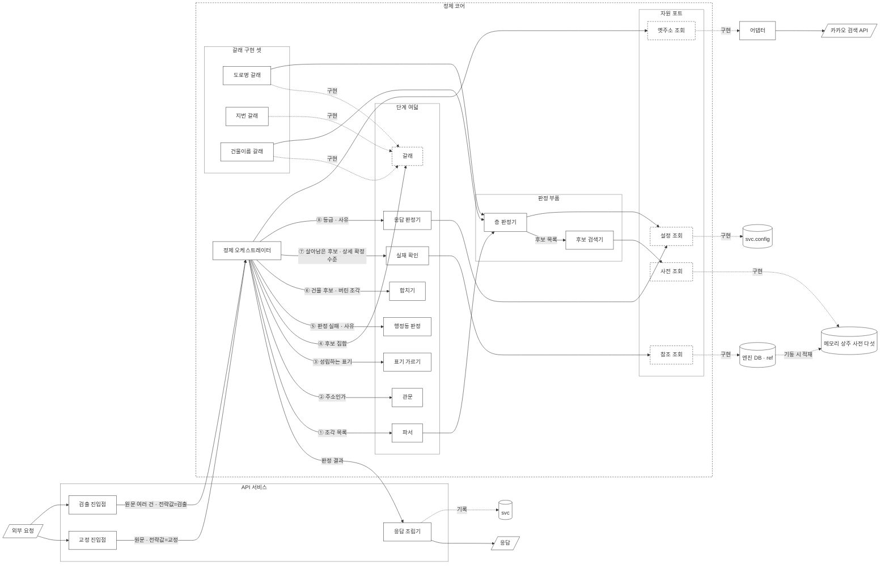

# 설계3 — 처리 흐름

**답하는 질문: 들어온 주소를 어떤 차례로 처리하는가**

상태: **흐름 전체 확정 · 단계별 역할 아홉 서술 완료 · 컴포넌트 UML 완료 · 인터페이스 정의서 완료 · 색인 기반 끊기 확정 · 옛 주소 대응 체계 확정**

---

## 0. 전체 흐름

```
교정 API ─┐                                  ┌→ 도로명 갈래 ──┐
          ├→ ① 파싱 ─→ 관문 ─→ 표기 가르기 ─┼→ 지번 갈래 ────┼→ ② 합치기
검출 API ─┘  (자르기·재기) (주소인가)         ├→ 건물이름 갈래 ┘      │
                    │                        └→ 행정동 ──┐          ↓
                 주소 아님                                │   ③ 실재 확인 (DB)
                    │                                     ↓          │
                  ④ 응답 ←────────────────────────────────────────────┘
```

**교정과 검출은 API를 따로 둔다.** 하나의 API로 받아 흐름 안에서 어느 쪽인지 판별하면 그 판별 기준을 또 세워야 한다. 진입점을 나누면 어느 API로 들어왔는지가 곧 전략값이 되고, 흐름 안에서 다시 묻지 않는다.

**전략값을 보는 자리는 셋이다.** 후보 찾기(접두사 비교를 켤지), 층 판정(허용 오타 횟수), 응답(후보를 내밀지 사유를 낼지). 나머지 자리는 전략과 무관하게 같은 일을 한다.

**갈래 셋은 같은 인터페이스의 구현이다.** 도로명 갈래·지번 갈래·건물이름 갈래가 받는 값과 돌려주는 값이 같고 안이 다르다. 어느 쪽으로 들어와도 마지막에는 건물 한 채를 가리키므로 ② 합치기부터는 하나로 흐른다. 원천 자료가 그렇게 생겨 있다. 건물정보 파일 한 줄에 도로명 값과 대표지번과 건물 이름 세 칸이 나란히 있다.

**행정동은 갈래가 아니다.** 대응표가 없어 못 찾는 것이 이미 정해져 있으므로, 사전에 걸리는 순간 ④ 응답으로 바로 간다. 실재 확인을 거치지 않는다.

### 단계별 서술 진행 상태

| 단계 | 상태 |
|---|---|
| ① 파싱 | 완료 |
| 관문 — 주소인가 | 완료 |
| 표기 가르기 | 완료 |
| 도로명 갈래 | 완료 |
| 지번 갈래 | 완료 |
| 건물이름 갈래 | 완료 |
| 행정동 | 완료 |
| ② 합치기 | 완료 |
| ③ 실재 확인 | 완료. 확인 쿼리 형태만 물리 데이터 모델로 넘긴다 |
| ④ 응답 | 완료 |

**서술 틀을 고정한다.** 각 단계를 다섯 항목으로 쓴다. 받는 값 / 하는 일 / 돌려주는 값 / 하지 않는 일 / 다음 단계가 쓰는 것. 마지막 항목이 단계를 잇는 자리다. 앞 단계가 무엇을 돌려줘야 하는지는 뒤 단계가 무엇을 필요로 하는지에서 나온다.

### 모듈 이름

**같은 대상을 같은 이름으로 부른다.** 단계 이름과 모듈 이름을 아래로 통일한다.

| 모듈 | 무엇 | 어느 단계 |
|---|---|---|
| 파서 | 원문을 조각으로 자른다 | ① 파싱 |
| 관문 | 주소로 볼 만한 입력인지 가른다 | 관문 |
| 표기 가르기 | 성립하는 표기를 전부 표시한다 | 표기 가르기 |
| 갈래 셋 | 도로명 · 지번 · 건물이름 | 갈래 |
| 행정동 판정 | 사유를 만든다 | 행정동 |
| 합치기 | 갈래 결과를 건물 단위로 합친다 | ② 합치기 |
| 실재 확인 | DB에 있는 것만 남긴다 | ③ 실재 확인 |
| 응답 판정기 | 등급과 사유를 정한다 | ④ 응답 |
| **정제 오케스트레이터** | 단계를 부르는 차례를 든다 | 흐름 전체 |
| **정제 컨텍스트** | 단계가 값을 읽고 적는 그릇 | 흐름 전체 |
| 응답 조립기 | 전략별 반환 모양을 만든다 | API 서비스 |
| 층 판정기 · 후보 검색기 | 판정 부품 둘 | 파싱 · 계층 조회 |

---

## 0-1. 단계별 역할과 책임

### ① 파싱

*받는 값* — 주소 문자열 한 덩어리, 우편번호, 들어온 경로, 전략값(교정인지 검출인지)

*하는 일* — 「서울특별시 강남구 테헤란로 152」처럼 한 줄로 들어온 글자를 의미 단위로 나눈다. 나누는 신호는 단위를 나타내는 끝 글자다. `시`·`구`·`읍`·`로`·`길` 같은 것이고, 이 문서에서는 **표지**라고 부른다. `강남구`의 `구`를 보고 거기서 끊는다.

끊은 덩어리 하나를 **조각**이라 부른다. 조각이 실제로 있는 이름인지 사전에서 찾는다. 사전은 이름 목록을 메모리에 올려 둔 것이다. 없으면 다른 자리에서 끊어 다시 찾는다. `구로구디지털로`를 `구로`+`구`로 끊으면 「구로」가 사전에 없으므로, `구로구`+`디지털로`로 다시 끊는다.

**표지가 없어 어디에서도 안 걸린 조각은 색인 기반 끊기가 받는다.** 그것도 실패하면 자모 거리를 잰다.

**자모 거리를 재는 자리가 여기다.** 정확히 맞는 이름이 없으면 그 자리에서 자모 거리를 재어 닮은 것이 있는지 본다. 재는 범위는 전국 사전 전체다. 상위가 아직 안 정해져 있어 좁힐 수가 없다.

*돌려주는 값* — 조각 목록. 조각마다 세 가지를 붙인다. 어느 층에 걸렸는지, 사전에서 찾았는지, 정확히 맞았는지 닮은 것만 있었는지. 어느 층에도 안 걸린 조각도 남긴다.

*하지 않는 일* — 옳고 그름을 정하지 않는다. **좁힌 범위에서 후보 목록을 만드는 일도 하지 않는다.** 그것은 계층 조회가 한다.

*다음 단계가 쓰는 것* — 관문이 「사전에서 찾은 조각이 하나라도 있는가」로 주소인지 아닌지를 가른다. 조각마다 찾았는지가 붙어 있어야 그 판단이 선다. 못 찾은 조각을 남기는 것은 「강남구는 찾았고 이 부분은 못 찾았다」를 응답에 담으려는 것이다.

세부 규칙은 아래 2절 ① 파싱에 있다.

### 관문 — 주소인가

*받는 값* — 조각 목록, 전략값

*하는 일* — 조각 목록을 훑어 사전에서 찾은 것이 하나라도 있는지 본다. 하나도 없으면 주소가 아니다. 「ㅁㄴㅇㄹ」이나 「추후연락」처럼 주소와 무관한 글자가 여기서 걸린다.

찾은 것이 있으면 주소로 보고 다음 단계로 보낸다. 옳은 주소인지를 묻지 않는다. 틀린 곳이 있어도 고칠 대상이 되는 입력인지만 가른다.

**뒤지는 사전이 넷이다.** 도로명·법정동·건물이름·행정동이다. 그래서 `롯데월드타워`처럼 건물 이름만 들어온 입력도 주소로 인정된다.

**닮은 것만 있어도 「찾았다」에 든다.** `서울틀별시 강남규 테헤란루 152`는 조각마다 자모 거리 안에 드는 이름이 있으므로 관문을 지난다. **전체 글자 수 대비 오탈자 비율은 보지 않는다.** 조각 단위 결과를 셀 뿐이다.

*돌려주는 값* — 주소인지 아닌지 둘 중 하나. 주소가 아니면 흐름이 여기서 끝나고 응답으로 간다.

*하지 않는 일* — 표지가 있는지 보고 판단하지 않는다. 「출근길」에는 도로명 표지 `길`이 있지만 사전에 없는 이름이라 주소가 아니다. 반대로 「경기」는 표지가 없어도 사전의 「경기도」와 견줄 수 있다. 표지는 끊을 자리를 알려 주는 신호일 뿐이고, 주소인지를 정하는 것은 사전이다.

*왜 파싱 뒤에 두는가* — 사전에서 찾으려면 먼저 끊어야 한다. 흐름의 맨 앞에 두면 아직 나누지 않은 글자를 놓고 판단하게 되고, 그때 볼 수 있는 것은 표지가 있는지뿐이다.

*왜 관문을 엄격하게 만들지 않는가* — 관문과 갈래는 세는 방식이 반대다. 관문은 조각이 하나라도 걸리면 통과이고, 갈래와 조회는 조각이 전부 맞고 조합이 실재해야 성공이다. 관문을 엄격하게 만들면 오타가 섞인 입력을 「주소 아님」으로 돌려보내 고칠 기회 자체가 사라진다.

*남는 경계* — 모든 조각이 허용 오타를 넘으면 「주소 아님」으로 나간다. `서울특벼시 강남그 테헤란`처럼 사람 눈에는 주소인데 어느 조각도 안 걸리는 경우다. 검출 전략의 허용 2가 폭을 넓히지만 완전히 없애지는 못한다.

*다음 단계가 쓰는 것* — 표기 가르기가 넷 중 어느 방식인지를 정한다. 주소가 아닌 입력을 여기서 걸러내므로 그 아래로는 주소로 볼 만한 것만 내려간다.

### 표기 가르기 — 넷 중 무엇인가

*받는 값* — 조각 목록, 전략값

*하는 일* — 대한민국 주소를 적는 방식은 넷이다.

| 표기방식 | 예 | 이 방식이 나오는 이유 |
|---|---|---|
| 도로명 | `테헤란로 152` | 도로 이름과 건물번호로 적는다 |
| 지번 | `역삼동 737` | 동·리 이름과 지번으로 적는다 |
| 건물이름 | `롯데월드타워` | 건물 이름으로만 적는다 |
| 행정동 | `상계1동 ○○로 12` | 법정동 자리에 행정동을 적는다 |

**앞 둘은 주소 체계이고 뒤 둘은 그렇지 않다.** 그래서 단계 이름이 「체계 가르기」가 아니라 「표기 가르기」다. 어느 쪽으로 들어왔는지 정해야 그다음에 무엇을 찾을지가 정해진다.

앞 세 자리(시·도, 시·군·구, 읍·면)는 방식이 달라도 같다. 어느 쪽으로 적어도 그대로 온다. 갈리는 것은 그 아래다.

*돌려주는 값* — 성립하는 방식 전부. 하나일 수도 있고 여럿일 수도 있다.

*가르는 순서* — 미리 정하지 않고 사전에 걸린 대로 갈래를 연다.

```
조각을 사전 넷에서 찾는다
 → 걸린 사전마다 그 갈래를 연다
 → 아무 데도 안 걸리면 관문에서 이미 걸러졌다
```

**미리 정하는 규칙을 세우지 않는다.** 「이럴 땐 지번으로 본다」를 찾기 전에 두면, 실제로는 도로명 하나뿐인 입력도 지번으로 보낸다. 어느 갈래가 살아남는지는 갈래를 다 돌린 뒤 ② 합치기가 정한다.

**한 조각이 사전 두 곳에 걸리는 경우가 있다.** 도로명과 법정동이 겹치는 이름은 전국에 `남성로`·`세종로` 둘이다. 「종로구 세종로 1」이 들어오면 도로명 표지가 잡히지만 법정동이다. 이때도 갈래 둘을 다 열고 결과로 가른다.

**조각이 여럿이고 각각 다른 사전에 걸리는 경우도 같다.** `노량진동 151-28 노량진로 171-2`는 지번 갈래와 도로명 갈래를 다 연다.

**법정동 사전이 행정동 사전을 이긴다.** 찾을 수 있는 길이 있으면 그 길로 간다. 행정동 판정은 법정동 사전에 없을 때만 붙는다.

*하지 않는 일* — 넷 중 하나를 고르라고 사용자에게 되묻지 않는다. 입력만 보고 정한다.

*다음 단계가 쓰는 것* — 갈래마다 끊는 규칙과 찾는 대상이 다르다. 도로명 쪽은 도로명 사전에서 찾고 건물번호를 붙여 조회하고, 지번 쪽은 동·리 이름을 찾고 본번·부번을 붙이며, 건물이름 쪽은 이름 세 칸을 훑는다.

### 도로명 갈래

*받는 값* — 조각 목록, 전략값

*하는 일* — 도로명 이름으로 도로명코드를 찾고 건물번호를 붙여 주소 한 자리를 정한다. 상위 행정구역이 입력에 있으면 계층 조회로 내려오고, 없으면 도로명과 건물번호로 시·군·구를 역조회해 출발점을 만든다.

*돌려주는 값* — 주소자리 후보 집합. 도로명주소관리번호 목록이다. 층마다의 결과 두 칸도 함께 낸다.

*하지 않는 일* — 건물을 하나로 정하지 않는다. 한 자리에 건물이 여럿 서 있다. 4칸 묶음 6,422,298개 가운데 건물이 한 채뿐인 것이 66.1%이고 최대는 1,732채다.

*다음 단계가 쓰는 것* — ② 합치기가 집합으로 받는다.

세부 규칙은 4-2절 계층 조회와 4-2-1절 상위 생략 입력에 있다.

### 지번 갈래

*받는 값* — 조각 목록, 전략값

*하는 일* — 동·리 이름 뒤 첫 숫자 덩어리를 지번으로 읽는다. 숫자 덩어리 앞에 홑글자 `산`이 붙으면 산여부가 `1`이고, 하이픈과 「의」는 같은 구분자로 보아 왼쪽이 본번, 오른쪽이 부번이다. 근거는 도로명주소법 시행령 제56조다.

**대표지번과 관련지번을 동시에 찾는다.** 어느 쪽을 먼저 볼지 정하지 않는다.

| | 어디에 있나 | 무엇에 붙나 |
|---|---|---|
| 대표지번 | 건물정보 파일 한 줄 안 | 건물 한 채 |
| 관련지번 | 별도 파일 | 주소 한 자리 |

**[전량 · 전국] 두 집합이 거의 겹치지 않는다.** 지번 자연키 유일값 7,597,936개 가운데 대표지번이 6,169,477개(81.2%)이고, 관련지번에만 있는 것이 1,428,459개(18.8%)다. 관련지번 유일값 1,613,524개 중 88.5%가 대표지번 집합에 없다.

**겹치는 185,065건이 순서를 두면 안 되는 이유다.** 같은 지번이 어느 건물의 대표지번이면서 다른 주소 자리의 관련지번이기도 하다. 한쪽을 먼저 보고 결과가 나왔다고 끝내면 나머지를 조회조차 하지 않는다.

```
노량진동 151-28 (땅 하나)
 ├ 노량진로 171-2    ← 대표지번 쪽
 ├ 노량진로 171-6    ┐
 ├ 노량진로 171-8    │ 관련지번 쪽
 ├ 노량진로 171-10   │
 └ 노량진로 171-12   ┘
```

*돌려주는 값* — 주소자리 후보 집합. 대표지번 쪽에서 나온 건물은 그 건물이 선 주소자리로 올려 맞춘다.

*하지 않는 일* — 지번만으로 자리를 하나로 정하지 않는다. 땅 하나에 주소가 여럿 얹히므로 구조적으로 좁혀지지 않는다.

*다음 단계가 쓰는 것* — ② 합치기가 집합으로 받는다.

### 건물이름 갈래

*받는 값* — 조각 목록, 전략값, 앞단에 행정구역이 있으면 그 범위

*하는 일* — 건물 이름 세 칸 전부와 비교한다. 칸 사이는 OR이고 조각 사이는 AND다.

```
입력   강일리버파크 308동
조각1  강일리버파크   →  세 칸 중 어디에 걸리든 인정한다
조각2  308동         →  세 칸 중 어디에 걸리든 인정한다
       두 조각을 다 가진 건물이 답이다
```

*돌려주는 값* — 건물 후보 집합. 이 갈래만 주소자리가 아니라 건물을 직접 낸다.

*하지 않는 일* — 이름 칸 둘을 짝으로 못박지 않는다. 건물 종류를 적어 둔 이름을 사전에서 걸러내지도 않는다.

*다음 단계가 쓰는 것* — ② 합치기가 집합으로 받는다.

세부 규칙과 실측값은 2절 ② 조회의 「건물 이름을 어떻게 맞추는가」에 있다.

### 행정동 — 찾지 않고 사유를 낸다

*받는 값* — 조각 목록, 행정동 사전에 걸린 조각

*하는 일* — 행정동으로 쓰였다는 사실을 기록하고 사유를 만든다. **찾지 않는다.** 행정동 ↔ 법정동 대응표가 원천에 없기 때문이다.

**이름 목록은 있고 대응표만 없다.** 건물정보 19번 칸에 행정동명이 온다. 전국 3,281개, 서울 427개다. 그래서 「이 조각은 행정동이다」는 알고 「그 행정동이 어느 법정동인가」는 모른다.

**A3(행정동·법정동 혼용)를 실제로 잡는 범위가 정해져 있다.** 행정동 이름 가운데 법정동 이름에 없는 것이 서울 338개, 전국 1,379개다. 나머지는 법정동 사전에 걸려 그쪽으로 처리되고, 사용자가 행정동으로 썼는지조차 알 필요가 없다.

*돌려주는 값* — 판정은 실패, 사유 종류는 참조없음, 사유코드는 `ADMIN_DONG_USED`, 사유는 「행정동 표기로 보임. 법정동 이름으로 다시 입력하거나 도로명을 확인해 주세요」다.

*하지 않는 일* — 실재 확인을 거치지 않는다. 확인할 대상이 없다.

*다음 단계가 쓰는 것* — ④ 응답이 사유를 그대로 내보낸다.

### ② 합치기 — 갈래 결과를 하나로 만든다

*받는 값* — 갈래마다의 후보 집합

*하는 일* — 집합을 건물 단위로 맞춘 뒤 합친다.

```
갈래마다 따로 돌려 후보를 낸다
후보를 건물 단위로 펼친다
교집합이 비어 있지 않으면 교집합, 비어 있으면 합집합
```

**건물 단위로 맞추는 이유는 판정 기준이 건물관리번호이기 때문이다.** 도로명 갈래와 지번 갈래는 주소자리를 내고 건물이름 갈래는 건물을 낸다. 층위가 다른 채로는 겹치는지 볼 수 없다.

**합치는 규칙에만 근거가 필요하다.** 두 갈래가 같은 자리를 가리키면 서로를 확증하므로 좁힌다. 다른 자리를 가리키면 어느 쪽이 틀렸는지 알 수 없으므로 둘 다 내밀고 고르는 일을 사용자에게 넘긴다.

```
입력  노량진동 151-28 노량진로 171-2
지번 갈래    171-2 · 171-6 · 171-8 · 171-10 · 171-12
도로명 갈래  171-2
교집합       171-2  →  하나로 좁혀진다
```

```
입력  노량진동 151-28 노량진로 171-4
지번 갈래    171-2 · 171-6 · 171-8 · 171-10 · 171-12
도로명 갈래  171-4        (이 자리의 지번은 노량진동 14-43이다)
교집합 없음  →  합집합 여섯을 내민다
```

```
입력  노량진동 999-99 노량진로 171-2
지번 갈래    없음
도로명 갈래  171-2
합집합       171-2  →  하나로 좁혀지고, 버린 조각으로 지번이 남는다
```

*돌려주는 값* — 건물 후보 집합, 그리고 **버린 조각 목록**. 어느 갈래가 결과를 못 냈는지가 여기 담긴다.

*하지 않는 일* — 갈래에 우선순위를 두지 않는다. 어느 갈래를 먼저 따라갈지 정하면 나머지 갈래를 조회조차 하지 않게 된다.

*다음 단계가 쓰는 것* — ③ 실재 확인이 후보를 받아 걸러내고, ④ 응답이 버린 조각으로 사유를 만든다.

### ③ 실재 확인

*받는 값* — 합친 건물 후보 집합, 상세주소 조각, 전략값

*하는 일* — 후보가 DB에 실제로 있는지 확인하고 없는 것을 지운다. 사전은 이름만 들고 있으므로 실재 판정은 여기서만 한다.

상세주소 조각이 있으면 상세주소찾기 테이블에서 동·층·호로 좁힌다. **주소 한 자리에 딸린 건물을 모두 놓고 상세주소를 모은 뒤 좁힌다.** 동이 건물 쪽에 있는 경우와 상세위치 쪽에 있는 경우가 76 대 21로 갈리므로, 입력한 동을 건물 고르는 조건으로만 쓰면 21%에서 실패한다.

**후보가 전부 지워지면 자리 대응 사전을 본다.** 옛 주소자리가 새 주소자리로 이어지면 그 자리로 다시 확인한다. 8절에 있다.

*돌려주는 값* — 살아남은 건물 후보, 상세 확정 수준(건물·층·호)

*하지 않는 일* — 닮은 정도로 순위를 매기지 않는다. 실재하는지만 본다.

*다음 단계가 쓰는 것* — ④ 응답이 남은 수로 등급을 정한다.

**이 단계가 이 설계의 유일한 안전장치다.** 건너뛰고 닮은 정도로 바로 답하면 없는 주소를 그럴듯하게 반환하게 되고, 교정 왕복 채점이 무너진다.

**[미착수] 확인 쿼리를 어떤 형태로 짤지는 물리 데이터 모델이 나온 뒤에 정한다.**

### ④ 응답

*받는 값* — 살아남은 건물 후보, 버린 조각 목록, 채운 값 목록, 상세 확정 수준, 전략값

*하는 일* — 등급을 정하고 사유를 붙인다. 둘을 한 칸에 뭉치지 않는다.

```
등급  =  남은 후보 수로 정한다        1이면 확실 · 2 이상이면 후보여럿 · 0이면 실패
사유  =  버린 조각이 있으면 붙인다    등급과 무관하다
확실 + 사유가 함께 서면 확인 권장으로 낸다
```

**나눠 두는 이유는 조건이 늘 때다.** 한 칸에 붙이면 조합마다 등급을 새로 만들게 되고, 나누면 사유 값 하나만 더하면 된다.

**등급과 사유를 정하는 일까지가 이 단계다.** 응답 판정기가 맡는다. 전략별 반환 모양을 만드는 일은 API 서비스의 응답 조립기가 맡는다. 두 자리를 가르는 근거는 소비자가 다르다는 것뿐이고, 판정 자체는 전략과 무관하게 같다.

**주소가 아닌 입력은 등급이 실패이고 사유 종류가 입력 오류다.** 사유코드는 `NOT_AN_ADDRESS`이고 사유는 「주소로 볼 수 있는 부분이 없습니다」이며 후보를 내지 않는다. 관문이 걸러낸 입력이 여기로 온다.

*돌려주는 값* — 교정 전략은 확정 주소 또는 고를 후보 목록, 검출 전략은 처리 결과 전체와 실패 목록이다. **두 반환값을 같은 모양으로 맞추지 않는다.**

*하지 않는 일* — 하나로 좁혀졌다고 해서 버린 조각을 감추지 않는다. 감추면 사용자는 자기가 쓴 것이 다 반영된 줄 안다. 채운 값도 감추지 않는다.

*다음 단계가 쓰는 것* — 없다. 흐름이 여기서 끝난다.

등급과 사유의 세부는 3절과 4절에 있다.

---

## 1. 런타임 다섯 단계

```
① 파싱                   → 조회 파라미터 생성
  갈래 (도로명·지번·건물이름) → 갈래마다 후보 집합
② 합치기                 → 건물 단위로 맞춰 합친다     ★판정 후보가 여기서 정해진다
③ 후보 실재 확인 (DB)     → 실재하는 것만 잔존         ★환각 차단
④ 응답                    → 3절
```

**파싱은 판정하지 않는다.** 입력을 잘라 조회 파라미터로 만드는 것이 역할이다.

---

## 2. 단계별 상세

### ① 파싱 — 어떻게 자를 것인가

#### 입력 계약

| 키 | 내용 |
|---|---|
| 주소 문자열 | 기본과 상세를 나누지 않은 한 덩어리 |
| 우편번호 | 별도 키 |
| 들어온 경로 | TMS 내부 · 외부사 팝업 · 엑셀 배치 |

외부사 팝업은 기본과 상세를 나눠서 주지만 이어붙여 한 키로 받는다.
팝업이 그은 경계를 그대로 믿으면 상세 칸에 기본주소가 들어온 입력(B07)을 못 잡는다.

#### 처리 순서

```
원문
 → 층 1  문자 손질     앞뒤 공백 제거 · 사이 공백 하나로 · 전각을 반각으로
 → 토큰 나누기         공백이 아니라 표지 글자로 끊는다
 → 왼쪽부터 상태 전이
      표지가 안 맞으면 → 층 2  낱말 해석 시도
      해석해도 안 맞으면 → 색인 기반 끊기 (아래)
      그래도 안 걸리면 → 자모 거리 → 코드 부여 → 실패 흐름
```

층 1은 뜻을 바꾸지 않는 것만 한다. 층 2는 위치에 따라 뜻이 갈리는 것을 다룬다.
`삼동`은 읍면 자리에서 지명이고 상세 자리에서 3동이다. 미리 일괄로 바꾸면 지명이 망가진다.
층 2는 표지가 바로 안 맞을 때만 돌린다. 정상 입력은 안 거친다.

두 층 모두 바꾼 자리마다 원문 위치와 바꾸기 전 값을 남긴다.
성공한 건에도 「이렇게 고쳐 읽었습니다」로 돌려줄 수 있어야 한다.

**공백은 끊을 자리 후보이지 반드시 끊는 자리가 아니다.** 층 1이 간격을 공백 하나로 맞추지만 그 공백을 경계로 믿지 않는다. `서울특별 시강남구 테헤란로 152`처럼 공백이 이름 한가운데를 가르는 입력이 있다.

#### 상태 전이표

```
[시작]→[시도]→[시군구]→[행정구]→[읍면]→┬→[도로명]→[건물번호]→[참고항목]→[상세]→[끝]
                                          └→[법정동]→[지번]────────────────┘
                                                       (선택)     (선택)
```

| 현재 상태 | 다음에 올 수 있는 것 | 못 맞았을 때 코드 |
|---|---|---|
| 시작 | 시도 / 시군구 / 도로명 / 법정동 | `SIDO_NOT_FOUND` |
| 시도 | 시군구 / 도로명 / 법정동 | `SGG_NOT_FOUND` |
| 시군구 | 행정구 / 읍면 / 도로명 / 법정동 | `ROAD_TOKEN_NOT_FOUND` |
| 행정구 | 읍면 / 도로명 / 법정동 | `ROAD_TOKEN_NOT_FOUND` |
| 읍면 | 도로명 / 법정동 | `ROAD_TOKEN_NOT_FOUND` |
| 도로명 | 건물번호 | `BLDG_NO_NOT_FOUND` |
| 법정동 | 지번 | `JIBUN_NOT_FOUND` |
| 건물번호 | 참고항목 / 상세 / 법정동 / 끝 | — |
| 지번 | 참고항목 / 상세 / 도로명 / 끝 | — |
| 참고항목 | 상세 / 끝 | — |
| 상세 | 끝 | — |

건물번호와 지번 뒤로는 실패가 없다. 조회에 필요한 값이 그 자리에서 다 모인다.

**건물번호 뒤에 법정동이, 지번 뒤에 도로명이 올 수 있게 열어 뒀다.** `노량진동 151-28 노량진로 171-2`처럼 두 표기가 함께 들어오는 입력을 실패로 보내지 않는다. 어느 쪽이 자리를 정하는지는 ② 합치기가 결과로 가른다.

시작 상태에서 시·도를 건너뛴 입력도 받도록 전이표를 만들었다. 「광명시 시청로 50」을 실패로 보내지 않는다.
빠진 상위 자리는 4-2-1절에서 채운다.

#### 상태별 표지

| 상태 | 표지 |
|---|---|
| 시도 | `특별시` `광역시` `특별자치시` `도` `특별자치도`로 끝남 |
| 시군구 | `시` `군` `구`로 끝남 |
| 행정구 | `구`로 끝남 · 시 상태 뒤에서만 |
| 읍면 | `읍` `면`으로 끝남 |
| 법정동 | `동` `가` `리`로 끝남 |
| 도로명 | `대로` `로` `길`로 끝남 |
| 건물번호 | 도로명 바로 뒤 첫 숫자 덩어리 · `숫자` 또는 `숫자-숫자` |
| 지번 | 법정동 바로 뒤 첫 숫자 덩어리 · 앞에 홑글자 `산`이 올 수 있음 |
| 참고항목 | 괄호로 감싸짐 |
| 상세 | 건물번호 또는 지번 뒤 나머지 전부 |

**[전량 · 전국] 법정동·법정리 이름의 끝 글자는 다섯이다.** 법정읍면동 3,589개가 `동` 2,079 · `면` 1,006 · `가` 266 · `읍` 236 · `로` 2이고, 법정리 6,968개는 전량 `리`다. 표지 `동`·`가`·`리` 셋이 법정동 자리를 덮는다. 끝 글자가 `로`인 둘은 도로명 표지와 겹치므로 사전 조회로 갈린다.

건물번호의 하이픈은 본번-부번이므로 한 덩어리로 본다. 떼어내면 조회 키가 깨진다.
지번의 하이픈도 같다. 왼쪽이 본번, 오른쪽이 부번이다.
상세의 하이픈(`110-502`)과는 자리로 갈린다. 도로명이나 법정동 바로 뒤 첫 덩어리만 번호다.

#### 끊는 자리를 바꿔 다시 시도한다

끊기와 조회는 한 번에 끝나지 않는다. 끊은 조각이 사전에 없으면 다른 자리에서 끊어 다시 시도한다.

```
구로구디지털로 → 시도 ①  구로 + 구 + 디지털로   → 「구로」가 사전에 없음
               → 시도 ②  구로구 + 디지털로       → 사전에 있음
```

실패 조건은 「끊을 수 없다」가 아니라 「어떻게 끊어도 사전에 안 걸린다」다.
전이표의 코드는 모든 끊기 시도가 끝난 뒤에 붙는다.

**표지로 끊는 이 방식을 없애거나 고치지 않는다.** 정상 입력을 처리하는 확정된 로직이다. 표지가 없는 입력은 아래 색인 기반 끊기가 별도 경로로 받는다. 두 방식을 하나로 합칠지는 항목 58이 2단계에서 정한다.

---

### ①-2 색인 기반 끊기 — 표지가 없는 조각을 받는다

#### 진입 조건

**파서 안에서, 표지로 끊어 봤는데 사전에 안 걸린 조각이 남았을 때 부른다.** 관문이 판정한 뒤가 아니다.

```
서울강남테헤란로152

표지 `로`가 하나뿐이라 「서울강남테헤란로」 + 「152」로만 갈린다
「서울강남테헤란로」가 도로명 사전에 없다
→ 찾은 조각 0개
→ 관문에 그대로 넘기면 「주소로 볼 수 있는 부분이 없습니다」로 끝난다
```

관문의 판단 재료를 파서가 만든다. 파서가 덜 만든 재료로 관문이 판단하면 안 된다.

**「전부 실패」가 아니라 「안 걸린 조각이 하나라도 있으면」이 조건이다.**

```
서울특별시 강남 테헤란로 152

서울특별시  →  표지 `시`로 끊고 사전에 있다
강남        →  표지가 없어 어디에도 안 걸린다     ← 이 조각 하나 때문에 부른다
테헤란로    →  표지 `로`로 끊고 사전에 있다
152         →  건물번호
```

전부 실패로 조건을 잡으면 이 입력은 답을 내되 「강남」을 버린 조각으로 흘려보낸다. 안 걸린 조각 하나만 있어도 부르면 그 자리에서 복원된다.

**덩어리 전체가 안 걸린 경우와 조각 하나가 안 걸린 경우가 같은 일이다.** 안 걸린 글자를 놓고 사전에서 시작 이름을 찾는 것이고 길이만 다르다. 경우를 둘로 나누지 않는다.

#### 색인이 담는 것

**표지를 뗀 형태를 열쇠로 삼는다.** 원본 사전은 그대로 두고 색인을 한 벌 더 만든다.

| 열쇠 | 층 | 원래 이름 |
|---|---|---|
| 강남 | 시군구 | 강남구 |
| 강남 | 읍면동 | 강남동 |
| 강남 | 리 | 강남리 |
| 강남 | 도로명 | 강남로 |
| 강남 | 도로명 | 강남대로 |
| 강남 | 도로명 | 강남길 |

**층을 값으로 든다.** 상태를 아는 자리에서는 층으로 걸러 한 줄만 쓰고, 상태가 없는 덩어리에서는 다 꺼내 조합으로 거른다. 자료 구조 하나가 두 경우를 다 받는다.

**원본 사전을 갈아 끼우지 않는다.** 표지로 끊는 기존 경로는 원본 사전을 그대로 친다. 도로명 이름으로 시·군·구를 거꾸로 찾는 역조회 색인과 같은 구조다.

#### 규칙 다섯

**하나 — 색인 열쇠는 표지를 뗀 뒤 공백까지 지워 만든다.**

표지 목록은 층마다 두고 **긴 것부터 뗀다.** `대로`를 `로`보다, `특별자치도`를 `도`보다 먼저 본다. 한 이름이 여러 표지로 갈리면 갈린 것을 다 올리고, 뗀 나머지가 비면 안 올린다.

공백을 지우는 이유는 일반구다. 원천이 「부천시 소사구」를 한 칸에 공백을 품고 준다. 전국 39개 일반구가 여기 걸린다.

```
원천 값    부천시 소사구
열쇠       부천시소사
입력       경기부천시소사양지로184번길7   →  맞는다
```

**둘 — 왼쪽부터 길이를 늘려 가며 묻고, 표지까지 먹는 가지와 안 먹는 가지를 둘 다 연다.**

```
광명시청로50
   광명시 | 청로   | 50
   광명   | 시청로 | 50      ← 정답
   광명   | 시청   | 로50
```

가장 긴 것만 고르면 「광명시」가 표지 `시`를 먹어 「시청로」를 잃는다. 그 `시`는 「시청로」의 첫 글자다.

**셋 — 숫자를 만난 자리에서도 색인을 먼저 친다.**

`3공단로`·`4.19로1길`처럼 숫자로 시작하는 도로명이 실재한다. 숫자 덩어리로 먼저 먹으면 아예 못 본다.

**넷 — 한 글자 열쇠는 두 경우에만 쓴다.**

| 쓰는 경우 | 예 |
|---|---|
| 시군구 층 이름일 때 | 남구 · 동구 · 북구 · 서구 · 중구 다섯뿐이다 |
| 표지가 입력에 남아 있을 때 | 「종로」는 `로`가 입력에 있으므로 인정한다 |

「서우르」의 「서」는 「서구」·「서면」의 표지가 입력에 없으므로 버린다. 한 글자 열쇠를 만드는 이름은 읍면동 115개, 리 137개, 도로명 70개다.

**다섯 — 완전 가지가 있으면 미완 가지를 버린다.**

끝까지 다 걸린 가지가 하나라도 있으면 도중에 막힌 가지를 버린다. 완전 가지가 하나도 없으면 통째로 자모 거리 단계로 넘긴다.

#### 예시

```
경기화성시만세3.1만세로281번길29

자리 0   '경기' 걸림 · '경' 걸림
         '경'은 표지 근거가 없다  →  버린다                    규칙 4
자리 2   '화성시만세' 걸림 (열쇠에서 공백을 지웠다)             규칙 1
         '화성'도 살린다                                       규칙 2
자리 7   숫자로 시작하지만 색인을 먼저 친다                     규칙 3
         '3.1만세로281번' · '3.1만세' 둘 다 걸린다             규칙 2
자리 18  '29'

완전 가지 1개 · 미완 가지 6개                                  규칙 5
경기 → 경기도  |  화성시만세 → 화성시 만세구  |  3.1만세로281번길  |  29
```

**끊기가 정하는 것은 조각과 조각마다의 이름 후보까지다.** 「경기」에 경기도와 경기대로가 함께 붙어 있고, 어느 쪽인지는 층 조합을 확인하는 다음 단계가 가른다.

#### 실측

**[전량 · 전국] 색인 규모**

| 층 | 이름 수 | 표지가 안 붙은 이름 |
|---|---|---|
| 시도 | 16 | 0 |
| 시군구 | 238 | 0 |
| 읍면동 | 3,969 | 3 |
| 리 | 7,003 | 6 |
| 도로명 | 143,565 | 319 |

열쇠 142,576개이고 최대 길이는 20자다. 표지 규칙이 못 덮는 328개는 원형 그대로 올린다.

**층 안에서는 열쇠가 유일하다.** 시군구 238개가 열쇠 238개이고, 리 6,997개 열쇠 중 리끼리 겹치는 것이 0이다. 겹침은 전부 층 사이에서 난다. 시군구 열쇠의 75.6%가 다른 층 이름과 열쇠를 나눠 갖는다.

**[표본] 시도 다섯에서 정답 가지 생존율과 가지 수**

각 시도 실주소 1,500건에서 시·도와 시·군·구의 표지를 지우고 공백을 없애 넣었다.

| 시도 | 정답 가지 생존 | 가지 중앙값 | 99퍼센타일 | 최대 |
|---|---|---|---|---|
| 서울 | 100.0% | 1 | 10 | 17 |
| 경기 | 100.0% | 1 | 4 | 6 |
| 경북 | 100.0% | 2 | 11 | 31 |
| 대구 | 100.0% | 1 | 6 | 15 |
| 제주 | 100.0% | 1 | 5 | 5 |

**한 글자 열쇠 규칙이 가지 수를 가른다.**

| 한 글자 열쇠 | 생존 | 가지 중앙값 | 최대 |
|---|---|---|---|
| 전부 뺀다 | 95.9% | 1 | 7 |
| 전부 쓴다 | 99.9% | 8 | 96 |
| **가려 쓴다** | **100.0%** | **1** | **17** |

**정답 주소를 망가뜨려 만든 시험값이다.** 이 방식이 얼마나 정확한지를 재지 얼마나 자주 쓰이는지를 재지 않는다.

---

#### 사전 넷의 규모

| 사전 | 전국 | 서울 |
|---|---|---|
| 도로명 | 371,958 | 14,583 |
| 법정동·법정리 | 10,557 | 466 |
| 건물이름 (세 칸 합집합) | 588,665 | 111,664 |
| 행정동 | 3,281 | 427 |
| **합** | **약 97만** | **약 12.7만** |

이름 단위로 만든 값이다. 건물마다 한 줄을 만들면 4천만 줄이 되지만, 사전은 이름만 들고 실재 판정은 DB가 하므로 그럴 필요가 없다.

**[확인 필요: 건물이름 사전의 자리]** — 관문이 뒤지는 사전은 넷인데 `04-source-data.md` 7절의 캐시 층에는 건물이름이 없다. 두 문서가 어긋난다.

#### 앞 세 자리 조합 여덟

| 번호 | 시·도 | 시·군·구 | 행정구·읍·면 | 예시 |
|---|---|---|---|---|
| 1 | 특별시·광역시 | 자치구 | — | 서울특별시 강남구 |
| 2 | 특별시·광역시 | 군 | 읍·면 | 부산광역시 기장군 정관읍 |
| 3 | 도·특별자치도 | 시 | — | 경기도 과천시 |
| 4 | 도·특별자치도 | 시 | 읍·면 | 경기도 여주시 가남읍 |
| 5 | 도·특별자치도 | 시 | 행정구 | 경기도 성남시 분당구 |
| 6 | 도·특별자치도 | 시 | 행정구 + 읍·면 | 경기도 용인시 처인구 포곡읍 |
| 7 | 도·특별자치도 | 군 | 읍·면 | 경기도 양평군 양평읍 |
| 8 | 특별자치시 | — | 읍·면 또는 없음 | 세종특별자치시 조치원읍 |

근거는 지방자치법 제3조와 도로명주소법 시행령 제6조다.

6번만 자리가 넷이다. 행정구 다음에 읍·면이 올 수 있게 전이표를 연 이유가 여기 있다.
1번과 5번은 둘 다 `구`로 끝나지만 앞에 오는 것으로 갈린다.
특별시·광역시 뒤면 자치구, 시 뒤면 행정구다.

**전남광주통합특별시가 이 표에 든다.** 2026년 7월 자료의 시도 열여섯에 「전남광주통합특별시」가 있고 「광주광역시」·「전라남도」는 없다. 세 번째 줄 아래 「특별시 + 시·군 + 읍·면」 조합이므로 새 줄을 만들지 않는다.

#### 상세주소 안쪽 하이픈

**왼쪽이 동번호, 오른쪽이 호수다.** 근거는 도로명주소법 시행규칙 제21조④다. 층수를 생략하면
`동`·`호` 표기를 빼고 동번호와 호수를 하이픈으로 잇는다. 하이픈은 읽지 않고 `동`과 `호`가
표기된 것으로 본다.

건물번호 하이픈과는 자리로 갈린다.

| 자리 | 형태 | 뜻 |
|---|---|---|
| 도로명 또는 법정동 바로 뒤 첫 덩어리 | `15-3` | 건물 본번-부번 또는 지번 본번-부번 |
| 그 뒤 | `101-502` | 동번호-호수 |

**호수 앞자리가 층을 겸할 수 있다.** 시행규칙 제25조①2호가 층수를 생략할 때 층수를 나타내는
숫자로 호수가 시작하도록 정한다. `502`는 5층 2호다.

층·호를 생략할 수 있는 조건 넷은 `04-source-data.md` 「건물 유형 판별 근거」에 있다.

#### 하이픈을 기준으로 삼지 않는다

**하이픈은 법이 정한 표기가 아니다.** 도로명주소법 시행령 제3조④는 상세주소를 동·층·호 순서로
적으라 하고, 같은 조 ⑤는 건물번호와 상세주소 사이에 쉼표를 넣으라고만 정한다. 하이픈을 규정한
조문이 없다. 사람들이 쓰는 표기 관행이지 규범이 아니다.

**그래서 하이픈을 해석 규칙의 출발점으로 삼지 않는다.** 대신 아래 순서로 처리한다.

```
상세주소 조각
 → 숫자가 아닌 글자로 끊어 숫자 덩어리를 뽑는다   (하이픈·공백·쉼표를 모두 같게 취급)
 → 오른쪽 덩어리부터 차례로
      주소 한 자리에 딸린 상세주소를 모아 놓고 맞춰 본다
 → 맞은 것만 남긴다                              ★판정은 코드가 한다
```

**대조 상대는 건물 한 채가 아니라 주소 한 자리다.** 동이 건물 쪽에 있는 경우와 상세위치 쪽에 있는 경우가 76 대 21로 갈리므로, 건물을 먼저 하나로 정하고 그 건물의 상세주소만 보면 21%에서 실패한다. 주소 한 자리에 딸린 건물을 모두 놓고 상세주소를 모은 뒤 동·층·호로 함께 좁힌다.

**오른쪽부터 맞추는 이유는 생략 방향 때문이다.** 가장 작은 단위인 호는 거의 안 빠지고, 동과 층은
생략 조건이 있어 빠질 수 있다. 반드시 있는 쪽에서 시작해야 한다.

**숫자 덩어리 개수가 알려주는 것은 가능한 조합의 수뿐이다.**

| 덩어리 수 | 가능한 해석 | 개수만으로 정해지나 |
|---|---|---|
| 셋 | 동-층-호 (시행령 제3조④가 순서를 고정한다) | **정해진다** |
| 둘 | 동-호 / 동-층 / 층-호 | 안 정해진다. 대조가 가른다 |
| 하나 | 호(층을 겸할 수 있음) / 동만 | 안 정해진다. 대조가 가른다 |

**여러 갈래가 동시에 맞으면 층 결과 두 칸으로 낸다.** 새 규칙을 만들지 않는다. 표는
`decisions.md` 「층 결과는 두 칸으로 낸다」에 있다.

**이 처리는 ① 파싱에서 끝나지 않고 ③ 실재 확인까지 이어진다.** 나눈 덩어리를 조회 파라미터로
만드는 것까지가 파싱이고, 어느 덩어리가 동이고 어느 것이 호인지 정하는 일은 대조 결과가 한다.

**표준 표기 순서와 실물이 어긋나는 지점이 있다.**

국가 표준은 이렇게 적으라고 한다.
```
시·도 + 시·군·구 + 읍·면 + 도로명 + 건물번호 + 상세주소(동/층/호) + (참고항목)
```

그런데 **아파트의 동은 표준상 「상세주소」 자리인데, 자료에서는 「참고항목(건물명)」에 있기도 하다.**
사용자가 표준대로 쓴 `77동`을 건물 이름 칸에서 찾아야 하는 경우가 생긴다.

### ② 조회 — 무엇을 키로 어떤 순서로

**들어온 표기 방식마다 찾는 길이 다르다.**

| 표기 방식 | 찾는 길 |
|---|---|
| 도로명 | 도로명코드 → 주소자리 → 건물 |
| 지번 | 지번 자연키 → **대표지번과 관련지번을 동시에** → 주소자리 → 건물 |
| 건물 이름 | **세 칸 전부와 비교** (건축물대장 / 상세 / 시군구용) |
| 행정동 | **대응표가 없어 못 찾는다.** 실패 + 사유로 처리 |

**주소자리를 가리키는 열쇠는 도로명주소관리번호 26자리다.** 4칸 묶음은 전국 10건에서 두 읍면동이 겹쳐 갈리지 않는다. 근거는 `06-source-schema.md` 「4칸 묶음은 유일하지 않다」에 있다. **찾을 때 쓰는 열쇠로는 4칸 묶음을 그대로 쓰고, 테이블끼리 서로를 가리키는 자리만 관리번호로 쓴다.**

#### 지번으로 찾을 때 두 곳을 함께 본다

**대표지번은 건물정보 줄 안에 있고 관련지번은 별도 파일에 있다.** 둘을 동시에 조회해 결과를 합친다. 근거와 실측값은 0-1절 지번 갈래에 있다.

대표지번 쪽에서 나온 것은 건물이므로 그 건물이 선 주소자리로 올려 맞춘 뒤 합친다. 관련지번 쪽은 처음부터 주소자리를 가리킨다.

#### 건물 이름을 어떻게 맞추는가

원천은 건물 한 채가 한 줄이고 이름 칸이 셋이다.

| 대장건물명 | 상세건물명 | 시군구용건물명 |
|---|---|---|
| 강일리버파크 | 308동 | 강일리버파크3단지아파트 |
| 강일리버파크 | 307동 | 강일리버파크3단지아파트 |
| (빈값) | (빈값) | 종로타워 |

**줄 단위로 맞춘다. 어느 칸인지 따지지 않는다.**

```
입력   강일리버파크 308동
조각1  강일리버파크
조각2  308동
       줄마다 묻는다 — 이 건물이 두 이름을 다 갖고 있나
1번 줄  둘 다 있음  →  ○
2번 줄  308동 없음  →  ×
```

| | 관계 |
|---|---|
| 칸 사이 | **OR.** 조각 하나가 세 칸 중 어디에 걸리든 인정한다 |
| 조각 사이 | **AND.** 조각이 둘이면 둘 다 만족하는 건물을 찾는다 |

**칸을 짝으로 못박지 않는다.** `강일리버파크3단지 308동`은 시군구용건물명과 상세건물명에 걸리므로, 대장건물명과 상세건물명을 짝으로 정하면 못 잡는다. **공동주택이 아니면 건축물대장건물명이 아예 오지 않는 것도 칸을 AND로 걸면 안 되는 이유다.**

**AND가 0을 만들 때는 조각별로 따로 찾은 결과를 남긴다.** 「단지는 찾았고 동을 못 찾았다」가 손에 남아야 고칠 방향이 나온다. 계층 조회에서 층을 따로 조회한 뒤 조합을 확인하는 것과 같은 이유다.

**앞단에 행정구역이 있으면 그 범위로 먼저 좁힌다.** 상위 생략 입력을 다루는 4-2-1절과 같은 구조다.

**후보 상한은 열 개다.** 검출 전략에서 이미 쓰는 값을 그대로 쓴다. 넘으면 사유코드 `BLDG_NAME_TOO_MANY`로 목록을 비우고 개수만 낸다.

**[전량 · 전국] 이름 하나가 가리키는 건물 수**

| | 이름 수 | 한 채뿐 | 열 채 이하 | 최대 |
|---|---|---|---|---|
| 건축물대장건물명 | 92,222 | 57.5% | 92.6% | 2,253 (`현대아파트`) |
| 시군구용건물명 | 418,618 | 61.1% | 95.3% | 5,508 (`주택`) |

**꼬리에 건물 종류를 적어 둔 값이 있다.** `주택`·`공장`·`창고`·`농막`·`제실` 같은 것이다. **사전에서 걸러내지 않는다.** 후보 상한을 넘으면 목록을 비우고 개수만 돌려주므로 「그 이름을 가진 건물이 5,508채입니다」가 나가고, 그것이 다음에 무엇을 할지 알려 주는 답이다. 사전에서 빼면 「주소가 아닙니다」로만 끝난다.

#### 문자 유사 비교 — 어떻게 재는가

**자모(한글 낱자. `강`을 `ㄱ`·`ㅏ`·`ㅇ`으로 푼 것)로 풀어 잰다.** 음절 단위로 재면 오타와 남의 이름이 갈리지 않는다.

| 쌍 | 구분 | 음절 거리 | 자모 거리 |
|---|---|---|---|
| 테헤란로 / 테해란로 | 오타 | 1 | 1 |
| 테헤란로 / 테헤란길 | 다른 길 | 1 | 3 |
| 경상남도 / 경상북도 | 다른 시도 | 1 | 3 |

`헤`와 `해`는 풀면 초성이 같고 모음만 다르다. `로`와 `길`은 풀어도 겹치는 것이 없다.
거리 계산은 다메라우-레벤슈타인(Damerau-Levenshtein)이다.

**숫자와 갈래 글자는 떼어 정확 일치를 요구한다.**
`사당로2길`과 `사당로20길`은 숫자가 달라 비교하지 않는다.
`다산로33가길`과 `다산로33나길`은 갈래 글자가 달라 비교하지 않는다.

**앞 두 자모를 고정한다.** 훑을 구간이 줄고 첫 글자가 통째로 다른 후보가 빠진다.

**표지 누락은 자모 거리로 못 잡는다.** 「강남」과 「강남구」의 자모 거리는 2이고 교정 허용 1 밖이다. 「강남동」과의 거리 3보다 가깝게 나오지만 그것은 `구`가 두 자모이고 `동`이 세 자모라서 생긴 차이지 강남이 구일 가능성이 높아서가 아니다. **표지 누락은 색인 기반 끊기가 정확 일치로 받는다.**

**재는 자리가 둘이고 목적이 다르다.**

| | 재는 범위 | 무엇을 얻나 |
|---|---|---|
| ① 파싱 | 전국 사전 전체 | 이 조각이 아는 이름인가. 관문이 셀 값 |
| 계층 조회 | 상위가 정해진 뒤 좁힌 범위 | 사용자에게 내밀 후보 목록 |

**두 번 재는 것이 낭비가 아니다.** 파싱 시점에는 상위가 안 정해져 있어 범위를 좁힐 수 없다. 파싱에서 잰 값으로 계층 조회를 대신하면 전국 도로명 37만 개를 상대로 만든 후보를 사용자에게 내밀게 된다.

#### 실측 — 서울 도로명 14,564개

조건은 위와 같다. 도로명마다 가장 가까운 다른 도로명까지의 자모 거리를 셌다.

| 최근접 자모 거리 | 도로명 수 | 비율 |
|---|---|---|
| 1 | 612 | 4% |
| 2 | 2,942 | 20% |
| 3 | 4,278 | 29% |
| 4 | 2,909 | 20% |
| 5 | 1,851 | 13% |
| 6 이상 | 1,495 | 10% |
| 닮은 상대 없음 | 477 | 3% |

허용 거리 안에 몇 개가 들어오는지는 따로 셌다.

| 허용 | 남의 이름이 섞이는 도로명 | 섞일 때 평균 | 최대 |
|---|---|---|---|
| 1 | 612개 (4%) | 1.12개 | 3개 |
| 2 | 3,554개 (24%) | 1.68개 | 13개 |

**섞이는 도로명은 많으나 섞여 들어오는 개수는 한두 개다.** 사용자에게 고르라고 물을 수 있는 크기다.

#### 허용 오타 횟수

**교정 1, 검출 2.** 설정값으로 두고 코드에 박지 않는다. 근거는 `decisions.md`에 있다.

허용 오타 횟수를 0으로 두면 닮은 이름(`SIMILAR`)이 하나도 안 나오므로, 실제로 쓸 수 있는 가장 작은 값은 1이다.

#### 층 결과

층마다 두 값을 낸다. 다섯 조합만 나온다. 표는 `decisions.md`에 있다.

### ③ 실재 확인 — 0-1절에 있음

### ④ 응답 — 3절에 있음

---

## 3. 응답 다섯 가지

| 응답 | 조건 | 사용자에게 하는 말 |
|---|---|---|
| **확실한 성공** | 후보가 하나이고 버린 조각이 없음 | (아무 말 없음) |
| **확인 권장** | 후보가 하나이나 그대로 받으면 안 되는 이유가 있음 | "이 중 맞는 것을 골라주세요" |
| **후보 여럿** | 실재 확인을 통과한 후보가 둘 이상 | "이 중에 있나요?" |
| **실패** | 잔존 후보 없음 | "여기가 잘못됐습니다" |
| **수정 제안** | 후보 없음 + 고칠 방향 있음 | "혹시 이것 아닌가요?" |

### 등급과 사유를 나눈다

```
등급  =  남은 후보 수로 정한다        1이면 확실 · 2 이상이면 후보여럿 · 0이면 실패
사유  =  버린 조각이 있으면 붙인다    등급과 무관하다
확실 + 사유가 함께 서면 확인 권장으로 낸다
```

**한 칸에 뭉치지 않는 이유는 조건이 늘 때다.** 뭉치면 조합마다 등급을 새로 만들게 되고, 나누면 사유 값 하나만 더하면 된다. 층 결과를 두 칸으로 내는 것과 같은 처리다.

### 확인 권장의 조건 — 세 가지가 들어온다

**「하나로 좁혀졌으나 그대로 받으면 안 되는 이유가 있다」가 조건이다.** 안쪽은 사유 종류가 가른다.

| 무슨 일이 있었나 | 사유 종류 |
|---|---|
| 지번↔도로명 일대다에서 첫 후보가 자동으로 채워졌다 | 정보 부족 |
| 사용자가 쓴 조각을 버리고 나머지로 좁혔다 | 입력 오류 |
| **옛 표기를 지금 표기로 갈아 끼웠다** | 입력 오류 |

같은 등급인데 책임 주체가 다르고 채점 방법도 다르다.

**버린 조각을 감추면 안 되는 이유가 있다.** `노량진동 999-99 노량진로 171-2`는 도로명만으로 하나로 좁혀지지만, 사용자가 도로명 쪽을 잘못 기억하고 지번 쪽이 맞을 수도 있다. 아무 말 없이 내보내면 사용자는 자기가 쓴 것이 다 반영된 줄 안다.

### 등급을 가르는 축

**축은 「검증했는가」가 아니라 「고칠 방향을 줄 수 있는가」다.**

검증할 사전이 없다는 것은 우리 사정이지 사용자의 잘못이 아니다. 형식이 맞으면 그대로 성공이다. 확인 딱지를 붙이지 않는다.

이유를 붙이는 조건은 고칠 방향이 있을 때다. 방향이 없으면 어느 부분이 실패인지만 지목하고 끝낸다.

| 입력 | 응답 |
|---|---|
| `202호` — 형식 맞음 | 확실한 성공. 아무 말 없음 |
| `2O1호` — 영문 O 섞임 | 수정 제안 |
| `abc호` — 형식 깨짐 | 실패. 「호 부분이 잘못됐습니다」만 |

### 확인 권장과 후보 여럿은 성질이 완전히 다르다

- **확인 권장** — 후보가 하나로 좁혀졌다. 그대로 받으면 안 되는 이유가 따로 있을 뿐이다
- **후보 여럿** — 좁혀지지 않았다. 고를 것이 둘 이상 남았다

### 판정 기준은 하나뿐이다

**건물관리번호가 하나로 좁혀지는가.** 사람도 언어모델도 개입하지 않는다.

**이 규칙은 특정 벤더 우회가 아니라 주소 체계에서 나오는 일반 규칙이다.**
지번만 들어온 주소는 원래부터 하나로 안 좁혀진다.
**아파트에서 동을 안 쓴 주소도 마찬가지다** — 한 도로명주소에 건물(동)이 여럿이므로 구조적으로 후보 여럿이 된다.

→ **아파트를 위한 별도 규칙이 필요 없다.** 지번만 들어왔을 때와 같은 자리에서 같은 이유로 나온다.

### 확인 권장의 근거 경계 — 흐리지 않는다

- **근거 있음** — 공식 가이드에 지번↔도로명 일대다 구간에서 컴포넌트가 임의의 첫 후보를 자동으로 채운다고 명시됨. 형식이 완전하고 실재하지만 **입력한 사람의 주소가 아닌 값**이 생성된다
- **근거 없음** — 그것이 실제 배송 오류로 이어졌다는 실무 관측

→ **확인 권장은 겪어서 만든 장치가 아니라 구조상 생길 수 있어 막아둔 장치다.**

### 남발하면 무의미해진다

경고가 늘 켜져 있으면 없는 것과 같다.

**평가 기준은 "등급을 만들었다"가 아니라 "확실한 주소에 괜히 경고가 붙는 일이 얼마나 드문가"다.**
확실한 케이스를 넣었는데 경고가 뜨면 그것이 오탐이다. 기대 정제 값(정답을 미리 붙여 둔 시험용 주소 묶음)으로 측정 가능하다.

---

## 4. 사유 세 가지

| 사유 종류 | 뜻 | 누가 고치는가 | 채점 방법 |
|---|---|---|---|
| 입력 오류 | 잘못 쓰셨습니다 | 사용자 | 사유대로 고쳐 다시 넣으면 성공하는가 |
| 정보 부족 | 정보가 모자랍니다 | 사용자 | 제시한 후보 안에 정답이 있고, 고르면 확실한 성공이 되는가 |
| 참조 데이터 없음 | 우리 쪽에 없습니다 | 우리 | 참조 데이터를 보정하면 성공하는가 |

**책임 주체가 다르고 채점 방식도 다르다.** 그래서 기대 정제 값 한 줄이 다섯 칸이 된다.

### 버린 조각은 코드 하나로 알린다

**사용자가 쓴 것 중 우리가 안 쓰고 버린 부분이 있으면 그 사실을 돌려준다.**

```
사유코드     PART_DISCARDED
버린조각     지번 · 참고항목 · 우편번호 · 행정동 …
```

| 입력 | 무엇으로 자리가 정해졌나 | 버린 조각 |
|---|---|---|
| `노량진동 999-99 노량진로 171-2` | 도로명과 건물번호 | 지번 |
| `판교역로 166 (백현동, 카카오 판교 아지트)` | 도로명과 건물번호 | 참고항목 |

**코드를 종류마다 만들지 않는다.** 버릴 수 있는 것이 여러 종류라 종류마다 코드를 만들면 목록이 계속 늘고, 받는 쪽도 그때마다 코드 목록을 갱신해야 한다. 코드는 「버린 것이 있다」 하나로 두고 무엇을 버렸는지는 값으로 적는다. 새 종류가 생겨도 값만 는다.

### 채운 값도 코드로 알린다

우리가 원문에 없던 값을 채웠으면 그 사실을 돌려준다. 버린 조각과 같은 방식이고 방향만 반대다.

| 무슨 일이 있었나 | 사유코드 | 값 |
|---|---|---|
| 도로명과 건물번호로 시·군·구를 역조회했다 | `SGG_INFERRED` | 채운 시군구 |
| 표지가 빠진 조각을 색인으로 복원했다 | `UNIT_TOKEN_RESTORED` | 복원한 이름 |
| 옛 표기를 지금 표기로 갈아 끼웠다 | `LEGACY_NAME_MAPPED` | 옛 이름 → 새 이름 |
| 닮은 이름으로 고쳐 읽었다 | `TYPO_CORRECTED` | 원문 값 → 고친 값 |

**넷 다 교정 전략에서 확정, 검출 전략에서 확인 권장이다.** 화면 앞에 사람이 있는지가 가른다.

### 사유코드 목록은 정의서가 든다

**응답 코드는 열일곱이고 정본은 `design/standard-dict/사유코드정의서.csv`다.** 코드마다 내는 자리·사유 종류·등급·근거를 든다. **더하는 것은 열려 있고, 빼는 것은 과거 줄이 뜻을 잃으므로 설계로 돌아온다.**

**이름 규칙은 `{대상}_{일어난 일}`이다.** 대상은 층 이름이거나 무엇이고, 일어난 일은 `NOT_FOUND` · `AMBIGUOUS` · `TOO_MANY` · `INFERRED` · `RESTORED` · `MAPPED` · `CORRECTED` · `DISCARDED`다. 범위를 넓히는 꼬리만 뒤에 붙인다(`_NATIONWIDE`). **약어를 쓰지 않는다.**

**`NOT_AN_ADDRESS` 하나가 규칙 밖에 선다.** 층이 아니라 입력 전체에 대한 판정이라 대상 자리가 없다.

---

## 4-2. 계층 조회

### 공통 흐름

```
캐시 → 정확 일치 → 이름 대응 사전 → 문자 유사 비교 → 나온 후보를 다시 조회해 실재 확인
```

**이름 대응 사전이 문자 유사 비교 앞에 선다.** 정확 일치가 닮음보다 강한 근거다. 8절에 있다.

**여기서 재는 것은 좁힌 범위 안이다.** 파싱이 전국을 상대로 잰 값과 목적이 다르다. 위 「문자 유사 비교 — 어떻게 재는가」에 있다.

### 계층 조회 — 처음 0이 된 층에서 멈춘다

주소는 위에서 아래로 좁혀진다. 상위가 틀리면 하위 조회는 헛돈다.

```
시·도      조회 → 있음
시·군·구   조회 → 있음
도로명     조회 → 후보 없음   ← 여기서 중단
건물번호   조회하지 않음
상세       조회하지 않음
```

**되짚는 깊이는 처음 0이 된 층 하나다.** 무한정 거슬러 올라가면 아무 주소나 비슷한 것을 내놓게 된다.

동시에 검색 범위도 좁아진다. 전국 도로명이 아니라 강남구 안의 도로명만 대상이 된다.

### 상위·하위가 다른 행정구역일 때

`서울특별시 만안구`가 그렇다. 만안구는 실재하나 안양시 소속이라 서울에 붙지 않는다.

**층을 따로 조회한 뒤 조합 실재를 확인한다.** 상위를 조건으로 걸고 한 번에 조회하는 방식을 기본에서 내렸다.

#### 두 방식 비교

| | 상위를 조건으로 걸기 (내려간 안) | 층 따로 조회 후 조합 확인 (채택) |
|---|---|---|
| 조회 | 한 번 | 두 번 |
| 손에 남는 것 | 「없음」 | 「만안구는 안양시 소속」 |
| 낼 수 있는 응답 | 다시 쓰라는 말뿐 | 고칠 방향을 붙인 제안 |

**고른 이유는 조회 횟수가 아니라 재료다.** 상위를 조건으로 걸면 결과가 0일 때 어느 층이 틀렸는지 알 방법이 사라진다. 그 상태로는 교정 전략이 내밀 선택지를 못 만들고, 검출 전략은 「입력값이 잘못됨」 한 줄만 적게 된다.

**대가는 계층마다 조회가 한 번씩 느는 것이다.** 이 값을 치른다.

**지번과 도로명이 어긋난 입력도 여기서 걸린다.** 지번도 실재하고 도로명도 실재하는데 조합이 없는 경우다. `서울특별시 만안구`와 같은 구조이므로 새 규칙을 만들지 않는다.

**색인 기반 끊기가 낸 가지도 여기서 갈린다.** 한 조각에 이름 후보가 여럿 붙어 오면 층 조합이 성립하는 것만 남는다. 「경기」가 경기도인지 경기대로인지는 뒤에 시군구가 왔다는 사실이 가른다.

### 계층 공통 흐름 — 네 마디

최상위부터 도로명까지 모든 계층이 같은 네 마디를 돈다.

```
요청  →  판단  →  결과  →  응답
```

**후보가 둘 이상이면 그 자리에서 응답하고 아래로 내려가지 않는다.**

하나로 좁혀졌을 때만 다음 계층으로 넘어간다. 0이면 4-2절 계층 조회 규칙대로 그 층에서 멈춘다.

**내려가지 않는 이유는 아래층의 비교 대상이 정해지지 않기 때문이다.** 시·도가 하나로 정해져야 그 안의 시·군·구 목록이 나온다. 둘이면 어느 목록을 볼지 결정할 근거가 없다.

**끊는 자리가 곧 교정을 받는 자리다.** 교정 전략에서는 사용자가 그 층의 후보를 고르고, 고른 값으로 아래층 조회가 이어진다. 계층마다 한 번씩 되묻는 흐름이 된다.

### 계층이 내려갈수록 판단이 하나씩 붙는다

| 계층 | 판단 |
|---|---|
| 최상위 (시·도) | 자기 계층 검사 |
| 시·군·구부터 | 자기 계층 검사 → 후보마다 위층과의 조합 실재 확인 |

`서울특별시 만안구`가 이 두 판단을 지나는 모습이다.

```
자기 계층 검사    만안구가 실재하는가        →  있다 (안양시)
조합 실재 확인    서울특별시 + 만안구인가    →  아니다
```

**자기 계층만 보면 통과한다.** 조합 확인이 붙어야 걸러진다.

### 응답은 전략이 갈라 받는다

같은 결과를 두 전략이 다르게 쓴다. 4-3절 전략 둘과 이어진다.

- **교정 전략** — 나온 후보를 그대로 내밀어 고르게 한다. 계층마다 입력 교정을 유도한다
- **검출 전략** — 실패 코드와 그 뜻을 돌려준다. 이유와 제안이 함께 들어간다

## 4-2-1. 상위를 생략한 입력

파싱 상태 전이표는 시작 상태에서 시·도를 건너뛴 입력도 받도록 만들었다. 빠진 상위 자리를 어떻게 채우는지 여기서 정한다.

### 두 경로로 갈린다

| 입력 | 빠진 것 | 채우는 방법 |
|---|---|---|
| `광명시 시청로 50` | 시·도 | 시군구 사전에서 시·도를 되찾는다 |
| `시청로 50` | 시·도 + 시군구 | 도로명+건물번호로 시군구를 역조회한다 |

앞 경로는 사전 조회 한 번이다. 다만 시군구 이름 237개 가운데 일곱이 여러 시·도에 걸린다. `동구`·`중구`가 다섯, `남구`·`북구`·`서구`가 넷이다. 하나로 안 좁혀지면 시·도 후보를 내민다.

### 역조회는 도로명과 건물번호를 함께 건다

도로명 이름만으로 시군구를 찾으면 실재하지 않는 번지에도 시군구를 내밀게 된다. 층을 따로 조회한 뒤 조합 실재를 확인하는 원칙과 어긋나고, ③ 실재 확인도 건너뛴다.

```
도로명 캐시 역조회         →  그 이름을 쓰는 도로명 후보
건물번호를 걸어 조합 확인   →  그 번지가 실재하는 시군구 후보 N개
```

**전국 실측 근거 (도로명주소 한글 전체분 16개 시도 6,422,078줄)**

| | 도로명 이름만 | 도로명+건물번호 |
|---|---|---|
| 대상 수 | 138,047 | 6,186,149 |
| 시군구 하나로 좁혀짐 | 90.94% | 97.48% |
| 둘 이하 누적 | 96.21% | 99.37% |
| 다섯 이하 누적 | 99.01% | 99.93% |
| 열 이하 누적 | — | 99.98% |
| 최대 | 92 | 52 (`중앙로 33`) |

`중앙로 33`이 걸린 52개 시군구는 도 지역에 몰려 있다. 전남광주통합특별시 11, 경상북도 8, 강원특별자치도·경상남도 각 7이고 광역시는 인천 하나다. 서울에는 없다.

**서울 주소라고 해서 더 잘 좁혀지지 않는다.** 서울에 있는 조합을 전국 기준으로 재면 98.15%로, 전국 평균보다 0.67%포인트 높을 뿐이다.

### 상위 확정 후 하강 원칙과 충돌하지 않는다

상위가 입력에 없으면 하강할 출발점이 없다. 역조회는 하강 순서를 어기는 것이 아니라 출발점을 만드는 일이다. 시군구가 하나로 정해지면 그 자리부터 정상 하강으로 들어간다.

### 실패 코드 둘

| 상황 | 코드 |
|---|---|
| 그 이름의 도로명이 전국에 없다 | `ROAD_NAME_NOT_FOUND` |
| 도로명은 있으나 그 번지가 어디에도 없다 | `BLDG_NO_NOT_FOUND_NATIONWIDE` |

둘을 가르는 이유는 고칠 대상이 다르기 때문이다. 앞은 도로명을 고쳐야 하고, 뒤는 번지를 고치거나 상위 행정구역을 직접 대야 한다.

### 후보 수에 따른 갈림

| N | 결과 |
|---|---|
| 0 | 위 실패 코드 둘 가운데 하나 |
| 1 | 시군구 확정. 하강을 이어간다 |
| 2 이상 | 전략에 따라 다르게 처리한다 |

### 전략별 처리

**교정 전략은 후보를 자르지 않고 페이징으로 넘긴다.**

| 값 | 크기 | 왜 |
|---|---|---|
| 한 쪽에 보이는 수 | 10 | 검출 전략의 후보 상한과 같은 수를 쓴다 |
| 한 응답이 담는 최대 | 100 | 한 자리에 건물이 1,732채인 경우가 있어 한 번에 다 내려보내지 않는다 |

**총 상한을 두지 않는 이유는 자를 자리가 애매하기 때문이다.** 역조회 시군구는 최대 52이고 도로명 문자 비교는 서울 자치구 안에서 최대 30이라 100을 안 넘는다. 한 주소 자리의 건물은 최대 1,732채라 100으로 잘라도 남는 것이 많아 자르는 뜻이 사라진다.

**시도 먼저 고르기도 함께 제공한다.** 계층 하강을 그대로 재사용한다. `중앙로 33`은 시군구가 52개지만 시·도는 아홉이고, 시·도를 고르면 남는 시군구가 최대 열하나다.

**검출 전략은 후보 상한을 10으로 둔다.**

| N | 사유 코드 | 후보 목록 |
|---|---|---|
| 2~10 | `SGG_AMBIGUOUS` | 전부 적는다 |
| 11 이상 | `SGG_TOO_MANY` | 비운다. 후보 수만 적는다 |

**11 이상에서 목록을 비우는 이유는 자를 순위가 없기 때문이다.** 앞 열 개를 적으면 받는 쪽이 그것을 전체로 읽는데, 정렬 근거가 자료에 없으므로 앞 열 개에 뜻이 없다.

상한과 페이지 크기는 설정값으로 두고 코드에 박지 않는다. 허용 오타 횟수와 같은 처리다.

### 역조회로 채운 값을 확정으로 보는가

**교정 전략은 확정, 검출 전략은 확인 권장이다.** 화면 앞에 사람이 있는지가 가른다.

교정 쪽은 채운 값이 사용자 눈앞에 뜬다. 틀리면 그 자리에서 고치므로 사람이 곧 확인 절차다.

검출 쪽은 배치가 혼자 돈다. 표시하지 않으면 채웠다는 사실이 아무 데도 안 남고, 나중에 틀린 것이 드러나도 어디서 채웠는지 못 찾는다.

| 칸 | 값 |
|---|---|
| 사유 코드 | `SGG_INFERRED` |
| 채운 값 | 경기도 광명시 |
| 원문에 있었나 | 없었음 |

**성공한 건에도 붙는다.** 검출 전략이 처리 결과 전체와 실패 목록을 함께 돌려주므로 새 반환 통로를 만들지 않는다.

---

## 4-3. 전략 둘 — 교정과 검출

처리 과정은 하나다. 전략은 결과를 무엇으로 돌려줄지만 정한다.

```
주소정제 모듈
 ├ 공통 처리   파싱 → 갈래 → 합치기 → 실재 확인
 ├ 교정 전략   반환: 확정 주소 또는 고를 후보 목록
 └ 검출 전략   반환: 처리 결과 전체 + 실패 목록(사유 포함)
```

| | 교정 전략 | 검출 전략 |
|---|---|---|
| 부르는 쪽 | 입력 화면 | 내부 배치 |
| 한 번에 다루는 양 | 한 건 | 여러 건 |
| 실패의 뜻 | 사용자가 다시 입력한다 | 개발자가 원본을 고친다 |

**교정 전략** — 잘못 쳐도 그 자리에서 올바른 값을 고른다. 선택지를 보이고, 고르면 정확한 주소가 된다.

**검출 전략** — 고치지 않는다. 실패를 모아 개발 쪽이 받는 형태(JSON 배열, 엑셀 파일)로 돌려준다. 무엇이 틀렸는지, 고칠 수 있는 것인지가 들어간다.

**두 반환값을 같은 모양으로 맞추지 않는다.** 각 전략이 자기 소비자에게 맞는 형태를 가진다.

### 검출 전략의 실패 기록

의사 코드 수준이다. 키 이름은 자료 구조를 확정할 때 정한다.

```
입력           원문
실패위치       어느 층에서 멈췄나
확정된앞조각   실패 층 위쪽에서 이미 맞은 값
버린조각       자리를 정하는 데 안 쓴 부분
채운값         원문에 없었는데 우리가 넣은 값
사유           오타로 보임 / 사전에 없음
가까운값       문자 비교가 찾은 후보. 없으면 빈 값
```

**값은 배치가 도는 중에 채운다.** 나중에 조회할 때 채우는 방식은 조회 API를 따로 만들어야 하고 결과 파일 하나로 끝나지 않는다.

### 계층별 문자 비교 실측

전국 도로명 전체분(`TN_SPRD_RDNM.txt`, 371,921행)으로 쟀다. 한 글자 차이를 기준으로 후보가 몇 개 나오는지 본 값이다.

| 층 | 비교 범위 | 후보 중앙값 | 최대 | 후보 0인 비율 |
|---|---|---|---|---|
| 시·도 | 전국 16개 | 1 | 1 | 50% |
| 시·군·구 | 시·도 안 | 0 | 5 | 58% |
| 읍·면·동 | 시·군·구 안 | 1 | 18 | 49% |
| 도로명 | 시·군·구 안 | 2 | 58 | 24% |
| 도로명 (서울만) | 자치구 안 | 6 | 30 | 6% |

**시·도와 시·군·구는 편집 거리로 값을 확정하지 않는다.** 대구광역시의 동구·중구·남구·서구·북구가 서로 전부 한 글자 차이다. 다섯 중 하나를 고를 근거가 없다. 별칭 표로 거른 뒤 후보를 내밀되 고르지 않는다.

**도로명은 서울 기준 최대 30개가 나온다.** 앞 두 층처럼 다 내밀 수 없어 페이징으로 넘긴다. 크기는 4-2-1절 전략별 처리에 있다.

허용 거리를 두 글자로 올렸을 때의 값도 함께 쟀다.

| 층 | 한 글자 | 두 글자 | 세 글자 |
|---|---|---|---|
| 시·군·구 후보 중앙값 | 0 | 7 | 16 |
| 읍·면·동 후보 중앙값 | 1 | 14 | 23 |

**세 글자까지 허용하면 후보 0인 비율이 0%가 된다.** 어떤 입력을 넣어도 후보가 나오고 실패가 사라진다. 그 후보들은 입력과 관계가 없다.

*(실제 이름끼리 잰 값이다. 오타 입력을 넣어 잰 것이 아니라 대략의 규모다.)*

### 읍·면·동은 도로명 계층 조회에 끼지 않는다

```
시·도  →  시·군·구  →  도로명  →  건물번호
```

근거 셋이다.

- 도로명주소 표기 자체에 읍·면·동이 없다. 시·군·구 다음이 바로 도로명이다
- 도로명이 동 경계를 넘는다. 시·군·구와 도로명이 같은데 동이 둘 이상인 묶음이 18,950개다. 종로구 새문안로5길 하나가 당주동·도렴동·신문로1가·적선동에 걸쳐 있다
- 전국 도로명 자료의 47%가 읍·면·동 칸이 비어 있다

**계층에서 빠지는 것과 쓸모가 없는 것은 다르다.** 지번 갈래에서는 법정동이 지번을 받치는 자리이므로 그쪽 계층에 든다.

---

## 4-4. 요청 형태와 진행 상태

교정 전략과 검출 전략이 각각 무엇을 돌려주는지는 「전략 둘 — 교정과 검출」 절에서 정했다. 여기서는 그 요청이 어떤 모양으로 오가고, 오가는 동안 진행분을 누가 들고 있는지 정한다.

### 교정 쪽 입력 흐름

팝업에서 자모가 완성될 때마다 요청이 나가고 하단에 후보가 뜬다. 상위부터 확정하며 내려가므로 `서울특별시 강남`까지 쳤을 때 시·도는 이미 닫혀 있고 시·군·구만 후보로 뜬다. **계층 공통 흐름을 그대로 쓴다.** 새 흐름을 만들지 않는다.

### 전송 방식은 HTTP 요청-응답

**WebSocket을 쓰지 않는다.** 서버가 사용자 요청 없이 먼저 응답을 보내야 하는 경우가 없다. 사용자가 손을 놓고 있는 동안 후보가 저절로 바뀌지 않는다. 자모마다 요청이 나가도 요청 수만 늘고 방향은 그대로다.

**서버가 교정값을 만들어 내려줘도 마찬가지다.** 만드는 일이 서버에서 일어나도 그 값은 사용자가 친 요청의 응답으로 돌아간다. 응답에 담기는 값이 「후보 목록」에서 「고쳐진 값」으로 바뀔 뿐 오가는 방향은 그대로다.

연결을 열어 두면 사람 수만큼 연결이 살아 있어야 하고, 끊겼을 때 다시 잇는 처리가 붙고, 서버를 여러 대로 늘릴 때 어느 대에 붙어 있는지 관리해야 한다. 얻는 것이 없으므로 이 부담을 질 이유가 없다.

**규약 원문도 같은 것을 말한다.** RFC 6455 「Background」 절이 든 문제는 셋이다. 클라이언트마다 TCP 연결을 여러 벌 써야 하는 것, 클라이언트에서 서버로 가는 메시지마다 HTTP 헤더가 붙어 전송 부하가 커지는 것, 나간 요청과 들어온 응답을 짝짓는 일을 클라이언트 스크립트가 떠맡는 것이다. **셋 다 폴링(서버에 주기적으로 물어보며 갱신을 기다리는 방식)을 쓸 때 생기는 문제이고, 이 설계는 폴링을 쓰지 않는다.** 첫째와 셋째는 해당하지 않고, 둘째만 남는데 대기 시간을 두어 요청 수를 줄이기로 한 결정이 이미 다룬다.

같은 규약의 「Design Philosophy」 절도 WebSocket이 TCP 위에 한 겹을 얹은 것일 뿐 그 밖에 더하는 것은 없다고 적는다. HTTP로 안 되는 일을 되게 하는 물건이 아니다.

**바깥 사례도 같은 방향이다.** 자동완성·타입어헤드를 실제로 만든 기록은 전송 규약을 바꿔서가 아니라 색인과 캐시로 성능을 낸다. 링크드인 타입어헤드가 역색인·정색인·블룸 필터·채점기로 짜인 것이 그 예다. 이 설계도 앞 세 자리 사전과 역조회 색인(도로명 이름으로 시·군·구를 거꾸로 찾는 표)을 메모리에 두는 같은 갈래다.

**응답 시간 목표는 100ms대로 둔다.** 사람이 즉각적이라고 느끼는 구간이 그 부근이라는 것이 근거다. 절대값이 아니라 근사값이므로 「200ms 이내」처럼 못박지 않는다. 실제로 닿는지는 구현 뒤에 재야 한다.

**요청 수는 줄인다.** `서울특별시 강남구 테헤란로 152`를 자모로 세면 60회가 넘는다. 입력이 멈춘 뒤 일정 시간을 기다렸다 보내고, 그 대기 시간을 설정값으로 둔다. 허용 오타 횟수와 같은 처리다.

**늦게 온 응답이 뒤엣것을 덮는 문제는 클라이언트가 막는다.** 요청마다 순번을 붙여 오래된 응답을 버린다. 서버는 상태를 늘리지 않는다.

### 진행 상태는 아무도 들지 않는다

**매 요청마다 원문 전체를 다시 판단한다.** 앞서 확정한 층별 값을 서버도 화면도 들고 있지 않는다.

셋을 놓고 골랐다.

| 방식 | 다음 요청에 담기는 것 | 왜 안 골랐나 |
|---|---|---|
| 화면 쪽 | 원문 + 앞서 확정한 층별 값 | 아래 무효화 규칙이 클라이언트로 넘어간다 |
| 서버 쪽 | 세션 열쇠 하나 | 같은 규칙에 더해 세션 관리가 붙는다 |
| **무상태** | **원문 전체** | **채택** |

**이유는 입력자가 완전히 자유롭기 때문이다.** 뒤에서 한 글자가 틀리면 전체를 지우는 사람도 있고 틀린 자리 주변만 지우는 사람도 있다. 확정값을 들고 있으면 어느 층까지 무효로 만들지, 무효로 만든 뒤 아래층 값을 어떻게 할지가 전부 새 규칙이 된다. 무상태는 그 규칙이 통째로 없어진다.

**정제 컨텍스트도 요청 하나만큼만 산다.** 단계 사이에 값을 나르는 그릇이지 요청 사이에 들고 있는 자리가 아니다. 요청이 끝나면 버린다.

**들고 있는 쪽의 이득도 작다.** 앞 세 자리는 메모리 상주 사전이라 다시 판단해도 DB를 안 친다. 아낄 것이 애초에 적다.

**대가는 동시 요청을 얼마나 버티느냐다.** 못 버티면 그때 다시 연다. `status.md` 「착수 전 검증」에 남겼다.

### 실행 방식은 자바 스프링 · 서블릿

**WebFlux와 Node는 실측 후 재검토 후보로 둔다.**

이벤트 루프가 이득을 주는 경우는 기다리는 시간이 길 때다. 한 요청이 DB 응답을 기다리는 동안 스레드가 묶여 있으면 요청이 몰릴 때 쓸 수 있는 스레드가 먼저 떨어진다.

**이 설계에서 기다림이 얼마인지 아직 안 쟀다.** 앞 세 자리는 DB를 안 치고, 도로명 아래층과 ③ 실재 확인만 친다. 기다림이 없는 계산을 이벤트 루프로 옮기면 빨라지지 않고 오히려 루프를 붙들어 다른 요청이 밀린다.

붙는 대가도 크다. WebFlux는 웹 계층만 바꿔서는 값이 안 나고 DB 접근까지 함께 넘어가야 한다. 중간에 기다리는 호출이 하나 섞이면 그 자리에서 막혀 이득이 사라진다.

`process.md` 「도구를 넣는 시점」이 필요가 확인된 뒤에 넣도록 정해 뒀다. 지금 넣으면 이유가 「빠를 것 같아서」가 된다.

### 교정과 검출을 실행 환경까지 나누지 않는다

대량 입력은 파일이 아니라 연동 규격으로 들어온다. **파일을 읽는 무거운 계산이 없으므로 검출도 「주소 여러 건을 한 요청으로 받는 것」이고, 교정과 성격이 같다. 건수만 다르다.**

나누면 내주는 것이 크다.

| 무엇 | 대가 |
|---|---|
| 공통 처리 | 파싱·갈래·합치기가 양쪽 공통인데 두 벌이 된다 |
| 참조 캐시 | 상주 다섯이 프로세스마다 따로 뜬다. 갱신도 두 곳에 맞춰야 한다 |

**검출이 대량을 도는 동안 교정이 밀리는 문제는 실행 자리를 나눠 푼다.** 같은 코드를 서로 다른 인스턴스로 띄우면 된다. 방식을 갈라야 풀리는 것이 아니다.

**기다림이 쌓이는 자리는 검출 쪽이다.** 한 요청에서 DB를 건수만큼 친다. 방식을 다시 열 때 기준이 되는 쪽도 검출이다.

[확인 필요: 한 요청에 담기는 주소 건수 상한]

---

## 5. 판정은 두 부분

**건물 판정 + 상세 판정.**

- **앞쪽(건물)** — 맞았거나 아니거나. 여럿 걸리면 후보 여럿
- **뒤쪽(상세)** — **어디까지 갔는지가 여러 단계.** 층까지인지 호까지인지

**하나로 뭉치면 표현할 수 없는 경우가 생긴다.** 건물은 하나로 딱 나왔는데 호를 안 쓴 경우다.
건물은 확실한데 배송은 못 간다. **실무에서 겪은 문제가 정확히 이것이다.**

---

## 6. 비교 방법은 층마다 다르다

**한 가지 방법으로 전부 맞추지 않는다.** 층마다 무엇이 정답인지가 다르므로 재는 방법도 갈린다.

| 층 | 비교 방법 | 왜 |
|---|---|---|
| 시·도 · 시·군·구 · 도로명 · 법정동 | 정확 일치 → 색인 → 이름 대응 → 자모 편집 거리 | 이름이라 오타가 난다. 정답 목록과 대조한다 |
| 건물번호 · 지번 | 정확 일치 | 숫자다. 가까운 숫자가 가까운 뜻이 아니다 |
| 동 (건물 이름) | 건물 이름 세 칸과 대조 | 같은 주소 자리 안이라 대상이 좁다 |
| 층 · 호 | 표지 글자로 끊고 형식 검사 | `동`·`층`·`호`가 기준점이다 |

**자르기의 기준점은 표지 글자다.** `208동`을 `이백팔동`으로 쓰든 `B동`으로 쓰든 `동`이 자리를
알려 준다. 숫자를 한글로 쓴 것은 파싱 층 2(낱말 해석)가 받고, `208-1503` 같은 생략형은
시행규칙 제21조④가 받는다.

**닮은 정도로 재는 자리는 이름을 맞출 때뿐이다.** 자리를 찾는 일에는 쓰지 않는다.

**이 표는 도로명이나 지번이 이미 정해진 뒤의 규칙이다.** 도로명 없이 건물 이름만 들어온 경우는 건물이름 갈래가 받는다. 규칙은 위 ② 조회의 「건물 이름을 어떻게 맞추는가」에 있다.

### 뒤쪽이 두 단계다

원천 실물 확인 결과, 좁혀 들어가는 순서가 이렇다.

```
주소 한 자리가 정해진다  →  그 자리의 건물과 상세주소를 모두 모은다  →  동·층·호로 함께 좁힌다
```

| 단계 | 비교 대상 | 어디서 오나 |
|---|---|---|
| 건물 이름(동) 맞추기 | 같은 주소 자리의 건물들 | 건물 이름 **세 칸** |
| 층·호 맞추기 | 그 자리에 딸린 상세위치 목록 | 상세주소DB + 건축물대장 상세주소 |

**건물을 먼저 하나로 정하고 내려가지 않는다.** 동이 건물 쪽에 있는 경우와 상세위치 쪽에 있는 경우가 76 대 21로 갈리기 때문이다.

### 남들과 다른 지점이 여기다

앞쪽은 다들 팝업으로 막고 있어 새로울 게 없다.
**나라가 층·호 자료를 제공하는데 화면들이 안 쓴다.** 이 프로젝트의 자리가 여기다.

*(아파트 호수는 건축물대장 상세주소에 있다. 서울 공동주택 88.4%가 호수 자료를 갖는다.)*

---

## 7. 채점은 두 층

산출물이 **실패 사유**이고, 사유의 정답은 지도에도 행안부에도 없다.

| 대상 | 채점 방법 |
|---|---|
| 정제 결과 | **GIS 관리 화면.** 정제 결과가 건물·상세주소로 실제 인식되는지 눈으로 확인 |
| 실패 사유 | **교정 왕복.** 사유가 지시한 대로 고쳤을 때 재정제가 성공하는가 |

```
입력       : "서울 강남구 테헤란로133 이백팔동"
기대 사유  : 도로명·건물번호 붙여씀 + 동 표기 한글
사유 종류  : 입력 오류
교정 적용  : "서울특별시 강남구 테헤란로 133 208동"
재정제     : 성공 여부 = 채점 결과
```

**사람 판단도 LLM 판정도 들어가지 않는다.**

---

## 8. 옛 주소 대응 체계

**정답은 언제나 지금의 주소 체계다.** 옛 이름은 결과에 담지 않고, 지금 무엇인지를 찾아내는 데만 쓴다.

**서비스가 도는 동안 배치가 스스로 채운다.** 요청이 실패할 때만 외부에 물어 적어 두는 방식이 아니다. 시간이 갈수록 우리가 아는 구간이 커지고 외부에 묻는 구간이 줄어든다.

### 8-0. 옛 이름은 후보를 여는 데만 쓴다

**대응 사전은 후보를 여는 자리이고, 어느 후보가 답인지는 실재 확인이 정한다.** `04-source-data.md` 7절의 「캐시는 후보를 좁히는 데만 쓴다. 실재 판정은 DB가 한다」와 같은 축이다.

이 규칙이 셋을 받는다.

- 옛 이름 하나가 현재 이름 여럿으로 갈려도 흐름이 안 깨진다. 후보를 여럿 열고 나머지 조각이 좁힌다
- 대응이 없거나 낡아도 틀린 답을 내지 않는다
- 대응을 이력이 아니라 사전으로 두는 근거가 선다

### 8-1. 재료 — 건물관리번호가 잇는다

**도로명코드와 법정동코드는 개편을 못 건넌다.** 둘 다 시군구코드 5자리를 앞에 달고 있어, 시·도나 시·군·구가 바뀌면 코드가 통째로 다시 매겨진다.

**[전량] 2024년 8월분과 2026년 7월분 대조**

| 잰 것 | 값 |
|---|---|
| 2024-08 광주(29)·전남(46) 도로명코드 열쇠 38,020개 중 2026-07 생존 | **0** |
| 2026-07 통합(12) 열쇠 38,284개 중 2024-08에 있던 것 | **0** |
| 광주 건물 165,019채 중 건물관리번호 생존 | **162,888 (98.7%)** |
| 인천 건물 254,210채 중 건물관리번호 생존 | **245,767 (96.7%)** |

**건물관리번호는 건넌다.** 건물마다 하나씩 붙고 중복이 없으며, 채번 시점의 값을 그대로 지킨다.

```
갱신 전   건물관리번호 A  →  광주광역시 북구 운암동 북문대로
갱신 후   건물관리번호 A  →  전남광주통합특별시 북구 운암동 북문대로
          이름 대응과 자리 대응이 한 줄에서 함께 나온다
```

**원천 이력에서 대응을 꺼내는 것이 아니다.** 원천은 「언제 무슨 사유로 바뀌었나」만 주고 「무엇이 무엇으로」를 안 준다. 변경이력사유 `0`(도로명변경)이 전체분에도 변동분에도 없다. **우리가 전후를 견줘 만든다.**

### 8-2. 층을 나누지 않는다

**열쇠는 건물관리번호 하나다.** 같은 건물의 전후 주소를 견주면 시도·시군구·읍면동·도로명 이름 대응과 자리 대응이 한꺼번에 나온다. 층마다 다른 열쇠를 세우지 않는다.

**도로명코드로 잡히는 것은 개편이 아니라 개별 도로명 변경뿐이고, 그것은 드물다.** [전량] 2024-08에서 2026-07까지 21개월 동안 코드가 유지된 채 이름만 바뀐 도로명이 전국 1건이다(경기 어수마을6길 → 어수마을1길).

### 8-3. 표 둘

**`ref.name_map` — 이름 대응 사전**

| 칸 | 내용 |
|---|---|
| 층 | 시도 · 시군구 · 읍면동 · 리 · 도로명 |
| 옛 이름 | 사전에서 없어진 이름 |
| 현재 이름 | 지금 그 자리가 쓰는 이름 |
| 현재 코드 | 법정동코드 또는 도로명코드 |
| 관측일 | 우리가 처음 견준 날 |
| 출처 | 배치비교 · 과거연동 · 외부조회 |

**식별자는 층 + 옛 이름 + 현재 코드다.** 옛 코드를 쓰지 않는 이유는 개편에서 옛 코드가 사라지기 때문이고, 한 옛 이름에 현재 코드가 여럿 붙기 때문이다.

**`ref.addr_map` — 자리 대응 사전**

| 칸 | 내용 |
|---|---|
| 옛 주소자리 | 도로명주소관리번호 26 |
| 현재 주소자리 | 도로명주소관리번호 26 |
| 건물관리번호 | 이어 준 열쇠 |
| 관측일 | — |
| 출처 | — |

**둘 다 `ref`다.** 배치가 채우고 온라인이 못 고친다. 외부에서 받아 온 답은 `svc.legacy_map`이 따로 든다. **우리가 만든 것과 빌려온 것을 섞지 않는다.**

### 8-4. 한 옛 이름이 현재 이름 여럿으로 갈린다

**[전량] 2026년 7월 인천 개편**

| 옛 이름 | 현재 이름 | 건물 수 |
|---|---|---|
| 서구 | 서해구 | 25,137 |
| 서구 | 검단구 | 13,762 |
| 중구 | 제물포구 | 11,509 |
| 중구 | 영종구 | 10,288 |
| 동구 | 제물포구 | 8,418 |
| 연수구 | 미추홀구 | 6 |

읍면동도 열 짝(서구 오류동 → 경서동 186채 등), 도로명도 열다섯 짝이 함께 바뀌었다.

**갈리는 것을 한 줄로 접지 않는다.** 현재 코드가 다르므로 줄이 여럿 선다. 조회는 「층 + 옛 이름」으로 묻고, 줄이 여럿이면 층 결과를 `EXACT`/`MANY`로 낸다. 어느 쪽인지는 나머지 조각과 실재 확인이 가른다.

**여러 번 바뀐 것은 현재 이름을 덮는다.** 이름이 A에서 B로, 다시 C로 바뀌면 같은 코드를 가리키던 줄의 현재 이름을 함께 C로 바꾸고, B → C 한 줄을 더한다. **조회가 언제나 한 번에 끝난다.** 대응을 따라가며 여러 번 뛰지 않는다.

관측일은 처음 값을 지킨다. 「우리가 언제부터 이 옛 이름을 알았나」가 남는다.

### 8-5. 채우는 배치 — 두 스냅숏을 견준다

**배치의 입력을 「스테이징에 올린 두 벌」로 정의한다.** 어디서 온 두 벌인지는 배치가 묻지 않는다. 연계 API로 받든 화면에서 내려받든 배치는 그대로다.

```
비교 배치
  입력   이전 스냅숏 · 새 스냅숏
  일     같은 건물관리번호끼리 이름과 자리를 견준다
  출력   달라진 것마다 대응 한 줄
```

부르는 자리가 둘이고 코드는 하나다.

| 언제 | 이전 스냅숏 | 새 스냅숏 | 출처 칸 |
|---|---|---|---|
| 매달 갱신 | 현재 `ref` | 이번 달 전체분 | 배치비교 |
| 과거분을 넣을 때 | 과거 전체분 | 현재 `ref` | 과거연동 |

**과거연동에 쓸 벌은 2024년 8월 전체분이다.** 화면에서 받을 수 있는 가장 오래된 벌이고 개편 전 이름을 든다.

**한 달 전 벌로는 안 된다.** [전량] 2026년 6월 30일 기준 자료에 이미 전남광주통합특별시가 들어 있고 광주광역시·전라남도가 없다. **행정안전부가 시행 전에 미리 담는다.** 며칠 앞서 담는지는 안 쟀다.

**과거연동의 한계를 출처가 남긴다.** 두 시점만 견주므로 그 사이에 두 번 바뀐 것은 한 번으로 보인다. A에서 B로 갔다가 C로 간 것을 A에서 C로 적는다. 매달 도는 배치는 그 중간을 다 본다.

배치 안에서 도는 자리는 `04-source-data.md` 8절에 있다.

### 8-6. 조회 흐름에 붙는 자리 둘

**파싱 — 조각이 사전에 없을 때**

```
안 걸린 조각
 → 색인 기반 끊기          정확 일치
 → 이름 대응 사전 조회      정확 일치
 → 자모 거리               닮음
 → 그래도 없으면 못 찾은 조각으로 남긴다
```

**이름 대응 사전이 자모 거리 앞에 선다.** 정확 일치가 닮음보다 강한 근거다. 계층 조회가 「정확 일치 → 문자 유사 비교」로 도는 것과 같은 순서다.

이름 대응 사전은 메모리 상주로 올린다. 상주 사전 다섯 중 하나이고, 자기를 만든 배치가 끝날 때 갈아 끼운다.

**실재 확인 — 후보가 다 지워졌을 때**

```
실재 확인이 후보를 전부 지웠다
 → 자리 대응 사전을 본다        있으면 새 자리로 잇는다
 → 없으면 옛주소 조회 포트를 부른다 (외부)
 → 외부가 답하면 svc.legacy_map에 적는다
```

**우리 표를 먼저 보고 없을 때만 외부에 묻는다.** 시간이 갈수록 앞에서 걸리는 비율이 늘고 외부 호출이 준다.

**부르는 자리는 정제 오케스트레이터다.** 코어는 포트만 알고 외부 검색 API는 어댑터 안에 있다.

### 8-7. 응답 — 현재 이름만 낸다

**확정 주소에는 지금의 이름만 담는다.** 옛 이름은 사유에만 남는다. 역조회로 시·군·구를 채운 것과 같은 성격이므로 같은 방식으로 알린다.

```
확정 주소      전남광주통합특별시 서구 상무대로 1
사유코드       LEGACY_NAME_MAPPED
바꾼 값        광주광역시  →  전남광주통합특별시
원문에 있었나   옛 이름으로 있었음
```

등급은 교정 전략에서 확정, 검출 전략에서 확인 권장이다.

### 8-8. 대응이 없어도 흐름은 안 깨진다

**대응 사전이 비어 있어도 틀린 답을 내지 않는다.**

```
입력   광주광역시 서구 상무대로 1

광주광역시  →  시도 사전에 없다. 닮은 것도 없다   →  못 찾은 조각
서구        →  시군구 사전에 있다
상무대로    →  도로명 사전에 있다
1           →  건물번호

관문        →  걸린 조각이 있다. 주소다
도로명 갈래  →  「상무대로 1」로 시군구를 역조회한다
결과        →  자리를 찾는다. 버린 조각은 「광주광역시」
```

**대응 사전이 더하는 것은 사유의 정확도다.** 「못 찾았습니다」가 「옛 주소입니다. 지금은 이것입니다」가 된다. 그리고 무엇이 실제로 들어오는지가 쌓인다.

**개편에서 하위 이름은 대체로 그대로 남는다.** 광주 대조에서 시군구·읍면동·도로명 이름이 하나도 안 바뀌고 시도 이름만 바뀌었다. 옛 표기로 들어온 입력도 나머지 조각이 온전하므로 자리를 찾는다.

### 8-9. 외부 조회 장부에 지켜야 할 것

- **출처를 반드시 적는다.** 직접 아는 것과 빌려온 것을 섞으면 나중에 못 나눈다
- **못 찾았다는 것도 적는다.** 같은 걸 두 번 묻지 않기 위해
- **기록은 응답을 돌려준 뒤에 한다.** 기록 실패가 사용자 응답을 막으면 안 된다

---

## 9. 컴포넌트 UML

**정제 코어 안쪽을 확대한 그림이다.** 솔루션 전체는 `01-scope.md` 6-1절이 그리고, 이 절이 그 안의 정제 코어를 연다.

**산출물은 `component-uml.drawio`이고 자료 폴더의 `design/`에 있다.** 상자 스물하나와 바깥 여덟을 담는다.

### 9-1. 다섯 층으로 갈린다

**경계는 넣고 빼기로 정하지 않는다. 의존 방향이 가른다.**

| 층 | 무엇 | 누가 부르나 |
|---|---|---|
| 진입 | 교정 진입점 · 검출 진입점 · 응답 조립기 | 바깥이 부른다. 코어는 진입점을 모른다 |
| 흐름 | 정제 오케스트레이터 | 진입점이 부른다 |
| 단계 | 파서 · 관문 · 표기 가르기 · 갈래 · 행정동 판정 · 합치기 · 실재 확인 · 응답 판정기 | 오케스트레이터 하나뿐 |
| 판정 부품 | 층 판정기 · 후보 검색기 | 파서와 갈래가 함께 쓴다 |
| 자원 포트 | 사전 조회 · 참조 조회 · 설정 조회 · 옛주소 조회 | 코어 안에서 바깥으로 |

**단계는 서로를 모른다.** 파서는 관문이 있는지도 모르고, 관문은 앞에 파서가 있었는지 모른다. 값은 정제 컨텍스트가 나른다.

### 9-2. 도식



**파선 테두리가 인터페이스다.** 갈래 하나와 포트 넷이 거기 든다. 나머지 도형 규약은 `01-scope.md` 6-1절과 같다.

**번호 ①~⑧은 오케스트레이터가 부르는 차례이고, 이름표는 돌려주는 값이다.**

**끊기를 인터페이스로 둔다.** 파서 안에서 표지 기반 끊기와 색인 기반 끊기가 같은 자리를 놓고 선다. 지금은 순서로 이어져 둘 다 돌지만, 항목 58이 통일을 정하면 구현 하나만 남는다.

### 9-3. 그리지 않는 것

| 무엇 | 왜 |
|---|---|
| GIS 모듈 | 코어를 부르지도 불리지도 않는다. 닿는 선이 없어 그리면 떠 있는 상자가 된다 |
| 정제 컨텍스트 | 부르는 관계가 아니라 값이다. 넣으면 모든 상자에 선이 붙어 그림이 뭉개진다 |
| 소비자 셋 | `01-scope.md` 6-6절이 이미 그린다 |
| 파서 안쪽 | 규칙은 2절에 다 있다. 두 끊기가 순서로 이어지는 모습은 그림보다 글이 낫다 |

**지번 갈래만 층 판정기를 부르지 않는다.** 건물번호와 지번은 정확 일치이고 닮은 정도를 재지 않는다.

---

## 10. 인터페이스 정의서

**설계 수준에서 정하는 범위: 인터페이스 · 패턴 · 책임 경계까지.** 메서드와 속성 상세는 코딩 단계다.

**산출물은 `design/07-interface.md`다.** 원칙 넷 · 패턴 여섯 · 인터페이스 열넷 · 정제 컨텍스트 · 검사 눈금을 담는다.

근거는 IEEE 1016(소프트웨어 설계 기술서) 논리 관점이다. 자동 생성이 대체하는 것은 **만들어진 결과를 그린 것**뿐이고, **무엇을 만들지 정하는 그림**은 대체되지 않는다.

**클래스 다이어그램을 따로 그리지 않는다.** 설계가 정할 것은 타입 목록이 아니라 「무슨 규칙이 이 인터페이스를 낳았는가」이고, 그것을 정의서가 담는다. 타입 이름은 후보로 적고 구현 단계에서 확정한다.

**설계본은 덮어쓰지 않는다.** 코딩하며 달라지면 구현본을 옆에 새로 만든다.

### 패턴 여섯 — 요약

| 패턴 | 적용 자리 | 의도 |
|---|---|---|
| 리절트 객체(Result) | 모든 단계의 반환 | 실패를 값으로 내야 사유를 판다 |
| 스트래티지(Strategy) | 응답 조립기 · 끊기 | 처리는 한 벌로 두고 반환 모양만 소비자에 맞춘다 |
| 템플릿 메서드(Template Method) | 정제 오케스트레이터 | 순서를 한 자리에 두어 단계를 건너뛸 수 없게 한다 |
| 컨텍스트 객체(Context) | 정제 컨텍스트 | 단계가 서로를 모른 채 값을 이어 나른다 |
| 컴포지트(Composite) | 갈래 셋 | 갈래를 다 돌려야 교집합이 나온다 |
| 포트와 어댑터(Ports and Adapters) | 자원 포트 넷 | 바깥이 바뀌어도 코어를 고치지 않는다 |

**갈래 셋과 후보 검색기는 겉이 같고 속이 반대다.** 갈래는 구현을 전부 실행하고, 후보 검색기는 하나를 골라 쓴다. 뭉쳐서 「인터페이스와 구현」으로만 적으면 갈래에서 하나만 고르는 코드가 나온다.

---

## 부록. 확인에 쓴 명령

### 옛 주소 대응 열쇠 대조 (2026-08-31)

**도로명코드가 개편을 건너는지**

```python
def load(p):                                   # road_code_total.txt · MS949 · 파이프 구분
    road={}; sido={}; sgg={}; emd={}
    for line in open(p, encoding='cp949', errors='replace'):
        c = line.rstrip('\r\n').split('|')     # 20칸
        if len(c) < 20: continue
        road[(c[0]+c[1], c[4])] = c[2]         # 도로명코드+읍면동일련번호 → 도로명
        sido[c[0][:2]] = c[5]; sgg[c[0]] = c[6]
        if c[8].strip(): emd[c[0]+c[8]] = c[9]
    return road, sido, sgg, emd
a = load('2024-08_source/full/building-db/road_code_total.txt')
b = load('2026-07_source/full/building-db/road_code_total.txt')
ch = [(k, a[0][k], b[0][k]) for k in a[0] if k in b[0] and a[0][k] != b[0][k]]
print(sum(1 for k in a[0] if k[0][:2] in ('29','46') and k in b[0]))   # 생존 0
```

**건물관리번호가 개편을 건너는지**

```python
def load(p):                                   # build_*.txt · 16번 칸이 건물관리번호 25
    d = {}
    for line in open(p, encoding='cp949', errors='replace'):
        c = line.rstrip('\r\n').split('|')
        if len(c) < 20: continue
        d[c[15]] = (c[1], c[2], c[3], c[9], c[0])   # 시도·시군구·읍면동·도로명·법정동코드
    return d
old = load('2024-08_source/full/building-db/build_gwangju.txt')
new = load('2026-07_source/full/building-db/build_jeonnamgwangju.txt')
same = set(old) & set(new)                     # 162,888 / 165,019 = 98.7%
from collections import Counter
Counter((old[k][1], new[k][1]) for k in same if old[k][1] != new[k][1])   # 인천은 파일만 바꾼다
```

### 색인 기반 끊기 실측 (2026-08-31)

**색인 만들기와 겹침 세기**

```python
# 개선_도로명코드_전체분.txt 에서 시도·시군구·읍면동·도로명을,
# rnaddrkor_*.txt 5·6번 칸에서 읍면동·리를 모은다
MARK={"시도":["특별자치도","특별자치시","특별시","광역시","도"],
      "시군구":["시","군","구"],"읍면동":["읍","면","동","가"],
      "리":["리"],"도로명":["대로","로","길"]}
for l,ns in layers:
    for n in ns:
        for m in MARK[l]:                      # 긴 표지부터 뗀다
            if n.endswith(m) and len(n)>len(m):
                key=n[:-len(m)]; break
        else: key=n                            # 표지가 안 붙는 328개
        idx[key.replace(" ","")].append((l,n,mark,n.replace(" ","")))
```

**정답 가지 생존율**

```python
# 시도별 실주소 1,500건을 뽑아 시도·시군구 표지를 지우고 공백을 없앤다
s=(cut(sido,SIDO_MARK)+cut(sgg,SGG_MARK)+road+bno).replace(" ","")
acc,bad=walk(s)                                # 완전 가지 · 미완 가지
ps=acc or bad                                  # 규칙 5
ok=any(sgg in names(p) and road in names(p) for p in ps)
```

**한 자리에서 후보 토큰을 내는 규칙**

```python
def cands(s,i):
    out=[]
    for j in range(min(len(s),i+MAXK),i,-1):   # 긴 것부터
        k=s[i:j]
        if k not in idx: continue
        eats=set()
        if len(k)>1: eats.add(len(k))
        elif any(l=="시군구" for l,n,m,ns in idx[k]): eats.add(1)   # 규칙 4
        for l,n,m,ns in idx[k]:
            if m and s.startswith(ns,i): eats.add(len(ns))          # 규칙 2
        for e in sorted(eats,reverse=True): out.append((s[i:i+e],idx[k]))
    return out
# 숫자 자리에서도 위를 먼저 부르고, 안 걸릴 때만 숫자 덩어리로 읽는다   규칙 3
```

**08-24·08-25·08-26 실측 명령은 `06-source-schema.md` 부록에, 08-20 도로명 실측은 `04-source-data.md` 부록에 있다.**
