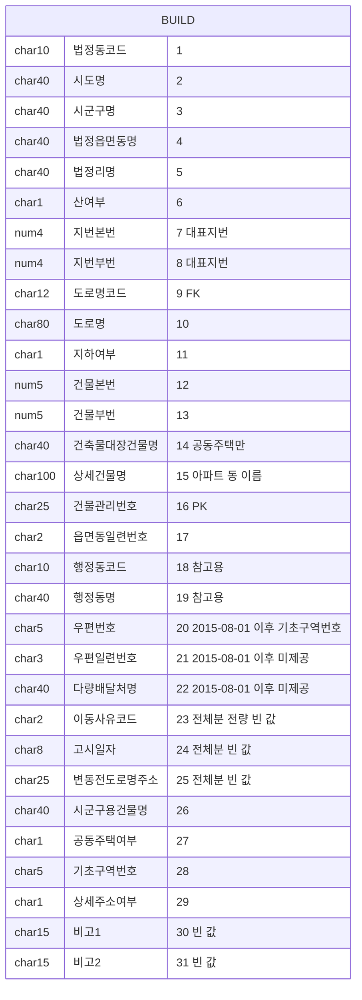
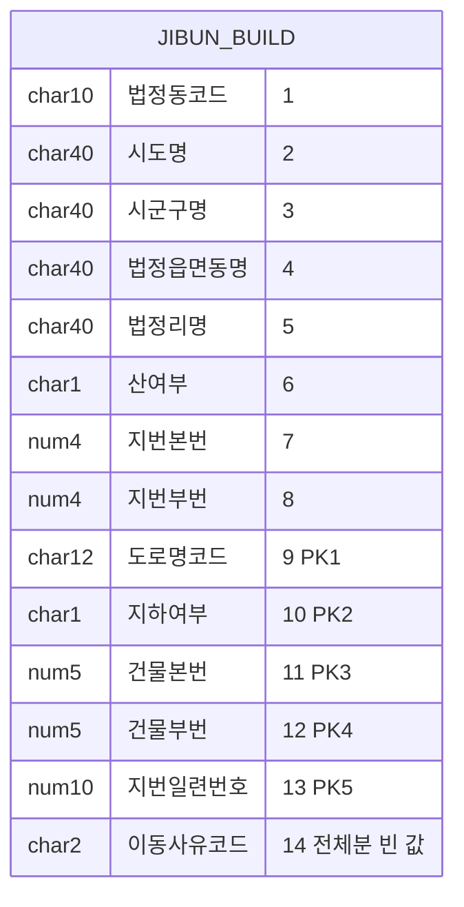
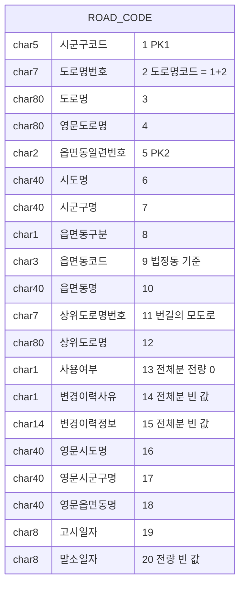
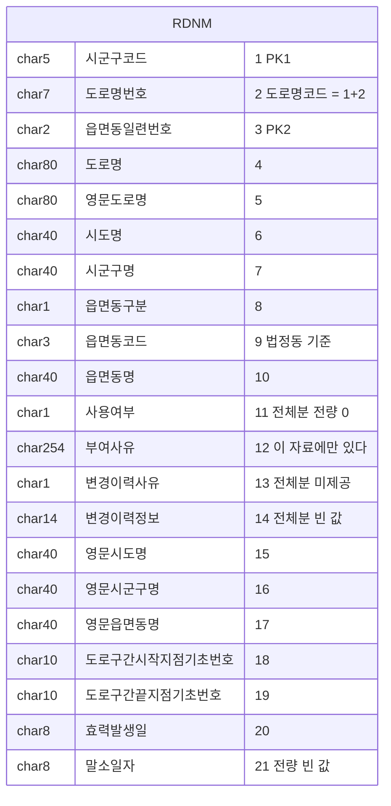
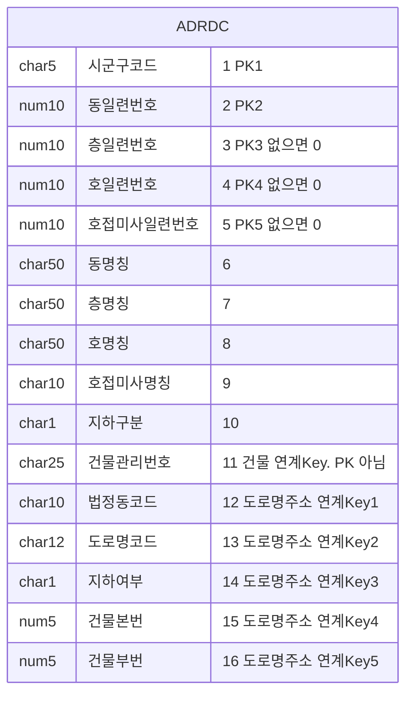
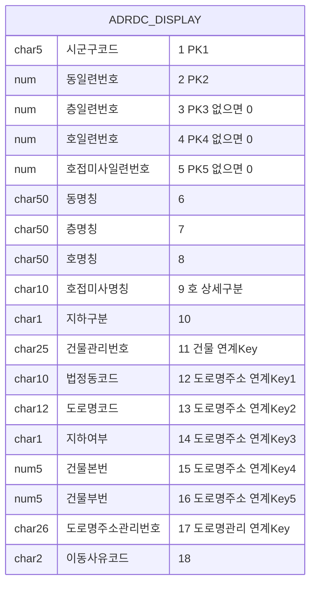
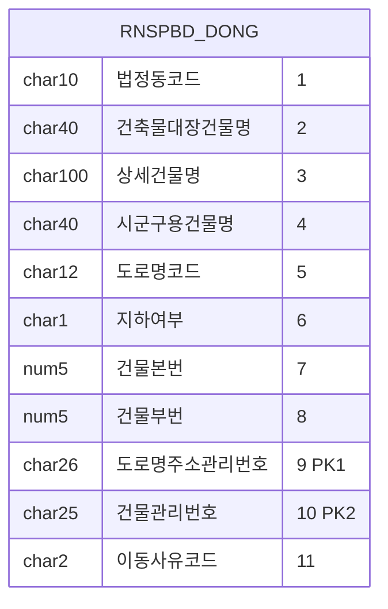
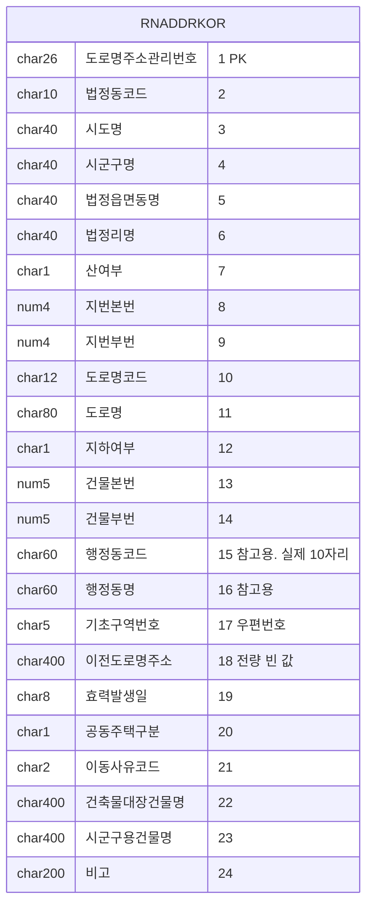
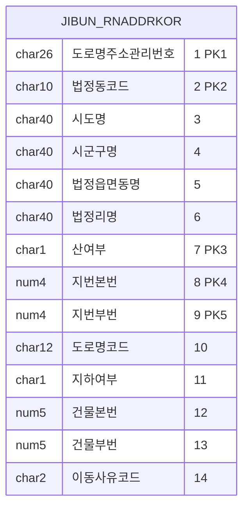

# 설계6 — 원천 자료 스키마

**답하는 질문: 행정안전부 원천 자료가 어떤 테이블로 생겼는가**

상태: **자료별 ERD 열 완료 / 전체 관계 ERD 완료 / 조인 전량 확인 완료 / 키 유일성 전량 확인 완료 / 변동분 사유코드 전량 확인 완료**

---

## 0. 이 문서를 읽는 법

**칸 이름·자릿수·PK는 여기서 확인한 뒤 쓴다. 기억으로 쓰지 않는다.**

열 자료 전부 아래가 같다.

| 무엇 | 값 |
|---|---|
| 칸 구분 | 파이프 `|` |
| 인코딩 | MS949 |
| 줄 끝 | CRLF. 마지막 칸을 볼 때 `\r`를 떼야 한다 |
| 첫 줄 | 칸 이름이 없다. 값부터 시작한다 |

**영문 물리명은 원천에 없다.** 가이드가 한글 칸 이름만 준다. 아래 ERD의 영문 이름은 이 문서에서 그리려고 붙인 것이고, 우리 DB의 물리명은 `02-data-model.md` 6절이 행정안전부 표준단어 대조로 따로 정한다.

**코드값은 `04-source-data.md` 「코드값」 절에 있다.**

**관계는 전부 선택적 비식별이다.** 근거는 아래 「관계를 선택적 비식별로 그리는 이유」에 있다.

---

## 1. 자료 열

네 묶음으로 배포된다. 같은 이름의 자료가 묶음마다 따로 있으므로 파일명으로 가른다.

| # | 자료 | 파일명 | 칸 | 배포 단위 |
|---|---|---|---|---|
| 1 | 건물정보 | `build_시도명.txt` | 31 | 시도별 |
| 2 | 관련지번 (건물DB) | `jibun_시도명.txt` | 14 | 시도별 |
| 3 | 도로명코드 | `road_code_total.txt` | 20 | 전국 파일 한 세트 |
| 4 | 도로명 | `TN_SPRD_RDNM.txt` | 21 | 전국 파일 한 세트 |
| 5 | 상세주소DB | `adrdc_시도명.txt` | 16 | 시도별 |
| 6 | 상세주소 표시 — 시군구용 | `rnspbd_adrdc_시도명.txt` | 18 | 시도별 |
| 7 | 상세주소 표시 — 건축물대장 | `rnspbt_adrdc_시도명.txt` | 18 | 시도별 |
| 8 | 상세주소 동 표시 | `rnspbd_dong_시도명.txt` | 11 | 시도별 |
| 9 | 도로명주소 한글 | `rnaddrkor_지역명.txt` | 24 | 시도별 |
| 10 | 관련지번 (도로명주소한글) | `jibun_rnaddrkor_지역명.txt` | 14 | 시도별 |

**같은 이름 다른 자료가 세 쌍이다.** 2와 10, 3과 4, 6과 7이다. 아래 3절에서 가른다.

**변동분 파일명**

| 자료 | 월 변동분 파일 |
|---|---|
| 건물정보 · 관련지번 · 도로명코드 | `build_mod.txt` · `jibun_mod.txt` · `road_code_mod.txt` |
| 도로명 | `TH_SPRD_RDNM_MOD.txt` |
| 도로명주소 한글 · 관련지번 | `rnaddrkor_mod.txt` · `jibun_rnaddrkor_mod.txt` |
| 상세주소DB | `adrdc_mod.txt` |
| 상세주소 표시 2세트 | `rnspbd_adrdc_mod.txt` · `rnspbt_adrdc_mod.txt` |
| 상세주소 동 표시 | `rnspbd_dong_mod.txt` |

**일 변동분은 이름이 다르다.** 도로명주소 한글 묶음은 `AlterD.JUSUKR.YYYYMMDD.TH_SGCO_RNADR_MST`와 `…_LNBR`로 오고, 상세주소 표시는 `AlterD.JUSUDC.YYYYMMDD.TH_RNSPBD_ADRDC`와 `…TH_RNSPBT_ADRDC`로 온다. 뒷부분이 행안부 쪽 테이블 이름이다.

---

## 2. 자료별 ERD

### 2-1. 건물정보 — `build_시도명.txt` · 31칸



**PK는 건물관리번호 하나다.** 9·11·12·13번 네 칸이 4칸 묶음이고, 이것으로 관련지번과 잇는다.

**사용여부·상태 칸이 없다.** 살아 있는 건물만 담긴 스냅숏이라 폐지 건은 아예 빠져 있다.

**[전량] 이동사유코드는 전체분에 오지 않는다.** 전국 10,722,871줄 전부 빈 값이다.

**[전량] 행정동코드가 빈 줄이 230개 있다.** 전부 잠실역 실내 도로명에 붙은 건물이다.

**[전량] 이름 칸의 유일값 수**

| 칸 | 전국 유일값 | 서울 |
|---|---|---|
| 건축물대장건물명 | 92,222 | — |
| 상세건물명 | 77,825 | — |
| 시군구용건물명 | 418,618 | — |
| 세 칸 합 | 588,665 | 111,664 |
| 행정동명 | 3,281 | 427 |

---

### 2-2. 관련지번 (건물DB) — `jibun_시도명.txt` · 14칸



**PK가 4칸 묶음 + 지번일련번호 다섯이다.**

**[전량 · 전국] 지번일련번호가 가르는 것은 같은 지번의 중복 등록이다.** 1,770,131줄에서 4칸 묶음 + 지번 자연키 넷이 같은 줄이 12건 있고 최대 2회다. 두 줄의 나머지 열세 칸이 전부 같다.

```
2653010600|부산광역시|사상구|주례동||0|20|10|265304217348|0|37|0|15533|
2653010600|부산광역시|사상구|주례동||0|20|10|265304217348|0|37|0|15536|
```

**우리 지번 마스터에 이 칸을 들지 않는다.**

**건물관리번호 칸이 없다.** 건물로 가려면 4칸 묶음을 거쳐야 한다.

---

### 2-3. 도로명코드 — `road_code_total.txt` · 20칸 · 전국



**유일키는 도로명코드(12) + 읍면동일련번호(2) = 14자리다.**

**[전량] 전체분 371,958줄의 사용여부가 전부 `0`이다.** 살아 있는 도로명만 담긴다.

**[전량] 변동분 434줄에는 값이 온다.** 변경이력사유 빈 값 363(신규) · `1` 71(폐지)이다.

---

### 2-4. 도로명 — `TN_SPRD_RDNM.txt` · 21칸 · 전국



**부여사유는 이 자료에만 있다.** `제덕로의 기초번호 활용`처럼 문장으로 온다. 전량 371,921줄 중 369,517줄이 채워진다.

**도로구간 기초번호 두 칸도 이 자료에만 있다.** 도로명코드에는 상위도로명 두 칸이 대신 들어 있다.

---

### 2-5. 상세주소DB — `adrdc_시도명.txt` · 16칸



**변동분은 17칸이다.** 끝에 이동사유코드(2)가 붙는다.

**[전량 · 전국] 3,238,597줄.** 동명칭이 채워진 줄 150,051, 호접미사 128, 층명칭 빈 값 1,703,240, 호명칭 빈 값 178,001이다.

**이 자료는 공동주택이 아닌 건물의 층·호를 담는다.**

---

### 2-6. 상세주소 표시 — `rnspbd_adrdc_*` · `rnspbt_adrdc_*` · 18칸

레이아웃 하나에 파일이 2세트다. **구조가 둘인 것이 아니라 값의 출처가 둘이다.**



**앞 16칸이 상세주소DB와 같다.**

**[전량 · 서울] 시군구용은 상세주소DB와 사실상 같은 자료다.** 533,103줄 대 533,102줄이고, PK 여덟 칸을 전량 대조해 128줄·129줄만 어긋났다. **적재는 한 세트만 한다.**

**[전량 · 서울] 건축물대장은 완전히 다른 자료다.** 3,790,271줄로 일곱 배이고, 건물 136,321채 가운데 122,159채가 공동주택이다. **공동주택 호수가 여기 있다.**

**2세트는 대상이 갈린다.** 서울에서 시군구용에만 있는 건물 80,790채, 대장에만 있는 건물 136,020채, 양쪽에 다 있는 건물 301채다.

**겹치는 301채도 충돌이 아니다.** 대장 줄 6,513개 중 시군구용과 층·호가 같은 것이 93개이고 나머지는 대장에만 있다. **시군구용이 호를 비워 둔다.**

**동·층·호에 기준 문자가 안 붙는다.** 서울 대장 기준 동 2,087,230개 중 숫자만인 것이 1,748,631개다.

**층명칭에 `null`이라는 글자와 공백 한 칸이 들어온다.**

**[확인 필요] 2세트의 PK 여덟 칸이 서로 겹치는가.**

---

### 2-7. 상세주소 동 표시 — `rnspbd_dong_시도명.txt` · 11칸



**PK가 도로명주소관리번호와 건물관리번호 쌍이다.** 등록주소 하나에 건물관리번호가 여럿 붙는다는 구조적 증거다.

**이름과 달리 동·층·호가 없다.** 「동 표시」의 동은 棟이고 건물 이름 세 칸으로 나타난다.

**[전량 · 16개 시도] 이 자료가 주소와 건물을 잇는 전량 매핑표다.** 줄 수가 건물정보 줄 수와 같고, 도로명주소관리번호의 유일값 수가 도로명주소 한글 줄 수와 같다. 서울만 건물정보보다 230줄 적다.

---

### 2-8. 도로명주소 한글 — `rnaddrkor_지역명.txt` · 24칸



**건물관리번호가 없다.** 등록주소 하나를 가리킨다. 아파트 단지가 한 줄이다.

**[전량] 도로명주소관리번호는 전국 6,422,078줄에서 유일하다.**

**[전량] 4칸 묶음은 유일하지 않다.** 아래 5절에 있다.

**[전량] 이전도로명주소는 채워지지 않는다.** 전체분 16개 시도와 변동분 9,785줄이 전부 빈 값이다.

---

### 2-9. 관련지번 (도로명주소한글) — `jibun_rnaddrkor_지역명.txt` · 14칸



**지번으로 들어온 입력을 받는 자리가 여기다.** 법정동코드·산여부·지번본번·지번부번 넷이 PK 안에 있다.

**적재는 이 자료 한 세트만 한다.**

---

## 3. 같은 이름 다른 자료

### 3-1. 관련지번 2세트 — 같은 자료다

| | 2-2 건물DB 쪽 | 2-9 도로명주소한글 쪽 |
|---|---|---|
| 파일명 | `jibun_시도명.txt` | `jibun_rnaddrkor_지역명.txt` |
| PK | 4칸 묶음 + 지번일련번호 | 도로명주소관리번호 + 법정동코드 + 지번 자연키 |
| 전국 줄 수 | 1,770,131 | 1,770,109 |

**[전량 대조] 담고 있는 내용이 같다.** 서울 89,491줄이 완전히 일치하고 한쪽에만 있는 줄이 0이다.

**줄 수 차이 22는 중복 때문이다.** 4칸 묶음 중복 10건과 지번일련번호 중복 12건의 합이다.

**`jibun_rnaddrkor_` 파일 한 세트만 적재한다.**

### 3-2. 도로명코드와 도로명

| | 2-3 도로명코드 | 2-4 도로명 |
|---|---|---|
| 파일명 | `road_code_total.txt` | `TN_SPRD_RDNM.txt` |
| 칸 수 | 20 | 21 |
| 전체분 줄 수 | 371,958 | 371,921 |
| 변동분 줄 수 | **434** | **541** |
| 이 자료에만 있는 칸 | 상위도로명번호 · 상위도로명 | 부여사유 · 도로구간 기초번호 둘 |
| 날짜 칸 이름 | 고시일자 | 효력발생일 |

**전체분 줄 수 차이 37은 도로명 19개다.** 도로명코드에만 있고 도로명 자료에는 없다. 아래 4절에 있다.

**변동분 줄 수 차이 107은 변경이력사유 `9`다.** 아래 6절에 있다.

### 3-3. 상세주소 표시 2세트

위 2-6절에 있다. **파일명 앞부분으로 가른다.** `rnspbd_adrdc_`는 시군구용, `rnspbt_adrdc_`는 건축물대장이다.

---

## 4. 자료마다 담는 범위가 다르다 — 잠실역 230건

**[전량 · 서울]** 건물정보 593,235줄과 동 표시 593,005줄의 차이 230, 주소DB 주소 523,345줄과 도로명주소 한글 523,115줄의 차이 230이 같은 건이다.

**송파구 잠실동·신천동의 잠실역 실내 도로명 19개에 붙은 건물 230채다.** `잠실역환승통로`·`잠실역8호선상행선`·`잠실역1주차장` 같은 이름이다.

| 자료 | 담고 있나 |
|---|---|
| 도로명코드 · 건물정보 · 주소DB 주소 | 있다 |
| 도로명 · 도로명주소 한글 · 상세주소 동 표시 | 없다 |

**폐지된 도로명이 아니다.** 도로명코드에서 사용여부가 `0`(사용)이다.

**같은 자료를 다 받아도 자료마다 줄 수가 다를 수 있다.** 적재할 때 차이를 오류로 보지 않는다.

---

## 5. 전체 관계 ERD

키와 이어지는 칸만 남겼다.


### 이어지는 길 정리 — 전량 확인

| 이으려는 것 | 키 | 확인 |
|---|---|---|
| 건물 ↔ 도로명 이름 | 도로명코드 12 | 확인함 |
| 건물 ↔ 관련지번(건물DB) | 4칸 묶음 | 확인함 |
| 건물 ↔ 대표지번 | 같은 줄 안에 있다 | 확인함. 건물 한 채에 정확히 하나 |
| 건물 ↔ 층·호 | 건물관리번호 25 | **전량 확인.** 상세주소DB 3,238,597줄 전부 건물에 걸린다 |
| 건물 ↔ 건물 이름(동 표시) | 건물관리번호 25 | **전량 확인** |
| 도로명주소 한글 ↔ 관련지번 | 도로명주소관리번호 26 | **전량 확인** |
| 도로명주소 한글 ↔ 동 표시 | 도로명주소관리번호 26 | **전량 확인** |
| 건물 ↔ 건축물대장 상세주소 | 건물관리번호 25 | **전량 확인.** 부모 없는 자식 0건 |

**부모 없는 자식이 한 건도 없었다.**

### 4칸 묶음은 유일하지 않다 — 전량 확인

**[전량 · 전국] 도로명주소 한글 6,422,078줄 중 10건이 겹친다.**

```
읍면동=공도읍   도로명코드=415504424294  지하여부=0  본번=73  부번=0
읍면동=원곡면   도로명코드=415504424294  지하여부=0  본번=73  부번=0
```

**원인은 도로명코드에 읍면동이 안 들어가는 것이다.** 도로명코드 12자리는 시군구코드 5 + 도로명번호 7이고, 읍면동을 가르는 것은 별도 칸인 읍면동일련번호다.

| 지역 | 겹치는 건수 | 도로명 |
|---|---|---|
| 경기 | 1 | 안성시 벚꽃길 (공도읍 · 원곡면) |
| 세종 | 9 | 의당전의로 (장군면 · 전의면) |

**등록주소 하나를 가리키는 식별자는 도로명주소관리번호 26이다.**

### 대표지번과 관련지번은 거의 겹치지 않는다 — 전량 확인

**[전량 · 전국]**

| | 유일 지번 수 | 몫 |
|---|---|---|
| 대표지번 (건물정보 안) | 6,169,477 | 81.2% |
| 관련지번에만 있는 것 | 1,428,459 | 18.8% |
| **전체** | **7,597,936** | 100% |

관련지번 유일값 1,613,524개 가운데 **88.5%가 대표지번 집합에 없다.**

```
노량진동 151-28 (땅 하나)
 ├ 노량진로 171-2    ← 대표지번 쪽
 ├ 노량진로 171-6    ┐
 ├ 노량진로 171-8    │ 관련지번 쪽
 ├ 노량진로 171-10   │
 └ 노량진로 171-12   ┘
```

**지번으로 찾을 때 두 곳을 동시에 봐야 한다.**

### 건물관리번호 앞 10자리로 지역을 좁히면 안 된다

**[전량 · 전국] 앞 10자리가 법정동코드와 32.9% 어긋난다.** 10,722,871줄 중 3,524,146줄이다.

| 지역 | 10자리 불일치 | 5자리(시군구) 불일치 |
|---|---|---|
| 서울 | 0.30% | 0.00% |
| 경기 | 19.61% | 13.99% |
| 경북 | 3.81% | 0.00% |
| 제주 | 0.07% | — |

**원인은 행정구역 개편이다.** **건물관리번호는 부여 시점의 코드를 보존하고 법정동코드 칸은 현재 코드라 달라진다.**

**지역은 법정동코드 칸으로 좁힌다.**

### 관계를 선택적 비식별로 그리는 이유

**하나. 담는 범위가 자료마다 다르다.** 잠실역 230건이 실물 사례다.

**둘. 배포 단위가 자료마다 다르다.** 시도 하나만 적재하면 다른 자료의 부모가 없는 상태가 정상이다.

**셋. 원천이 참조 무결성을 보장한다고 적은 적이 없다.** 가이드는 각 자료의 PK만 적는다.

**식별관계로 보이는 자리에 주의한다.** 관련지번(건물DB)의 PK에 4칸 묶음이 통째로 들어가 있으나, 그 넷은 건물정보의 PK가 아니다.

---

## 6. 변동분이 무엇을 주는가 — 전량 확인 (2026-08-26)

**7월 월 변동분 아홉 종을 전부 열어 사유코드 분포를 셌다.**

| 변동분 | 줄 수 | 사유칸 | 신규 31 | 변경 34 | 폐지 63 |
|---|---|---|---|---|---|
| 건물정보 `build_mod` | 20,132 | 23 | 7,001 | 6,662 | 6,469 |
| 관련지번 `jibun_mod` | 8,603 | 14 | 4,023 | — | 4,580 |
| 도로명주소 한글 `rnaddrkor_mod` | 9,785 | 21 | 4,750 | 1,781 | 3,254 |
| 관련지번 `jibun_rnaddrkor_mod` | 6,554 | 14 | 2,996 | — | 3,558 |
| 상세주소DB `adrdc_mod` | 21,897 | 17 | 20,905 | 291 | 701 |
| 상세주소 시군구용 `rnspbd_adrdc_mod` | 21,796 | 18 | 20,904 | 193 | 699 |
| 상세주소 대장 `rnspbt_adrdc_mod` | 46,098 | 18 | 34,295 | 2,692 | 9,111 |
| 동 표시 `rnspbd_dong_mod` | 18,881 | 11 | 8,080 | 3,253 | 7,548 |

**도로명 쪽은 코드 체계가 다르다.**

| 변동분 | 줄 수 | 사유칸 | 분포 |
|---|---|---|---|
| 도로명코드 `road_code_mod` | 434 | 14 (변경이력사유) | 빈 값 363(신규) · `1` 71(폐지) |
| 도로명 `TH_SPRD_RDNM_MOD` | 541 | 13 (변경이력사유) | 빈 값 363 · `9` 107 · `1` 71 |

**관련지번에는 변경(34)이 오지 않는다.** 신규와 폐지뿐이다. 지번은 값이 바뀌는 것이 아니라 붙거나 떨어진다.

### 6-1. 다섯 대상 전부에 이력이 온다

건물·도로명·등록주소·관련지번·상세위치다. **「이력 대상을 건물과 도로명 둘로 좁힌다」는 안은 자료로 성립하지 않는다.**

**원천이 이미 대상별로 파일을 나눠 준다.** 한 표에 합치면 원천에 없는 구조를 만드는 일이 된다.

### 6-2. 변경(34)이 키를 바꾸지 않는다

**[전량 · 7월 · 건물]** 변동분 20,132줄의 건물관리번호가 전체분에 있는지 대조했다.

| 사유코드 | 변동분 | 전체분에 그 키가 있나 |
|---|---|---|
| 31 신규 | 7,001 | **7,001건 전부 있다** |
| 34 변경 | 6,662 | **6,662건 전부 있다** |
| 63 폐지 | 6,469 | **한 건도 없다** |

**변경이 키를 바꿨다면 옛 키가 전체분에서 사라졌을 텐데 전부 남아 있다.** 속성만 바뀐다.

**폐지는 전체분에서 통째로 빠진다.** 전체분이 살아 있는 것만 담는 스냅숏이라는 사실과 맞는다.

→ **적재 배치의 갈래가 「폐지인가」 하나면 된다.** 근거는 `04-source-data.md` 갱신 서비스 흐름에 있다.

**[확인 필요] 7월 한 달치로 잰 값이다.** 여러 달을 봐야 확정된다.

### 6-3. 도로명 변경이력사유 `9` — 기존 도로명의 변경

**107건 전부가 두 전체분에 이미 있다.**

| 잰 것 | 결과 |
|---|---|
| 도로명 전체분(`TN_SPRD_RDNM`)에 있나 | 107건 전부 있다 |
| 도로명코드 전체분(`road_code_total`)에 있나 | 107건 전부 있다 |
| 도로명코드 변동분에도 왔나 | **한 건도 안 왔다** |
| 사용여부 | 전부 `0` (사용) |
| 변경이력정보 | 전부 빈 값 |
| 효력발생일 | 2009년 것과 2026년 7월 것이 섞여 있다 |

**신규가 아니고 폐지도 아니다.** 남는 것은 기존 건의 변경이다.

**무엇이 바뀌었는지도 좁혀진다.** 도로명코드 변동분에 한 건도 안 왔다는 것은 도로명코드 파일이 담지 않는 칸이 바뀌었다는 뜻이다. 그 칸은 넷뿐이다 — 부여사유, 도로구간 시작·끝 기초번호, 효력발생일.

**넷 다 우리가 안 담기로 한 칸이다.** `02-data-model.md` 6-4절에 근거가 있다. **107건을 반영해도 `ref.road`의 값은 하나도 안 바뀐다.**

표본 하나를 남긴다.

```
11560|4154470|00|선유서로28길|Seonyuseo-ro 28-gil|서울특별시|영등포구|2|||0|
선유서로에서 분기되는 도로로 해당 일련번호 활용|9||Seoul|Yeongdeungpo-gu||21|30|20260702|
```

---

## 7. 주소DB (미채택, 참고)

건물DB를 채택했으므로 적재 대상이 아니다.

| 자료 | 칸 수 | 키 |
|---|---|---|
| 주소정보 | 11 | 관리번호(25) |
| 지번정보 | 11 | 관리번호(25) + 일련번호(3), 대표여부(1) |
| 부가정보 | 9 | 관리번호(25) |
| 개선 도로명코드 | 17 | 도로명코드(12) + 읍면동일련번호(2) |

**주소DB의 지번은 관리번호로 건물에 직접 붙는다.** 건물DB는 4칸 묶음으로 붙는다.

---

## 8. 원천에 없는 것

| 무엇 | 왜 없다고 하는가 |
|---|---|
| 완성된 주소 문자열 | 열 자료 전부 칸으로 쪼개 준다. 검색API만 `roadAddr`로 만들어 준다 |
| 영문 물리명 | 가이드가 한글 칸 이름만 준다 |
| FK 선언 | 각 자료의 PK만 적는다 |
| 건물 상태 칸 | 사용여부·말소일자가 없거나 값이 오지 않는다 |
| 행정동 ↔ 법정동 대응표 | 행정동코드가 참고용으로만 온다. **행정동 이름 목록은 있다** |
| 도로명이 바뀐 대응 관계 | 폐지만 오고 무엇으로 바뀌었는지는 안 온다 |
| 2세트를 나눠 배포하는 근거 | 가이드가 테이블 이름만 적고 이유를 적지 않는다. **[확인 필요]** |

---

## 부록. 쓴 명령

### 법정읍면동명·법정리명 끝 글자 분포 (2026-08-24)

```bash
for f in *.txt; do
  iconv -f CP949 -t UTF-8 -c "$f" | awk -F'|' '{print $3"\t"$4"\t"$5"\t"$6}'
done | sort -u > dongri.tsv
```

법정읍면동 3,589개, 법정리 6,968개가 나왔다. 끝 글자는 `동` 2,079 · `면` 1,006 · `가` 266 · `읍` 236 · `로` 2, 리는 전량 `리`다.

### 조인 전량 확인 (2026-08-24)

```bash
awk -F'|' '
FILENAME~/build_/{b[$16]=1;bn++;next}
FILENAME~/adrdc_/{a++; if($11 in b) ah++; next}
{d++; if($10 in b) dh++}
END{printf "%s build=%d adrdc=%d/%d dong=%d/%d\n",S,bn,ah,a,dh,d}' \
build_$s.txt adrdc_$s.txt rnspbd_dong_$s.txt
```

### 건물관리번호 앞자리 대조 (2026-08-24)

```bash
awk -F'|' '{t++
  if(substr($16,1,10)!=$1)b++
  if(substr($16,1,5)!=substr($1,1,5))c5++}
 END{printf "10자리 %.2f%% 5자리 %.2f%%\n",b*100/t,c5*100/t}' build_$s.txt
```

### 상세주소 표시 2세트 대조 (2026-08-24)

```bash
awk -F'|' '{gsub(/\r/,""); print $1"|"$2"|"$3"|"$4"|"$5"|"$6"|"$7"|"$8}' adrdc_seoul.txt | sort > a1
awk -F'|' '{gsub(/\r/,""); print $1"|"$2"|"$3"|"$4"|"$5"|"$6"|"$7"|"$8}' rnspbd_adrdc_seoul.txt | sort > a2
comm -23 a1 a2 | wc -l; comm -13 a1 a2 | wc -l
```

### 변동분이 건드리는 등록주소 (2026-08-24)

```bash
awk -F'|' '
FILENAME~/build_mod/{gsub(/\r/,""); k[$9"|"$11"|"$12"|"$13]=1; next}
{gsub(/\r/,""); k[$13"|"$14"|"$15"|"$16]=1}
END{for(x in k) print x}' build_mod.txt adrdc_mod.txt rnspbd_adrdc_mod.txt rnspbt_adrdc_mod.txt
```

**`gsub(/\r/,"")`를 빼면 마지막 칸이 빈 값으로 안 잡힌다.** 파일이 CRLF다.

### 지번일련번호 중복 확인 (2026-08-25)

```bash
awk -F'|' '{k=$9"|"$10"|"$11"|"$12"|"$1"|"$6"|"$7"|"$8; c[k]++}
END{d=0;m=0;for(x in c){if(c[x]>1){d++; if(c[x]>m)m=c[x]}}
printf "전체줄=%d 유일키=%d 중복키=%d 최대반복=%d\n", NR, length(c), d, m}' jibun_*.txt
```

### 4칸 묶음 유일성 확인 (2026-08-25)

```bash
for f in rnaddrkor_*.txt; do
  awk -F'|' '{k=$10"|"$12"|"$13"|"$14; c[k]++}
  END{d=0;for(x in c)if(c[x]>1)d++;
  printf "%s 줄=%d 유일4칸=%d 중복4칸=%d\n", FILENAME, NR, length(c), d}' "$f"
done
```

### 관련지번 2세트 대조 (2026-08-25)

```bash
awk -F'|' 'FILENAME~/rnaddrkor/{gsub(/\r/,""); k=$10"|"$11"|"$12"|"$13"|"$2"|"$7"|"$8"|"$9; a[k]=1; an++; next}
{gsub(/\r/,""); k=$9"|"$10"|"$11"|"$12"|"$1"|"$6"|"$7"|"$8; bn++; if(k in a){h++; seen[k]=1}}
END{o=0; for(x in a) if(!(x in seen)) o++;
printf "한글쪽=%d 건물DB쪽=%d 겹침=%d 한글쪽만=%d 건물DB쪽만=%d\n",an,bn,h,o,bn-h}' \
jibun_rnaddrkor_seoul.txt jibun_seoul.txt
```

### 대표지번과 관련지번 겹침 (2026-08-25)

```bash
awk -F'|' '
FILENAME~/build_/ {gsub(/\r/,""); k=$1"|"($6+0)"|"($7+0)"|"($8+0); a[k]=1; next}
{gsub(/\r/,""); k=$2"|"($7+0)"|"($8+0)"|"($9+0)
 if(!(k in b)){b[k]=1; if(k in a) h++; else m++}}
END{printf "대표=%d 관련유일=%d 겹침=%d 관련만=%d\n", length(a), length(b), h, m}' \
build_$s.txt jibun_rnaddrkor_$s.txt
```

**본번·부번에 `+0`을 붙여 숫자로 맞춘다.** 두 자료의 앞자리 0 채움이 다를 수 있다.

### 변동분 사유코드 분포 (2026-08-26)

자료마다 사유 칸 위치가 다르므로 인자로 넘긴다.

```bash
f(){ awk -F'|' -v k=$3 '{gsub(/\r/,"");c[$k]++;n++}
END{printf "  줄=%d 칸=%d  ",n,NF; for(x in c) printf "[%s]=%d ",(x==""?"빈값":x),c[x]; print ""}' "$2"; }
f build_mod       build_mod.txt        23
f jibun_mod       jibun_mod.txt        14
f road_code_mod   road_code_mod.txt    14
f rnaddrkor_mod   rnaddrkor_mod.txt    21
f adrdc_mod       adrdc_mod.txt        17
f rnspbd_adrdc    rnspbd_adrdc_mod.txt 18
f rnspbt_adrdc    rnspbt_adrdc_mod.txt 18
f rnspbd_dong     rnspbd_dong_mod.txt  11
f rdnm_mod        TH_SPRD_RDNM_MOD.txt 13
```

### 변경(34)이 키를 바꾸는지 (2026-08-26)

```bash
awk -F'|' '
FILENAME~/build_mod/{gsub(/\r/,""); k[$16]=$23; next}
{gsub(/\r/,""); if($16 in k) c[k[$16]]++}
END{printf "전체분에 이미 있는 키 →  31=%d  34=%d  63=%d\n", c["31"]+0, c["34"]+0, c["63"]+0}' \
build_mod.txt build_*.txt
```

### 도로명 변경이력사유 9 규명 (2026-08-26)

```bash
awk -F'|' '
FILENAME~/TH_SPRD_RDNM_MOD/ && $13=="9"{gsub(/\r/,""); m[$1"|"$2"|"$3]=1; next}
FILENAME~/TN_SPRD_RDNM/{gsub(/\r/,""); if(($1"|"$2"|"$3) in m) a[$1"|"$2"|"$3]=1; next}
{gsub(/\r/,""); if(($1"|"$2"|"$5) in m) b[$1"|"$2"|"$5]=1}
END{printf "사유9=%d 도로명전체분=%d 도로명코드전체분=%d\n", length(m), length(a), length(b)}' \
TH_SPRD_RDNM_MOD.txt TN_SPRD_RDNM.txt road_code_total.txt
```

**macOS에서 한글 폴더 이름이 자모 분해(NFD)로 저장돼 셸 글로브가 안 맞는다.** `ls -d */ | sed -n 'Np'`로 자리를 골라 변수에 담아 썼다.
