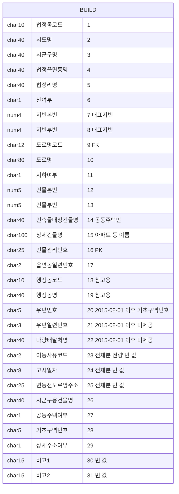
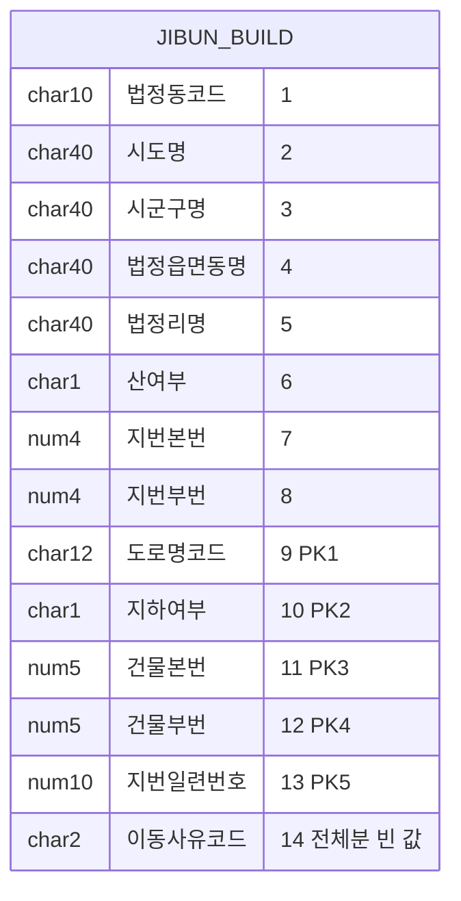
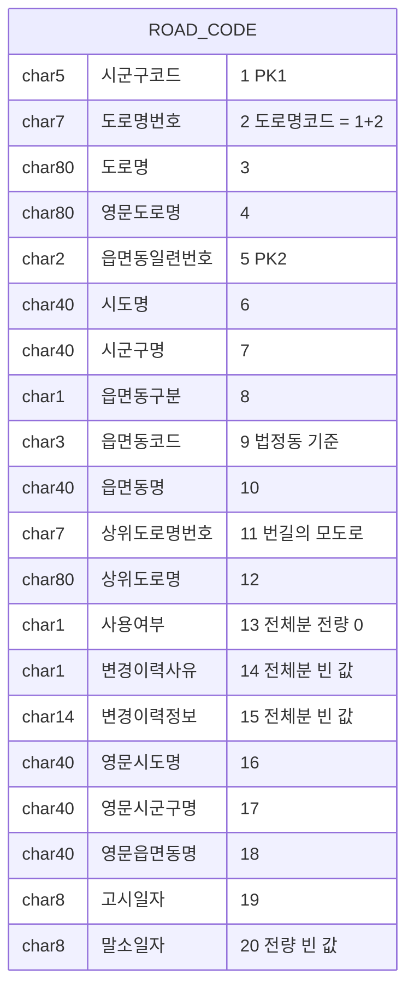
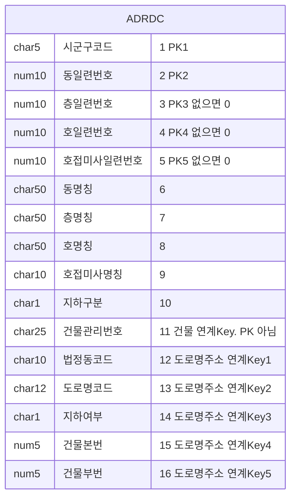
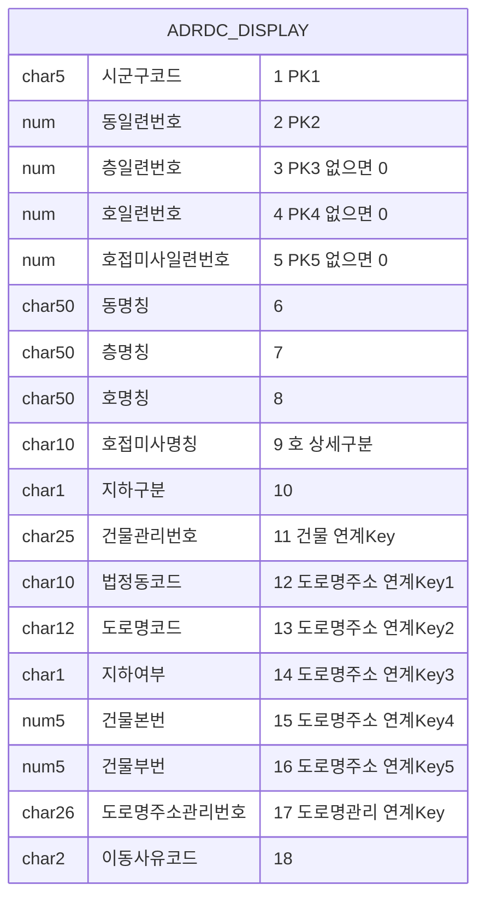
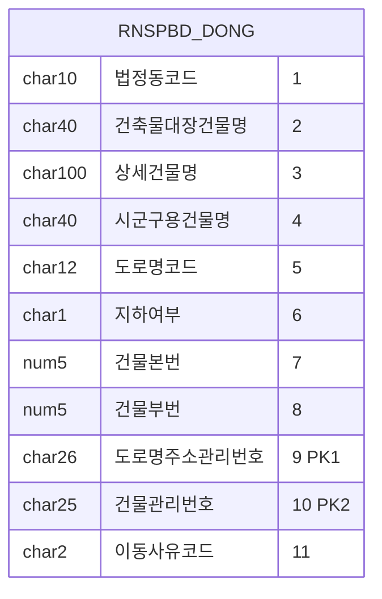
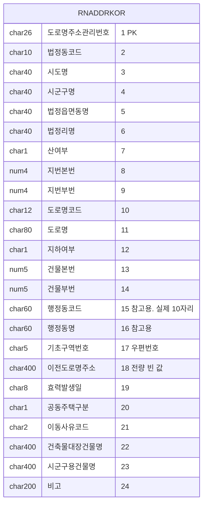
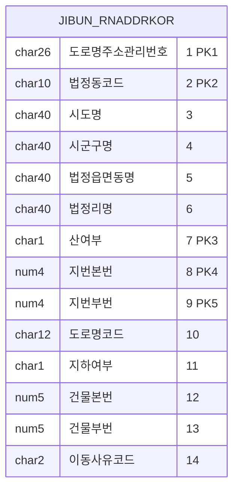
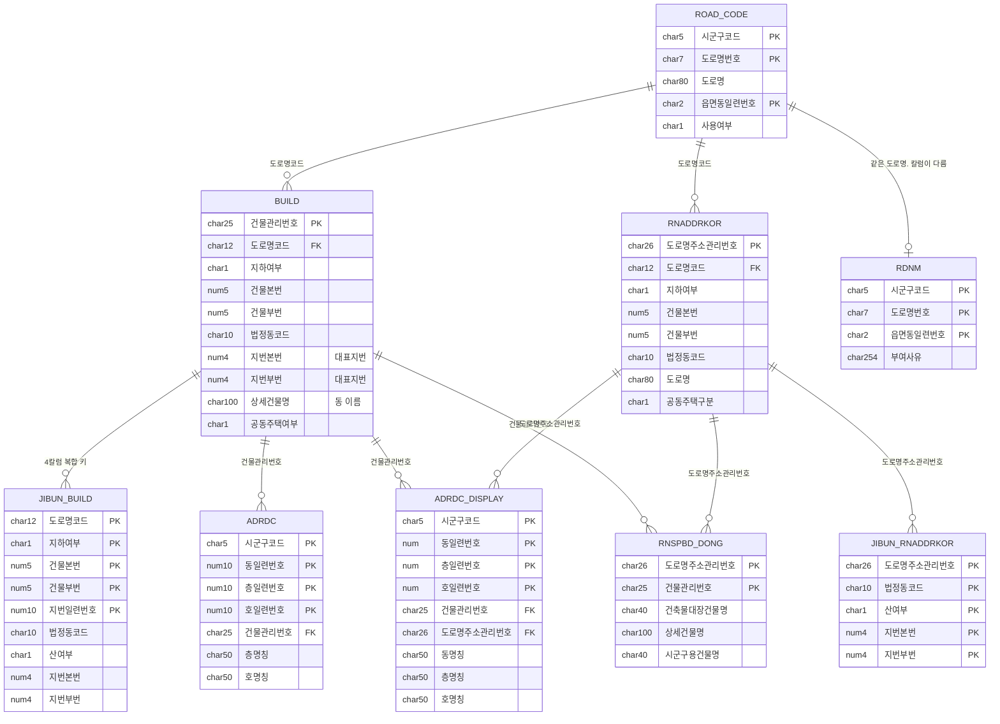

# 설계6: 원천 자료 스키마

## 1. 자료 10종

원천 자료는 4개 묶음으로 배포됩니다. 이름이 같은 자료가 묶음마다 따로 있으므로 파일명으로 구분합니다.

| # | 자료 | 파일명 | 칼럼 수 | 배포 단위 |
|---|---|---|---|---|
| 1 | 건물정보 | `build_시도명.txt` | 31 | 시도별 |
| 2 | 관련지번 (건물DB) | `jibun_시도명.txt` | 14 | 시도별 |
| 3 | 도로명코드 | `road_code_total.txt` | 20 | 전국 파일 한 세트 |
| 4 | 도로명 | `TN_SPRD_RDNM.txt` | 21 | 전국 파일 한 세트 |
| 5 | 상세주소DB | `adrdc_시도명.txt` | 16 | 시도별 |
| 6 | 상세주소 표시(시군구용) | `rnspbd_adrdc_시도명.txt` | 18 | 시도별 |
| 7 | 상세주소 표시(건축물대장) | `rnspbt_adrdc_시도명.txt` | 18 | 시도별 |
| 8 | 상세주소 동 표시 | `rnspbd_dong_시도명.txt` | 11 | 시도별 |
| 9 | 도로명주소 한글 | `rnaddrkor_지역명.txt` | 24 | 시도별 |
| 10 | 관련지번 (도로명주소한글) | `jibun_rnaddrkor_지역명.txt` | 14 | 시도별 |

이름이 같거나 비슷한 자료가 3쌍입니다. 2번과 10번, 3번과 4번, 6번과 7번이며 3절에서 구분합니다.

월 변동분 파일명은 다음과 같습니다.

| 자료 | 월 변동분 파일 |
|---|---|
| 건물정보 · 관련지번 · 도로명코드 | `build_mod.txt` · `jibun_mod.txt` · `road_code_mod.txt` |
| 도로명 | `TH_SPRD_RDNM_MOD.txt` |
| 도로명주소 한글 · 관련지번 | `rnaddrkor_mod.txt` · `jibun_rnaddrkor_mod.txt` |
| 상세주소DB | `adrdc_mod.txt` |
| 상세주소 표시 2세트 | `rnspbd_adrdc_mod.txt` · `rnspbt_adrdc_mod.txt` |
| 상세주소 동 표시 | `rnspbd_dong_mod.txt` |

일 변동분은 파일명 규칙이 다릅니다. 도로명주소 한글 묶음은 `AlterD.JUSUKR.YYYYMMDD.TH_SGCO_RNADR_MST`와 `…_LNBR`로 오고, 상세주소 표시는 `AlterD.JUSUDC.YYYYMMDD.TH_RNSPBD_ADRDC`와 `…TH_RNSPBT_ADRDC`로 옵니다. 파일명 뒷부분은 행정안전부 쪽 테이블 이름입니다.

---

## 2. 자료별 ERD

### 2-1. 건물정보: `build_시도명.txt` · 31칼럼



**PK는 건물관리번호 하나입니다.** 9번 도로명코드, 11번 지하여부, 12번 건물본번, 13번 건물부번이 4칼럼 복합 키이고, 이 키로 관련지번과 연결합니다.

사용여부나 상태를 나타내는 칼럼이 없습니다. 전체분은 현재 유효한 건물만 담은 스냅샷이므로 폐지된 건물은 아예 빠져 있습니다.

[전량] 이동사유코드는 전체분에 값이 오지 않습니다. 전국 10,722,871줄이 모두 빈 값입니다.

[전량] 행정동코드가 빈 줄이 230개 있습니다. 모두 잠실역 실내 도로명에 붙은 건물입니다.

[전량] 이름 칼럼별 유일값 수는 다음과 같습니다.

| 칼럼 | 전국 유일값 | 서울 |
|---|---|---|
| 건축물대장건물명 | 92,222 | — |
| 상세건물명 | 77,825 | — |
| 시군구용건물명 | 418,618 | — |
| 3칼럼 합 | 588,665 | 111,664 |
| 행정동명 | 3,281 | 427 |

---

### 2-2. 관련지번 (건물DB): `jibun_시도명.txt` · 14칼럼



PK는 4칼럼 복합 키와 지번일련번호를 합친 5칼럼입니다.

[전량 · 전국] 지번일련번호는 같은 지번이 중복 등록된 줄을 구분합니다. 1,770,131줄 가운데 4칼럼 복합 키와 지번 자연키 4칼럼이 모두 같은 중복이 12건 있고, 같은 키가 반복되는 횟수는 최대 2회입니다. 중복된 두 줄은 지번일련번호를 뺀 나머지 13칼럼이 모두 같습니다.

```
2653010600|부산광역시|사상구|주례동||0|20|10|265304217348|0|37|0|15533|
2653010600|부산광역시|사상구|주례동||0|20|10|265304217348|0|37|0|15536|
```

우리 지번 마스터에는 이 칼럼을 담지 않습니다.

건물관리번호 칼럼이 없습니다. 건물과 연결하려면 4칼럼 복합 키를 거쳐야 합니다.

---

### 2-3. 도로명코드: `road_code_total.txt` · 20칼럼 · 전국



유일키는 도로명코드(12)와 읍면동일련번호(2)를 합친 14자리입니다.

[전량] 전체분 371,958줄의 사용여부는 모두 `0`입니다. 전체분에는 사용 중인 도로명만 담깁니다.

[전량] 변동분 434줄의 변경이력사유는 빈 값 363줄(신규)과 `1` 71줄(폐지)로 나뉩니다.

---

### 2-4. 도로명: `TN_SPRD_RDNM.txt` · 21칼럼 · 전국


부여사유는 이 자료에만 있습니다. `제덕로의 기초번호 활용`처럼 문장으로 옵니다. 전량 371,921줄 가운데 369,517줄에 값이 있습니다.

도로구간 기초번호 2칼럼도 이 자료에만 있습니다. 도로명코드 자료에는 그 대신 상위도로명 2칼럼이 있습니다.

---

### 2-5. 상세주소DB: `adrdc_시도명.txt` · 16칼럼



변동분은 17칼럼입니다. 끝에 이동사유코드(2)가 붙습니다.

[전량 · 전국] 3,238,597줄입니다. 동명칭이 채워진 줄이 150,051개, 호접미사가 있는 줄이 128개, 층명칭이 빈 줄이 1,703,240개, 호명칭이 빈 줄이 178,001개입니다.

이 자료는 공동주택이 아닌 건물의 층과 호를 담습니다.

---

### 2-6. 상세주소 표시: `rnspbd_adrdc_*` · `rnspbt_adrdc_*` · 18칼럼

레이아웃은 하나이고 파일은 2세트입니다. 구조가 2가지인 것이 아니라 값의 출처가 2가지입니다.



앞 16칼럼은 상세주소DB와 같습니다.

[전량 · 서울] 시군구용은 상세주소DB와 사실상 같은 자료입니다. 시군구용 533,103줄과 상세주소DB 533,102줄을 PK 5칼럼과 동·층·호 명칭 3칼럼을 합친 8칼럼으로 전량 대조했고, 상세주소DB에만 있는 줄이 128개, 시군구용에만 있는 줄이 129개뿐이었습니다. 그래서 적재는 한 세트만 합니다.

**[전량 · 서울] 건축물대장은 완전히 다른 자료이고, 공동주택 호수가 여기 있습니다.** 3,790,271줄로 시군구용의 7배이고, 건물 136,321채 가운데 122,159채가 공동주택입니다.

2세트는 담는 건물이 서로 다릅니다. 서울에서 시군구용에만 있는 건물이 80,790채, 건축물대장에만 있는 건물이 136,020채, 양쪽에 모두 있는 건물이 301채입니다.

양쪽에 모두 있는 301채도 충돌하지 않습니다. 건축물대장 줄 6,513개 가운데 시군구용과 층·호가 같은 줄은 93개이고 나머지는 건축물대장에만 있습니다. 시군구용이 호를 비워 두기 때문입니다.

동·층·호에 기준 문자가 붙지 않습니다. 서울 건축물대장 기준으로 동 2,087,230개 가운데 숫자로만 된 값이 1,748,631개입니다.

층명칭에 `null`이라는 글자나 공백 한 칸이 값으로 들어옵니다.

[전량] 2세트의 PK는 서로 겹치지 않습니다. 가이드가 PK로 표시한 5칼럼(시군구코드·동일련번호·층일련번호·호일련번호·호접미사일련번호)을 2026년 7월 전체분에서 시도별로 대조했습니다. 시군구용 3,238,845개와 건축물대장 19,762,295개 가운데 겹치는 키는 0개입니다. 따라서 한 테이블에 함께 담아도 키가 충돌하지 않습니다.

---

### 2-7. 상세주소 동 표시: `rnspbd_dong_시도명.txt` · 11칼럼



PK는 도로명주소관리번호와 건물관리번호의 쌍입니다. 등록주소 하나에 건물관리번호가 여러 개 붙는다는 것을 구조로 보여 줍니다.

이름과 달리 동·층·호가 없습니다. 「동 표시」의 동은 棟(건물 한 동)이며 건물 이름 3칼럼으로 나타납니다.

[전량 · 16개 시도] 이 자료는 등록주소와 건물을 잇는 전량 매핑 테이블입니다. 줄 수가 건물정보 줄 수와 같고, 도로명주소관리번호의 유일값 수가 도로명주소 한글 줄 수와 같습니다. 서울만 건물정보보다 230줄 적습니다.

---

### 2-8. 도로명주소 한글: `rnaddrkor_지역명.txt` · 24칼럼



건물관리번호가 없습니다. 한 줄이 등록주소 하나를 가리키므로 아파트 단지 하나가 한 줄입니다.

[전량] 도로명주소관리번호는 전국 6,422,078줄에서 유일합니다.

[전량] 4칼럼 복합 키는 유일하지 않습니다. 자세한 내용은 5절에 있습니다.

[전량] 이전도로명주소는 채워지지 않습니다. 전체분 16개 시도와 변동분 9,785줄이 모두 빈 값입니다.

---

### 2-9. 관련지번 (도로명주소한글): `jibun_rnaddrkor_지역명.txt` · 14칼럼



**지번으로 들어온 입력은 이 자료로 찾습니다.** 법정동코드·산여부·지번본번·지번부번 4칼럼이 PK에 들어 있습니다.

적재는 이 자료 한 세트만 합니다.

---

## 3. 이름이 비슷한 자료를 구분합니다

### 3-1. 관련지번 2세트는 같은 내용을 담습니다

| | 2-2 건물DB 쪽 | 2-9 도로명주소한글 쪽 |
|---|---|---|
| 파일명 | `jibun_시도명.txt` | `jibun_rnaddrkor_지역명.txt` |
| PK | 4칼럼 복합 키 + 지번일련번호 | 도로명주소관리번호 + 지번 자연키 4칼럼 |
| 전국 줄 수 | 1,770,131 | 1,770,109 |

[전량 대조] 담고 있는 내용이 같습니다. 서울 89,491줄이 완전히 일치하고 한쪽에만 있는 줄은 0개입니다.

전국 줄 수 차이 22는 중복 때문에 생깁니다. 4칼럼 복합 키 중복 10건과 지번일련번호 중복 12건을 합한 값입니다.

`jibun_rnaddrkor_` 파일 한 세트만 적재합니다.

### 3-2. 도로명코드와 도로명의 차이

| | 2-3 도로명코드 | 2-4 도로명 |
|---|---|---|
| 파일명 | `road_code_total.txt` | `TN_SPRD_RDNM.txt` |
| 칼럼 수 | 20 | 21 |
| 전체분 줄 수 | 371,958 | 371,921 |
| 변동분 줄 수 | 434 | 541 |
| 이 자료에만 있는 칼럼 | 상위도로명번호 · 상위도로명 | 부여사유 · 도로구간 기초번호 2칼럼 |
| 날짜 칼럼 이름 | 고시일자 | 효력발생일 |

전체분 줄 수 차이 37은 도로명 19개에서 나옵니다. 이 도로명은 도로명코드 자료에만 있고 도로명 자료에는 없습니다. 자세한 내용은 4절에 있습니다.

변동분 줄 수 차이 107은 변경이력사유가 `9`인 줄입니다. 자세한 내용은 6절에 있습니다.

### 3-3. 상세주소 표시 2세트의 구분

구조는 2-6절에 있습니다. 두 세트는 파일명 앞부분으로 구분합니다. `rnspbd_adrdc_`는 시군구용, `rnspbt_adrdc_`는 건축물대장입니다.

---

## 4. 자료마다 담는 범위가 다릅니다: 잠실역 230건

[전량 · 서울] 건물정보 593,235줄과 동 표시 593,005줄의 차이 230, 주소DB 주소 523,345줄과 도로명주소 한글 523,115줄의 차이 230은 같은 230건을 가리킵니다.

이 230건은 송파구 잠실동·신천동의 잠실역 실내 도로명 19개에 붙은 건물 230채입니다. `잠실역환승통로`·`잠실역8호선상행선`·`잠실역1주차장` 같은 이름입니다.

| 자료 | 담고 있나 |
|---|---|
| 도로명코드 · 건물정보 · 주소DB 주소 | 있습니다 |
| 도로명 · 도로명주소 한글 · 상세주소 동 표시 | 없습니다 |

폐지된 도로명이 아닙니다. 도로명코드 자료에서 사용여부가 `0`(사용)입니다.

같은 시점의 자료를 모두 받아도 자료마다 줄 수가 다를 수 있습니다. 적재할 때 이 차이를 오류로 보지 않습니다.

---

## 5. 전체 관계 ERD

키와 자료를 잇는 칼럼만 남겼습니다.



### 자료를 잇는 키: 전량 확인

| 잇는 대상 | 키 | 확인 |
|---|---|---|
| 건물 ↔ 도로명 이름 | 도로명코드 12 | 확인함 |
| 건물 ↔ 관련지번(건물DB) | 4칼럼 복합 키 | 확인함 |
| 건물 ↔ 대표지번 | 같은 줄 안에 있습니다 | 확인함. 건물 한 채에 정확히 하나 |
| 건물 ↔ 층·호 | 건물관리번호 25 | 전량 확인. 상세주소DB 3,238,597줄이 모두 건물에 연결됩니다 |
| 건물 ↔ 건물 이름(동 표시) | 건물관리번호 25 | 전량 확인 |
| 도로명주소 한글 ↔ 관련지번 | 도로명주소관리번호 26 | 전량 확인 |
| 도로명주소 한글 ↔ 동 표시 | 도로명주소관리번호 26 | 전량 확인 |
| 건물 ↔ 건축물대장 상세주소 | 건물관리번호 25 | 전량 확인. 부모 없는 자식 0건 |

### 4칼럼 복합 키는 유일하지 않습니다: 전량 확인

[전량 · 전국] 도로명주소 한글 6,422,078줄에서 4칼럼 복합 키 10개가 각각 두 줄에 겹쳐 나옵니다.

```
읍면동=공도읍   도로명코드=415504424294  지하여부=0  본번=73  부번=0
읍면동=원곡면   도로명코드=415504424294  지하여부=0  본번=73  부번=0
```

원인은 도로명코드에 읍면동이 들어가지 않는 데 있습니다. 도로명코드 12자리는 시군구코드 5자리와 도로명번호 7자리로 이루어지고, 읍면동은 별도 칼럼인 읍면동일련번호로 구분합니다.

| 지역 | 겹치는 건수 | 도로명 |
|---|---|---|
| 경기 | 1 | 안성시 벚꽃길 (공도읍 · 원곡면) |
| 세종 | 9 | 의당전의로 (장군면 · 전의면) |

**등록주소 하나를 가리키는 식별자는 도로명주소관리번호 26자리입니다.**

### 대표지번과 관련지번은 거의 겹치지 않습니다: 전량 확인

[전량 · 전국] 유일 지번 수는 다음과 같습니다.

| | 유일 지번 수 | 비율 |
|---|---|---|
| 대표지번 (건물정보 안) | 6,169,477 | 81.2% |
| 관련지번에만 있는 것 | 1,428,459 | 18.8% |
| 전체 | 7,597,936 | 100% |

관련지번 유일값 1,613,524개 가운데 88.5%가 대표지번 집합에 없습니다.

```
노량진동 151-28 (땅 하나)
 ├ 노량진로 171-2    ← 대표지번 쪽
 ├ 노량진로 171-6    ┐
 ├ 노량진로 171-8    │ 관련지번 쪽
 ├ 노량진로 171-10   │
 └ 노량진로 171-12   ┘
```

**지번으로 찾을 때는 대표지번과 관련지번을 함께 조회해야 합니다.**

### 건물관리번호 앞 10자리로 지역을 좁히면 안 됩니다

[전량 · 전국] 건물관리번호 앞 10자리가 법정동코드와 32.9% 어긋납니다. 10,722,871줄 가운데 3,524,146줄입니다.

| 지역 | 10자리 불일치 | 5자리(시군구) 불일치 |
|---|---|---|
| 서울 | 0.30% | 0.00% |
| 경기 | 19.61% | 13.99% |
| 경북 | 3.81% | 0.00% |
| 제주 | 0.07% | — |

원인은 행정구역 개편입니다. 건물관리번호는 부여 시점의 코드를 그대로 유지하고 법정동코드 칼럼은 현재 코드를 담으므로 두 값이 달라집니다.

지역은 법정동코드 칼럼으로 좁힙니다.

### 관계를 선택적 비식별로 그리는 이유

첫째, 담는 범위가 자료마다 다릅니다. 잠실역 230건이 실제 사례입니다.

둘째, 배포 단위가 자료마다 다릅니다. 시도 하나만 적재하면 다른 자료의 부모가 없는 것이 정상입니다.

셋째, 원천은 참조 무결성을 보장한다고 적은 적이 없습니다. 가이드는 각 자료의 PK만 적습니다.

식별 관계처럼 보이는 지점에 주의합니다. 관련지번(건물DB)의 PK에 4칼럼 복합 키가 통째로 들어 있지만, 그 4칼럼은 건물정보의 PK가 아닙니다.

---

## 6. 변동분의 사유코드 분포: 전량 확인

7월 월 변동분 10종을 모두 열어 사유코드 분포를 셌습니다.

| 변동분 | 줄 수 | 사유 칼럼 | 신규 31 | 변경 34 | 폐지 63 |
|---|---|---|---|---|---|
| 건물정보 `build_mod` | 20,132 | 23 | 7,001 | 6,662 | 6,469 |
| 관련지번 `jibun_mod` | 8,603 | 14 | 4,023 | — | 4,580 |
| 도로명주소 한글 `rnaddrkor_mod` | 9,785 | 21 | 4,750 | 1,781 | 3,254 |
| 관련지번 `jibun_rnaddrkor_mod` | 6,554 | 14 | 2,996 | — | 3,558 |
| 상세주소DB `adrdc_mod` | 21,897 | 17 | 20,905 | 291 | 701 |
| 상세주소 시군구용 `rnspbd_adrdc_mod` | 21,796 | 18 | 20,904 | 193 | 699 |
| 상세주소 대장 `rnspbt_adrdc_mod` | 46,098 | 18 | 34,295 | 2,692 | 9,111 |
| 동 표시 `rnspbd_dong_mod` | 18,881 | 11 | 8,080 | 3,253 | 7,548 |

도로명 쪽 2종은 코드 체계가 다릅니다.

| 변동분 | 줄 수 | 사유 칼럼 | 분포 |
|---|---|---|---|
| 도로명코드 `road_code_mod` | 434 | 14 (변경이력사유) | 빈 값 363(신규) · `1` 71(폐지) |
| 도로명 `TH_SPRD_RDNM_MOD` | 541 | 13 (변경이력사유) | 빈 값 363 · `9` 107 · `1` 71 |

관련지번에는 변경(34)이 오지 않고 신규와 폐지만 옵니다. 지번은 값이 바뀌지 않고 건물과의 연결이 새로 생기거나 없어지기 때문입니다.

### 6-1. 대상 5가지 모두에 이력이 옵니다

대상은 건물·도로명·등록주소·관련지번·상세위치입니다. 「이력 대상을 건물과 도로명 2가지로 좁힙니다」라는 안은 자료와 맞지 않습니다.

원천이 이미 대상별로 파일을 나눠 제공합니다. 한 테이블에 합치면 원천에 없는 구조를 새로 만드는 셈입니다.

### 6-2. 변경(34)은 키를 바꾸지 않습니다

[전량 · 7월 · 건물] 변동분 20,132줄의 건물관리번호가 전체분에 있는지 대조했습니다.

| 사유코드 | 변동분 | 전체분에 그 키가 있나 |
|---|---|---|
| 31 신규 | 7,001 | 7,001건 모두 있습니다 |
| 34 변경 | 6,662 | 6,662건 모두 있습니다 |
| 63 폐지 | 6,469 | 한 건도 없습니다 |

변경이 키를 바꿨다면 옛 키가 전체분에서 사라졌어야 하는데 모두 남아 있습니다. 따라서 변경은 속성만 바꿉니다.

폐지된 건물은 전체분에서 통째로 빠집니다. 전체분이 현재 유효한 것만 담는 스냅샷이라는 사실과 맞습니다.

따라서 적재 배치는 「폐지인가」 하나로만 분기하면 됩니다. 갱신 흐름은 `04-source-data.md` 8절 「갱신 서비스 흐름」에 있습니다.

이 값은 7월 한 달치로 측정했습니다.

### 6-3. 도로명 변경이력사유 `9`: 기존 도로명의 변경

107건 모두 두 전체분에 이미 있습니다.

| 잰 것 | 결과 |
|---|---|
| 도로명 전체분(`TN_SPRD_RDNM`)에 있나 | 107건 전부 있습니다 |
| 도로명코드 전체분(`road_code_total`)에 있나 | 107건 전부 있습니다 |
| 도로명코드 변동분에도 왔나 | 한 건도 오지 않았습니다 |
| 사용여부 | 전부 `0` (사용) |
| 변경이력정보 | 전부 빈 값 |
| 효력발생일 | 2009년 것과 2026년 7월 것이 섞여 있습니다 |

신규도 폐지도 아니므로 남는 것은 기존 도로명의 변경입니다.

무엇이 바뀌었는지도 좁힐 수 있습니다. 도로명코드 변동분에 한 건도 오지 않았다는 것은 도로명코드 파일에 없는 칼럼이 바뀌었다는 뜻입니다. 그런 칼럼은 부여사유, 도로구간시작지점기초번호, 도로구간끝지점기초번호, 효력발생일 4개뿐입니다.

4칼럼 모두 우리가 담지 않기로 한 칼럼입니다. 근거는 `02-data-model.md` 6-4절에 있습니다. 따라서 107건을 반영해도 `ref.road`의 값은 하나도 바뀌지 않습니다.

표본 한 건을 남깁니다.

```
11560|4154470|00|선유서로28길|Seonyuseo-ro 28-gil|서울특별시|영등포구|2|||0|
선유서로에서 분기되는 도로로 해당 일련번호 활용|9||Seoul|Yeongdeungpo-gu||21|30|20260702|
```

---

## 7. 주소DB (미채택, 참고)

건물DB를 채택했으므로 주소DB는 적재 대상이 아닙니다.

| 자료 | 칼럼 수 | 키 |
|---|---|---|
| 주소정보 | 11 | 관리번호(25) |
| 지번정보 | 11 | 관리번호(25) + 일련번호(3), 대표여부(1) |
| 부가정보 | 9 | 관리번호(25) |
| 개선 도로명코드 | 17 | 도로명코드(12) + 읍면동일련번호(2) |

주소DB의 지번은 관리번호로 건물에 직접 연결됩니다. 건물DB의 지번은 4칼럼 복합 키로 연결됩니다.

---

## 8. 원천에 없는 정보

| 없는 것 | 근거 |
|---|---|
| 완성된 주소 문자열 | 자료 10종 모두 주소를 칼럼별로 나눠 제공합니다. 검색 API만 `roadAddr`로 완성된 문자열을 줍니다 |
| 영문 물리명 | 가이드가 한글 칼럼 이름만 제공합니다 |
| FK 선언 | 각 자료의 PK만 적습니다 |
| 건물 상태 칼럼 | 사용여부·말소일자 칼럼이 없거나 값이 오지 않습니다 |
| 행정동 ↔ 법정동 대응표 | 행정동코드는 참고용으로만 옵니다. 행정동 이름 목록은 있습니다 |
| 도로명이 바뀐 대응 관계 | 폐지만 오고 무엇으로 바뀌었는지는 오지 않습니다 |
| 2세트를 나눠 배포하는 근거 | 가이드가 테이블 이름만 적고 이유를 적지 않습니다 |
